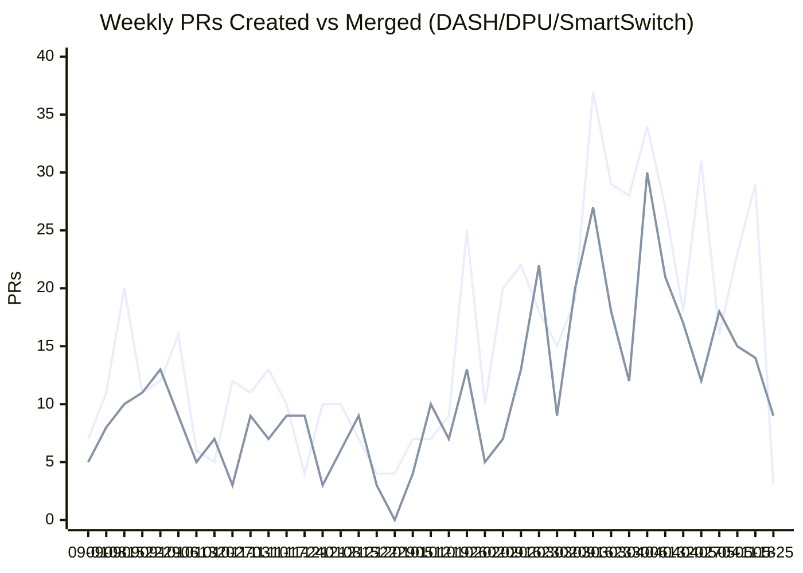

# DASH/DPU/SmartSwitch Weekly Review
**Period:** May 21 – May 27, 2026 (7 days)
**Report Generated:** May 27, 2026
**Query Keywords:** DPU, DASH, SmartSwitch, Smart

---

## Executive Summary

This report covers activity from **May 21 – May 27, 2026** across the sonic-net organization, focusing on PRs containing DASH, DPU, SmartSwitch, or Smart keywords in titles or descriptions.

### Key Metrics
- **16 PRs Created** during the period
- **14 PRs Merged** during the period
- **7 Active Repositories** with DASH/DPU/SmartSwitch activity
- **Merge Rate:** 87.5% (14 merged out of 16 created)
- **Creation Velocity:** 2.3 PRs/day
- **Merge Velocity:** 2.0 PRs/day

### Highlights
- Highest PR creation volume: **sonic-net/sonic-mgmt** (6 created)
- Highest merge volume: **sonic-net/sonic-mgmt** (8 merged)
- Week showed sustained SmartSwitch HA test, DPU platform, and DASH scale-path activity
- Merge throughput remained strong with mgmt-led backlogs landing early in the week

---

## Weekly Created vs Merged Trend (Sep 2025 → Current Week)



## Community Meeting Notes (Applied Where Applicable)

> ⚠️ **AI-Generated Notes Disclaimer:** The following notes were generated by AI from the actual meeting transcript. Please verify accuracy before relying on them.

### Memory Issue and Performance Optimization Updates
- The team reviewed ongoing DPU memory growth under repeated config pushes; Nikhil (Marti team) is developing a fix.
- The memory fix is **not planned for 2025-11** and is currently targeted for **2026-05**; 2025-11 is limited to critical fixes.
- Pilot testing can proceed without the memory fix, but scale testing should use the updated image.
- Memory footprint optimization work (including reducing meta-object validation caching) is in progress and not expected in 2025-11.

### Performance Profiling and Scale Test Coordination
- Prabhat requested scale-test logs; Mircea committed to provide data by end of day.
- After logs are reviewed, Prabhat will set up a review session with Nvidia and Cisco.
- Reported profiling improvement reduced config load time from ~32s to ~8s, primarily from client-side changes by Fred (Cisco).
- Team will use latest profiling data to isolate remaining bottlenecks (Orcasian/SIMP/other components).
- No platform-specific discrepancy has been observed so far, suggesting a SONiC-common issue path.

### Recent PR and Test Alignment Notes
- Meeting called out recent updates including:
  - HA test addition: sonic-mgmt [#24376](https://github.com/sonic-net/sonic-mgmt/pull/24376)
  - ZMQ socket reset fix: sonic-sairedis [#1881](https://github.com/sonic-net/sonic-sairedis/pull/1881)
  - Bulk sync workflow improvements: sonic-dash-ha [#165](https://github.com/sonic-net/sonic-dash-ha/pull/165)
  - DPU counters DB migration/backport work: sonic-buildimage [#27498](https://github.com/sonic-net/sonic-buildimage/pull/27498), [#27499](https://github.com/sonic-net/sonic-buildimage/pull/27499), sonic-swss [#4590](https://github.com/sonic-net/sonic-swss/pull/4590), sonic-gnmi [#677](https://github.com/sonic-net/sonic-gnmi/pull/677)
- Vivek and Prabhat emphasized that counters DB and inbound-rule fixes must include corresponding test updates (coordination with Lawrence).

### Leadership Transition and Schedule
- Kristina announced transition to a new internal role focused on data center build/automation and next-gen networking programs.
- Next regular meeting will be skipped; a new lead is expected to join in a following session.

### Follow-up Tasks
| Task | Owner | Status |
|------|-------|--------|
| Schedule Nvidia/Cisco review after receiving scale/perf logs from Mircea | Prabhat | Open |
| Confirm counters DB move to NPU includes required test updates with Lawrence | Prabhat | Open |
| Ensure inbound route/rule deletion fix in SONiC has matching test coverage updates with Lawrence | Prabhat | Open |

---

## PRs Created (May 21 – May 27, 2026)

### Summary
- **Total:** 16 PRs
- **Top Repository:** sonic-net/sonic-mgmt (6 PRs created)

### All Created PRs (Complete List):

| # | Repository | PR | Title | Created | Keywords |
|---|------------|-----|-------|---------|----------|
| 1 | sonic-net/sonic-buildimage | [#27485](https://github.com/sonic-net/sonic-buildimage/pull/27485) | [Mellanox][Smartswitch] Add blacklist for dpu kernel module to prevent race condition | May 21 | DPU SmartSwitch Smart |
| 2 | sonic-net/sonic-swss | [#4592](https://github.com/sonic-net/sonic-swss/pull/4592) | [vnetorch] Resolve interface for directly-connected local endpoints | May 21 | DASH DPU |
| 3 | sonic-net/sonic-buildimage | [#27498](https://github.com/sonic-net/sonic-buildimage/pull/27498) | Update DPU HWSKU context config to use DPU_COUNTERS_DB | May 21 | DPU |
| 4 | sonic-net/sonic-buildimage | [#27499](https://github.com/sonic-net/sonic-buildimage/pull/27499) | [202511] Update DPU HWSKU context config to use DPU_COUNTERS_DB | May 21 | DPU |
| 5 | sonic-net/sonic-mgmt | [#24787](https://github.com/sonic-net/sonic-mgmt/pull/24787) | [platform_tests][T2] Add test_sup_fan_recovery.py to verify sup fan status after config reload + cold reboot | May 21 | DPU |
| 6 | sonic-net/sonic-mgmt | [#24791](https://github.com/sonic-net/sonic-mgmt/pull/24791) | Adapt test launch with no peer for NPU-driven HA | May 21 | DPU |
| 7 | sonic-net/sonic-mgmt | [#24792](https://github.com/sonic-net/sonic-mgmt/pull/24792) | [202511] Add utility to upgrade DPU images for smartswitch testbeds | May 21 | DPU SmartSwitch Smart |
| 8 | sonic-net/sonic-buildimage | [#27506](https://github.com/sonic-net/sonic-buildimage/pull/27506) | [Nvidia-Bluefiled] Update NASA/SAI to 26.4-RC4/SAIBuild0.0.53.0  | May 21 | DASH DPU |
| 9 | sonic-net/sonic-mgmt | [#24795](https://github.com/sonic-net/sonic-mgmt/pull/24795) | [smartswitch]: Add advertise_prefix to VNET in HA golden config and verify VIP BGP advertisement | May 21 | SmartSwitch Smart |
| 10 | sonic-net/sonic-sairedis | [#1905](https://github.com/sonic-net/sonic-sairedis/pull/1905) | test dashmeta change on 202511 | May 22 | DASH |
| 11 | sonic-net/sonic-gnmi | [#683](https://github.com/sonic-net/sonic-gnmi/pull/683) | Skip Redis client init for DBs not in database_config.json | May 22 | DPU SmartSwitch Smart |
| 12 | sonic-net/sonic-buildimage | [#27521](https://github.com/sonic-net/sonic-buildimage/pull/27521) | Add new sku for SmartSwitch Mellanox-SN4280-O4X96 | May 22 | DPU SmartSwitch Smart |
| 13 | sonic-net/sonic-mgmt | [#24825](https://github.com/sonic-net/sonic-mgmt/pull/24825) | [dash]: add dash scale performance tests for dash programming | May 22 | DASH DPU SmartSwitch Smart |
| 14 | sonic-net/sonic-dash-ha | [#170](https://github.com/sonic-net/sonic-dash-ha/pull/170) | Fix handling of health signals in NPU-driven HA | May 26 | DASH DPU |
| 15 | sonic-net/sonic-platform-common | [#680](https://github.com/sonic-net/sonic-platform-common/pull/680) | [module_base] Record DPU reboot time at command invocation | May 27 | DPU |
| 16 | sonic-net/sonic-mgmt | [#24881](https://github.com/sonic-net/sonic-mgmt/pull/24881) |  Remove hardcoded smartswitch testbed skip | May 27 | DPU SmartSwitch Smart |

---

## PRs Merged (May 21 – May 27, 2026)

### Summary
- **Total:** 14 PRs
- **Top Repository:** sonic-net/sonic-mgmt (8 PRs merged)

### All Merged PRs (Complete List):

| # | Repository | PR | Title | Merged | Keywords |
|---|------------|-----|-------|--------|----------|
| 1 | sonic-net/sonic-buildimage | [#27384](https://github.com/sonic-net/sonic-buildimage/pull/27384) | NH-5010 - Set GRUB timeout_style=countdown | May 21 | Smart |
| 2 | sonic-net/sonic-swss | [#4590](https://github.com/sonic-net/sonic-swss/pull/4590) | [202511][dash]: Add ENI OID mapping and DPU counter DB support | May 21 | DASH DPU |
| 3 | sonic-net/sonic-gnmi | [#677](https://github.com/sonic-net/sonic-gnmi/pull/677) | [202511] Add DPU_COUNTERS_DB virtual path handling for DASH_METER and ENI counters | May 21 | DASH DPU |
| 4 | sonic-net/sonic-dash-ha | [#165](https://github.com/sonic-net/sonic-dash-ha/pull/165) | Improve Bulk Sync Workflow | May 21 | DPU |
| 5 | sonic-net/sonic-mgmt | [#24376](https://github.com/sonic-net/sonic-mgmt/pull/24376) | [HA][smartswitch] HA add test FNIC steady state and planned shutdown | May 22 | SmartSwitch Smart |
| 6 | sonic-net/sonic-mgmt | [#24641](https://github.com/sonic-net/sonic-mgmt/pull/24641) | [BMC] Skip test_orchagent_heartbeat on BMC (no orchagent) | May 26 | SmartSwitch Smart |
| 7 | sonic-net/sonic-mgmt | [#24335](https://github.com/sonic-net/sonic-mgmt/pull/24335) | Remove the skip condition for test test_privatelink_udp_sport_range_negative | May 26 | SmartSwitch Smart |
| 8 | sonic-net/sonic-mgmt | [#24292](https://github.com/sonic-net/sonic-mgmt/pull/24292) | [202511] Update the copp test for smartswitch(PR #22751 and # 21409) | May 26 | SmartSwitch Smart |
| 9 | sonic-net/sonic-mgmt | [#23815](https://github.com/sonic-net/sonic-mgmt/pull/23815) | Fix minigraph reload related tests for smartswitch | May 26 | SmartSwitch Smart |
| 10 | sonic-net/sonic-mgmt | [#23811](https://github.com/sonic-net/sonic-mgmt/pull/23811) | Override config in restore_test_env of GCU test_cacl.py | May 26 | SmartSwitch Smart |
| 11 | sonic-net/sonic-mgmt | [#24483](https://github.com/sonic-net/sonic-mgmt/pull/24483) | Fix test issues in test_gnoi_system_reboot.py | May 26 | SmartSwitch Smart |
| 12 | sonic-net/sonic-mgmt | [#24791](https://github.com/sonic-net/sonic-mgmt/pull/24791) | Adapt test launch with no peer for NPU-driven HA | May 26 | DPU |
| 13 | sonic-net/sonic-sairedis | [#1881](https://github.com/sonic-net/sonic-sairedis/pull/1881) | zmq: reset ZMQ_REQ socket when zmq_poll times out | May 27 | DASH |
| 14 | sonic-net/sonic-buildimage | [#27506](https://github.com/sonic-net/sonic-buildimage/pull/27506) | [Nvidia-Bluefiled] Update NASA/SAI to 26.4-RC4/SAIBuild0.0.53.0  | May 27 | DASH DPU |

---

## Metrics Summary

| Metric | Value |
|--------|-------|
| Period | May 21 – May 27, 2026 (7 days) |
| PRs Created | 16 |
| PRs Merged | 14 |
| Merge Rate | 87.5% |
| Creation Velocity | 2.3 PRs/day |
| Merge Velocity | 2.0 PRs/day |
| Active Repositories | 7 |
| Top Created Repo | sonic-net/sonic-mgmt (6) |
| Top Merged Repo | sonic-net/sonic-mgmt (8) |

---

### Query Used
```
org:sonic-net is:pr created:2026-05-21..2026-05-27 (DPU OR DASH OR SmartSwitch OR Smart) in:title,body NOT [action] in:title NOT submodule in:title
org:sonic-net is:pr is:merged merged:2026-05-21..2026-05-27 (DPU OR DASH OR SmartSwitch OR Smart) in:title,body NOT [action] in:title NOT submodule in:title
```

*Data source: GitHub Search API results retrieved on 2026-05-27.*
