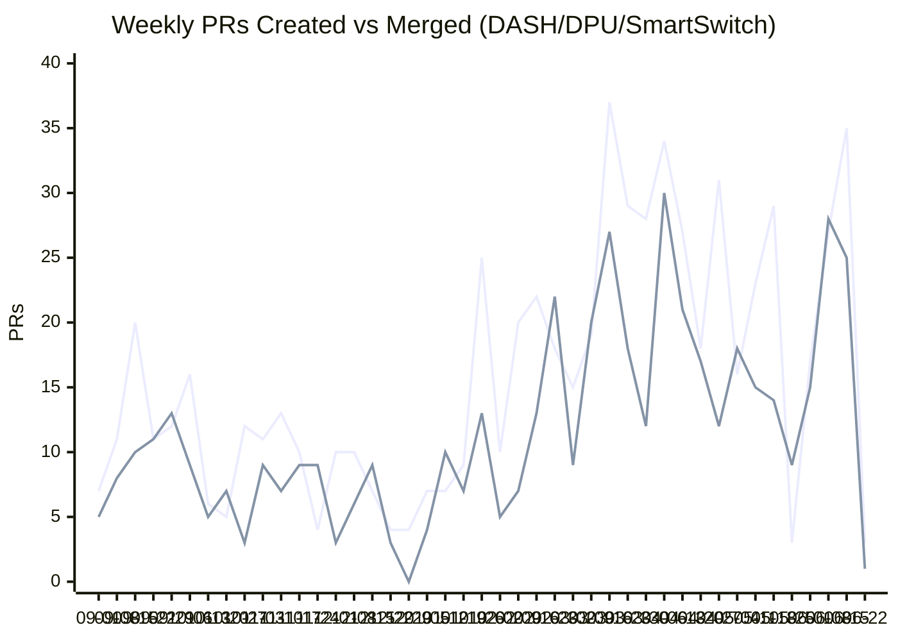

# DASH/DPU/SmartSwitch Weekly Review
**Period:** May 28 – Jun 22, 2026 (26 days)
**Report Generated:** Jun 22, 2026
**Query Keywords:** DPU, DASH, SmartSwitch, Smart

---

## Executive Summary

This report covers activity from **May 28 – Jun 22, 2026** across the sonic-net organization, focusing on PRs containing DASH, DPU, SmartSwitch, or Smart keywords in titles or descriptions.

### Key Metrics
- **98 PRs Created** during the period
- **84 PRs Merged** during the period
- **16 Active Repositories** with DASH/DPU/SmartSwitch activity
- **Merge Rate:** 85.7% (84 merged out of 98 created)
- **Creation Velocity:** 3.8 PRs/day
- **Merge Velocity:** 3.2 PRs/day

### Highlights
- Highest PR creation volume: **sonic-net/sonic-mgmt** (52 created)
- Highest merge volume: **sonic-net/sonic-mgmt** (37 merged)
- Period showed sustained SmartSwitch HA, DPU platform resilience, and DASH scale-path changes across core repos
- Merge throughput remained strong while creation volume increased during mid-June activity spikes

---

## Weekly Created vs Merged Trend (Sep 2025 → Current Week)



## PRs Created (May 28 – Jun 22, 2026)

### Summary
- **Total:** 98 PRs
- **Top Repository:** sonic-net/sonic-mgmt (52 PRs created)

### All Created PRs (Complete List):

| # | Repository | PR | Title | Created | Keywords |
|---|------------|-----|-------|---------|----------|
| 1 | sonic-net/sonic-swss | [#4617](https://github.com/sonic-net/sonic-swss/pull/4617) | [202511][orchagent/dash]: Remove retry logic, add failure handling and exception safety | May 28 | DASH DPU |
| 2 | sonic-net/sonic-buildimage | [#27566](https://github.com/sonic-net/sonic-buildimage/pull/27566) | Upgrade the dash-ha container to Trixie | May 28 | DASH |
| 3 | sonic-net/sonic-sairedis | [#1912](https://github.com/sonic-net/sonic-sairedis/pull/1912) | [meta]: Add SAI_OBJECT_TYPE_METER_BUCKET_ENTRY to MetaKeyHasher | May 28 | DASH |
| 4 | sonic-net/sonic-mgmt | [#24935](https://github.com/sonic-net/sonic-mgmt/pull/24935) | grpc_fixtures: Respect DUT parametrization | May 28 | DPU SmartSwitch Smart |
| 5 | sonic-net/sonic-utilities | [#4571](https://github.com/sonic-net/sonic-utilities/pull/4571) | [smartswitch]: Use reboot_gracefully() to record DPU reboot time at command invocation | May 28 | DPU SmartSwitch Smart |
| 6 | sonic-net/sonic-utilities | [#4572](https://github.com/sonic-net/sonic-utilities/pull/4572) | [cli]: Add DPU recovery CLI commands for SmartSwitch | May 28 | DPU SmartSwitch Smart |
| 7 | sonic-net/sonic-mgmt | [#24952](https://github.com/sonic-net/sonic-mgmt/pull/24952) | Backport SmartSwitch gNOI upgrade test and dependencies | May 28 | DPU SmartSwitch Smart |
| 8 | sonic-net/sonic-sairedis | [#1915](https://github.com/sonic-net/sonic-sairedis/pull/1915) | [DPU] Increase hugepages to 16000 for nvidia-bluefield kernel | May 28 | DPU |
| 9 | sonic-net/sonic-sairedis | [#1918](https://github.com/sonic-net/sonic-sairedis/pull/1918) | [smartswitch][meta] add cache policy for specific DASH entry types | May 29 | DASH SmartSwitch Smart |
| 10 | sonic-net/sonic-mgmt | [#24971](https://github.com/sonic-net/sonic-mgmt/pull/24971) | Add skip condition for dash/test_dash_smartswitch_crm.py::TestDashCRM::test_dash_crm_cleanup | May 29 | DASH SmartSwitch Smart |
| 11 | sonic-net/sonic-mgmt | [#24977](https://github.com/sonic-net/sonic-mgmt/pull/24977) | Update the topology marker of test_dpu_show_platform_temperature.py | May 29 | DPU SmartSwitch Smart |
| 12 | sonic-net/sonic-mgmt | [#24979](https://github.com/sonic-net/sonic-mgmt/pull/24979) | [Smartswitch] Call common reboot function in test_cold_reboot_switch | May 29 | DPU SmartSwitch Smart |
| 13 | sonic-net/sonic-mgmt | [#24982](https://github.com/sonic-net/sonic-mgmt/pull/24982) | [Smartswitch] Combine the dpu online and process up timeout into one timeout | May 29 | DPU SmartSwitch Smart |
| 14 | sonic-net/sonic-mgmt | [#24989](https://github.com/sonic-net/sonic-mgmt/pull/24989) | Move vxlan sport to func scope. | May 29 | DPU |
| 15 | sonic-net/sonic-platform-daemons | [#826](https://github.com/sonic-net/sonic-platform-daemons/pull/826) | [chassisd] Add testbed script for DPU reboot cause persistence | May 30 | DPU SmartSwitch Smart |
| 16 | sonic-net/sonic-mgmt | [#24993](https://github.com/sonic-net/sonic-mgmt/pull/24993) | Fix test_m2o_fluctuating_lossless | May 30 | DPU |
| 17 | sonic-net/sonic-mgmt | [#25006](https://github.com/sonic-net/sonic-mgmt/pull/25006) | Update lossy topology conditional markers | Jun 1 | DASH SmartSwitch Smart |
| 18 | sonic-net/sonic-swss | [#4626](https://github.com/sonic-net/sonic-swss/pull/4626) | Revert "[zmqorch]: Restore drain-until-empty consumer for non-DPU/fab… | Jun 1 | DPU |
| 19 | sonic-net/sonic-dash-ha | [#174](https://github.com/sonic-net/sonic-dash-ha/pull/174) | Auto reset dp_channel_is_alive to true upon DPU launching | Jun 2 | DPU |
| 20 | sonic-net/sonic-buildimage | [#27654](https://github.com/sonic-net/sonic-buildimage/pull/27654) | [docker] Avoid slow docker restarts from netfilter readiness check | Jun 2 | SmartSwitch Smart |
| 21 | sonic-net/sonic-buildimage | [#27655](https://github.com/sonic-net/sonic-buildimage/pull/27655) | [202511][docker] Avoid slow docker restarts from netfilter readiness check - master PR: #27654 | Jun 2 | SmartSwitch Smart |
| 22 | sonic-net/sonic-mgmt | [#25037](https://github.com/sonic-net/sonic-mgmt/pull/25037) | fix: fix get_duts_version prioritise main dut first | Jun 2 | DPU SmartSwitch Smart |
| 23 | sonic-net/sonic-mgmt | [#25042](https://github.com/sonic-net/sonic-mgmt/pull/25042) | DPU driven HA - Set disabled to true when setting state to dead. | Jun 2 | DPU SmartSwitch Smart |
| 24 | sonic-net/sonic-mgmt | [#25048](https://github.com/sonic-net/sonic-mgmt/pull/25048) | Fix test_ha_dpu_power_down and related utils | Jun 2 | DPU |
| 25 | sonic-net/sonic-buildimage | [#27675](https://github.com/sonic-net/sonic-buildimage/pull/27675) | [202511][docker] Avoid slow docker restarts from netfilter readiness check - master PR: #27654 | Jun 2 | SmartSwitch Smart |
| 26 | sonic-net/sonic-mgmt | [#25058](https://github.com/sonic-net/sonic-mgmt/pull/25058) | [HA][smartswitch] Make get_pending_operation_id() atomic | Jun 2 | SmartSwitch Smart |
| 27 | sonic-net/SONiC | [#2361](https://github.com/sonic-net/SONiC/pull/2361) | [DASH] Add metering example/clarification for FNIC + PL | Jun 2 | DASH |
| 28 | sonic-net/sonic-platform-daemons | [#829](https://github.com/sonic-net/sonic-platform-daemons/pull/829) | [chassisd]: Enhance DPU auto-recovery robustness and race condition handling | Jun 2 | DPU SmartSwitch Smart |
| 29 | sonic-net/sonic-sairedis | [#1923](https://github.com/sonic-net/sonic-sairedis/pull/1923) | [smartswitch][meta] dash cache policy tests | Jun 2 | DASH SmartSwitch Smart |
| 30 | sonic-net/sonic-mgmt | [#25088](https://github.com/sonic-net/sonic-mgmt/pull/25088) | Smartswitch: DPU: DASH VNET CRUD testcases | Jun 3 | DASH DPU SmartSwitch Smart |
| 31 | sonic-net/sonic-buildimage | [#27706](https://github.com/sonic-net/sonic-buildimage/pull/27706) | Revert "[202511] Update DPU HWSKU context config to use DPU_COUNTERS_DB" | Jun 4 | DPU |
| 32 | sonic-net/sonic-buildimage | [#27735](https://github.com/sonic-net/sonic-buildimage/pull/27735) | [Platform/Enhancement] Add firmware upgrade function for micas | Jun 5 | DASH |
| 33 | sonic-net/sonic-mgmt | [#25157](https://github.com/sonic-net/sonic-mgmt/pull/25157) | [ansible/golden_config_db]: Disable acms in smartswitch DPU extra config | Jun 5 | DPU SmartSwitch Smart |
| 34 | sonic-net/sonic-mgmt | [#25164](https://github.com/sonic-net/sonic-mgmt/pull/25164) | [202511] Added DPU config tags to run the DPU minigraph separately | Jun 8 | DPU SmartSwitch Smart |
| 35 | sonic-net/sonic-mgmt | [#25179](https://github.com/sonic-net/sonic-mgmt/pull/25179) | [HA][smartswitch] HA Add Stress/Scale Testing | Jun 8 | DASH DPU SmartSwitch Smart |
| 36 | sonic-net/sonic-mgmt | [#25182](https://github.com/sonic-net/sonic-mgmt/pull/25182) | Check ha scope pmon state values. | Jun 8 | DASH DPU SmartSwitch Smart |
| 37 | sonic-net/sonic-mgmt | [#25183](https://github.com/sonic-net/sonic-mgmt/pull/25183) | Check DB for neighbors. | Jun 8 | DPU SmartSwitch Smart |
| 38 | sonic-net/sonic-mgmt | [#25199](https://github.com/sonic-net/sonic-mgmt/pull/25199) | Make test_ha_link_failure.py work for switch-driven HA | Jun 8 | DPU |
| 39 | sonic-net/sonic-dash-ha | [#176](https://github.com/sonic-net/sonic-dash-ha/pull/176) | Add 4 common AI agent skills for build/test/deployment | Jun 9 | DASH DPU SmartSwitch Smart |
| 40 | sonic-net/sonic-utilities | [#4598](https://github.com/sonic-net/sonic-utilities/pull/4598) | Add image installation disk-space validation helper | Jun 9 | DPU SmartSwitch Smart |
| 41 | sonic-net/sonic-buildimage | [#27792](https://github.com/sonic-net/sonic-buildimage/pull/27792) | [202605][smartswitch]: Add dpu_auto_recovery flag to SmartSwitch NPU default config (#27385) | Jun 9 | DPU SmartSwitch Smart |
| 42 | sonic-net/sonic-buildimage | [#27795](https://github.com/sonic-net/sonic-buildimage/pull/27795) | ci: add all to include_jobs  docker-sonic-mgmt PR test | Jun 9 | DPU |
| 43 | sonic-net/sonic-mgmt | [#25252](https://github.com/sonic-net/sonic-mgmt/pull/25252) | [dash]: Add apply_dash_configs helper to enforce DASH table write order | Jun 9 | DASH DPU SmartSwitch Smart |
| 44 | sonic-net/sonic-dash-ha | [#177](https://github.com/sonic-net/sonic-dash-ha/pull/177) | Change the handling of DPU up/down | Jun 10 | DPU |
| 45 | sonic-net/sonic-mgmt | [#25255](https://github.com/sonic-net/sonic-mgmt/pull/25255) | chore: add all include jobs for pr test | Jun 10 | DPU |
| 46 | sonic-net/sonic-mgmt | [#25264](https://github.com/sonic-net/sonic-mgmt/pull/25264) | Fix test test_dpu_status_post_dpu_kernel_panic | Jun 10 | DPU SmartSwitch Smart |
| 47 | sonic-net/sonic-mgmt | [#25265](https://github.com/sonic-net/sonic-mgmt/pull/25265) | [Mellanox] Add a DPU shutdown time check in test case test_cold_reboot_dpus | Jun 10 | DPU SmartSwitch Smart |
| 48 | sonic-net/sonic-mgmt | [#25267](https://github.com/sonic-net/sonic-mgmt/pull/25267) | Fix test test_override_config_table.py and test_override_config_table_masic.py for smartswitch | Jun 10 | SmartSwitch Smart |
| 49 | sonic-net/sonic-buildimage | [#27814](https://github.com/sonic-net/sonic-buildimage/pull/27814) | [aspeed] Resolve bootconf from device tree for FIT boot | Jun 11 | DASH |
| 50 | sonic-net/sonic-mgmt | [#25299](https://github.com/sonic-net/sonic-mgmt/pull/25299) | Add traffic test for dash-ha launch with no peer | Jun 11 | DASH |
| 51 | sonic-net/sonic-buildimage | [#27821](https://github.com/sonic-net/sonic-buildimage/pull/27821) | [nvidia-bluefield] Update MFT version to 4.36.0-147 | Jun 11 | DPU |
| 52 | sonic-net/sonic-buildimage | [#27827](https://github.com/sonic-net/sonic-buildimage/pull/27827) | [build] Honor "# SKIP_HOOK" in collect_docker_version_files.sh | Jun 11 | DPU |
| 53 | sonic-net/sonic-buildimage | [#27833](https://github.com/sonic-net/sonic-buildimage/pull/27833) | [nvidia-bluefield] Ignore pdb in arm64-nvda_bf-bf3comdpu Health Check | Jun 11 | DPU |
| 54 | sonic-net/sonic-mgmt | [#25314](https://github.com/sonic-net/sonic-mgmt/pull/25314) | [route/test_duplicate_route]: Skip unsupported IP family instead of erroring | Jun 11 | SmartSwitch Smart |
| 55 | sonic-net/SONiC | [#2385](https://github.com/sonic-net/SONiC/pull/2385) | [PMON HLD] update get_reboot_cause mechanism and add get_midplane_dow… | Jun 11 | DPU SmartSwitch Smart |
| 56 | sonic-net/sonic-mgmt | [#25328](https://github.com/sonic-net/sonic-mgmt/pull/25328) | [DASH] Use specific import | Jun 12 | DASH |
| 57 | sonic-net/sonic-mgmt | [#25341](https://github.com/sonic-net/sonic-mgmt/pull/25341) | Add a topo check for ipv4 pass all OVS rule. | Jun 12 | SmartSwitch Smart |
| 58 | sonic-net/sonic-buildimage | [#27863](https://github.com/sonic-net/sonic-buildimage/pull/27863) | Docker: Prevent first-boot platform startup failures by disabling IPv6 iptables management | Jun 13 | SmartSwitch Smart |
| 59 | sonic-net/sonic-buildimage | [#27886](https://github.com/sonic-net/sonic-buildimage/pull/27886) | Yang changes for inner source mac rewrite feature for ipv6 packets in | Jun 14 | Smart |
| 60 | sonic-net/sonic-buildimage | [#27887](https://github.com/sonic-net/sonic-buildimage/pull/27887) | [system-health] Add periodic full-scan backstop so transient service failures are not missed | Jun 14 | DASH DPU SmartSwitch Smart |
| 61 | sonic-net/sonic-mgmt | [#25363](https://github.com/sonic-net/sonic-mgmt/pull/25363) | [ha]: Apply DASH configs in dependency order | Jun 15 | DASH SmartSwitch Smart |
| 62 | sonic-net/sonic-swss | [#4673](https://github.com/sonic-net/sonic-swss/pull/4673) | Clear DASH HA brainsplit recovery pending flag | Jun 15 | DASH DPU |
| 63 | sonic-net/sonic-sairedis | [#1938](https://github.com/sonic-net/sonic-sairedis/pull/1938) | [TEST/DO NOT MERGE] Combined #1932 + #1927 to verify CI interdependency | Jun 15 | DPU |
| 64 | sonic-net/sonic-platform-common | [#694](https://github.com/sonic-net/sonic-platform-common/pull/694) | Fix Micron NVMe disk health output showing N/A | Jun 15 | Smart |
| 65 | sonic-net/sonic-mgmt | [#25379](https://github.com/sonic-net/sonic-mgmt/pull/25379) | Fix ENI counter test for CT aging interval change | Jun 16 | DASH DPU SmartSwitch Smart |
| 66 | sonic-net/sonic-dash-ha | [#183](https://github.com/sonic-net/sonic-dash-ha/pull/183) | [ci] enable PR checker trigger for release branches | Jun 16 | DASH |
| 67 | sonic-net/sonic-mgmt | [#25385](https://github.com/sonic-net/sonic-mgmt/pull/25385) | Smartswitch: DPU: Check DPU Transition State during dpu_module_status… | Jun 16 | DPU SmartSwitch Smart |
| 68 | sonic-net/sonic-platform-vpp | [#252](https://github.com/sonic-net/sonic-platform-vpp/pull/252) | [ci] enable PR checker trigger for release branches | Jun 16 | DASH |
| 69 | sonic-net/sonic-py-swsssdk | [#161](https://github.com/sonic-net/sonic-py-swsssdk/pull/161) | [ci] enable PR checker trigger for release branches | Jun 16 | DASH |
| 70 | sonic-net/sonic-snmpagent | [#382](https://github.com/sonic-net/sonic-snmpagent/pull/382) | [ci] enable PR checker trigger for release branches | Jun 16 | DASH |
| 71 | sonic-net/sonic-stp | [#92](https://github.com/sonic-net/sonic-stp/pull/92) | [ci] enable PR checker trigger for release branches | Jun 16 | DASH |
| 72 | sonic-net/sonic-mgmt | [#25402](https://github.com/sonic-net/sonic-mgmt/pull/25402) | [ha]: Update FNIC planned shutdown flow checks | Jun 16 | DPU |
| 73 | sonic-net/sonic-mgmt | [#25403](https://github.com/sonic-net/sonic-mgmt/pull/25403) | [ha][yang]: Avoid writing test GNMI certs to CONFIG_DB | Jun 16 | SmartSwitch Smart |
| 74 | sonic-net/sonic-mgmt | [#25411](https://github.com/sonic-net/sonic-mgmt/pull/25411) | [smartswitch]: Harden DPU startup/shutdown retries | Jun 16 | DPU SmartSwitch Smart |
| 75 | sonic-net/sonic-mgmt | [#25420](https://github.com/sonic-net/sonic-mgmt/pull/25420) | [elastictest] Plumb DPU_IMAGE_URL through to the test plan image config | Jun 16 | DPU SmartSwitch Smart |
| 76 | sonic-net/sonic-buildimage | [#27945](https://github.com/sonic-net/sonic-buildimage/pull/27945) | [build] upgrade p4lang-pi package version | Jun 17 | DASH |
| 77 | sonic-net/sonic-buildimage | [#27947](https://github.com/sonic-net/sonic-buildimage/pull/27947) | [docker-ptf] Resolve python-saithrift egg path dynamically (fix switch_sai_thrift import on Trixie/OS13 DUTs) | Jun 17 | DASH |
| 78 | sonic-net/sonic-mgmt | [#25431](https://github.com/sonic-net/sonic-mgmt/pull/25431) | Fix HA dpu process crash state checks. | Jun 17 | DPU SmartSwitch Smart |
| 79 | sonic-net/sonic-mgmt | [#25434](https://github.com/sonic-net/sonic-mgmt/pull/25434) | platform/device_utils: default get_dpu_port to 8080 on miss | Jun 17 | DPU SmartSwitch Smart |
| 80 | sonic-net/sonic-mgmt | [#25440](https://github.com/sonic-net/sonic-mgmt/pull/25440) | [ha]: Xfail Cisco 8102 SmartSwitch HA tests | Jun 17 | DPU SmartSwitch Smart |
| 81 | sonic-net/sonic-mgmt | [#25441](https://github.com/sonic-net/sonic-mgmt/pull/25441) | [smartswitch]: disable loganalyzer for test_dpu_status_post_switch_reboot | Jun 17 | DPU SmartSwitch Smart |
| 82 | sonic-net/sonic-dash-ha | [#186](https://github.com/sonic-net/sonic-dash-ha/pull/186) | Use sonic-swss agent pool for CI | Jun 17 | DASH |
| 83 | sonic-net/sonic-dash-ha | [#187](https://github.com/sonic-net/sonic-dash-ha/pull/187) | [ci] Use 1ES agent pool for CI | Jun 17 | DASH |
| 84 | sonic-net/sonic-host-services | [#395](https://github.com/sonic-net/sonic-host-services/pull/395) | Add an inline platform check for ExecCondition of gnoi-shutdown.service | Jun 18 | SmartSwitch Smart |
| 85 | sonic-net/sonic-mgmt | [#25463](https://github.com/sonic-net/sonic-mgmt/pull/25463) | [ha]: Update FNIC steady-state flow checks | Jun 18 | DASH |
| 86 | sonic-net/sonic-buildimage | [#27979](https://github.com/sonic-net/sonic-buildimage/pull/27979) | Pin jsonpath to 1.7.0, last working version | Jun 18 | DASH |
| 87 | sonic-net/sonic-mgmt | [#25466](https://github.com/sonic-net/sonic-mgmt/pull/25466) | [smartswitch]: Populate DPU table in golden config | Jun 18 | DASH DPU SmartSwitch Smart |
| 88 | sonic-net/sonic-mgmt | [#25467](https://github.com/sonic-net/sonic-mgmt/pull/25467) | [smartswitch]: move ensure_all_dpus_ready to platform_tests conftest | Jun 18 | DPU SmartSwitch Smart |
| 89 | sonic-net/sonic-mgmt | [#25468](https://github.com/sonic-net/sonic-mgmt/pull/25468) | [ha]: Parallelize DPU config reload cleanup | Jun 18 | DPU SmartSwitch Smart |
| 90 | sonic-net/sonic-mgmt | [#25491](https://github.com/sonic-net/sonic-mgmt/pull/25491) | HA testsuite - Switch from UDP to TCP traffic. | Jun 19 | DPU SmartSwitch Smart |
| 91 | sonic-net/sonic-mgmt | [#25492](https://github.com/sonic-net/sonic-mgmt/pull/25492) | Fix test_ha_dpu_process_crash.py for NPU-driven HA | Jun 19 | DASH DPU SmartSwitch Smart |
| 92 | sonic-net/sonic-mgmt | [#25496](https://github.com/sonic-net/sonic-mgmt/pull/25496) | Fix test_ha_npu_reboot.py for NPU-driven HA | Jun 19 | DPU |
| 93 | sonic-net/sonic-mgmt | [#25497](https://github.com/sonic-net/sonic-mgmt/pull/25497) | Add test_ha_link_down in test_ha_link_failure.py | Jun 19 | DPU |
| 94 | sonic-net/sonic-mgmt | [#25503](https://github.com/sonic-net/sonic-mgmt/pull/25503) | Fix test_ha_npu_process_crash for NPU-driven HA | Jun 19 | DASH DPU |
| 95 | sonic-net/sonic-mgmt | [#25528](https://github.com/sonic-net/sonic-mgmt/pull/25528) | [vxlan][dualtor] Fix test_vnet_decap on active-active dualtor | Jun 21 | Smart |
| 96 | sonic-net/sonic-mgmt | [#25558](https://github.com/sonic-net/sonic-mgmt/pull/25558) | [gnmi/test_gnoi_smartswitch]: route DPU gNOI via PtfGnoi headers; drop direct-to-DPU path | Jun 22 | DPU SmartSwitch Smart |
| 97 | sonic-net/sonic-mgmt | [#25559](https://github.com/sonic-net/sonic-mgmt/pull/25559) | [dash]: Extend DASH ENI counter tests for SAI#2251 counters | Jun 22 | DASH DPU SmartSwitch Smart |
| 98 | sonic-net/sonic-buildimage | [#28023](https://github.com/sonic-net/sonic-buildimage/pull/28023) | [container_checker/service_checker]: Guard newer device_info APIs against stale sonic_py_common | Jun 22 | DPU SmartSwitch Smart |

---

## PRs Merged (May 28 – Jun 22, 2026)

### Summary
- **Total:** 84 PRs
- **Top Repository:** sonic-net/sonic-mgmt (37 PRs merged)

### All Merged PRs (Complete List):

| # | Repository | PR | Title | Merged | Keywords |
|---|------------|-----|-------|--------|----------|
| 1 | sonic-net/sonic-mgmt | [#24881](https://github.com/sonic-net/sonic-mgmt/pull/24881) |  Remove hardcoded smartswitch testbed skip | May 28 | DPU SmartSwitch Smart |
| 2 | sonic-net/sonic-host-services | [#376](https://github.com/sonic-net/sonic-host-services/pull/376) | [smartswitch] Use dpu_halt_services_timeout from platform.json, fallback to HALT_TIMEOUT=60 | May 28 | DPU SmartSwitch Smart |
| 3 | sonic-net/sonic-utilities | [#4525](https://github.com/sonic-net/sonic-utilities/pull/4525) | [DPU] Add optional DPU flow dump to techsupport collection | May 28 | DPU |
| 4 | sonic-net/sonic-host-services | [#343](https://github.com/sonic-net/sonic-host-services/pull/343) | [SmartSwitch] [gnoi-shutdown] Handle non-SmartSwitch platforms gracefully and simplify service dependencies | May 28 | DPU SmartSwitch Smart |
| 5 | sonic-net/sonic-buildimage | [#27566](https://github.com/sonic-net/sonic-buildimage/pull/27566) | Upgrade the dash-ha container to Trixie | May 28 | DASH |
| 6 | sonic-net/sonic-mgmt | [#24351](https://github.com/sonic-net/sonic-mgmt/pull/24351) | [smartswitch]: Quiet retry-time noise in check_dpu_critical_processes | May 28 | DPU SmartSwitch Smart |
| 7 | sonic-net/sonic-swss | [#4574](https://github.com/sonic-net/sonic-swss/pull/4574) | Skip swss.rec updates for high volume dash child objects | May 28 | DASH |
| 8 | sonic-net/sonic-swss-common | [#1188](https://github.com/sonic-net/sonic-swss-common/pull/1188) | swsscommon: expose batched ZmqProducerStateTable APIs to SWIG | May 29 | DASH |
| 9 | sonic-net/sonic-swss | [#4566](https://github.com/sonic-net/sonic-swss/pull/4566) | [orchagent/dash]: Remove retry logic, add failure handling and exception safety | May 29 | DASH DPU |
| 10 | sonic-net/sonic-sairedis | [#1893](https://github.com/sonic-net/sonic-sairedis/pull/1893) | [DPU] Optimize Flow Sync Notification and fix cleanup for flow dumps | May 29 | DASH DPU |
| 11 | sonic-net/sonic-dash-ha | [#170](https://github.com/sonic-net/sonic-dash-ha/pull/170) | Fix handling of health signals in NPU-driven HA | May 29 | DASH DPU |
| 12 | sonic-net/sonic-mgmt | [#24704](https://github.com/sonic-net/sonic-mgmt/pull/24704) | [202511][ssw] move VDPU, DPU, REMOTE_DPU, VXLAN_TUNNEL, VNET generation from test fixture to golden config gen (#23605) | May 29 | DPU |
| 13 | sonic-net/sonic-swss | [#4617](https://github.com/sonic-net/sonic-swss/pull/4617) | [202511][orchagent/dash]: Remove retry logic, add failure handling and exception safety | May 29 | DASH DPU |
| 14 | sonic-net/sonic-platform-daemons | [#826](https://github.com/sonic-net/sonic-platform-daemons/pull/826) | [chassisd] Add testbed script for DPU reboot cause persistence | May 30 | DPU SmartSwitch Smart |
| 15 | sonic-net/sonic-gnmi | [#675](https://github.com/sonic-net/sonic-gnmi/pull/675) | MixedDbClient: batch ZMQ Set/Del for multi-key gNMI updates (#27250) | May 31 | DASH DPU |
| 16 | sonic-net/sonic-utilities | [#4558](https://github.com/sonic-net/sonic-utilities/pull/4558) | [smartswitch][reboot]: gate DPU midplane DHCP during NPU reboot | Jun 1 | DPU SmartSwitch Smart |
| 17 | sonic-net/sonic-buildimage | [#27387](https://github.com/sonic-net/sonic-buildimage/pull/27387) | [FC] Move DPU counter defaults to init_cfg.json (#20492) | Jun 1 | DASH DPU |
| 18 | sonic-net/sonic-dash-ha | [#174](https://github.com/sonic-net/sonic-dash-ha/pull/174) | Auto reset dp_channel_is_alive to true upon DPU launching | Jun 2 | DPU |
| 19 | sonic-net/sonic-utilities | [#4373](https://github.com/sonic-net/sonic-utilities/pull/4373) | Add multi-asic support for counterpoll phy command | Jun 2 | DASH |
| 20 | sonic-net/sonic-sairedis | [#1918](https://github.com/sonic-net/sonic-sairedis/pull/1918) | [smartswitch][meta] add cache policy for specific DASH entry types | Jun 2 | DASH SmartSwitch Smart |
| 21 | sonic-net/sonic-mgmt | [#25048](https://github.com/sonic-net/sonic-mgmt/pull/25048) | Fix test_ha_dpu_power_down and related utils | Jun 2 | DPU |
| 22 | sonic-net/sonic-mgmt | [#25037](https://github.com/sonic-net/sonic-mgmt/pull/25037) | fix: fix get_duts_version prioritise main dut first | Jun 3 | DPU SmartSwitch Smart |
| 23 | sonic-net/sonic-buildimage | [#27675](https://github.com/sonic-net/sonic-buildimage/pull/27675) | [202511][docker] Avoid slow docker restarts from netfilter readiness check - master PR: #27654 | Jun 3 | SmartSwitch Smart |
| 24 | sonic-net/sonic-mgmt | [#24982](https://github.com/sonic-net/sonic-mgmt/pull/24982) | [Smartswitch] Combine the dpu online and process up timeout into one timeout | Jun 3 | DPU SmartSwitch Smart |
| 25 | sonic-net/sonic-buildimage | [#27654](https://github.com/sonic-net/sonic-buildimage/pull/27654) | [docker] Avoid slow docker restarts from netfilter readiness check | Jun 3 | SmartSwitch Smart |
| 26 | sonic-net/sonic-utilities | [#4572](https://github.com/sonic-net/sonic-utilities/pull/4572) | [cli]: Add DPU recovery CLI commands for SmartSwitch | Jun 3 | DPU SmartSwitch Smart |
| 27 | sonic-net/sonic-mgmt | [#24952](https://github.com/sonic-net/sonic-mgmt/pull/24952) | Backport SmartSwitch gNOI upgrade test and dependencies | Jun 3 | DPU SmartSwitch Smart |
| 28 | sonic-net/sonic-sairedis | [#1915](https://github.com/sonic-net/sonic-sairedis/pull/1915) | [DPU] Increase hugepages to 16000 for nvidia-bluefield kernel | Jun 4 | DPU |
| 29 | sonic-net/sonic-buildimage | [#27706](https://github.com/sonic-net/sonic-buildimage/pull/27706) | Revert "[202511] Update DPU HWSKU context config to use DPU_COUNTERS_DB" | Jun 5 | DPU |
| 30 | sonic-net/sonic-mgmt | [#25157](https://github.com/sonic-net/sonic-mgmt/pull/25157) | [ansible/golden_config_db]: Disable acms in smartswitch DPU extra config | Jun 7 | DPU SmartSwitch Smart |
| 31 | sonic-net/sonic-buildimage | [#27411](https://github.com/sonic-net/sonic-buildimage/pull/27411) | [mellanox] Remove force power off during ONIE upgrade | Jun 8 | DPU SmartSwitch Smart |
| 32 | sonic-net/sonic-buildimage | [#27248](https://github.com/sonic-net/sonic-buildimage/pull/27248) | [nvidia-bluefield] Remove legacy console=hvc0 from BF3 DPU kernel command line to fix IRQ open request error | Jun 8 | DPU |
| 33 | sonic-net/sonic-mgmt | [#24534](https://github.com/sonic-net/sonic-mgmt/pull/24534) | Add ERSPAN mirror session plugin for NPU-DPU port packet capture (--enable-dpc-mirroring) | Jun 8 | DASH DPU SmartSwitch Smart |
| 34 | sonic-net/sonic-buildimage | [#27385](https://github.com/sonic-net/sonic-buildimage/pull/27385) | [smartswitch]: Add dpu_auto_recovery flag to SmartSwitch NPU default config | Jun 8 | DPU SmartSwitch Smart |
| 35 | sonic-net/sonic-sairedis | [#1923](https://github.com/sonic-net/sonic-sairedis/pull/1923) | [smartswitch][meta] dash cache policy tests | Jun 8 | DASH SmartSwitch Smart |
| 36 | sonic-net/sonic-mgmt | [#24706](https://github.com/sonic-net/sonic-mgmt/pull/24706) | [ssw] fix PORT lanes validation | Jun 8 | DPU SmartSwitch Smart |
| 37 | sonic-net/sonic-dash-ha | [#167](https://github.com/sonic-net/sonic-dash-ha/pull/167) | Add version to npu DASH_HA_SCOPE_STATE | Jun 8 | DASH DPU |
| 38 | sonic-net/sonic-buildimage | [#27485](https://github.com/sonic-net/sonic-buildimage/pull/27485) | [Mellanox][Smartswitch] Add blacklist for dpu kernel module to prevent race condition | Jun 9 | DPU SmartSwitch Smart |
| 39 | sonic-net/sonic-dash-ha | [#176](https://github.com/sonic-net/sonic-dash-ha/pull/176) | Add 4 common AI agent skills for build/test/deployment | Jun 9 | DASH DPU SmartSwitch Smart |
| 40 | sonic-net/sonic-utilities | [#4085](https://github.com/sonic-net/sonic-utilities/pull/4085) | Add -x to smartctl in log_ssd_health | Jun 10 | Smart |
| 41 | sonic-net/sonic-mgmt | [#24993](https://github.com/sonic-net/sonic-mgmt/pull/24993) | Fix test_m2o_fluctuating_lossless | Jun 10 | DPU |
| 42 | sonic-net/sonic-mgmt | [#24935](https://github.com/sonic-net/sonic-mgmt/pull/24935) | grpc_fixtures: Respect DUT parametrization | Jun 10 | DPU SmartSwitch Smart |
| 43 | sonic-net/sonic-swss | [#4557](https://github.com/sonic-net/sonic-swss/pull/4557) | [dashhaorch]: Update in-memory ha_role on HA scope set | Jun 10 | DASH DPU |
| 44 | sonic-net/sonic-mgmt | [#24977](https://github.com/sonic-net/sonic-mgmt/pull/24977) | Update the topology marker of test_dpu_show_platform_temperature.py | Jun 10 | DPU SmartSwitch Smart |
| 45 | sonic-net/sonic-mgmt | [#25199](https://github.com/sonic-net/sonic-mgmt/pull/25199) | Make test_ha_link_failure.py work for switch-driven HA | Jun 11 | DPU |
| 46 | sonic-net/sonic-sairedis | [#1912](https://github.com/sonic-net/sonic-sairedis/pull/1912) | [meta]: Add SAI_OBJECT_TYPE_METER_BUCKET_ENTRY to MetaKeyHasher | Jun 11 | DASH |
| 47 | sonic-net/sonic-mgmt | [#24979](https://github.com/sonic-net/sonic-mgmt/pull/24979) | [Smartswitch] Call common reboot function in test_cold_reboot_switch | Jun 11 | DPU SmartSwitch Smart |
| 48 | sonic-net/sonic-buildimage | [#27521](https://github.com/sonic-net/sonic-buildimage/pull/27521) | Add new sku for SmartSwitch Mellanox-SN4280-O4X96 | Jun 11 | DPU SmartSwitch Smart |
| 49 | sonic-net/sonic-mgmt | [#25183](https://github.com/sonic-net/sonic-mgmt/pull/25183) | Check DB for neighbors. | Jun 11 | DPU SmartSwitch Smart |
| 50 | sonic-net/sonic-mgmt | [#25006](https://github.com/sonic-net/sonic-mgmt/pull/25006) | Update lossy topology conditional markers | Jun 11 | DASH SmartSwitch Smart |
| 51 | sonic-net/sonic-mgmt | [#24444](https://github.com/sonic-net/sonic-mgmt/pull/24444) | [HA] [smartswitch] add the HA reapairing test | Jun 11 | DPU SmartSwitch Smart |
| 52 | sonic-net/sonic-mgmt | [#25299](https://github.com/sonic-net/sonic-mgmt/pull/25299) | Add traffic test for dash-ha launch with no peer | Jun 11 | DASH |
| 53 | sonic-net/sonic-mgmt | [#24989](https://github.com/sonic-net/sonic-mgmt/pull/24989) | Move vxlan sport to func scope. | Jun 12 | DPU |
| 54 | sonic-net/sonic-mgmt | [#24316](https://github.com/sonic-net/sonic-mgmt/pull/24316) | test_po_update.py - cannot remove the last IP entry of interface Port… | Jun 12 | DPU SmartSwitch Smart |
| 55 | sonic-net/sonic-mgmt | [#25252](https://github.com/sonic-net/sonic-mgmt/pull/25252) | [dash]: Add apply_dash_configs helper to enforce DASH table write order | Jun 12 | DASH DPU SmartSwitch Smart |
| 56 | sonic-net/sonic-buildimage | [#27814](https://github.com/sonic-net/sonic-buildimage/pull/27814) | [aspeed] Resolve bootconf from device tree for FIT boot | Jun 12 | DASH |
| 57 | sonic-net/sonic-dash-ha | [#177](https://github.com/sonic-net/sonic-dash-ha/pull/177) | Change the handling of DPU up/down | Jun 12 | DPU |
| 58 | sonic-net/sonic-buildimage | [#27821](https://github.com/sonic-net/sonic-buildimage/pull/27821) | [nvidia-bluefield] Update MFT version to 4.36.0-147 | Jun 13 | DPU |
| 59 | sonic-net/sonic-mgmt | [#24795](https://github.com/sonic-net/sonic-mgmt/pull/24795) | [smartswitch]: Add advertise_prefix to VNET in HA golden config and verify VIP BGP advertisement | Jun 15 | SmartSwitch Smart |
| 60 | sonic-net/sonic-swss | [#4673](https://github.com/sonic-net/sonic-swss/pull/4673) | Clear DASH HA brainsplit recovery pending flag | Jun 15 | DASH DPU |
| 61 | sonic-net/sonic-swss | [#4592](https://github.com/sonic-net/sonic-swss/pull/4592) | [vnetorch] Resolve interface for directly-connected local endpoints | Jun 15 | DASH DPU |
| 62 | sonic-net/sonic-buildimage | [#27795](https://github.com/sonic-net/sonic-buildimage/pull/27795) | ci: add all to include_jobs  docker-sonic-mgmt PR test | Jun 16 | DPU |
| 63 | sonic-net/sonic-mgmt | [#25255](https://github.com/sonic-net/sonic-mgmt/pull/25255) | chore: add all include jobs for pr test | Jun 16 | DPU |
| 64 | sonic-net/sonic-mgmt | [#25314](https://github.com/sonic-net/sonic-mgmt/pull/25314) | [route/test_duplicate_route]: Skip unsupported IP family instead of erroring | Jun 16 | SmartSwitch Smart |
| 65 | sonic-net/sonic-dash-ha | [#183](https://github.com/sonic-net/sonic-dash-ha/pull/183) | [ci] enable PR checker trigger for release branches | Jun 16 | DASH |
| 66 | sonic-net/sonic-mgmt | [#25341](https://github.com/sonic-net/sonic-mgmt/pull/25341) | Add a topo check for ipv4 pass all OVS rule. | Jun 16 | SmartSwitch Smart |
| 67 | sonic-net/sonic-py-swsssdk | [#161](https://github.com/sonic-net/sonic-py-swsssdk/pull/161) | [ci] enable PR checker trigger for release branches | Jun 16 | DASH |
| 68 | sonic-net/sonic-stp | [#92](https://github.com/sonic-net/sonic-stp/pull/92) | [ci] enable PR checker trigger for release branches | Jun 16 | DASH |
| 69 | sonic-net/sonic-snmpagent | [#382](https://github.com/sonic-net/sonic-snmpagent/pull/382) | [ci] enable PR checker trigger for release branches | Jun 16 | DASH |
| 70 | sonic-net/sonic-platform-vpp | [#252](https://github.com/sonic-net/sonic-platform-vpp/pull/252) | [ci] enable PR checker trigger for release branches | Jun 16 | DASH |
| 71 | sonic-net/sonic-mgmt | [#25403](https://github.com/sonic-net/sonic-mgmt/pull/25403) | [ha][yang]: Avoid writing test GNMI certs to CONFIG_DB | Jun 17 | SmartSwitch Smart |
| 72 | sonic-net/sonic-mgmt | [#25402](https://github.com/sonic-net/sonic-mgmt/pull/25402) | [ha]: Update FNIC planned shutdown flow checks | Jun 17 | DPU |
| 73 | sonic-net/sonic-dash-ha | [#187](https://github.com/sonic-net/sonic-dash-ha/pull/187) | [ci] Use 1ES agent pool for CI | Jun 18 | DASH |
| 74 | sonic-net/sonic-mgmt | [#25441](https://github.com/sonic-net/sonic-mgmt/pull/25441) | [smartswitch]: disable loganalyzer for test_dpu_status_post_switch_reboot | Jun 18 | DPU SmartSwitch Smart |
| 75 | sonic-net/sonic-mgmt | [#25411](https://github.com/sonic-net/sonic-mgmt/pull/25411) | [smartswitch]: Harden DPU startup/shutdown retries | Jun 18 | DPU SmartSwitch Smart |
| 76 | sonic-net/sonic-mgmt | [#25363](https://github.com/sonic-net/sonic-mgmt/pull/25363) | [ha]: Apply DASH configs in dependency order | Jun 18 | DASH SmartSwitch Smart |
| 77 | sonic-net/sonic-mgmt | [#25440](https://github.com/sonic-net/sonic-mgmt/pull/25440) | [ha]: Xfail Cisco 8102 SmartSwitch HA tests | Jun 18 | DPU SmartSwitch Smart |
| 78 | sonic-net/sonic-mgmt | [#23656](https://github.com/sonic-net/sonic-mgmt/pull/23656) | HA privatelink support when running snappi_tests | Jun 18 | DASH DPU SmartSwitch Smart |
| 79 | sonic-net/sonic-mgmt | [#25042](https://github.com/sonic-net/sonic-mgmt/pull/25042) | DPU driven HA - Set disabled to true when setting state to dead. | Jun 19 | DPU SmartSwitch Smart |
| 80 | sonic-net/sonic-buildimage | [#27945](https://github.com/sonic-net/sonic-buildimage/pull/27945) | [build] upgrade p4lang-pi package version | Jun 19 | DASH |
| 81 | sonic-net/sonic-host-services | [#395](https://github.com/sonic-net/sonic-host-services/pull/395) | Add an inline platform check for ExecCondition of gnoi-shutdown.service | Jun 19 | SmartSwitch Smart |
| 82 | sonic-net/sonic-mgmt | [#25492](https://github.com/sonic-net/sonic-mgmt/pull/25492) | Fix test_ha_dpu_process_crash.py for NPU-driven HA | Jun 19 | DASH DPU SmartSwitch Smart |
| 83 | sonic-net/sonic-mgmt | [#25496](https://github.com/sonic-net/sonic-mgmt/pull/25496) | Fix test_ha_npu_reboot.py for NPU-driven HA | Jun 19 | DPU |
| 84 | sonic-net/sonic-mgmt | [#25467](https://github.com/sonic-net/sonic-mgmt/pull/25467) | [smartswitch]: move ensure_all_dpus_ready to platform_tests conftest | Jun 22 | DPU SmartSwitch Smart |

---

## Metrics Summary

| Metric | Value |
|--------|-------|
| Period | May 28 – Jun 22, 2026 (26 days) |
| PRs Created | 98 |
| PRs Merged | 84 |
| Merge Rate | 85.7% |
| Creation Velocity | 3.8 PRs/day |
| Merge Velocity | 3.2 PRs/day |
| Active Repositories | 16 |
| Top Created Repo | sonic-net/sonic-mgmt (52) |
| Top Merged Repo | sonic-net/sonic-mgmt (37) |

---

### Query Used
```
org:sonic-net is:pr created:2026-05-28..2026-06-22 (DPU OR DASH OR SmartSwitch OR Smart) in:title,body NOT [action] in:title NOT submodule in:title
org:sonic-net is:pr is:merged merged:2026-05-28..2026-06-22 (DPU OR DASH OR SmartSwitch OR Smart) in:title,body NOT [action] in:title NOT submodule in:title
```

*Data source: GitHub Search API results retrieved on 2026-06-22.*
