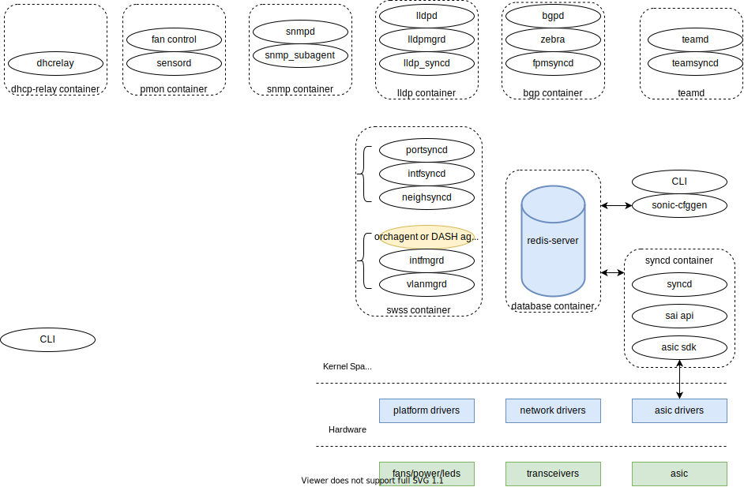

# SONiC-DASH High Level Design

<!-- reopened PR -->

## Table of Contents

- [Overview](#overview)
- [Requirements](#requirements)
- [Architecture](#architecture)
- [High-Level Design](#high-level-design)
- [Repositories](#repositories)
- [Configuration and management](#configuration-and-management)
- [Restrictions / Limitations](#restrictions--limitations)
- [Glossary](https://github.com/Azure/DASH/wiki/Glossary)
- [References](#supplementary-documents)

## Overview 

This document describes the **SONiC Disaggregated API for SONiC Hosts** (SONiC-DASH) high level design and architecture. SONiC-DASH (DASH for short) is an open source project that will deliver enterprise network performance to critical cloud applications. The ultimate goal is that DASH will have the same success as SONiC for switches and also be widely adopted as a major **Open NOS for Programmable Hardware Technologies**, including [SmartNICs](https://blogs.nvidia.com/blog/2021/10/29/what-is-a-smartnic/), to supercharge a variety of cloud and enterprise applications.
  
DASH extends SONiC APIs and a comprehensive set of object models that initially describe Microsoft Azure’s networking services for the cloud. The 7 initial services (in draft) located in the GitHub repo https://github.com/Azure/DASH describe this in more detail. The project enlists cloud and enterprise providers to further extend DASH to meet their specific needs.

## Requirements

The overall requirement is to **optimize network SMART Programmable Technologies performance**, and **leverage commodity hardware technology** to achieve **10x or even 100x stateful connection performance**.
- With the help of network hardware vendors, create an open forum that capitalizes on the use of **programmable networking hardware** including SmartNICs, SmartToRs, SmartAppliances. 
- Optimize **stateful L4** performance and connection scale by 10x or even 100x when compared to implementations that make extensive use of software. As host networking in the cloud is performed at L4 the resulting performance improvements should be truly significant.
- Microsoft Azure will integrate and deploy DASH solutions to ensure that scale, monitoring, reliability, availability and constant innovation are proven and hardened. It should be noted that innovations for **in-service software upgrades** (ISSU) and **high availability** (HA) are key tenets of the DASH charter that will also be battle hardened. 

## Architecture

SONiC is structured into various containers that communicate through multiple logical databases via a shared Redis instance. DASH will make use of the SONiC modified infrastructure as shown in the figure below.

 **The figure below is a draft (work in progress)** 

**DASH architecture**

## High-Level Design

**DASH high level design**

TBD

## Repositories

TBD

## References

- [Glossary](https://github.com/Azure/DASH/wiki/Glossary)
- [SAI](../SAI)
- [Test](../test)