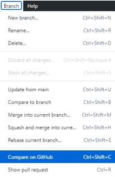
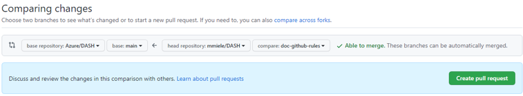

# GitHub basic process

**Table of contents**
- [Create issues](#create-issues)
- [Create a fork](#create-a-fork)
  - [Create a pull request (PR) in the original repository from a fork](#create-a-pull-request-pr-in-the-original-repository-from-a-fork)
- [Create pull request (PR) in the original repository](#create-pull-request-pr-in-the-original-repository)
- [Tools](#tools)

This document describes a short process to effectively use GitHub to achieve the following main goals:

1. Proposing a change. 
2. Reporting a bug. 
3. Making impovement suggestions.   

## Create issues

You use the **Issues** mechanism to report problems, bugs and suggest general improvements. This is for both internal and external contributors. 

This approach is useful if you want to 

- Flag items that cannot be addressed by a single PR.
- Request that may need to be analyzed to find the proper course of action.
- Record information to put on backlog.  

Please, include relevant details the rest of the team needs to understand in order to discuss the issue effectively. 

For more information, see [Creating an issue](https://docs.GitHub.com/en/issues/tracking-your-work-with-issues/creating-an-issue). 

## Create a fork

You fork a repository to propose changes to the original repository.
This is for external contributors that do not have the ability to create PRs directly against the original repository. It can also be used by internal contributors for tasks that cannot be addressed by issuing PRs against the original repository. 
For more information, see [Fork a repo](https://docs.github.com/en/get-started/quickstart/fork-a-repo).

This approach is useful if you want to 

- Fix a pubished artifact.
- Create a new artifact.
- Improve overall readibility, usefulness, and quality.
   
In this case, it's good practice to regularly sync your fork with the original repository. 
For more information, see [Syncing a fork](https://docs.github.com/en/pull-requests/collaborating-with-pull-requests/working-with-forks/syncing-a-fork).

### Create a pull request (PR) in the original repository from a fork

You can make any changes to a fork, including making branches and opening pull requests. 
If you want to contribute to the original repository, you can send a request to the original author to pull your fork into their repository by submitting a pull request.

For more information, see [Creating a pull request from a fork](https://docs.github.com/en/pull-requests/collaborating-with-pull-requests/proposing-changes-to-your-work-with-pull-requests/creating-a-pull-request-from-a-fork).

If you use the Github desktop app, you can perform these steps:

1. In the Github app, select **Branch** in the top menu bar. 
1. In the drop-down menu, select **Compare on GitHub**. 

      

1. This displays the **Comparing changes** page. There select the original repository and then the **Create pull request** button.

    

    You can also select a branch in the main repository to host the PR if one is made available. 

## Create pull request (PR) in the original repository 

You use a pull request (PR) to propose changes to a repository. The changes can be accepted or rejected by the repository's contributors. This is for internal contributors. For more information, see [Creating a pull request](https://docs.github.com/en/pull-requests/collaborating-with-pull-requests/proposing-changes-to-your-work-with-pull-requests/creating-a-pull-request). 

## Tools

- [GitHub desktop](https://desktop.github.com/)
- [Visual studio code](https://code.visualstudio.com/)
- [Drawing tool: draw.io](https://www.microsoft.com/en-us/p/drawio-diagrams/9mvvszk43qqw?activetab=pivot:overviewtab)
  
