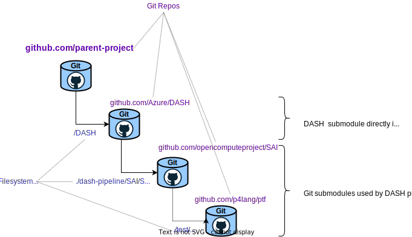

**I want a [Quick-Start](#quick-start)!**

**Table of Contents**

- [Importing the DASH project into another project](#importing-the-dash-project-into-another-project)
- [Quick-Start](#quick-start)
- [How to use DASH as a Git Submodule](#how-to-use-dash-as-a-git-submodule)
- [Third-Party Workflow & DASH Workflow Reuse](#third-party-workflow--dash-workflow-reuse)
  - [Recap: DASH bmv2 workflow](#recap-dash-bmv2-workflow)
  - [Custom DASH Workflow](#custom-dash-workflow)
  - [Reusable Build toolchain and artifacts](#reusable-build-toolchain-and-artifacts)
  - [Required Custom Tools and Artifacts](#required-custom-tools-and-artifacts)
  - [Custom Traffic Test Harness](#custom-traffic-test-harness)
  - [Custom Tests](#custom-tests)
  - [Third-Party CI Pipeline Automation (Git Actions)](#third-party-ci-pipeline-automation-git-actions)
# Importing the DASH project into another project

The [sonic-net/DASH project](https://github.com/sonic-net/DASH) can be used as a resource within other projects, such as third-party, commercial or open-source DASH implementations. For example, a commercial DPU vendor can incorporate the DASH project into a private Git repository and utilize many of the components, providing consistency with the community implementation and definition, reusing test-cases, and avoiding duplication of efforts.

# Quick-Start
This will show you how to import the [sonic-net/DASH project](https://github.com/sonic-net/DASH) project into your own Git project.

A minimal sample project created using this recipe can be found here: https://github.com/chrispsommers/dashsubmodule


1. Start with a Git project, either a new or existing one of your choosing. You might want to make a scratch project just to try this out.
2. Copy the [Makefile.3rdpty](Makefile.3rdpty) into your project. You can put it into its own subdirectory and/or or rename it to suit. If you rename it, please interpret the subsequent instructions accordingly.
3. Choose a subdirectory in which to import the DASH project as a submodule. The sample [Makefile.3rdpty](Makefile.3rdpty) assumes a directory  `./DASH` relative to the Makefile location. Edit the following line in the makefile to change this (or, set the environment variable `DASHDIR` before calling `make`):
    ```
    DASHDIR ?=DASH
     ```
4. Import the DASH repository as a submodule using the following command. Modify the final parameter to match the relative directory in your project where you want the submodule to be cloned into:
    ```
    git submodule add -b main --name DASH [git@github.com:sonic-net/DASH.git](https://github.com/sonic-net/DASH.git) DASH
    ```
5. Commit the changes now or later, see [DASH as a Git Submodule](#dash-as-a-git-submodule)
6. To verify the dash submodule was imported correctly and crucial steps function properly, execute the following. (If you rename the file to `Makefile` you can omit the `-f` option.)
    ```
    make [-f Makefile.3rdpty] clean
    make [-f Makefile.3rdpty] all
    ```
    This will run selected build steps from DASH - those which don't depend upon third-party implementations. This includes compiling the P4 code, generating SAI headers, and also pulls in several Docker images. It's a great starting point. See the detailed descriptions elsewhere in this document for next steps.
7. *OPTIONAL:* To perform the entire dash-pipeline build process, execute the following:
    ```
    make [-f Makefile.3rdpty] dash-pipeline-regression
    ```
    This will run `make clean && make all` from the dash project. You don't *have* to do this since many of the artifacts are irrelevant for third-party adaptations.
8. *OPTIONAL:* You can also `cd <DASHDIR>/dash-pipeline` and run any of the steps outlined in the DASH bmv2 [workflows](README-dash-workflows.md), such as the following. This has the benefit of verifying the function of SW traffic generators etc. in your environment. You can use this to confirm functional tests against the reference implementation.
    ```
    make run-switch              # console 1
    make run-saithrift-server    # console 2
    make run-all-tests           # console 3

# How to use DASH as a Git Submodule
A third-party project can import the DASH project as a Git Submodule. See [about-git-submodules](README-dash-workflows.md#about-git-submodules) for background. In this example, DASH is imported at the top-level of the project using the following command. (See the documentation for `git submodule add` for other options.)

```
git submodule add -b main --name DASH [git@github.com:sonic-net/DASH.git](https://github.com/sonic-net/DASH.git) DASH
```

The effects of this command are:
- Clone the DASH repository in-place under the directory `DASH` (relative to the working directory of the command).
- Make an entry in the `.gitmodules` file (creating it if needed). For example:
  ```
  [submodule "DASH"]
	path = DASH
	url = git@github.com:sonic-net/DASH.git
	branch = main
  ```
- Store the imported repository git index/database under the parent project's `.git/modules` directory

Importing the submodule also creates new items for `DASH` and `.gitmodules` which need to be committed. For example:
```
chris@chris-z4:~/dashsubmodule$ git status
On branch main
Your branch is up to date with 'origin/main'.

Changes to be committed:
  (use "git restore --staged <file>..." to unstage)
	new file:   .gitmodules
	new file:   DASH

Changes not staged for commit:
  (use "git add <file>..." to update what will be committed)
  (use "git restore <file>..." to discard changes in working directory)
  (commit or discard the untracked or modified content in submodules)
	modified:   DASH (modified content, untracked content)
```
To commit to your project:
```
git add .gitmodules DASH
git commit
[git push]
```
The resulting Git structure is as follows. DASH is imported as a submodule. Furthermore, the DASH project itself contains multiple levels of submodules. Via `git submodule update --init` instructions in `DASH/dash-pipeline/Makefile`) these  repositories are cloned-in-place.



# Third-Party Workflow & DASH Workflow Reuse
## Recap: DASH bmv2 workflow
The figure below shows the traditional bmv2-based workflow and is described in [README-dash-workflows](README-dash-workflows.md).


## Custom DASH Workflow
The reference project contains a `Makefile.3rdpty` to serve as a starting point. It has make targets which are just wrappers to invoke predefined Makefile targets in the DASH repository (e.g. using `make -C...`). It also has placeholder make targets where third-party customization is required. You can modify it arbitrarily. The intent was to reuse as much as possible from DASH.

The drawing below shows where third-party customization will be needed, using "exciting" colors.


The main objective is to re-use DASH artifacts, Makefiles, Dockerfiles, etc. where possible and replace (or augment) certain resources by third-party implementations.

## Reusable Build toolchain and artifacts

The following toolchains and output artifacts *should* be reusable as-is from the DASH project, with no (or very few) modifications:
* dash-pipeline P4 source code (for SAI header generation)
* P4 behavioral Model code compilation. The primary artifact of interest is just the P4Info file used to auto-generate the SAI headers for overlay services. Both the dockerized `dash-p4c-bmv2` container and the output artifacts should be reusable as-is from DASH.
* SAI experimental headers describing the interface to the dataplane, derived from P4Info. A code generator script [SAI/sai_api_gen.py](SAI/sai_api_gen.py) produces SAI headers derived from the P4 code, emitted into [SAI/SAI/experimental](SAI/SAI/experimental). It also generates a SAI-to-P4Runtime adaptor layer emitted into [SAI/lib](SAI/lib), for the bmv2 implementation.Third-party workflows can ignore the bmv2 adaptor layer or use it as inspiration.
* SAI metadata derived from the combination of standard SAI headers and the DASH headers. This is done by makefiles and scripts inside the SAI submodule and also uses the `dash-saithrift-bldr` container.
* `saithrift-client-bldr` base docker container, retrieved from a docker registry and built in a standard way. It contains base tools and packages.
* `dash-saithrift-client` docker container which includes all tools and artifacts needed to perform dataplane tests. The artifacts are generated based on the outputs of the saithrift-server build step (below) which might need third-party customization as described below.
  >**Note:** The community dash-pipeline bmv2 build workflows assume that saithrift-server is built first, then saithrift-client is built next. In principle the saithrift client is target-agnostic and should not depend upon the saithrift server, but the build process for saithrift client and server are somewhat combined. To make a saithrift client for a third-party implementation *without* depending upon third-party saithrift server (which depends on third-party `libsai`), just use the dash-pipeline `make all` and use the resulting saithrift-client docker image.

## Required Custom Tools and Artifacts
The following will undoubtedly be developed uniquely for each DASH implementation:
* DASH Dataplane - this is the primary focus of third-party DASH implementations and can be any mix of hardware and/or software.
* SAI adaptor layer to translate SAI API calls into the underlying dataplane configuration "SDK." You might want to adapt the code generator [SAI/sai_api_gen.py](SAI/sai_api_gen.py) to produce your own adaptor layer, or a skeleton thereof. 
* saithrift-server [Makefile](SAI/saithrift/Makefile) and `dash-saithrift-bldr` container to run the saithrift code generator and link to third-party `libsai.so`.

  >**Note:**  this might require significant third-party customizations to compile for certain archtectures. Default is Ubuntu 20.04 running on an x86 "device." Some implementations, e.g. the bmv2/P4Runtime implementation, use an RPC between the SAI adaptor layer and the underlying device "SDK," which means the saithrift server *could* run on one processor while the dataplane and device SDK run in a DPU with a different achitecture. For example, if a third-party dataplane has a native RPC such as gRPC, it could serve the same role as the P4Runtime API in the community bmv2 archtecture. If so, then the saithrift server could be compiled using the community workflow; presumably the custom `libsai` would translate SAI calls into native third-party gRPC calls, which means the saithrift server runs in a different process than the dataplane/native gRPC server. The [SAI/saithrift/Makefile](SAI/saithrift/Makefile) will probably need modifications to pass in different `SAIRPC_EXTRA_LIBS` at the minimum.

## Custom Traffic Test Harness
The community DASH bmv2 test workflow includes SW traffic-generators connected to the SW dataplane via `veth` ports. Third-party integrations can continue to use this method, or others, including:
* Using physical NIC devices driven by SW traffic generators, cabled to SW dataplanes bound to other physical NIC ports (high-performance SW implementations relying on NIC devices)
*  HW implementations of DASH dataplanes, e.g. "real DPUs" or physical emulations thereof, cabled to SW traffic generators which are bound to physical NIC ports.
*  HW or SW DASH dataplane implementations cabled to HW-based traffic generators such as IXIA chassis etc.

If test ports other than `veth0/1` and `veth2/3` are used, some modifications of setup scripts may be required:
* PTF tests using scapy for SW traffic generation can be parameterized to specify logical-to-physical port mappings.
* Pytests using ixia-c SW traffic generator are set up using docker-compose topology files under [DASH/test/third-party/traffic_gen/deployment](https://github.com/sonic-net/DASH/tree/main/test/third-party/traffic_gen/deployment)

## Custom Tests
You can use the tests under DASH by calling the appropriate DASH make targets from the parent project. You can also have private tests in your own project repository which you invoke from your Makefiles. We recommend if you write new tests which are generally applicable that you consider upstreaming to the Community repository.
## Third-Party CI Pipeline Automation (Git Actions)
You should be able to adapt the CI automation files from the dash project as located under [.github/workflows](../.github/workflows). You will need to modify them to suit your project by changing the trigger conditions (e.g. file system paths) and steps.