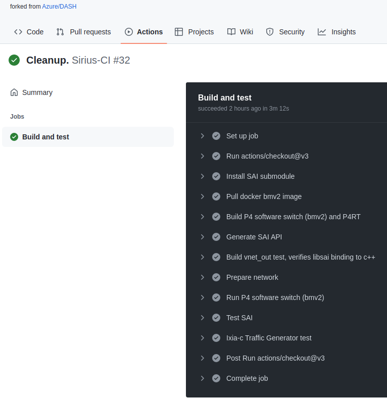
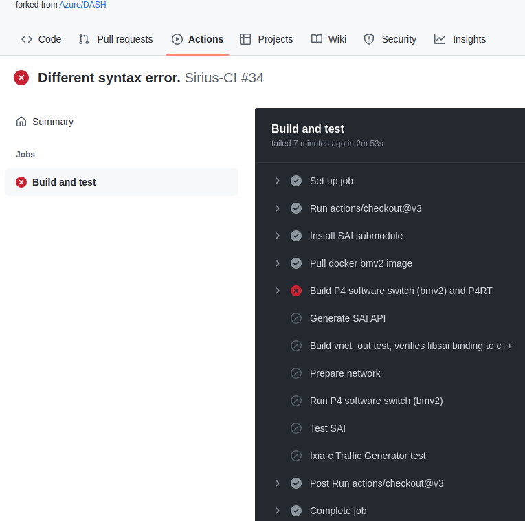
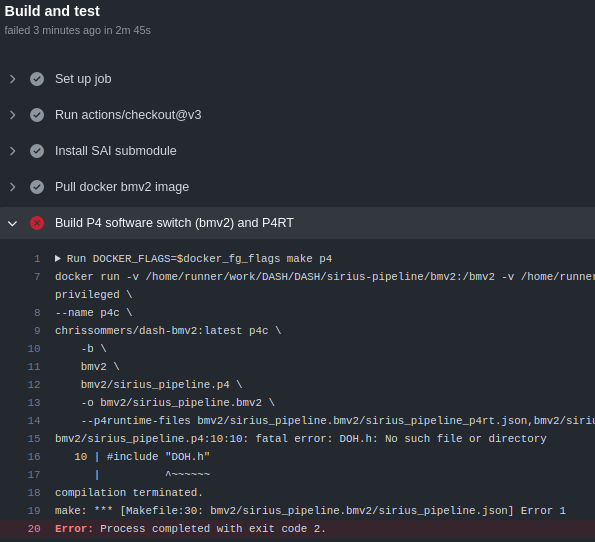
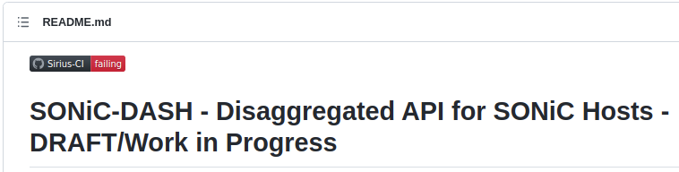

See also:
* [README.md](README.md) Top-level README for dash-pipeline
* [README-dash-workflows](README-dash-workflows.md) for detailed make targets etc.
* [README-dash-docker](README-dash-docker.md) for Docker usage.

**Table of Contents**
# DASH CI (Continuous Integration) Via Git Actions

- [DASH CI (Continuous Integration) Via Git Actions](#dash-ci-continuous-integration-via-git-actions)
- [CI Badges](#ci-badges)
    - [CI Build log - Passing example](#ci-build-log---passing-example)
    - [CI Build log - Fail example](#ci-build-log---fail-example)

This project contains [Git Actions](https://docs.github.com/en/actions) to perform continuous integration whenever certain actions are performed. These are specified in YAML files under [.github/workflows](../.github/workflows) directory.

There are several such `.yml` files and each one has specific trigger criteria and job specifications. These job specifications call out a sequence of steps, which in our case are `Makefile` build and/or test targets, similar to those you'd do "manually" as a developer.

The main CI job called `DASH-BMV2-CI ` is to rebuild the entire dash-pipeline and run all the tests whenever any of the dependencies change: P4 code, Makefiles, scripts and tests, etc. This can be used to ensure new features and build recipes work, test-cases pass and regressions didn't creep in.

There are also numerous `DASH-DOCKER-xxx` jobs which rebuild the various "builder" docker images. These are not invoked as often and are used to verify the infrastructure itself.
# CI Badges
* The CI badges will be updated according to the CI build status and appear on the front page of the repository (it's actually on the top-level README). You can click on this icon to drill down into the Git Actions history and view pass/fail details. Typical icons appear below:

      

Badges have flexibility, for example we could show the status of more than one branch at a time.

See:
* https://docs.github.com/en/actions/monitoring-and-troubleshooting-workflows
* https://docs.github.com/en/actions/monitoring-and-troubleshooting-workflows/adding-a-workflow-status-badge)
### CI Build log - Passing example

A typical "Good" CI log appears below, this can be watched in real-time:

  

### CI Build log - Fail example
A typical "Failed" CI log appears below. You can click on the arrow next to the red circled "X" and see details. In this example there is a (deliberate) P4 coding error.



Let's drill down into the Build P4 step which failed. We see a a bad statement. (There is no `#import` keyword for P4 or the C preprocessor).
```
#import DOH.h
```

  

The main README for this repository shows the CI failing badge:

