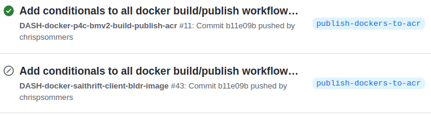

See also:
* [README.md](README.md) Top-level README for dash-pipeline
* [README-dash-workflows](README-dash-workflows.md) for detailed make targets etc.
* [README-dash-ci](README-dash-ci.md) for CI pipelines.

**Table of Contents**
- [DASH Docker Images](#dash-docker-images)
  - [Disclaimer - Specific Docker Image Details](#disclaimer---specific-docker-image-details)
  - [Docker Overview](#docker-overview)
  - [Use of existing Public Docker images](#use-of-existing-public-docker-images)
  - [Running Containers during Make](#running-containers-during-make)
  - [Volume Mounts](#volume-mounts)
  - [Building Docker Images](#building-docker-images)
    - [Best Practices](#best-practices)
  - [Optional - Manually Pull prebuilt Docker image(s)](#optional---manually-pull-prebuilt-docker-images)
  - [Optional - Override default Docker image version(s)](#optional---override-default-docker-image-versions)
  - [Optional - Docker image developers - build a new Docker image](#optional---docker-image-developers---build-a-new-docker-image)
  - [Optional - expert - `exec` a container shell](#optional---expert---exec-a-container-shell)
- [Dockerfile Development and Publishing Workflows](#dockerfile-development-and-publishing-workflows)
  - [Dockerfile Workflow Overview](#dockerfile-workflow-overview)
  - [Separate CI scripts for forks vs. main repo](#separate-ci-scripts-for-forks-vs-main-repo)
  - [Detailed Dockerfile Build  and Publish Workflows](#detailed-dockerfile-build--and-publish-workflows)
    - [Workflow I: Developing/Publishing docker images in a branch of main repo](#workflow-i-developingpublishing-docker-images-in-a-branch-of-main-repo)
    - [Workflow II: Developing/Publishing docker images in a fork via PRs to a branch of the main repo](#workflow-ii-developingpublishing-docker-images-in-a-fork-via-prs-to-a-branch-of-the-main-repo)
    - [Workflow III: Developing/Publishing docker images in a forked branch initially using Dockerhub](#workflow-iii-developingpublishing-docker-images-in-a-forked-branch-initially-using-dockerhub)
  - [Publishing Docker Images to Azure Container Registry Using Secrets](#publishing-docker-images-to-azure-container-registry-using-secrets)
# DASH Docker Images

## Disclaimer - Specific Docker Image Details
Below we'll lay out general principles; we avoid describing specific docker images used in DASH, to prevent documentation drift. Look at [Makefile](Makefile) and in the [dockerfiles](dockerfiles) directory for current details.

## Docker Overview
One or more docker images are used extensively to run the build and test workflows:
* Compile DASH behavioral model artifacts, such as P4 code, the SAI adaptor layer, etc.
* Run switch model processes, such as the bmv2 simple switch
* Run SW traffic generators for testing.

Docker images are read-only artifacts which are used to run a "container." These images contain all the resources required to perform the build or test task. Resources may include:
*  A base Operating System such as Ubuntu 20.04
*  Additional packages such as python3, p4c compiler, etc.
*  Libraries such as gRPC, built from source then whittled down to essential libraries

For normal day-to-day operations, the prebuilt Docker images are pulled from a publicly available Docker registry. This is automatically done when a `docker run` command is executed, e.g. by a `Makefile`.


>A notable exception is the `saithrift-client` docker image which is built on-demand in the dev workspace since it is based on current build artifacts (namely, saithrift libraries).

Occasionally, a Docker image must be modified, or a new one created, to serve the project's needs. This will require publishing (`docker push`), which is a privileged operation requiring administrative access to the Docker registry. This is done via Git Actions; see [Dockerfile Development and Publishing Workflows](#dockerfile-development-and-publishing-workflows).

All Docker images used by this project should be tagged with *dependable* labels to support [Configuration Management](README-dash-workflows#configuration-management). When using 3rd-party containers, use of `:latest` or even `:stable` is discouraged, since the contents can change without notice following an update of a 3rd-party project. Use of `@sha256:xxxxx` specifies a known image version and is the most reliable. See [Why you should pin your docker images with SHA instead of tags](https://rockbag.medium.com/why-you-should-pin-your-docker-images-with-sha-instead-of-tags-fd132443b8a6)

## Use of existing Public Docker images

Some docker images are pulled from public repositories and used as-is, for example `ixia-c` images used as SW traffic-generators for testing. Others form the basis (`FROM`) of purpose-built images, e.g `p4lang/p4c` is used to compile P4 source code and we use it in our own customized image.

## Running Containers during Make
During various build steps, a docker image is used to `docker run` a container(s) in which various `make` targets or other scripts are executed. So, the execution environment for most build steps is inside the docker container, not the normal user environment.

## Volume Mounts
When the container is run, various host machine subdirectories are "mounted" as volumes in the container, via the `-v` flag, for example: `-v $(PWD)/SAI:/SAI`, which mounts the host `./SAI` directory as the container's `/SAI` directory. The container can thus read and write the host development environment directories and files to access source files and generate build artifacts. See the diagram below.


## Building Docker Images
Docker images are not built routinely. Rather, they are built as-needed by an image maintainer and pushed to the docker registry.

The `make docker-XXX` targets create a docker images named `dash-XXX` where XXX is the name of the image, e.g. `docker-bmv2-bldr`. Docker images are built using a Dockerfile. See the [Makefile](Makefile) for all targets; or, you can  execute `make docker[TAB]` and let tab-completion provide the available targets.

Example (not necessarily current):
```
DASH/dash-pipeline$ make docker-[TAB]
docker-bmv2-bldr               docker-dash-p4c                docker-publish-dash-grpc       docker-publish-saithrift-bldr  docker-pull-dash-grpc          docker-pull-saithrift-bldr     
docker-dash-grpc               docker-publish-bmv2-bldr       docker-publish-dash-p4c        docker-pull-bmv2-bldr          docker-pull-dash-p4c           docker-saithrift-bldr       
```
### Best Practices
We strive to follow best practices in our Dockerfiles, such as:
* Using [Multi-stage builds](https://docs.docker.com/develop/develop-images/multistage-build/) to attain a cleaner, leaner image
* Deleting unneeded source files after package installs, preferably in the same layer (`RUN` command).
* Reducing layer count by chaining multiple shell commands (e.g. `RUN cmd-1 && \ cmd-2 && \ ... cmd-N`)
* Omitting dev tools such as `vim` - they can be added ad-hoc by developers on the fly
* Pinning base images with SHA versions instead of generic labels like `:latest` or even `:stable` which can change without notice.

## Optional - Manually Pull prebuilt Docker image(s)
This is optional, the Docker images will be pulled automatically the first time you run a `make` command which uses that image You can also do this to restore an image. These commands are used in the CI scripts to explicitly pull images before running them, to provide more granular visibility into CI steps and their success or failure.

```
make docker-pull-xxx  # where xxx = image name, e.g. bmv2-bldr
```
## Optional - Override default Docker image version(s)
You can override the image in use by setting an environment variable, for example:
```
export DOCKER_P4C_BMV2_IMG=p4lang/p4c:stable  # persistently override image
make p4
```
or
```
DOCKER_P4C_BMV2_IMG=p4lang/p4c:stable make p4 # temporarily override image
```
If you do multiple make targets in one command (e.g. `make all`), you can override multiple image names in the same command line by setting appropriate environment variables.
## Optional - Docker image developers - build a new Docker image
This step builds a new Docker image on demand, i.e. if you're developing or maintaining them. For routine code development (e.g. P4 code), you shouldn't have to do this; instead, you use the prebuilt one retrieved from a Docker registry. Note, this can be very time-consuming. 
```
make docker-XXX  ### where XXX = image name, e.g. bmv2-bldr
```
## Optional - expert - `exec` a container shell
This step runs a new container and executes `bash` shell, giving you a terminal in the container. It's primarily useful to examine the container contents or perform debugging.
```
docker run -it --rm [--network=host] [--priviliged] <image-name> bash
```
Some images already specify `CMD /bin/bash` so you can omit the final `bash` in the example above.

Some images don't have a base OS, they only contain libraries or other artifacts, so you can't `run` them.

# Dockerfile Development and Publishing Workflows
## Dockerfile Workflow Overview
As stated in [Docker Overview](#docker-overview), to save time, for normal artifact builds and regression tests, prebuilt Docker images are pulled from the registry, rather than built anew in each development or CI runner environment. From time-to-time, a new Docker image must be created, or an existing one modified, to serve the project's needs. This can be broken down into a few steps:
* Creating or modifying Dockerfile(s) and Makefile(s) which build and consume images
* Building a docker image locally
* Testing the docker image locally
* Committing changes to a development branch or fork
* Publishing the docker image to ACR (Azure Container Registry)
* CI testing the published artifacts (docker images etc.)
* Submitting a Pull Request to the main DASH branch and eventually merging it following the customary review process.

The following factors complicate the workflow a little bit:
* Images can only be published to ACR via a CI runner launched by the `sonic-net/DASH` parent project's Git actions, because the credentials allowing writes to ACR are stored in this repository as "secrets." These secrets are not available in forks.
* Changes to Makefiles, Dockerfiles or GitHub Actions in [.github/workflows](../.github/workflows) are used to trigger various rebuilds, test suites and docker image publishing in the cloud.
* The order of these triggers is not sequential, they can be triggered in parallel depending upon what changed. For example, pushing a change to a Dockerfile's tag definition (any file named `DOCKER_XXX_IMG.env` under [dockerfiles/](dockerfiles/)) will initiate building and publishing the Docker image *and* trigger a new run of the main dash-pipeline CI action ([dash-bmv2-ci.yml](../.github/workflows/dash-bmv2-ci.yml))
* A make target requiring a new Docker image version might run before the new image has been built and published to ACR.

The net result is that a CI build or test step might initially fail after a Git pull request or merge, because it depends on a new Docker image which is also being built simultaneously and not published yet. Furthermore, some Docker images depend upon base docker images (`FROM` clause), which also might not yet be published at the time the derived image's build begins. Fortunately this can be remedied with a manual re-run of the failed jobs in the Git Actions page of your project. We'll explain everything ahead.

## Separate CI scripts for forks vs. main repo
As explained above, credentials are required to push docker images to ACR. Therefore, two different CI scripts exist for each Dockerfile. Each Docker CI script has two variants, for example `dash-xxx-docker.yml` and `dash-xxx-docker-acr.yml`. The first variant only builds the docker image to catch regressions. The second variant also publishes to ACR.
* Forked projects (forks of `sonic-net/DASH`) will execute a build of any changed Dockerfile to verify correctness, but will not attempt to publish.
* Non-forked projects (branches of `sonic-net/DASH`) will execute a docker build and publish the images to ACR.

Conditionals are used in the CI jobs to gate their execution.

For example, this snippet containing an `if:` clause ensures we only push an image if we are running in the context of the `sonic-net/DASH` project (any branch), not in a fork. Similarly, the same expression but with the `!=` operator, is used in CI action scripts which should only run in a fork, *not* the main repo. 
```
jobs:
  build:
    name: Build and publish docker dash-bmv2-bldr image
    # Can only publish from within DASH repo (need credentials from secrets)
    if: github.repository == 'sonic-net/DASH'
```
>**Note:** Experienced GitHub Action developers might wonder why a single CI script couldn't combine the behavior of both scripts by making only the publish part conditional. It was tried per the advice [here](https://emmer.dev/blog/publishing-docker-images-with-github-actions/) but the saved docker file in the build job failed to upload to make it available to the publish job. So, two scripts are used.

The screenshot below from the Git Actions page shows an example of two Dockerfile-triggered Git action jobs: one which was executed (build and publish), and one which was skipped (build only), based on the repo it was running in. The gray circle with a slash indicates a skipped job.


## Detailed Dockerfile Build  and Publish Workflows
Practical Docker image development and publishing workflows are illustrated below and explained ahead. There is room for improvement, and more sophisticated CI action scripts might improve the developer experience. Please feel free to contribute your expertise!

Note, these workflows are for changes affecting docker images. If no docker images or tags are affected, these workflows are not relevant.

### Workflow I: Developing/Publishing docker images in a branch of main repo
In this workflow, all work is done in a *branch* of the main repo (versus a *fork* - see next section). This is recommended for smaller changes confined mainly to Dockerfile creation or updating. Larger-scope changes are better done in forks, to minimize main repo activity.

See the figure and descriptions below.


1. Create a development branch in `sonic-net/DASH`, e.g. named `featureX`. This requires write-access to the project, typically confined to a few core maintainers.
2. Create or modify Dockerfiles, associated `.env` files containing image names and tags, Makefiles, etc. Build and test this new work in your development machine. All Docker images are stored to and retrieved from the host machine's docker environment.
3. Perform `git commit` and `git push` to upload changes to GitHub. This will trigger CI actions, at a minimum to build/publish the docker images and run the main build/test CI actions. These run in parallel, which can lead to a race condition. If the main CI job tries to pull a new docker image which hasn't yet been published, it will fail the first time only.
4. Manually re-run failed job(s) as needed, which should now pass, since the docker images should have successfully published. (If not, fix the Dockerfiles or CI action files which control these steps). Steps 2-4 can be repeated as needed.
5. When feature work is complete, submit a pull request to the `main` branch. Once merged, it will again run all the CI jobs, which should pass.
### Workflow II: Developing/Publishing docker images in a fork via PRs to a branch of the main repo
This workflow does most of the work in a fork of the DASH repo. A branch of the main repo is still required to publish new images. This process is more complicated, but also more suitable for larger-scope changes. This allows the majority of the work to be done in a fork to lessen the main repo activity.

A concise description of this workflow is: make a feature branch in the main project (needs write access); check out this branch in a fork, then make a dev branch of the feature branch. Make code changes, create/modify docker images etc. and submit a pull request from dev branch to feature branch. The feature branch CI pipeline can push new images to ACR. Finally, submit a PR from the feature branch to main.

This workflow is appropriate for project developers who lack write access and thus can't create a branch in the `sonic-net/DASH` project. A maintainer with write access can first create a branch which developers can then submit pull requests against (for the primary purpose of making changes to docker images). The instructions below will make this clearer.

Oftentimes, a new docker image is created and doesn't change much thereafter, but other project content evolves significantly during the development of a feature. This workflow gets the needed docker image into ACR using a combination of a fork (for the brunt of the work) and a branch (to get the docker image into ACR for subsequent development).

Once the docker image is available in ACR, all further work can be done in the fork's branch, lessening the activity in the main repo which can impact or distract multiple community developers via e-mail alerts, Action logs, etc.

See the figure and descriptions below.


1. Create (or ask a maintainer to create) a branch in the `sonic-net/DASH` project. This will be used for publishing new docker images and perform the final pull-request into `main`. For this example we'll call the branch `featureX`.
2. Create a fork, or update an existing one (`git pull`), and `git checkout featureX`.
3. Create a new branch of this one, e.g. `git checkout -b featureX-dev`. This will be used to push changes to the `featureX` branch to effect docker image publishing. (Make sure you begin from the `featureX` branch before making the new one!)
4. Create or modify Dockerfiles, associated `.env` files containing image names and tags, Makefiles, etc. Build and test this new work in your development machine. All Docker images are stored to and retrieved from the host machine's docker environment.
5. Commit and push changes to the forked project repo. This will trigger CI pipelines in the fork only. The main CI job will fail because it won't be able to pull the new docker images since they have not been published yet.
6. Do a pull request from `featureX-dev` in your fork, to the `featureX` branch in the main repo. This will trigger CI actions to build and publish the new docker images. In parallel it will attempt a CI pipeline run to build and test everything, which will likely fail because required new images won't be published yet.
7. Re-run the failed CI job, which should pass this time. From here you can proceed to step 8 (final PR) or return to step 4 and continue incremental development in your fork. Assuming the newly-published docker image published in step 6 is satisfactory, you can do more work on your fork and pushes to your forked project will trigger CI runs which should pass, since new docker images got published. If you need to make more docker updates, repeat steps 4-7 as needed.
8. When all changes created in your fork have been pushed to `featureX` branch, issue a pull request to the main project. Once merged, it should pass all CI pipelines. (Be sure to sync to `main` before the final push to avoid surprises).

### Workflow III: Developing/Publishing docker images in a forked branch initially using Dockerhub
This workflow allows a developer to do all initial work using a private Dockerhub account, and only at the final Pull Request stage does it use ACR. The benefit of this approach is it that doesn't use a branch of the main repo for the publishing stages to ACR, and therefore avoids the write permissions issues required to create such a branch.

A concise description of this workflow is: make a dev branch in a fork. Do all code changes and new Dockerfile creation, pushing and pulling using a Dockerhub account of your own choosing. Just prior to submitting a pull request, change the new image's repository to ACR. The pull-request will initiate CI pipelines which will publish the image.

See the detailed steps and a diagram below.


1. Make or update a fork of the main project.
2. Checkout a new branch e.g. `featureX`
3. Create/modify docker images and other project artifacts. Instead of using ACR as the docker image's registry, use a personal or other Dockerhub account (or equivalent) as an interim registry.
4. Manually `docker push` the image to your personal Dockerhub account. This will ensure it can be accessed by the triggered CI pipeline steps when you `git push`.
5. Push this branch to the forked repo. It should build successfully, pulling the new image from the Dockerhub account which was manually pushed in the previous step.  The CI pipeline will *not* push the image since it's a fork; see [Separate CI scripts for forks vs. main repo](#separate-ci-scripts-for-forks-vs-main-repo).
6. When all development and testing are complete, change the docker image to use the ACR registry.
7. Push this change to the development repo. CI builds will fail because you cannot read the image from the new location; it hasn't been published to ACR yet!
8. Submit a pull request to the main project `sonic-net/DASH`. The first run of the main CI pipeline will fail because the initial push of the new image to ACR is being published in a parallel CI pipeline and won't be ready in time.
9. Re-run the failed job, it should pass since the image was published.
10. Review and accept the Pull Request. CI pipelines should again pass.
## Publishing Docker Images to Azure Container Registry Using Secrets
Docker images are stored in Azure Container Registry (ACR). Pushing new images requires proper authentication credentials for the registry. These credentials are stored in Git Project "Secrets" accessible only to the project administrator. Therefore, publishing new images is done via Git Actions which reference the secrets as "environment variables" which are available in the CI action's runner context. These CI actions are triggered by anything which changes the docker image contents or even the tag, including Dockerfiles, image names, Makefiles, etc.

For example, the file [dash-bmv2-bldr-docker-acr.yml](../.github/workflows/dash-bmv2-bldr-docker-acr.yml) contains the following code:
```
    - uses: azure/docker-login@v1
      with:
        login-server: ${{ secrets.DASH_ACR_LOGIN_SERVER }}
        username: ${{ secrets.DASH_ACR_USERNAME }}
        password: ${{ secrets.DASH_ACR_PASSWORD }}   
```
This snippet accomplishes login to ACR so that subsequent `docker push` commands can succeed.
