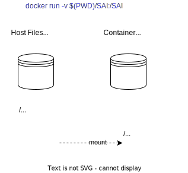

See also:
* [README.md](README.md) Top-level README for dash-pipeline
* [README-dash-workflows](README-dash-workflows.md) for detailed make targets etc.
* [README-dash-ci](README-dash-ci.md) for CI pipelines.

**Table of Contents**
- [DASH Docker Images](#dash-docker-images)
  - [Disclaimer - Specific Docker Image Details](#disclaimer---specific-docker-image-details)
  - [Overview](#overview)
  - [Use of existing Public Docker images](#use-of-existing-public-docker-images)
  - [Running Containers during Make](#running-containers-during-make)
  - [Volume Mounts](#volume-mounts)
  - [Building Docker Images](#building-docker-images)
    - [Best Practices](#best-practices)
  - [Optional - Manually Pull prebuilt Docker image(s)](#optional---manually-pull-prebuilt-docker-images)
  - [Optional - Override default Docker image version(s)](#optional---override-default-docker-image-versions)
  - [Optional - Docker image developers - build a new Docker image](#optional---docker-image-developers---build-a-new-docker-image)
  - [Optional - Expert/Admin - Publish Docker Image](#optional---expertadmin---publish-docker-image)
  - [Optional - expert - `exec` a container shell](#optional---expert---exec-a-container-shell)
# DASH Docker Images

## Disclaimer - Specific Docker Image Details
Below we'll lay out general principles; we avoid describing specific docker images used in DASH, to prevent documentation drift. Look at [Makefile](Makefile) and in the [dockerfiles](dockerfiles) directory for current details.

## Overview
One or more docker images are used extensively to run the build and test workflows:
* Compile DASH behavioral model artifacts, such as P4 code, the SAI adaptor layer, etc.
* Run switch model processes, such as the bmv2 simple switch
* Run SW traffic generators for testing.

Docker images are read-only artifacts which are used to run a "container." These images contain all the resources required to perform the build or test task. Resources may include:
*  A base Operating System such as Ubuntu 20.04
*  Additional packages such as python3, p4c compiler, etc.
*  Libraries such as gRPC, built from source then whittled down to essential libraries

For normal day-to-day operations, the prebuilt Docker images are pulled from a publicly available Docker registry. This is automatically done when a `docker run` command is executed, e.g. by a `Makefile`.

Occasionally, a Docker image must be modified, or a new one created, to serve the project's needs. This will require publishing (`docker push`), which is a privileged operation requiring administrative access to the Docker registry.

All Docker images used by this project should be tagged with *dependable* labels to support [Configuration Management](README-dash-workflows#configuration-management). When using 3rd-party containers, use of `:latest` or even `:stable` is discouraged, since the contents can change without notice following an update of a 3rd-party project. Use of `@sha256:xxxxx` specifies a known image version and is the most reliable. See [Why you should pin your docker images with SHA instead of tags](https://rockbag.medium.com/why-you-should-pin-your-docker-images-with-sha-instead-of-tags-fd132443b8a6)

## Use of existing Public Docker images

Some docker images are pulled from public repositories and used as-is, for example `ixia-c` images used as SW traffic-generators for testing. Others form the basis (`FROM`) of purpose-built images, e.g `p4lang/p4c` is used to compile P4 source code and we use it in our own customized image.

## Running Containers during Make
During various build steps, a docker image is used to `docker run` a container(s) in which various `make` targets or other scripts are executed. So, the execution environment for most build steps is inside the docker container, not the normal user environment.

## Volume Mounts
When the container is run, various local subdirectories are "mounted" as volumes in the container, via the `-v` flag, for example: `-v $(PWD)/SAI:/SAI`, which mounts the local `./SAI` directory as the container's `/SAI` directory. The container can thus read and write the local development environment directories and files to access source files and generate build artifacts. See the diagram below.



## Building Docker Images
Docker images are not built routinely. Rather, they are built as-needed by an image maintainer and pushed to the docker registry.

The `make docker-XXX` targets create a docker images named `dash-XXX` where XXX is the name of the image, e.g. `docker-bmv2-bldr`. Docker images are built using a Dockerfile. See the [Makefile](Makefile) for all targets; or, you can  execute `make docker[TAB]` and let tab-completion provide the available targets.

Example (not necessarily current):
```
DASH/dash-pipeline$ make docker-[TAB]
docker-bmv2-bldr               docker-dash-p4c                docker-publish-dash-grpc       docker-publish-saithrift-bldr  docker-pull-dash-grpc          docker-pull-saithrift-bldr     
docker-dash-grpc               docker-publish-bmv2-bldr       docker-publish-dash-p4c        docker-pull-bmv2-bldr          docker-pull-dash-p4c           docker-saithrift-bldr       
```
### Best Practices
We strive to follow best practices in our Dockerfiles, such as:
* Using [Multi-stage builds](https://docs.docker.com/develop/develop-images/multistage-build/) to attain a cleaner, leaner image
* Deleting unneeded source files after package installs, preferably in the same layer (`RUN` command).
* Reducing layer count by chaining multiple shell commands (e.g. `RUN cmd-1 && \ cmd-2 && \ ... cmd-N`)
* Omitting dev tools such as `vim` - they can be added ad-hoc by developers on the fly
* Pinning base images with SHA versions instead of generic labels like `:latest` or even `:stable` which can change without notice.

## Optional - Manually Pull prebuilt Docker image(s)
This is optional, the Docker images will be pulled automatically the first time you run a `make` command which uses that image You can also do this to restore an image. These commands are used in the CI scripts to explicitly pull images before running them, to provide more granular visibility into CI steps and their success or failure.

```
make docker-pull-xxx  # where xxx = image name, e.g. bmv2-bldr
```
## Optional - Override default Docker image version(s)
You can override the image in use by setting an environment variable, for example:
```
export DOCKER_P4C_BMV2_IMG=p4lang/p4c:stable  # persistently override image
make p4
```
or
```
DOCKER_P4C_BMV2_IMG=p4lang/p4c:stable make p4 # temporarily override image
```
If you do multiple make targets in one command (e.g. `make all`), you can override multiple image names in the same command line by setting appropriate environment variables.
## Optional - Docker image developers - build a new Docker image
This step builds a new Docker image on demand, i.e. if you're developing or maintaining them. For routine code development (e.g. P4 code), you shouldn't have to do this; instead, you use the prebuilt one retrieved from a Docker registry. Note, this can be very time-consuming. 
```
make docker-XXX  ### where XXX = image name, e.g. bmv2-bldr
```
## Optional - Expert/Admin - Publish Docker Image
This step publishes the local Docker image to the registry and requires credentials. It should be done selectively by Docker image maintainers. For now there are no `make` targets to do this.

## Optional - expert - `exec` a container shell
This step runs a new container and executes `bash` shell, giving you a terminal in the container. It's primarily useful to examine the container contents or perform debugging.
```
docker run -it --rm [--network=host] [--priviliged] <image-name> bash
```
Some images already specify `CMD /bin/bash` so you can omit the final `bash` in the example above.

Some images don't have a base OS, they only contain libraries or other artifacts, so you can't `run` them.
