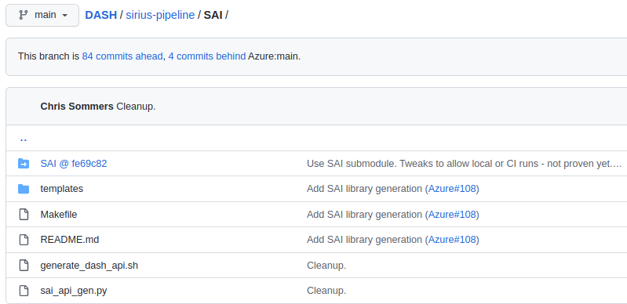
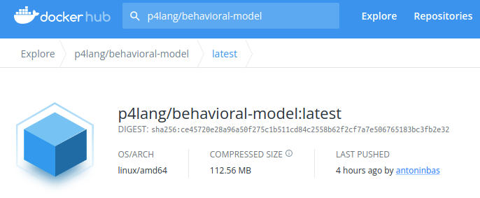

**>> I Don't have time to RTFM!***   [Jump to Concise Developer Workflows](#concise-developer-workflows)

*(Read the Fancy Manual)

See also:
* [README.md](README.md) Top-level README for dash-pipeline
* [README-dash-ci](README-dash-ci.md) for CI pipelines.
* [README-dash-docker](README-dash-docker.md) for Docker usage.
* [README-saithrift](README-saithrift.md) for saithrift client/server and test workflows.
* [README-ptftests](README-ptftests.md) for saithrift PTF test-case development and usage.
* [README-pytests](README-pytests.md) for saithrift Pytest test-case development and usage.

**Table of Contents**
- [Concise Developer Workflows](#concise-developer-workflows)
  - [Use Case I - Developing P4 Code - Zero config](#use-case-i---developing-p4-code---zero-config)
    - [Sending packets "manually" into the switch](#sending-packets-manually-into-the-switch)
  - [Use-Case II - Developing P4 Code + libsai config (C++)](#use-case-ii---developing-p4-code--libsai-config-c)
  - [Use-Case III - Developing End-to-End Tests with saithrift](#use-case-iii---developing-end-to-end-tests-with-saithrift)
  - [Use-Case IV - Incremental Test-Case Development](#use-case-iv---incremental-test-case-development)
- [Make Target Summary](#make-target-summary)
  - [Make "ALL" Targets](#make-all-targets)
  - [Build Artifacts](#build-artifacts)
  - [Launch Daemons/Containers](#launch-daemonscontainers)
  - [Run Tests](#run-tests)
- [Detailed DASH Behavioral Model Build Workflow](#detailed-dash-behavioral-model-build-workflow)
  - [Docker Image(s)](#docker-images)
  - [Build Workflow Diagram](#build-workflow-diagram)
  - [Make All](#make-all)
  - [Cleanup](#cleanup)
  - [Stop Containers](#stop-containers)
  - [Compile P4 Code](#compile-p4-code)
  - [Build libsai.so adaptor library](#build-libsaiso-adaptor-library)
    - [Restore SAI Submodule](#restore-sai-submodule)
  - [Build saithrift-server](#build-saithrift-server)
  - [Build libsai C++ client test program(s)](#build-libsai-c-client-test-programs)
  - [Create veth pairs for bmv2](#create-veth-pairs-for-bmv2)
  - [Run software switch](#run-software-switch)
  - [Initialize software switch](#initialize-software-switch)
    - [Use wireshark to decode P4Runtime messages in the SAI-P4RT adaptor](#use-wireshark-to-decode-p4runtime-messages-in-the-sai-p4rt-adaptor)
  - [Run saithrift-server](#run-saithrift-server)
  - [Build saithrift-client docker image](#build-saithrift-client-docker-image)
  - [Run All Tests](#run-all-tests)
  - [Run saithrift-client tests](#run-saithrift-client-tests)
    - [Run saithrift-client PTF tests](#run-saithrift-client-ptf-tests)
    - [Run saithrift-client Pytests](#run-saithrift-client-pytests)
    - [Run saithrift-client "Dev" Pytests](#run-saithrift-client-dev-pytests)
  - [Run libsai C++ tests](#run-libsai-c-tests)
  - [Start/Stop ixia-c Traffic Generator](#startstop-ixia-c-traffic-generator)
    - [About snappi and ixia-c traffic-generator](#about-snappi-and-ixia-c-traffic-generator)
      - [Opensource Sites](#opensource-sites)
      - [DASH-specific info](#dash-specific-info)
  - [About Git Submodules](#about-git-submodules)
    - [Why use a submodule?](#why-use-a-submodule)
    - [Typical Workflow: Committing new code - ignoring SAI submodule](#typical-workflow-committing-new-code---ignoring-sai-submodule)
    - [Committing new SAI submodule version](#committing-new-sai-submodule-version)
- [Configuration Management](#configuration-management)
  - [DASH Repository Versioning](#dash-repo-versioning)
  - [Submodules](#submodules)
  - [Docker Image Versioning](#docker-image-versioning)
    - [Project-Specific Images](#project-specific-images)
    - [Third-party Docker Images](#third-party-docker-images)
# Concise Developer Workflows
This section gives you a quick idea of how to work on various tasks efficiently. Don't  run `make all` unless you have to!

>Do you have another use-case in mind? Help document it with a Pull-Request, or ask the community.

## Use Case I - Developing P4 Code - Zero config
Developing P4 code only requires  use of `make p4` to verify the code compiles. This is fairly quick. You can run the code in the bmv2 software switch via `make run-switch`. This simplified setup doesn't support any switch configuration, so the testability is minimal. For example, you can send in packets and observe the switch console logging to verify packet parsing/deparsing. See [Sending packets "manually" into the switch](#sending-packets-manually-into-the-switch)


### Sending packets "manually" into the switch
Assuming you've done `make all` at least once, you will have a handy saithrift-client docker image which contains scapy, snappi libraries to run ixia-c SW traffic generator, etc. See the "optional" box in the figure above.
You also have to build `sai` in order for the bmv2 "forwarding pipeline config" to get loaded, which you can force via `make init-switch`. For example, you can enter the container and run ad-hoc scapy commands, see below:
```
make run-switch                   # console 1
make init-switch                  # console 2
make run-saithrift-client-bash    # console 2
...   
root@chris-z4:/tests-dev/saithrift# scapy
>>> p=Ether()/IP()/UDP()
>>> sendp(p, iface='veth1')
.
Sent 1 packets.
>>> 
```

## Use-Case II - Developing P4 Code + libsai config (C++)
To test the autogeneration of `libsai` and configuration of the data plane, you can execute `make sai` and `make libsai-test`. You can add tests under `dash-pipeline/tests/libsai`. It takes slightly over half a minute to generate `libsai`. The C++ tests are limited to CRUD operations on the SAI interface and run as one-shot programs without any traffic generation.

That being said, you can use the same techniques described in [Sending packets "manually" into the switch](#sending-packets-manually-into-the-switch). Conceivably you could write C++ tests to configure the switch to a known state; send packets; then verify them manually. However, test-cases written this way are not very useful, perhaps only  as ad hoc throwaway tests.

>Use [saithrift tests](#developing-end-to-end-tests-with-saithrift) for end-to-end testing of config and traffic. Tests using the saithrift client/server are very easy to write and translate well into CI automated regression testing.

Here's the minimal set of commands to [re-]compile p4, generate libsai and C++ tests, and run tests:
```
[make clean]
make p4 sai libsai-test run-switch
```
In a second console, run tests and optionally stop the switch:
```
make run-libsai-test [&& make kill-switch]
```


## Use-Case III - Developing End-to-End Tests with saithrift
End-to-end tests require `make all` in order to build all the local artifacts and saithrift-client docker image.

A concise set of commands to run, in three separate terminals:
```
[make clean &&] make all run-switch   # console 1
make run-saithrift-server             # console 2
make run-all-tests                    # console 3
```


## Use-Case IV - Incremental Test-Case Development
This builds upon the previous use-case.

Once you have stable P4 code, `libsai` and a saithrift client/server framework, you can start the switch and sai-thrift server, then develop test-cases interactively. The figure above illustrates this process in the lower-right corner. You can edit and save saithrift tests (PTF or Pytest) in your host PC's workspace; save the files; then run selected, or all tests, interactively from inside the saithrift-client container. See [Developer: Run tests selectively from `bash` inside saithrift-client container](README-saithrift.md#developer-run-tests-selectively-from-bash-inside-saithrift-client-container) for details.

# Make Target Summary
The tables below summarize the most important `make` targets for easy reference. You can click on a link to jump to further explanations. Not all make targets are shown. See the [Makefile](Makefile) to learn more.

Dockerfile build targets are separately described in [README-dash-docker](README-dash-docker.md) since they are mainly for infrastructure and generally not part of day-to-day code and test-case development. The one exception is the [docker-saithrift-client](#build-saithrift-client-docker-image) target. 
## Make "ALL" Targets
| Target(s)              | Description                                                                  |
| ---------------------- | --------------------------------------------------|
| [all](#make-all)       | Builds all artifacts except Docker "builder" images.                     |
| [clean](#cleanup)      | Deletes built artifacts and restores distro directories to clean state                    |
| [kill-all](#stop-containers)             | Stops all running containers                      |
| [run-all-tests](#run-all-tests)          | Run all tests under `dash-pipeline/tests`         |

## Build Artifacts 
| Target(s)              | Description                                                                  |
| ---------------------- | --------------------------------------------------|
| [p4](#compile-p4-code) <br>[p4-clean](#compile-p4-code) | Compiles P4 code and produces both bmv2 and P4Info `.json` files.<br>Delete p4 artifacts |
| [sai](#build-libsaiso-adaptor-library)<br>[sai-clean](#build-libsaiso-adaptor-library)| Auto-generate sai headers, sai adaptor code and compile into `libsai.so` library<br>Cleans up artifacts and restores SAI submodule |
| [test](build-libsai-c-client-test-programs) | Compile C++ unit tests under [tests/libsai](tests/libsai)
| [saithrift-server](#build-saithrift-server) | Auto-generate the saithrift client-server framework and libraries |
| [docker-saithrift-client](#build-saithrift-client-docker-image) | Build a docker image containing tools, libraries and saithrift test-cases for PTF and Pytest

## Launch Daemons/Containers
| Target(s)              | Description                                                                  |
| ---------------------- | --------------------------------------------------|
| [run-switch](#run-software-switch)<br>[kill-switch](#run-software-switch) | Run a docker container with bmv2 data plane & P4Runtime server<br>Stop the bmv2 container
| [run-saithrift-server](#run-saithrift-server)<br>[kill-saithrift-server](#run-saithrift-server) | Run a saithrift server which translates SAI over thrift into into P4Runtime<br>Stop the saithrift server container|
| [deploy-ixiac](#startstop-ixia-c-traffic-generator)<br>[undeploy-ixiac](#startstop-ixia-c-traffic-generator)  | Start ixia-c containers (done automatically when running tests)<br>Stop ixia-c containers (called by `kill-all`)

## Run Tests
| Target(s)              | Description                                                                  |
| ---------------------- | --------------------------------------------------|
| [run-libsai-test](run-libsai-c-tests)     | Run tests under [tests/libsai](tests/libsai)       |
| [run-saithrift-ptftests](#run-saithrift-client-ptf-tests) | Run PTF tests under [tests/saithrift/ptf](tests/libsai/ptf) using tests built into [docker-saithrift-client](#build-saithrift-client-docker-image) image
| [run-saithrift-pytests](#run-saithrift-client-pytests) | Run Pytests under [tests/saithrift/pytest](tests/libsai/pytest) using tests built into [docker-saithrift-client](#build-saithrift-client-docker-image) image
|[run-saithrift-client-tests](#run-saithrift-client-tests) | Run all saithrift tests |
| [run-saithrift-dev-ptftests](#run-saithrift-client-ptf-tests) <br> [run-saithrift-dev-pytests](#run-saithrift-client-dev-pytests) <br> [run-saithrift-client-dev-tests](#run-saithrift-client-dev-tests) | Like the three targets above. above, but run tests from host directory `tests/saithrift` instead of tests built into the `saithrift-client` container for faster test-case development code/test cycles.


# Detailed DASH Behavioral Model Build Workflow

This explains the various build steps in more details. The CI pipeline does most of these steps as well. All filenames and directories mentioned in the sections below are relative to the `dash-pipeline` directory (containing this README) unless otherwise specified. 

The workflows described here are primarily driven by a [Makefile](Makefile) and are suitable for a variety of use-cases:
* Manual execution by developers - edit, build, test; commit and push to GitHub
* Automated script-based execution in a development or production environment, e.g. regression testing
* Cloud-based CI (Continuous Integration) build and test, every time code is pushed to GitHub or a Pull Request is submitted to the upstream repository.

See the [Diagram](#build-workflow-diagram) below. You can read the [dockerfiles](dockerfiles) and all `Makefiles` in various directories to get a deeper understanding of the build process. You generally use the targets from the main [Makefile](Makefile) and not any subordinate ones.


## Docker Image(s)
>**NOTE** P4 code or test-case developers generally **don't** need to build `p4c`, `saithrift-bldr,` or `bmv2` docker images; they are pulled automatically, on-demand, from a registry. They contain static tooling. Developers who create and maintain the Docker images **do** need to build and push new images.

Several docker images are used to compile artifacts, such as P4 code, or run processes, such as the bmv2 simple switch. These Dockerfiles should not change often and are stored/retrieved from an external docker registry. See [README-dash.docker](README-dash.docker.md) for details. When a Dockerfile does change, it needs to be published in the registry. Dockerfile changes also trigger rebuilds of the docker images in the CI pipeline.

See the diagram below. You can read the [Dockerfile](Dockerfile) and all `Makefiles` to get a deeper understanding of the build process.

## Build Workflow Diagram


## Make All
This make target will build all the artifacts from source:
* Compile P4 code
* Auto-generate DASH SAI API header files based on P4Info from previous step
* Compile `libsai` for dash including SAI-to-P4Runtime adaptor
* Compile functional tests written in C++ to verify sai (under `dash-pipeline/tests/libsai`)
* Auto-generate the saithrift server and client framework (server daemon + client libraries) based on the DASH SAI headers
* Build a saithrift-client Docker image containing all needed tools and test suites
```
make all
```
## Cleanup
This will delete all built artifacts, restore the SAI submodule and kill all running containers.
```
make clean
```
## Stop Containers
This will kill one or all containers:
```
make kill-switch             # stop the P4 bmv2 switch
make kill-saithrift-server   # stop the RPC server
make undeploy-ixiac          # stop the ixia-c containers
make kill-all                # all of the above
```
## Compile P4 Code
```
make p4-clean # optional
make p4
```
The primary outputs of interest are:
 * `bmv2/dash_pipeline.bmv2/dash_pipeline.json` - the "P4 object code" which is actually metadata interpreted by the bmv2 "engine" to execute the P4 pipeline.
 * `bmv2/dash_pipeline.bmv2/dash_pipeline_p4rt.json` - the "P4Info" metadata which describes all the P4 entities (P4 tables, counters, etc.). This metadata is used downstream as follows:
    * P4Runtime controller used to manage the bmv2 program. The SAI API adaptor converts SAI library "c" code calls to P4Runtime socket calls.
    * P4-to-SAI header code generation (see next step below)

## Build libsai.so adaptor library
This library is the crucial item to allow integration with a Network Operating System (NOS) like SONiC. It wraps an implementation specific "SDK" with standard Switch Abstraction Interface (SAI) APIs. In this case, an adaptor translates SAI API table/attribute CRUD operations into equivalent P4Runtime RPC calls, which is the native RPC API for bmv2.

```
make sai-headers     # Auto-generate headers & adaptor code
make libsai          # Compile into libsai.so
make sai             # Combines steps above
make sai-clean       # Clean up artifacts and Git Submodule
```

These targets generates SAI headers from the P4Info which was described above. It uses [Jinja2](https://jinja.palletsprojects.com/en/3.1.x/) which renders [SAI/templates](SAI/templates) into C++ source code for the SAI headers corresponding to the DASH API as defined in the P4 code. It then compiles this code into a shared library `libsai.so` which will later be used to link to a test server (Thrift) or `syncd` daemon for production.

This consists of two main steps
* Generate the SAI headers and implementation code via [SAI/generate_dash_api.sh](SAI/generate_dash_api.sh) script, which is merely a wrapper which calls the real workhorse: [SAI/sai_api_gen.py](SAI/sai_api_gen.py). This uses templates stored in [SAI/templates](SAI/templates).

  Headers are emitted into the imported `SAI` submodule (under `SAI/SAI`) under its `inc`, `meta` and `experimental` directories.

  Implementation code for each SAI accessor are emitted into the `SAI/lib` directory.
* Compile the implementation source code into `libsai.so`, providing the definitive DASH data plane API. Note this `libsai` makes calls to bmv2's embedded P4Runtime Server and must be linked with numerous libraries, see for example `tests/vnet_out/Makefile` to gain insights.

### Restore SAI Submodule
As mentioned above, the `make sai` target generates code into the `SAI` submodule (e.g. at `./SAI/SAI`). This "dirties" what is otherwise a cloned Git repository from `opencomputeproject/SAI`.
```
make sai-clean
```

To ensure the baseline code is restored prior to each run, the modified directories under SAI are deleted, then restored via `git checkout -- <path, path, ...>` . This retrieves the subtrees from the SAI submodule, which is stored intact in the local project's Git repository (e.g. under `DASH/.git/modules/dash-pipeline/SAI/SAI`)

## Build saithrift-server
This builds a saithrift-server daemon, which is linked to the `libsai` library and also includes the SAI-to-P4Runtime adaptor. It also builds Python thrift libraries and saithrift libraries.
```
make saithrift-server
```
In the case a vendor integrates its own `libsai` library into the saithrift server, the libsai might have new external dependencies (such as google protocol buffer) thus requiring for vendor specific libraries or linker options to be passed down to the saiserver linker.
An environment variable (SAIRPC_VENDOR_EXTRA_LIBS) can be specified when invoking the saithrift server build command to provide path to new libraries and/or new linker options.
Its value will be added to the baseline SAIRPC_EXTRA_LIBS as defined in the saithrift makefile.

Since the saithrift server is built within a docker container (and the parent repository is mounted as /dash), any of the extra libraries needed will need to be copied over under the parent repository, and the paths to those libraries will need to be relative to the docker mount point.

In the example below, libprotobuf.a is a new external dependency to the vendor specific libsai.so and has been copied over under the parent repository (in our case, dash-pipeline/SAI/lib).
We use the provided Makefile.3rdpty as an entry point into the DASH makefiles.

```
SAIRPC_VENDOR_EXTRA_LIBS="/dash/dash-pipeline/SAI/lib/libprotobuf.a"
thirdparty-saithrift-server: thirdparty-libsai
	@echo "Build third-party saithrift-server"
	@echo "   Expects libsai.so under $(DASHDIR)/dash-pipeline/SAI/lib"
	SAIRPC_VENDOR_EXTRA_LIBS=$(SAIRPC_VENDOR_EXTRA_LIBS) $(MAKE) -C $(DASHDIR)/dash-pipeline saithrift-server
```

## Build libsai C++ client test program(s)
This compiles simple libsai client program(s) to verify the libsai-to-p4runtime-to-bmv2 stack. It performs table access(es).

```
make test
```

## Create veth pairs for bmv2
This needs to be run just once. It will create veth pairs, set their MTU, disable IPV6, etc.

```
make network
```

You can delete the veth pairs when you're done testing via this command:
```
make network-clean
```
## Run software switch
This will run an interactive docker container in the foreground. The main process is `simple_switch_grpc` which  includes an embedded P4Runtime server. This will spew out verbose content when control APIs are called or packets are processed. Use additional terminals to run other test scripts.

>**NOTE:** Stop the process (CTRL-c) to shut down the switch container. You can also invoke `make kill-switch` from another terminal or script.

```
make run-switch   # launches bmv2 with P4Runtime server
```
## Initialize software switch
The `bmv2` switch does not start up loaded with your P4 program; it is a "blank slate" awaiting a
`SetForwardingPipelineConfigRequest` gRPC message which contains the output of the p4c compiler (P4 bmv2 JSON) and P4Info), as described in [Compile P4 Code](#compile-p4-code). In our current implementation, this is done via a static initializer in the`libsai.so` shared library, which won't get loaded and activated (by the Linux loader) until an API call is made to the library. This can be triggered by e.g. a SAI table accessor. What if we want to initialize the switch without calling any SAI table APIs?

The `init_switch` test program and corresponding make target shown below makes a benign dummy call to the library to cause it to load and perform a `SetForwardingPipelineConfigRequest`.
```
make init-switch
```
A message similar to the following will be emitted in the running switch's console:
```
GRPC call SetForwardingPipelineConfig 0.0.0.0:9559 => /etc/dash/dash_pipeline.json, /etc/dash/dash_pipeline_p4rt.txt
Switch is initialized.
```
### Use wireshark to decode P4Runtime messages in the SAI-P4RT adaptor
>**Hint:** You can monitor P4Runtime messages using Wireshark or similar. Select interface `lo`, filter on `tcp.port==9559`. Right-click on a captured packet and select "Decode as..." and configure port 9559 to decode as HTTP2 (old versions of Wireshark might lack this choice).
## Run saithrift-server
>**Note:** the bmv2 switch must be running, see 
When this server is launched, it will establish a P4Runtime session (behind the scenes) to the running `bmv2` switch daemon . The thrift server listens on port `9092` for Thrift messages carrying SAI rpc commands. These commands are dispatched the the SAI library handlers. These handlers translate them into corresponding P4Runtime RPC commands and are sent to the bmv2 daemon onto a socket at standard P4Runtime port `9559`.
```
make run-saithrift-server
```
When the server starts, the first SAI command it receives will load the `libsai.so` shared library and establish a P4Runtime connection. This results in a console message similar to below. Note this message doesn't necessarily appear when the daemon starts. This also loads the bmv2 behavioral model with the P4 "object code" (JSON file), see [Initialize software switch](#initialize-software-switch).
```
GRPC call SetForwardingPipelineConfig 0.0.0.0:9559 => /etc/dash/dash_pipeline.json, /etc/dash/dash_pipeline_p4rt.txt
Switch is initialized.
```

To stop it:
```
make kill saithrift-server
```

## Build saithrift-client docker image
```
make docker-saithrift-client
```
This will build a docker image which has all libraries needed to talk to the saithrift-server daemon, including:
* saithrift client libraries (Python)
* PTF framework from [OCP SAI repo](https://github.com/opencomputeproject/SAI.git), including all test cases
* The [PTF repo](https://github.com/p4lang/ptf) imported from p4lang
* Scapy etc.

It also contains all the artifacts under `tests/` which includes PTF and Pytest test-cases. Thus, it comprises a self-contained test resource with tools, libraries and test scripts.
## Run All Tests
```
make run-all-tests
```
This will run all the tests cases for libsai (C++ programs) as well as saithrift (Pytest and PTF). You must have the bmv2 switch and saithrift-server running.
## Run saithrift-client tests
To run all "Production" tests which use the saithrift interface, execute the following. The tests are assumed to be built into the `saithrift-client` docker image. See [Running DASH saithrift tests](README-saithrift.md#running-dash-saithrift-tests). You must have the bmv2 switch and saithrift-server running.
```
make run-saithrift-client-tests
```
This will launch a saithrift-client docker container and execute tests under `tests/saithrift`, including:
* Pytests under `tests/saithrift/pytest`
* PTF Tests under `tests/saithrift/PTF`
### Run saithrift-client PTF tests
To run all PTF tests which use the saithrift interface, execute the following. You must have the bmv2 switch and saithrift-server running.
```
make run-saithrift-client-ptftests
```
This will launch a saithrift-client docker container and execute tests under `tests/saithrift/ptf`.
### Run saithrift-client Pytests
To run all Pytests which use the saithrift interface, execute the following. You must have the bmv2 switch and saithrift-server running.
```
make run-saithrift-client-pytests
```
This will launch a saithrift-client docker container and execute tests under `tests/saithrift/pytests`.
### Run saithrift-client "Dev" Pytests
You can also run "dev" versions of tests using the following make targets. These use test scripts mounted from the host's file system, allowing a faster development workflow. No dockers need to be rebuilt to try out test cases iteratively. Use the following variants of the make targets. See [Development - Launch container, run tests in one shot](#development---launch-container-run-tests-in-one-shot)
```
make run-saithrift-client-dev-pytests     # run Pytests from host mount
make run-saithrift-client-dev-ptftests    # run PTF tests from host mount
make run-saithrift-client-dev-tests       # run both suites above
```

## Run libsai C++ tests
This exercises the `libsai.so` shared library with C++ programs. This tests the SAI API handlers and P4Runtime client adaptor, which communicates to the running `simple_switch_grpc` process over a socket.
```
make run-libsai-test
```

## Start/Stop ixia-c Traffic Generator
This will start/stop the ixia-c traffic generator, which consists of one container for the Controller and one container per Traffic Engine (1 per port = 2 for DASH).
```
make deploy-ixiac    # Start the containers
make undeploy-ixiac  # Stop the containers
```
### About snappi and ixia-c traffic-generator
#### Opensource Sites
* Vendor-neutral [Open Traffic Generator](https://github.com/open-traffic-generator) model and API
* [Ixia-c](https://github.com/open-traffic-generator/ixia-c), a powerful traffic generator based on Open Traffic Generator API
* [Ixia-c Slack support channel](https://github.com/open-traffic-generator/ixia-c/blob/main/docs/support.md)

#### DASH-specific info
* [../test/test-cases/bmv2_model](../test/test-cases/bmv2_model) for ixia-c test cases
* [../test/third-party/traffic_gen/README.md](../test/third-party/traffic_gen/README.md) for ixia-c configuration info
* [../test/third-party/traffic_gen/deployment/README.md](../test/third-party/traffic_gen/deployment/README.md) for docker-compose configuration and diagram

## About Git Submodules
See also:
* https://git-scm.com/book/en/v2/Git-Tools-Submodules
* https://www.atlassian.com/git/tutorials/git-submodule#:~:text=A%20git%20submodule%20is%20a,the%20host%20repository%20is%20updated

### Why use a submodule?
A Git submodule is like a symbolic link to another repo. It "points" to some other repository via a URL, and is also pinned to a specific revision of that repo. For example, the `DASH/dash-pipeline/SAI` directory looks like this in Github. The `SAI @ fe69c82` means this is a submodule pointing to the SAI project (at the opencompute-project repo), in particular the `fe69c82` commit SHA.



Advantages of this approach:
* Don't need to "manually" clone another repository used by this project
* Precise configuration control - we want a specific revision, not "latest" which might break a DASH build if something under `SAI` changes.
* It's a well-known practice; for example the `SAI` project and the `sonic-buildimage` projects both use submodules to great advantage.

### Typical Workflow: Committing new code - ignoring SAI submodule

>**NOTE:** You **do not want to check in changes to the SAI/SAI submodule** unless you're deliberately upgrading to a new commit level of the SAI submodule.

Since the SAI/SAI directory gets modified in-place when bmv2 SAI artifacts are generated, it will "taint" the SAI/SAI submodule and appear as "dirty" when you invoke `git status`. This makes it inconvenient to  do `git commit -a`, which will commit everything which has changed. An easy remedy is to restore the SAI/SAI directory to pristine state as follows:
```
make sai-clean
```
Then you can do `git status`, `git commit -a` etc. and skip the modified SAI/SAI submodule.

### Committing new SAI submodule version
To upgrade to a newer version of `SAI`, for example following a SAI enhancement which the DASH project needs, or will benefit from, we need to change the commit SHA of the submodule. This requires the following steps, in abbreviated form:
* Inside the `SAI/SAI` directory, pull the desired version of SAI, e.g. to get latest:
  ```
  git pull
  ```
* Go to the top level in the DASH project
* Add the SAI submodule to the current commit stage; commit; and push:
  ```
  git add SAI/SAI
  git commit [-a]
  git push
  ```
Since we haven't gone through this process yet, it is subject to more clarification or adjustments.
# Configuration Management

"Configuration Management" here refers to maintaining version control over the various components used in the build and test workflows. It's mandatory to identify and lock down the versions of critical components, so that multiple versions and branches of the complete project can be built and tested in a reproducible and predictable way, at any point in the future.

The sections below discuss version control of critical components.
## DASH Repository Versioning
The DASH GitHub repo, i.e. [https://github.com/Azure/DASH](https://github.com/Azure/DASH) is controlled by Git source-code control, tracked by commit SHA, tag, branch, etc. This is the main project and its components should also be controlled.
## Submodules
As discussed in [About Git Submodules](#about-git-submodules), submodules are controlled by the SHA commit of the submodule, which is "committed" to the top level project (see [About Git Submodules](#about-git-submodules). The versions are always known and explicitly specified.
## Docker Image Versioning
Docker image(s) are identified by their `repo/image_name:tag`, e.g. `p4lang/dp4c:latest`.
### Project-Specific Images
Docker images which we build, e.g. `dash-bmv2-bldr`, are controlled by us so we can specify their contents and tag images appropriately. It is important to version-control the contents of these images so that future builds of these images produce the same desired behavior. This means controlling the versions of base Docker images, OS packages added via `apt install` etc.
### Third-party Docker Images
Docker images which we pull from third-party repos, e.g. [p4lang/behavioral-model](https://hub.docker.com/r/p4lang/behavioral-model) may have "version" tags like `:latest`, `:stable`, `:no-pi`. Such tags are not reliable as packages are often updated, so `:latest` and even `:stable` change over time. We use such images directly or as base images in our own Dockerfiles, e.g. in `FROM` statements.

Similarly, common OS base images like [amd64/ubuntu:20.04](https://hub.docker.com/layers/ubuntu/amd64/ubuntu/20.04/images/sha256-b2339eee806d44d6a8adc0a790f824fb71f03366dd754d400316ae5a7e3ece3e?context=explore) have the tag `20.04` but this does not guarantee that the image won't suddenly change, which could break our builds.

To ensure predictable and stable behavior, we should use SHA values for tags, e.g. `@sha256:ce45720e...` instead of `:latest`.

Example:

***Not reliable:***
```
# Can change daily:
FROM p4lang/behavioral-model:latest
```
***Reliable:***
```
# p4lang/behavioral-model:latest on 2022-07-03:
FROM p4lang/behavioral-model@sha256:ce45720e28a96a50f275c1b511cd84c2558b62f2cf7a7e506765183bc3fb2e32
```
The screencap below shows how to obtain the SHA digest of a docker image on Dockerhub, corresponding to the example above.



See:
* [Why you should pin your docker images with SHA instead of tags](https://rockbag.medium.com/why-you-should-pin-your-docker-images-with-sha-instead-of-tags-fd132443b8a6)
