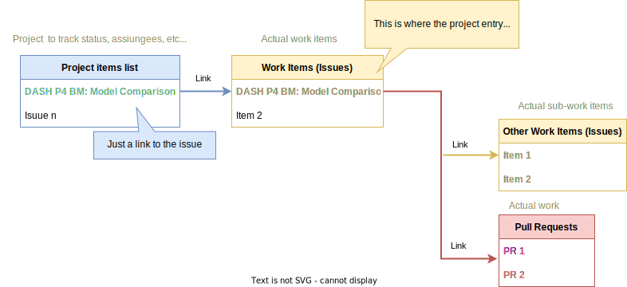

# GitHub basic process

**Table of contents**
- [Create issues](#create-issues)
- [Create a fork](#create-a-fork)
  - [Create a Pull Request (PR)](#create-a-pull-request-pr)
- [Create a Pull Request from a branch in the original repository](#create-a-pull-request-from-a-branch-in-the-original-repository)
- [PR Review Phase](#pr-review-phase)
- [PR Accept Phase](#pr-accept-phase)
- [Directly Editing Artifacts](#directly-editing-artifacts)
- [Use checklists for large issues or PRs](#use-checklists-for-large-issues-or-prs)
  - [About task lists (check lists)](#about-task-lists-check-lists)
    - [Tracking work on an issue](#tracking-work-on-an-issue)
    - [Convert a task to an issue](#convert-a-task-to-an-issue)
- [Create a project](#create-a-project)
  - [Adding draft issues to your project](#adding-draft-issues-to-your-project)
  - [Reorder rows](#reorder-rows)
  - [Adding your project to a repository](#adding-your-project-to-a-repository)
  - [Excluding files from being pushed to the remote repository](#excluding-files-from-being-pushed-to-the-remote-repository)
- [Tools](#tools)

This document describes a short process to effectively use GitHub to achieve the following main goals:

1. Proposing a change. 
2. Reporting a bug. 
3. Making improvement suggestions.   

> [!NOTE]
> The intent of this document is not to teach the use of GitHub. The document just gathers some basic rules for a quick reference. 

## Create issues

You use the **Issues** mechanism to report problems, bugs and suggest general improvements. This is for both internal and external contributors. 

This approach is useful if you want to 

- Flag items that cannot be addressed by a single PR.
- Request that may need to be analyzed to find the proper course of action.
- Record information to put on backlog.  

Please, include relevant details the rest of the community needs to understand in order to discuss the issue effectively. 

For more information, see [Creating an issue](https://docs.GitHub.com/en/issues/tracking-your-work-with-issues/creating-an-issue). 


## Create a fork

You fork a repository to propose changes to the original repository. This is the recommended practice for community contributions.

For more information, see [Fork a repo](https://docs.github.com/en/get-started/quickstart/fork-a-repo).

If you use the Github desktop app, see [Cloning and forking repositories from GitHub Desktop](https://docs.github.com/en/desktop/contributing-and-collaborating-using-github-desktop/adding-and-cloning-repositories/cloning-and-forking-repositories-from-github-desktop). 
   
It's good practice to regularly sync your fork with the original repository. 
For more information, see [Syncing a fork](https://docs.github.com/en/pull-requests/collaborating-with-pull-requests/working-with-forks/syncing-a-fork).

### Create a Pull Request (PR)

You can make any changes to a fork, including making branches and opening pull requests. 
If you want to contribute to the original repository, you can submit a pull request.

For more information, see [Creating a pull request from a fork](https://docs.github.com/en/pull-requests/collaborating-with-pull-requests/proposing-changes-to-your-work-with-pull-requests/creating-a-pull-request-from-a-fork).

If you use the Github desktop app, see [Creating an issue or pull request](https://docs.github.com/en/desktop/contributing-and-collaborating-using-github-desktop/working-with-your-remote-repository-on-github-or-github-enterprise/creating-an-issue-or-pull-request). 

## Create a Pull Request from a branch in the original repository

> [!WARNING] 
> This approach is for contributors that have write access to the original repository and should be used sparingly. Excessive "topic branches" can clutter the main repository. 

You create a branch off the original repository and then create a PR based on this branch. 

For more information, see [Creating a pull request](https://docs.github.com/en/pull-requests/collaborating-with-pull-requests/proposing-changes-to-your-work-with-pull-requests/creating-a-pull-request). 

If you use the Github desktop app, see [Creating an issue or pull request](https://docs.github.com/en/desktop/contributing-and-collaborating-using-github-desktop/working-with-your-remote-repository-on-github-or-github-enterprise/creating-an-issue-or-pull-request). 

## PR Review Phase

Pull requests generally are open to community review and get accepted as-is or with requested changes. The more impactful the changes, the more review activity is to be expected.

The following are the main steps of the review process:

- You can review changes in a pull request one file at a time. 
- While reviewing the files in a pull request, you can leave individual comments on specific changes. 
- After you finish reviewing each file, you can mark the file as viewed. This collapses the file, helping you identify the files you still need to review. 
- A progress bar in the pull request header shows the number of files you've viewed. 
- After reviewing as many files as you want, you can approve the pull request or request additional changes by submitting your review with a summary comment. 

For more information, see [Reviewing proposed changes in a pull request](https://docs.github.com/en/enterprise-cloud@latest/pull-requests/collaborating-with-pull-requests/reviewing-changes-in-pull-requests/reviewing-proposed-changes-in-a-pull-request).

See also [Searching issues and pull requests](https://docs.github.com/en/enterprise-cloud@latest/search-github/searching-on-github/searching-issues-and-pull-requests). 

## PR Accept Phase

Once a PR has received sufficient review and concerns are satisfied, a designated person with sufficient [permissions](https://docs.github.com/en/organizations/managing-access-to-your-organizations-repositories/repository-roles-for-an-organization#permissions-for-each-role) can accept the Pull Request. 

## Directly Editing Artifacts
Contributors with write access permission or higher have rights to directly edit documents and push changes. This practice should be used very sparingly, and only in the draft stages of documents, or to make trivial changes in documents already in use.

> [!WARNING]
> Direct edits (without proper PR and review) to "released" artifacts short-circuits the normal community process and can result in breaking changes and significant disruption, resulting in potential impact to downstream consumers.

## Avoid Directly Committing New Artifacts
As a corollary to the hazards of directly editing documents, contributors with write access permission or higher have rights to directly commit new documents. This should be avoided. Skipping the normal PR and review process prevents reviewers from making inline comments against "Files Changed" etc. Only summary comments of the commit itself are possible, which is less useful.

> [!WARNING]
> Direct commits (without proper PR and review) of new artifacts short-circuits the normal community process and should be avoided. 

## Use checklists for large issues or PRs

When working on a complex Issue or PR, it is often preferable to use a checklist within one Issue or PR. This avoids the use of multiple Issues or PRs that could be difficult to track.  

Especially with an issue related to a feature, all of the pull requests used to implement the feature can refer to the same issue. The progress made can be easily understood by looking at which boxes are checked and which are not. The status is found in one place.

The checklist system is also useful to track work, such as a progress summary, when reviewing lists of open Issues.

A contributor would enter the checklist in the comment when creating the Issue or PR. To create a checklist, please use a markdown format similar to the one shown in the example below.

```md
- [x] Fix TOC
- [x] Add checklist section
```
> [!NOTE]
> Any work item is check-marked  with `x` when the related tasks are completed. 

### About task lists (check lists)

A task list (or check list) is a set of tasks where each task is displayed on a separate line with a clickable checkbox. Notice the following:

- You can select or deselect the checkboxes to mark the tasks as complete or incomplete.
- If you reference an issue, pull request, or discussion in a task list, the reference shows the title and the status.
- If you add a task list to the body of an issue, the list has added functionality.

#### Tracking work on an issue

- The progress of an issue's task list appears in various places on GitHub, such as a repository's list of issues.
- If a task references another issue and someone closes that issue, the task's checkbox will automatically be marked as completed.
- If a task requires further tracking or discussion, you can **convert the task to an issue** by hovering over the task and clicking  in the upper-right corner of the task.
- To add more details before creating the issue, you can use keyboard shortcuts to open the new issue form. For more information, see [Keyboard shortcuts](https://docs.github.com/en/get-started/using-github/keyboard-shortcuts#issues-and-pull-requests).
- Any issues referenced in the task list will specify that they are tracked in the referencing issue.

#### Convert a task to an issue

When in the issue that contains tasks, perform these steps:

1. Mouse over the task to convert to an issue.
2. On the right side, select the arrow down icon.
3. Select the link to the issue just created. This displays the related page. Enter a description, labels, assignees, etc..

For more information, see [About task lists](https://docs.github.com/en/issues/tracking-your-work-with-issues/about-task-lists)

## Create a project

A project is a **customizable spreadsheet** that integrates with issues and pull requests. You can do the following:

- Customize the layout by filtering, sorting, and grouping your issues and PRs.
- Add custom fields to track metadata.

For more information see [About projects (beta)](https://docs.github.com/en/issues/trying-out-the-new-projects-experience/about-projects).

See also [Creating an organization project](https://docs.github.com/en/issues/trying-out-the-new-projects-experience/quickstart#creating-an-organization-project). 

The following figure is a simple workflow representation.



### Adding draft issues to your project

You can also add a draft issue to the project as a place holder for future work not yet defined. See [Adding draft issues to your project](https://docs.github.com/en/issues/trying-out-the-new-projects-experience/quickstart#adding-draft-issues-to-your-project). 

For more information, see [Plan and track projects closer to your code #DemoDays](https://www.youtube.com/watch?v=SI1ra-XHWHM) (you may want to start at minute 23:00). 

### Reorder rows

In project table layout, you can change the order of rows.

1. Select the **number** at the start of the row.
1. While clicking, **drag the row** to the required location.

> [!NOTE]
> Make sure to clear automatic sorting.

### Adding your project to a repository

You can list relevant projects in a repository. You can only list projects that are owned by the same user or organization that owns the repository.

In order for **repository members to see a project listed in a repository**, they **must have visibility** for the project. For more information, see [Managing the visibility of your projects (beta)](https://docs.github.com/en/issues/trying-out-the-new-projects-experience/managing-the-visibility-of-your-projects) and [Managing access to projects (beta)](https://docs.github.com/en/issues/trying-out-the-new-projects-experience/managing-access-to-projects).

### Excluding files from being pushed to the remote repository 

When working on a project, you’ll want to exclude specific files or directories
from being pushed to the remote repository. This is where `.gitignore` file
comes into the picture. This file specifies what untracked files Git must ignore
so they are not pushed to the remote repository.
For more information, see [Ignoring Files and Directories in Git
(.gitignore)](https://linuxize.com/post/gitignore-ignoring-files-in-git/). 
See also [A collection of .gitignore templates](https://github.com/github/gitignore). 

## Tools

- [GitHub desktop](https://desktop.github.com/ "Cntrl+Left Click to open in a new tab")
- [How to Use the Github Workflow ](https://www.youtube.com/watch?v=8UguQzmswC4)
-  [Plan and track projects closer to your code #DemoDays](https://www.youtube.com/watch?v=SI1ra-XHWHM) 
- [Visual studio code](https://code.visualstudio.com/)
  - [Gitlens](https://marketplace.visualstudio.com/items?itemName=eamodio.gitlens). Supercharge the Git capabilities. 
  - [Markdown All in One](https://marketplace.visualstudio.com/items?itemName=yzhang.markdown-all-in-one). Create the ToC for an article.
- [Drawing tool: diagrams.net](https://www.diagrams.net/)