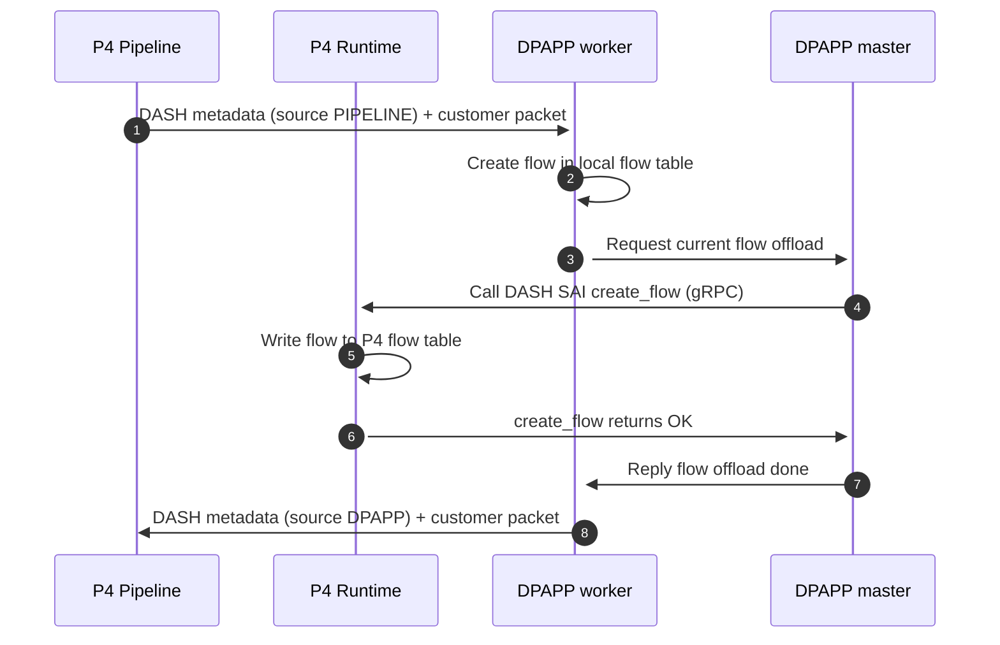
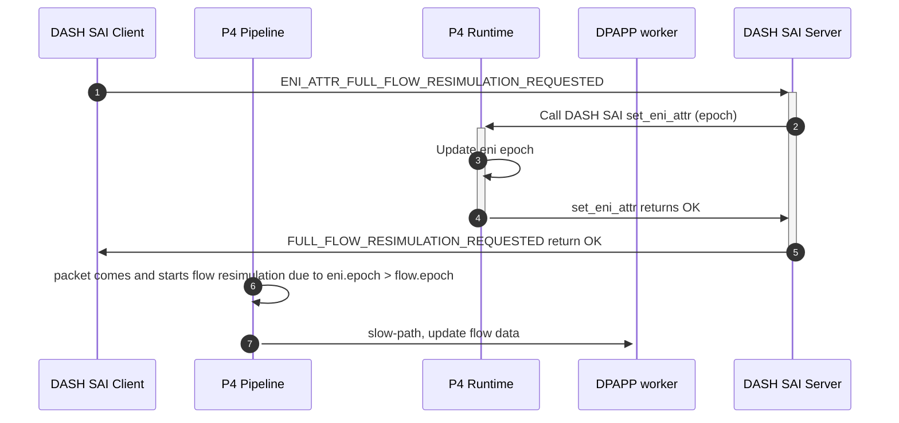

# DASH BMv2 Data Plane App HLD

| Rev | Date | Author | Change Description |
| --- | ---- | ------ | ------------------ |
| 0.1 | 06/29/2024 | Junhua Zhai | Initial version |

1. [Terminology](#1-terminology)
2. [Background](#2-background)
3. [Project scenario](#3-project-scenario)
4. [Resource modeling, requirement, and SLA](#4-resource-modeling-requirement-and-sla)
5. [System Architecture overview](#5-system-architecture-overview)
6. [Detailed design](#6-detailed-design)
    - [6.1. DASH metadata](#61-dash-metadata)
    - [6.2. Basic Flow](#62-basic-flow)
    - [6.3. Flow resimulation](#63-flow-resimulation)
    - [6.4. HA flow](#64-ha-flow)
    - [6.5. HA flow resimulation](#65-ha-flow-resimulation)
    - [6.6. SAI](#66-sai)
7. [Test Plan](#7-test-plan)
8. [Appendix](#8-appendix)
    

## 1. Terminology

| Term | Explanation |
| --- | --- |
| VPP | Vector Packet Processing |
| DPAPP | Data plane Application |


## 2. Background

Referring to data path logical architecture, shown at the below figure:


Data plane app is another packet processing engine running on CPUs. It adds extra capacities onto DASH capable ASIC:
- It serves the slow (exception) path of packet processing to implement complicated pipeline logic, which is hard to be done in ASIC, for example adding/updating/removing table entry inline.
- It optionally implements some DASH-SAI APIs, which are not proper/easy to be done upon ASIC SDK.

### 2.1. Scope

This document only focuses on describing the design of a data-plane app example, as a proof of concept, how it cooperates with [DASH pipeline BMv2](https://github.com/sonic-net/DASH/tree/main/dash-pipeline/bmv2) to implement DASH data plane. The app will be based on [VPP](https://fd.io/).

## 3. Project scenario

### 3.1. Stateful packet process - flow
- Flow Creation

  In DASH pipeline, after flow keys are well extracted, packet goes to flow
  lookup stage. It does the flow lookup. If any flow is matched, packet is
  marked a flow-hit flag, otherwise flow-miss flag. If flow-hit, the packet
  should bypass policy matching stages, such as ACL, routing, etc, and
  continue doing the rest stages, like flow actions. If flow-miss, the packet
  should do policy matching stages and then be forwarded to data-plane app.
  The data-plane app will use dash-sai APIs to create flow in flow table, and
  then re-inject the packet back to pipeline.

- Flow Deletion

  In flow lookup stage, TCP FIN/RST packet should be treated specially with
  FLOW-DELETE hint and forwarded to data-plane app.
- Flow Age-out

  Data-plane app can help the data plane implement the flow age-out
  mechanism by bridging the gap in the current data plane engine - bmv2.
  For example, in flow lookup stage, if packet hits one flow, pipeline may refresh
  flow timestamp via p4 extern function. Data-plane app periodically scans flow table
  and check if flow is timed out according to (current timestamp - flow timestamp) vs idle
  timeout value.

### 3.2. HA
- Inline flow replication

  In HA context, Active data-plane app creates flow, serializes the flow in
metadata header, glues it with original packet, and sends the packet to Standby
via DPU data-plane channel. Standby data-plane app recreates
the flow, and acknowledges Active data-plane app to finish flow creation. The
same logic can apply for flow deletion, flow age-out.
- Flow bulk sync

  Flow bulk sync replicates batch flows from one DPU to another to make flow
  table consistent on Active and Standby DPUs. When HA agents starts a bulk
  sync via DASH SAI, Active data-plane app will walk flow table based on sync
  method (perfect/range), generate batch flows and send them to Standby
  data-plane app with gRPC via control-plane channel. Standby date-plane app
  will create flows in order.

### 3.3. Flow re-simulation
When SONiC changes polices via DASH SAI, some flows might need to be updated
to get the latest policy applied. Data-plane app is raised to re-simulate
flow. In HA context, Active data-plane app also needs to sync the updated
flows to Standby.

## 4. Resource modeling, requirement, and SLA
Refer to [SONiC DASH HLD](https://github.com/sonic-net/DASH/blob/main/documentation/general/dash-sonic-hld.md)

## 5. System Architecture overview


Referring to the above figure, data-plane app overall is a multi-thread application based on vpp, running in a standalone container. It includes these components:

- master thread, it runs dashsai server to receive dashsai requests (dash object CRUD) via northbound RPC channel and then invoke DASH SAI APIs to handle them. The server also processes flow creation/deletion notification from workers.
- worker threads, they serve as an exception (slow) path of packet processing, running
on multiple CPUs. It creates a flow in local flow table and notifies dashsai
server to offload it to BMv2 flow table. The packet is temporarily queued.
After workers know the success of flow offloading to BMv2, they dequeue the packet and send it back to P4 pipeline via DPAPP port. The workers also do flow age-out task with proper scheduling.
- flow table, is a local cache of BMv2 flow table.
- DASH SAI, is a unique interface for DASH object CRUD of DASH pipeline, implemented by DASH BMv2.
- DPAPP port, is a veth interface and connects to BMv2 via veth pair. It serves as datapath channel to receive/send all packets between date-plane app and BMv2. Generally the port supports multi RSS queues, each queue binds to one worker thread.

**Note:** For simplicity and concept verification, worker threads may directly call DASH SAI to offload flow to BMv2. The concern is that DASH SAI blocking API can block packet processing of workers.

## 6. Detailed design

Referring to the below figure from [HA API HLD](https://github.com/sonic-net/DASH/blob/main/documentation/high-avail/ha-api-hld.md), it greatly outlines the whole packet flow in data plane for both standalone and HA context.


From the perspective of DPAPP, its core task in slow path is to create flow in flow table in case of flow miss in Flow (Conntrack) lookup stage, and then maintain flow state. The sub sections will depict these functions around flow object.


### 6.1. DASH metadata
DASH metadata records the packet processing result of DASH pipeline. It can have the following info to help flow creation/removal, etc operations:
- flow key entry - eni_mac, vnet_id, 5-tuples
- common flow data - state, direction, eni, flow actions, metering class, policy ID
- flow overlay rewrite data 
- flow underlay encapsulation data 
- flow tunnel encapsulation data 

When DASH pipeline requests DPAPP for flow creation, it encapsulates DASH metadata in an ethernet frame with EtherType DASH_METADATA and appends the original customer packet. The packet sent to DPAPP is like:

```
    Ethernet HEADER | DASH metadata | customer packet
```

The number of DASH_METADATA is 0x876D, which reuses the number of EtherType SECURE_DATA (vpp/src/vnet/ethernet/types.def at master · FDio/vpp · GitHub).
DASH metadata is encoded in protocol DASH_METADATA, whose message format is defined as the below figure:

```
    0                   1                   2                   3   
    0 1 2 3 4 5 6 7 8 9 0 1 2 3 4 5 6 7 8 9 0 1 2 3 4 5 6 7 8 9 0 1 
   +-+-+-+-+-+-+-+-+-+-+-+-+-+-+-+-+-+-+-+-+-+-+-+-+-+-+-+-+-+-+-+-+
   |      Source   | Type  |Subtype|           Length              |
   +-+-+-+-+-+-+-+-+-+-+-+-+-+-+-+-+-+-+-+-+-+-+-+-+-+-+-+-+-+-+-+-+
   |                           Flow key entry                      |
   +-+-+-+-+-+-+-+-+-+-+-+-+-+-+-+-+-+-+-+-+-+-+-+-+-+-+-+-+-+-+-+-+
   |                           Flow data                           :
   :                                                               |
   +-+-+-+-+-+-+-+-+-+-+-+-+-+-+-+-+-+-+-+-+-+-+-+-+-+-+-+-+-+-+-+-+

   Source: Where is packet from, dash_packet_source_t
   Type: Packet type under certain source
   Subtype: Packet subtype under certain type
   Length: Total length of DASH header
   Flow key entry: eni_mac, 5-tuples
   Flow data: As next figure
```

```
   0                   1                   2                   3   
   0 1 2 3 4 5 6 7 8 9 0 1 2 3 4 5 6 7 8 9 0 1 2 3 4 5 6 7 8 9 0 1 
  +-+-+-+-+-+-+-+-+-+-+-+-+-+-+-+-+-+-+-+-+-+-+-+-+-+-+-+-+-+-+-+-+
  |  Reserved   |U|  Sync State   |          Direction            |
  +-+-+-+-+-+-+-+-+-+-+-+-+-+-+-+-+-+-+-+-+-+-+-+-+-+-+-+-+-+-+-+-+
  |                       Version                                 |
  +-+-+-+-+-+-+-+-+-+-+-+-+-+-+-+-+-+-+-+-+-+-+-+-+-+-+-+-+-+-+-+-+
  |                       Action                                  |
  +-+-+-+-+-+-+-+-+-+-+-+-+-+-+-+-+-+-+-+-+-+-+-+-+-+-+-+-+-+-+-+-+
  |                       Meter Class                             |
  +-+-+-+-+-+-+-+-+-+-+-+-+-+-+-+-+-+-+-+-+-+-+-+-+-+-+-+-+-+-+-+-+
  |                       [overlay rewrite]                       :
  :                                                               |
  +-+-+-+-+-+-+-+-+-+-+-+-+-+-+-+-+-+-+-+-+-+-+-+-+-+-+-+-+-+-+-+-+
  |                       [tunnel encap]                          :
  :                                                               |
  +-+-+-+-+-+-+-+-+-+-+-+-+-+-+-+-+-+-+-+-+-+-+-+-+-+-+-+-+-+-+-+-+
  |                       [underlay encap]                        :
  :                                                               |
  +-+-+-+-+-+-+-+-+-+-+-+-+-+-+-+-+-+-+-+-+-+-+-+-+-+-+-+-+-+-+-+-+
                                                                   
  U: flag is-unidirectional, 0, false, 1, true
  Sync State: flow sync state
  Direction: flow direction, 0, oubound; 1, inbound
  Version: flow version
  Action: flow action
  Meter Class: Meter class object
  ...
```

### 6.2. Basic Flow

Basic flow means basic operation of flow, i.e. CRUD. Generally DPAPP may run a flow state machine to manage flow state and do proper operation of CRUD. The state transformation is triggered by these events:
- Packets with DASH metadata from pipeline,  for flow creation/deletion/refresh
- Timer, for flow age-out

The below sequence chart shows the detail steps of flow creation, flow state becomes FLOW_CREATED. Other operations are similar.



It is remarkable that DPAPP worker should not call DASH SAI API directly, otherwise DASH SAI may block DPAPP worker to handle other packets. Each flow has a packet queue. In step 3, it enqueues current packet firstly and then requests flow offload. In step 8, it dequeues the packet and then sends the packet back to P4 pipeline.

### 6.3. Flow resimulation


Note: epoch could be an internal attribute of eni and flow, which is not
visible in public SAI.

### 6.4. HA flow
Base on basic flow, HA flow adds an extra FLOW_SYNCED state, which involves
extra sync for request/response ping-pong between DPAPP and PEER DPAPP.

### 6.5. HA flow resimulation
Same as section 6.3, but also do the below:
- Sync eni epoch
- Update flow data in PEER 

### 6.6. SAI
DPAPP will implement a dashsai server, which is a shim layer of underlying DASH SAI. It works as below:
1.	Accept the request from dashsai client
2.	Parse the request, identify DASH SAI object and construct its attr list
3.	If the SAI object is implemented in DPAPP itself, call its function
4.	Else invoke DASH SAI API of the object
5.	Reply dashsai client

## 7. Test Plan
Test objective: 
1.	Verify flow CRUD in standalone and HA
2.	Verify DASH SAI

Test scope:

  The test only covers the functionality verification of DPAPP. The test of performance and capacity is out of scope.

Test environment:
- BMv2 P4 pipeline + DPAPP
- scapy

The below table lists all test cases, all of which must be scripted based on DASH test infrastructure.

<table><tbody>
<tr>
    <th><p>Test Suite</p></th>
    <th><p>Test Case</p></th>
    <th><p>Test Description</p></th>
</tr>
<tr>
    <td rowspan="7"><p>1. Unit Test</p></td>
    <td><p>1.1 DASH SAI</p></td>
    <td>
        <p>Target: Verify dashsai server behaving well as DASH SAI proxy</p>
        <p>Steps:</p>
        <ol>
            <li>Start P4 BMv2 and DPAPP</li>
            <li>dashsai client sends request for DASH SAI objects CRUD</li>
            <li>Verify dashsai server handles them correctly</li>
            <li>Verify dashsai server calls proper DASH SAI APIs</li>
            <li>Verify dashsai server replies dashsai client</li>
        </ol>
    </td>
</tr>
<tr>
    <td><p>1.2 Flow Creation</p></td>
    <td>
        <p>Target: Verify flow creation OK</p>
        <p>Steps:</p>
        <ol>
            <li>Start P4 BMv2 and DPAPP</li>
            <li>Configure vnet2vnet via DASH SAI</li>
            <li>Send TCP SYN packet to BMV2 external port</li>
            <li>Verify flow via vppctl “show dash flow”</li>
            <li>Verify flow via DASH SAI flow get</li>
        </ol>
    </td>
</tr>
<tr>
    <td><p>1.3 Flow Deletion</p></td>
    <td>
        <p>Target: Verify flow deletion OK</p>
        <p>Steps:</p>
        <ol>
            <li>Same test steps as test case 1.2</li>
            <li>Send TCP FIN packet to BMV2 external port</li>
            <li>Verify flow not found via vppctl “show dash flow”</li>
            <li>Verify flow not found via DASH SAI flow get</li>
        </ol>
    </td>
</tr>
<tr>
    <td><p>1.4 Flow Age-out</p></td>
    <td>
        <p>Target: Verify flow age-out OK</p>
        <p>Steps:</p>
        <ol>
            <li>Same test steps as test case 1.2</li>
            <li>Change flow timeout to 10s</li>
            <li>Wait 10s</li>
            <li>Verify flow not found via DASH SAI flow get</li>
        </ol>
    </td>
</tr>
<tr>
    <td><p>1.5 Flow resimulation</p></td>
    <td><p>Target: Verify flow resimulation</p>
        <p>Steps:</p>
        <ol>
            <li>Same test steps as test case 1.2</li>
            <li>Update outbound CA->PA mapping via SAI</li>
            <li>Verify underlay DIP is changed in CA entry of table outbound_ca_to_pa</li>
            <li>Get flow attr UNDERLAY_DIP via SAI flow get</li>
            <li>Verify the above attr value unchanged</li>
            <li>Send TCP DATA packet</li>
            <li>Get flow attr UNDERLAY_DIP again via SAI flow get</li>
            <li>Verify the attr value changed to new PA</li>
            <li>Trigger multiple flows of one eni</li>
            <li>Set eni attr FULL_RESIMULATION_REQ via SAI</li>
        </ol>
    </td>
</tr>
<tr>
    <td><p>1.6 1.2-1.5 in HA</p></td>
    <td><p>Target: Verify flow CRUD in HA</p></td>
</tr>
<tr>
    <td><p>1.7 bulk sync in HA</p></td>
    <td><p>Target: Verify bulk sync in HA</p></td>
</tr>
<tr>
    <td rowspan="2"><p>2. Negative</p></td>
    <td>
        <p>2.1 Flow not creation</p>
    </td>
    <td>
        <p>Target: Verify flow not creation OK</p>
        <p>Steps:</p>
        <ol>
            <li>Send an illegal TCP packet (only ACK flag) as the first packet to the external port</li>
            <li>P4 pipeline drop it or let DPAPP determines to drop it ??</li>
        </ol>
    </td>
</tr>
</tbody></table>

## 8. Appendix
- [DASH FLOW API](https://github.com/sonic-net/DASH/blob/main/documentation/dataplane/dash-flow-api.md)
- [SONiC DASH HLD](https://github.com/sonic-net/DASH/blob/main/documentation/general/dash-sonic-hld.md)
- [DASH scaling requirements](https://github.com/sonic-net/SONiC/blob/master/doc/dash/dash-sonic-hld.md#14-scaling-requirements)
- [Smart Switch HA HLD](https://github.com/sonic-net/SONiC/blob/master/doc/smart-switch/high-availability/smart-switch-ha-hld.md)
- [HA API HLD](https://github.com/sonic-net/DASH/blob/main/documentation/high-avail/ha-api-hld.md)
- [Flow Resimulation](https://github.com/sonic-net/DASH/blob/main/documentation/dataplane/dash-flow-resimulation.md)
- [DASH-SAI pipeline packet flow](https://github.com/sonic-net/DASH/blob/main/documentation/general/dash-sai-pipeline-packet-flow.md)

