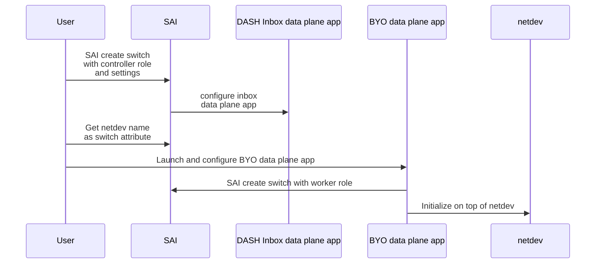

# DASH BYO (Bring-Your-Own) data plane app

1. [1. Data plane app](#1-data-plane-app)
2. [2. BYO data plane app](#2-byo-data-plane-app)
   1. [2.1. Work flow](#21-work-flow)
   2. [2.2. DASH management role and ASIC programming](#22-dash-management-role-and-asic-programming)
   3. [2.3. Flow management](#23-flow-management)
   4. [2.4. RSS support](#24-rss-support)
3. [3. SAI API design](#3-sai-api-design)
   1. [3.1. SAI switch attribute updates](#31-sai-switch-attribute-updates)
   2. [3.2. DASH pipeline programming APIs](#32-dash-pipeline-programming-apis)
4. [4. Future work](#4-future-work)

## 1. Data plane app

Data plane app is one of the most important pieces in DASH pipeline. It is mainly responsible for:

- Flow management, such as flow creation, deletion, resimulation, etc.
- Work with ASIC to complete the table lookup and packet transformations. Depends on ASIC capability, if any operation could not be completed inside ASIC, it can be postponed to data plane app and completed in software.
- ASIC management, such as initializing and programming match stage, etc.
- and more.


By default, DASH technology providers will provide their own data plane app. This is usually closed source and can satisfy the DASH community requirement. However, in some cases, you might want to use your own data plane app due to some reasons, such as: private protocol support or support special logic in packet handling that is not supported by DASH technology providers. In this case, you can enable DASH BYO data plane app.

## 2. BYO data plane app

BYO data plane app is essentially a DPDK application that directly interacts with the data plane netdev.

When BYO data plane app is enabled, the data plane app provided by technology providers will be either disabled or running without tied to the data plane netdev and only act as part of SAI API implementation if needed. With this setup, DASH users can start to use that device to run their own data plane app and process the packets.

After the change, at a high level, the system architecture will be look like below:


### 2.1. Work flow

The work flow of enabling the BYO data plane app will be like below:



After initialization, the data plane app will be able to:

- Receive/Send packets from/to netdev
- Use SAI API to program the ASIC

### 2.2. DASH management role and ASIC programming

There are 2 roles ASIC management roles for DASH:

- Controller: When calling create switch with controller role, it will setup the ASIC, configure the inbox data plane app, etc.
- Worker: When calling create switch with worker role, it will only initialize the SDK for calling SAI APIs.

This allows the data plane app also be able to program the ASIC, so that data plane app can implement features such as: flow management, match stage entry eviction, etc.

> **NOTE**:
>
> Please bare in mind that - Although some APIs can be accessed by both roles, such as creating match stage entries, but this is not a good practice, because the ASIC state will be overwritten by the last caller without any synchronization and knowledge from the other side. So, please make sure that the APIs are only called by one side.

### 2.3. Flow management

One of the most important responsibility of data plane app is flow management. Essentially, whenever a packet that cannot be handled by the hardware flow table, it will run through the DASH pipeline and sent to the data plane app. The data plane app will need to decide if a flow needs to be created, deleted or resimulated, and how.

In DASH-SAI APIs, we have provided a set of APIs to help manage the flows. Please refer to DASH Flow API design doc for more details.

### 2.4. RSS support

RSS is a frequently used feature in data plane app, which allows the packets to be distributed among different worker threads to increase throughput.

To enable and configure RSS, we don't have any extra APIs in SAI, and BYO data plane app can follow the standard way in DPDK to achieve this.

## 3. SAI API design

### 3.1. SAI switch attribute updates

```c
typedef enum _sai_dash_management_role_t {
    /**
     * @brief Controller role.
     */
    SAI_DASH_MANAGEMENT_ROLE_CONTROLLER,

    /**
     * @brief Worker role. Should only be used by BYO data plane app.
     */
    SAI_DASH_MANAGEMENT_ROLE_WORKER,
} sai_dash_management_role_t;

typedef enum _sai_switch_attr_extensions_t {
    // ...


    /**
     * @brief DASH management role.
     *
     * @type sai_dash_management_role_t
     * @flags CREATE_ONLY
     */
    SAI_SWITCH_ATTR_DASH_MANAGEMENT_ROLE,

    /**
     * @brief Inbox data plane app worker count. (-1 = Disable, 0 = Auto, > 0 = Specified count)
     *
     * @type sai_int32_t
     * @flags CREATE_AND_SET
     * @default 0
     */
    SAI_SWITCH_ATTR_DASH_INBOX_DATA_PLANE_APP_WORKER_COUNT,

    /**
     * @brief BYO data plane app netdev name.
     *
     * @type sai_s8_list_t
     * @flags READ_ONLY
     */
    SAI_SWITCH_ATTR_DASH_BYO_DATA_PLANE_APP_NETDEV_NAME,
} sai_switch_attr_extensions_t;
```

### 3.2. DASH pipeline programming APIs

Please refer to the DASH-SAI APIs for more details: <https://github.com/opencomputeproject/SAI/tree/master/experimental>.

## 4. Future work

- Hybrid data plane app, where both inbox and BYO data plane app are enabled at the same time.
