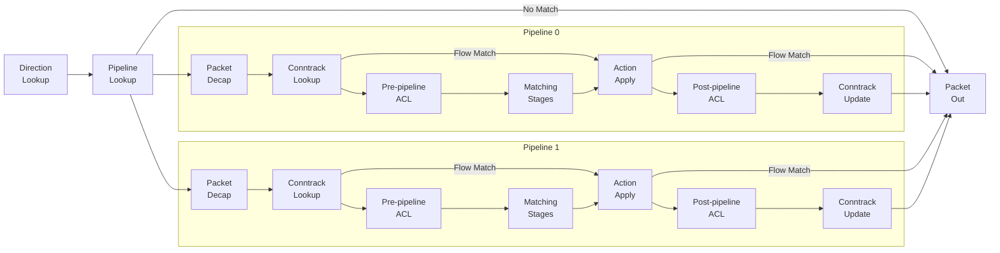
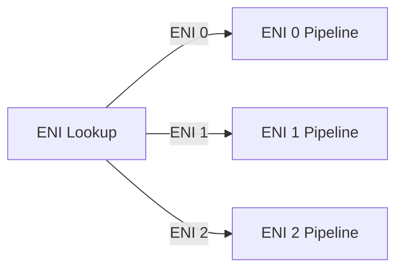
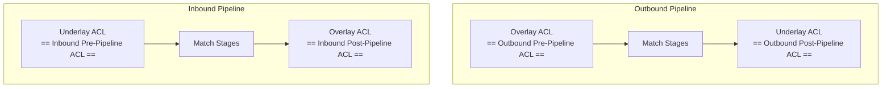
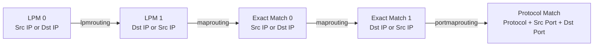
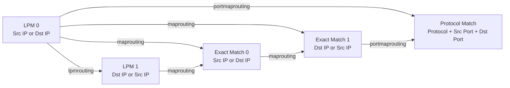

# DASH pipeline packet flow

1. [Overview](#overview)
2. [Pipeline components](#pipeline-components)
   1. [Direction Lookup](#direction-lookup)
   2. [Pipeline Lookup](#pipeline-lookup)
   3. [Conntrack Lookup](#conntrack-lookup)
   4. [Pre-pipeline ACL and Post-pipeline ACL](#pre-pipeline-acl-and-post-pipeline-acl)
   5. [Matching stages and metadata publishing](#matching-stages-and-metadata-publishing)
      1. [Matching stage and stage progressing](#matching-stage-and-stage-progressing)
      2. [Metadata publishing](#metadata-publishing)
   6. [Routing action](#routing-action)
   7. [Routing type](#routing-type)
3. [Examples](#examples)

## Overview

DASH pipeline packet flow is the core of the DASH project. It defines how the traffic is modeled to DASH, packets gets processed and transformation gets applied to the packets.

DASH pipeline is designed to work as a general purpose network function pipeline. Similar to [SAI](https://github.com/opencomputeproject/SAI), it works as a shim layer on top of DPU/ASIC SDKs, provides a set of hardware agnostic APIs that exposes the generic DPU primitives to the upper layer. So, the pipeline itself is not limited to any specific network function, but can be used to implement any network function. 

## Pipeline components

DASH pipeline is modeled as a list of stages. Each stage defines its own tables, and use the table entries to match packets in certain way and publishing thecorresponding metadata when an entry is matched. After all stages are processed, a list of final routing actions will be defined. Then, by executing these routing actions, the packet will be transformed in the way we want and corresponding flows will be generated according to the direction of the packet.

On the high level the pipeline looks like below:



### Direction Lookup

In DASH pipeline, traffic can have 2 directions: `inbound` and `outbound`, and each direction has its own pipeline (see more details below). When a new packet arrives, we will first assign a direction to the packet, then process the packet in the corresponding pipeline. This ensures us to do flow match propoerly and transform the packet in the right way.

For example, today, [SONiC-DASH pipeline](https://github.com/sonic-net/SONiC/blob/master/doc/dash/dash-sonic-hld.md#2-packet-flows) is used to implement the VNET routing function. In this case, a DASH pipeline represents a VM NIC, and we use VNI from outer encap to set the direction. The `outbound` pipeline is used to process the packets coming from the VM, while the `inbound` pipeline is used to process the packets going into the VM.

### Pipeline Lookup

DASH uses multi-tenancy model for traffic handling. A single device can have multiple pipelines, and each pipeline is used to handle traffic for a specific tenant. When a packet arrives, after direction lookup, we will start pipeline lookup to determine which pipeline to use for processing the packet.

For example, in SONiC, we use one pipeline to represent one VM NIC. However, we are not limited to this model, for example, in load balancer case, a pipeline can be used to represent a load balancer instance, and we can use multiple pipelines to represent multiple load balancer instances.



One thing to notice is that, the pipeline is a logic concept. It doesn't have to be 1 to 1 mapping to a physical ASIC pipeline. The underlying implementation can be as simple as a metadata field update with a specific value, when the entry getting matched, e.g., `ENI = Inner Source/Destination MAC`.

### Conntrack Lookup

Next, we are at the Conntrack Lookup stage. DASH will do flow lookup in this stage, and apply the saved actions and skip the rest of pipeline when a flow is matched.

The flow lookup should follow the rules below:

1. Flow lookup **MUST** be based on the packet direction. If the direction is set to `outbound`, then outbound flow table will be used to lookup the flow. Otherwise, inbound flow table will be used.
2. The flow lookup **MUST** use the information of inner most packet. However, the matching keys can be configurated via the DASH flow APIs.
3. Although the outer encaps are decap'ed and not used in flow matching, the source information of each encap **MUST** be saved and compared. If any change is detected, the flow lookup **MUST** fail and the packet **MUST** continue the pipeline processing.
   1. This is because the source information will be used for creating reverse flow, and failover can happen to whoever that sends us packet, so we need this behavior to fix the reverse flow actions.

After the flow lookup, if a flow is matched, we will apply the saved actions in the flow direction and skip the rest of the pipeline. Otherwise, we will continue the pipeline processing.

### Pre-pipeline ACL and Post-pipeline ACL

Pre-pipeline ACL and Post-pipeline ACL are used to drop the unexpected traffic before and after the packet transformation. It works as below:

1. As the high-level pipeline shows above, if an incoming packet hits a flow, it will skip matching all the ACLs. If an incoming packet is denied by a ACL, the packet will be dropped without creating a flow.
2. ACL stages are also aware of packet direction. So although we only have 2 ACL stages in high level, but we will have 4 ACL substages in total, 2 for inbound direction and 2 for outbound direction.

A typical usage of the ACLs is to implement security policies. For example, in SONiC dash pipeline, we use the pre/post-pipeline ACLs to implement the underlay and overlay ACLs in both directions, where overlay ACLs will be used for implementing customer policies, while underlay ACLs will be used for implementing the infrastructure policies.



### Matching stages and metadata publishing

#### Matching stage and stage progressing

Matching stages is the one of the core part of the DASH pipeline and the components that gives the pipeline flexibility.

In DASH pipeline, a matching stage is basic building blocks for packet matching and metadata publishing. And currently, we have 3 type of matching stages:

- LPM stage (on source **OR** destination IP)
- Exact matching stage (on source **OR** destination IP)
- Protocol matching stage (on protocol + source port + destination port)

Althugh we could design the pipeline to have all stages created and connected arbitrarily, but it might make the pipeline hard to implement and debug, also it might be an overkill for majority of the cases. So the match stages are designed to be connected from larger range to smaller range as below:



Here is an example that shows how the DASH object presented in SONiC-DASH pipeline:

```json
// Routing table is used to define the LPM stage.
// When this entry is matched, we will invoke the vnet routing type, which executes maprouting stage and jump to Exact Match stage.
"DASH_ROUTE_TABLE:123456789012:10.0.1.0/24": {
    "action_type": "vnet",
    "vnet": "Vnet1"
}

"DASH_ROUTING_TYPE_TABLE:vnet": {
    "name": "action1",
    "action_type": "maprouting"
}
```

In the pipeline progressing, the entries in each stage can define different routing actions, so we can skip some stages and move to the stage that we want. Take LPM stage as an example, it can use different routing actions to jump to different stages. But, reverse direction is not allowed, e.g., we can't jump from LPM 1 to LPM 0.



#### Metadata publishing

When an entry is matched in the matching stages, we will publish the metadata defined in the entry to the metadata bus. The metadata bus is a set of fields that can be used by the routing actions as parameters. And the metadata bus is designed to be a shared resource, so the metadata published by the entries in the later stages will override the earlier ones.

```json
// VNET mapping entry (Exact Match stage)
"DASH_VNET_MAPPING_TABLE:Vnet1:10.0.1.1": {
    "routing_type": "do_something",

    // Underlay destination IP address. Used by staticencap action.
    "underlay_dip": "3.3.3.1",

    // Overlay IP address encoding from v4 to v6. Used by 4to6 action.
    "4to6_sip_encoding": "9988::/ffff::",
    "4to6_dip_encoding": "1122:3344:5566:7788::0303:0301/ffff:ffff:ffff:ffff:ffff:ffff:ffff:ffff",

    // Metering ID. Used in metering stage.
    "metering_class": "60001"
}
```

With this in mind, the entire pipeline works as matching and metadata publishing until the final routing actions are executed.

Please note that the Direction Lookup and Pipeline Lookup stages are also matching stages, so they can also populate metadatas too, e.g., ENI-level metadata for underlay encap.

### Routing action

In DASH pipeline, routing actions are the fundamental building blocks for packet transformations. Each routing action is designed to work as below:

1. Take a specific list of metadata fields as input parameters:
   1. For example, `staicencap` action will take the `underlay_dip`, `underlay_sip`, `encap_type` and `encap_key` to encapsulate the packet.
   2. The parameter can come from 2 places - the metadata defined associated with the entries in each table, or the routing action definition itself. More details will be discussed in the next section.
2. Transform the packet in a specific way, e.g., encapsulate the packet, natting the address and port, etc.
3. Independent to other actions.
   1. With this design, we don't have to worry about the order of the actions. It also enables the hardware to improve the E2E pipeline latency by doing the actions in parallel.

Take staticencap as an example, it can be defined as below:

- Action parameters:
    - `encap_type`: "nvgre|vxlan|..."
- Metadata parameters:
    - `underlay_dip`: Destination IP used in encap.
    - `underlay_sip`: Source IP used in encap.
    - `encap_key`: GRE key in NvGRE or VNI in VxLAN
- Actions:
    - Enable the underlay encap header based on the `encap_type`.
    - Update the underlay encap header with `encap_key`, `underlay_dip`, `underlay_sip`.

### Routing type

To implement a network funtion, we usually need to do multiple packet transformations, such as adding a tunnel and natting the address or port. This requires us to be able to combine multiple routing actions together, and this is what routing type is for.

In DASH pipeline, routing type is defined as a list of routing actions. And by combining different routing actions into different routing types, we will be able to implement different network functions.

For example:

- We can implement the VNET routing by creating a routing type named `vnet` with only 1 action `staticencap`, which takes the next hop information from the mapping table.
- We can also add additional hop to tunnel the traffic to an firewall first, which is known as [UDR](https://learn.microsoft.com/en-us/azure/virtual-network/virtual-networks-udr-overview), by creating another routing type named `vnetfw` with a `staticencap` action and an extra `tunnel` actions.
- We can even use `tunnel` action with multiple destinations as ECMP group to implement a simple load balancer!

This combination of routing actions is very flexible and powerful, and it enables us to implement any network function we want.

## Examples

[SONiC-DASH pipeline](https://github.com/sonic-net/SONiC/blob/master/doc/dash/dash-sonic-hld.md#2-packet-flows).