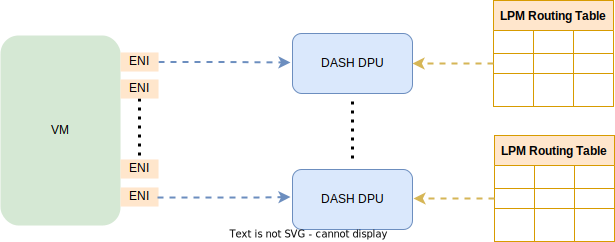

# Routing guidelines

- [Overview](#overview)
- [Routing examples](#routing-examples)
  - [Add firewall hop to the routes](#add-firewall-hop-to-the-routes)
    - [Mapping](#mapping)
    - [RouteTable (LPM)](#routetable-lpm)
  - [Set default route](#set-default-route)
    - [Mapping](#mapping-1)
    - [RouteTable (LPM)](#routetable-lpm-1)
  - [Set a specific Internet route](#set-a-specific-internet-route)
    - [Mapping](#mapping-2)
    - [RouteTable (LPM)](#routetable-lpm-2)
  - [Set an on premises route to an express route (ER)](#set-an-on-premises-route-to-an-express-route-er)
    - [RouteTable (LPM)](#routetable-lpm-3)
  - [Set an on premises route to an express route (ER) with two private addresses](#set-an-on-premises-route-to-an-express-route-er-with-two-private-addresses)
    - [RouteTable (LPM)](#routetable-lpm-4)
- [Private end points (?)](#private-end-points-)
- [Terminlogy](#terminlogy)
## Overview

This article explains the basic steps to build a **routing table** (also knonw
as *forwarding* table) and how to use **mappings** during the process.  
It is important to notice from the get go, **routing** and **mapping** are two
different but complementary concepts, specifically:

1. **Routing**. It is used by the customer to configure the way the traffic must
be routed. It must be clear that routing table has the last say in the way the
traffic is routed. For example, by defaut usually this entry applies:

    `0/0 -> Internet (Default)`

    But the customer can override the entry and route the traffic as follows:

    `8.8.0.0/16 -> Internet (SNAT to VIP)`

    `0/0 -> Default Hop: 10.1.2.11 (Firewall in current VNET)`

1. **Mapping**. It allows to relate the customer’s defined routing to the
   network physical space that is transparent to the customer . In other words,
   mapping allows to know what is the **physical address** (PA) for a specific
   **customer address** (CA) and if it requires different encap, etc.
1. On the other hand, we want to be able to insert in the routing table any
   entry with a specific mapping, for example:  

    `10.3.0.0/16 -> VNET C (Peered) (use mapping)`

Notice that a routing table has a size limit of about 100 K while mapping has a
limit of 1 M. Using mapping allows you to extendd the amount of data that can be
contained in a routing table.

One of the main objectives of a routing table, more specifically **LPM routing
table**, is to allow the customers to enter static or mapped entries the way
they see fit. The LPM routing rules determine the order. The rules can be either
static or can refer to mapping. But mappings does not control routing which is
done via the LPM table.  

- **Static** means that when you create an entry into the table, you know
  exactly the physical address (PA). Here there is no mapping (lookup).
- **Mapping** means that for that particular entry, you want to intercept the
traffic and exempt it from the standard routing. Instead, you want to apply
different actions than the ones associated with the rest of the traffic.

## Routing examples

This section provides guidelines, along with some examples, on how to build
routing tables statically and/or by using mapping.

The following is an example of the kind of entries an LPM routing table may
contain. We'll describe the various entries as we progess with the explantion.

```
VNET: 10.1.0.0/16
- Subnet 1: 10.1.1.0/24
- Subnet 2: 10.1.2.0/24  (VM/NVA: 10.1.2.11 - Firewall)
- Subnet 3: 10.1.3.0/24
- Mappings: 
 . VM 1: 10.1.1.1 (y)
 . VM 2: 10.1.3.2
 . Private Link 1: 10.1.3.3
 . Private Link 2: 10.1.3.4
 . VM 3: 10.1.3.5
 
ENIA_x - separate counter)
RouteTable (LPM)  attached to VM 10.1.1.1
- 10.1.0.0/16 -> VNET (use mappings)
 * route meter class: y
- 10.1.3.0/24 -> Hop: 10.1.2.11 Customer Address (CA) -> Private Address (PA) (Firewall in current VNET)
- 10.1.3.0/26 -> Hop: 10.1.2.88 Customer Address (CA) -> Private Address (PA)(Firewall in peered VNET)
 * route meter class: y
 * use mapping meter class (if exists): true
- 10.1.3.5/27 -> VNET A (mapping)
- 10.1.3.3/32 -> Private Link Route (Private Link 1)
- 10.2.0.0/16 -> VNET B (Peered) (use mapping)
 * route meter class: y
- 10.2.1.0/24 -> Hop: 10.1.2.11 Hop: 10.1.2.88(CA->PA) (Firewall in peered VNET)
- 10.2.0.0/16 -> VNET B (Peered) (use mappings)
 * route meter class: y
- 10.3.0.0/16 -> VNET C (Peered)  (use mappings)
 * route meter class: y
- 50.3.5.2/32 -> Private Link Route (Private Link 7)
 * route meter class: y
- 50.1.0.0/16 -> Internet
- 50.0.0.0/8 -> Hop: CISCO ER device PA (100.1.2.3, 10.1.2.4), GRE Key: X
- 8.8.0.0/16 -> Internet (SNAT to VIP)
- 0/0 -> Default Hop: 10.1.2.11 (Firewall in current VNET)

```

Notice a routing table is attached to a specific VM in the VNET, not to VNET
itself. In VNET the VM functions like a router, to which a routing table is
attached.



<figcaption><i>Figure 1. Routing table per VM</i></figcaption><br/>

### Add firewall hop to the routes

The example below shows how to add a hop to a firewall in a routing table entry
using mapping.  

#### Mapping

The `VNET: 10.1.0.0/16` has 3 subnets. A VM/NVA (VM or Virtual Appliance)
firewall is added to Subnet 2 with address `10.1.2.11`.

```
VNET: 10.1.0.0/16
- Subnet 1: 10.1.1.0/24
- Subnet 2: 10.1.2.0/24 (VM/NVA: 10.1.2.11 - Firewall)
- Subnet 3: 10.1.3.0/24
```

#### RouteTable (LPM)

A hop to the firewall `10.1.2.11` is added at address `10.1.3.0/24`.

```
- 10.1.0.0/16 -> VNET
- 10.1.3.0/24 -> Hop: 10.1.2.11 (Firewall in current VNET)
- 10.2.0.0/16 -> VNET B (Peered) (use mappings)
- 10.3.0.0/16 -> VNET C (Peered) (use mappings)
- 0/0 -> Default (Internet)
```

The following settings should also be allowed:

```
- 10.1.0.0/16 -> VNET
- 10.1.3.0/24 -> Hop: 10.1.2.11 Customer Address (CA) -> Private Address (PA) (Firewall in current VNET)
- 10.1.3.0/26 -> Hop: 10.1.2.88 Customer Address (CA) -> Private Address (PA) (Firewall in peered VNET)
- 10.2.0.0/16 -> VNET B (Peered) (use mappings)
- 10.3.0.0/16 -> VNET C (Peered) (use mappings)
- 0/0 -> Default (Internet)
```

### Set default route

The example shows how to set the default route to hop to a firewall instead of
routing the traffic to the Internet.

#### Mapping

A VM/NVA (VM or Virtual Appliance) firewall is added to Subnet 2 with address
`10.1.2.11`.

```
VNET: 10.1.0.0/16
- Subnet 2: 10.1.2.0/24 (VM/NVA: 10.1.2.11 - Firewall)
```

#### RouteTable (LPM)

A hop to the firewall `10.1.2.11` is added at address `0/0`.

```
- 0/0 -> Default Hop: 10.1.2.11 (Firewall in current VNET)
```

### Set a specific Internet route

The example shows how to set a specific Internet route.

#### Mapping

A VM/NVA (VM or Virtual Appliance) firewall is added to Subnet 2 with address
`10.1.2.11`.

```
VNET: 10.1.0.0/16
- Subnet 2: 10.1.2.0/24 (VM/NVA: 10.1.2.11 - Firewall)
```

#### RouteTable (LPM)

All the default traffic goes to through the fire-wall before going to the
Internet; but the traffic going to the Internet trusted IPs do not have to go
through the firewall and can go directly to the Internet.  

```
8.8.0.0/16 -> Internet – SNAT (Source Network Address Translation) to VIP (Virtual IP Address). 
- 0/0 -> Default Hop: 10.1.2.11 (Firewall in current VNET)
```

### Set an on premises route to an express route (ER)

The example shows how to set an on premises route to an express route (ER) for a
specific private address (PA).

#### RouteTable (LPM)

In the example below the RouteTable (LPM) is attached to VM `10.1.1.1`.

```
- 10.1.0.0/16 -> VNET
- 50.0.0.0/8 -> Hop CISCO Express Route (ER) device PA (100.1.2.3)
```

Where the on premises route: `50.0.0.0/0` is the customer on premises space.

### Set an on premises route to an express route (ER) with two private addresses

The example shows how to set an on premises route to an express route (ER) with
two private addresses (end points) and **Generic Routing Encapsulation** (GRE)
key.

#### RouteTable (LPM)

```
- 50.0.0.0/8 -> Hop CISCO Express Route (ER) device PA (100.1.2.3, 100.1.2.4)
- 50.1.0.0/16 -> Internet - This is also supported
```

## Private end points (?)

TBD


## Terminlogy

- **GRE**. Generic Routing Encapsulation is a Cisco developed tunneling
protocol. It is a simple IP packet encapsulation protocol used when IP packets
need to be transported from one network to another network, without being
notified as IP packets by any intermediate routers.
- 
- **LPM**. LPM or longest prefix match refers to an algorithm used by routers in
Internet Protocol (IP) networking to select an entry from a routing table.
Because each entry in a forwarding table may specify a sub-network, one
destination address may match more than one forwarding table entry. The most
specific of the matching table entries — the one with the longest subnet mask —
is called the longest prefix match. It is called this because it is also the
entry where the largest number of leading address bits of the destination
address match those in the table entry.
- **Routing**. Routing is the process of sending a packet of information from
  one network to another network. Routers build **routing tables** that contain
  the following information:
  - Destination network and subnet mask.
  - Next hop to get to the destination network.
  - Routing metrics.

- **SNAT**. The Source Network Address Translation (SNAT) is typically used when
  an internal/private host needs to initiate a connection to an external/public
  host. The device performing NAT changes the private IP address of the source
  host to public IP address. It may also change the source port in the TCP/UDP
  headers.
  
- **VIP**. The Virtual IP Address (VIP) is a public IP address that may be
  shared by multiple devices connected to the Internet.
