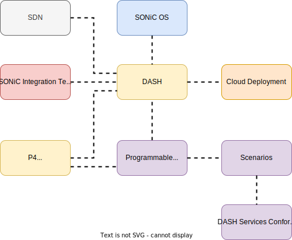

[<< Back to parent directory](../README.md) ]

[<< Back to DASH top-level Documents](../../README.md#contents) ]

# Disaggregated API for SONiC Hosts (DASH) high level design 

- [Disaggregated API for SONiC Hosts (DASH) high level design](#disaggregated-api-for-sonic-hosts-dash-high-level-design)
  - [Introduction](#introduction)
    - [Why DASH?](#why-dash)
    - [Objectives](#objectives)
  - [Compliance and requirements](#compliance-and-requirements)
  - [Scenarios](#scenarios)
  - [Azure provisioning example](#azure-provisioning-example)
  - [DASH project](#dash-project)
  - [Logical architecture (software stack)](#logical-architecture-software-stack)
      - [SDN controller](#sdn-controller)
        - [SDN and DPU High-Availability (HA)](#sdn-and-dpu-high-availability-ha)
    - [gNMI container](#gnmi-container)
      - [Multiple DPUs device](#multiple-dpus-device)
    - [SONiC app containers](#sonic-app-containers)
    - [Switch State Service (SWSS)](#switch-state-service-swss)
    - [Switch Abstraction Interface (SAI) DASH extension](#switch-abstraction-interface-sai-dash-extension)
    - [ASIC Drivers](#asic-drivers)
    - [DASH capable ASICs](#dash-capable-asics)
  - [SONiC integration](#sonic-integration)
    - [DASH single DPU on NIC](#dash-single-dpu-on-nic)
    - [DASH appliance](#dash-appliance)
      - [High Level Architecture](#high-level-architecture)
      - [Low level architecture](#low-level-architecture)
    - [DASH smart switch](#dash-smart-switch)
      - [High level architecture](#high-level-architecture-1)
      - [Low level architecture](#low-level-architecture-1)
  - [Example of network representation](#example-of-network-representation)
    - [Deployment](#deployment)
  - [Behavioral model](#behavioral-model)
  - [SONiC Integration testing](#sonic-integration-testing)
  - [DASH services conformance and performance testing](#dash-services-conformance-and-performance-testing)
  - [Appendix](#appendix)
    - [A day in the life of a DASH packet](#a-day-in-the-life-of-a-dash-packet)
    - [A day in the life of a DASH SDN controller](#a-day-in-the-life-of-a-dash-sdn-controller)
    - [A day in the life of a gNMI container](#a-day-in-the-life-of-a-gnmi-container)
  - [References](#references)

## Introduction

> [!NOTE]
> This document is work in progress and will replace the current [SONiC-DASH High Level Design (WIP)](dash-high-level-design.md).

This document introduces the **Disaggregated API for SONiC Hosts** (**DASH** for
short) and provides an holistic view or overview of the project, the supporting elements and its
architecture.

DASH is an open source project with the goal of delivering a **behavioral
model** and related **test cases** to confirm conformance and performance
requirements. Technology providers will conform to the model and test cases when
designing and building programmable hardware technology. These devices are meant
to **deliver enterprise network performance to critical cloud applications**. 

DASH extends SONiC APIs and a related comprehensive set of object models to
describe networking services for the cloud. The project enlists cloud and
enterprise technology providers to collaborate and further extend DASH to meet
their specific needs.

### Why DASH? 

Because it has been difficult/impossible to target each specific technology provider's implementation(s), the technologies in the market currently provide general purpose APIs to perform general purpose actions (such as ACLs, forwarding tables, metering, etc...).  Again, these are not targeted to specific cloud/enterprise usage.  Obviously, a general purpose approach delivers only so much, and may work against high performance connectivity. 

DASH takes a different approach. DASH is publicizing Behavioral Models to optimize exactly 'what' clouds/enterprises are doing, to optimize against their services. This is the first time 'what we do' has been exposed.  It does not make assumptions or enforce implementation details, such as a programming language. It delegates these decisions to technology providers in order to best employ their expertise and competitive edge to obtain the best possible results (*given that the agreed upon
DASH behavioral model and test cases are satisfied*).

### Objectives

The DASH overall objective is to **optimize network SMART Programmable
Technologies performance**, and **leverage commodity hardware technology** to
achieve **10x or even 100x stateful connection performance** with hardware offload and leveraging parallel processing for specific tasks. In particular

- With the help of network hardware technology providers, create an open forum
  that capitalizes on the use of **programmable networking devices** including
  - **SmartNICs**. A smart network interface card (SmartNIC), is a programmable
    accelerator enabling flexible and efficient data center networking, security and storage
    It offloads from server CPU a set of tasks such as
    how to process and route packets of data.
  - **SmartSwitches**. A smart switch is a network switch with programmable DPUs/IPUs/EPUs, etc...) SmartNIC hardware integrated into the switch design, with a selected number of options for management. 
  - **SmartAppliances**. An appliance is a multi-tenant network appliance. It
    has multiple data processing units (DPUs) supporting virtual ports.
- Optimize **stateful L4** performance and connection scale by 10x or even 100x,
  when compared to implementations that make extensive use of a generic software
  stack approach (compromising performance for flexibility). As host networking
  in the cloud is performed at L4, the resulting performance improvements should
  be truly significant.
- As a starting point, Microsoft Azure will integrate and deploy DASH solutions to
  ensure that scale, monitoring, reliability, availability and constant
  innovation are proven and hardened. Other enterprise and cloud providers may
  deploy DASH as well.  It should be noted that innovations for **in-service
  software upgrades** (ISSU) and **high availability** (HA) are key tenets of
  the DASH charter.
  
## Compliance and requirements

> [!NOTE] TBD - Some intro here from SDN packets transform document.

The following are the compliance and requirements details applicable to the
supported scenario:

- [VNET to VNET
  service](https://github.com/Azure/DASH/blob/main/documentation/vnet2vnet-service/requirements/README.md)
- [VNET peering
  service](https://github.com/Azure/DASH/blob/main/documentation/vnet-peering-service/requirements/README.md)
- [Service tunnel & Private link
  service](https://github.com/Azure/DASH/blob/main/documentation/stpl-service/requirements/README.md)
- [Load balancer
  service](https://github.com/Azure/DASH/blob/main/documentation/load-bal-service/requirements/README.md)
- [Encryption gateway
  service](https://github.com/Azure/DASH/blob/main/documentation/encrypt-gw-service/requirements/README.md)
- [Express route gateway
  service](https://github.com/Azure/DASH/blob/main/documentation/express-route-service/requirements/README.md)

## Scenarios

DASH extends SONiC APIs and a related comprehensive set of object models
described in both *documentation* and a *behavioral model* to describe
networking services for the cloud. The 7 initial services (in draft) describe
this in more detail. We will also work with cloud and enterprise providers to
further extend DASH to meet their specific needs.

1. [VNET-to-VNET](https://github.com/Azure/DASH/tree/main/documentation/vnet2vnet-service).
This scenario is the starting point to design, implement and test the core DASH
mechanisms. In particular it allows the following features: VM to VM
communication in VNET, route support, LPM support, ACL support. This is to
verify the following performance properties: CPS, flow, PPS, and rule scale. 
1. [VNET
   Peering](https://github.com/Azure/DASH/tree/main/documentation/vnet-peering-service).
   Virtual network peering connects two virtual networks
   seamlessly. Once peered, for connectivity purposes, the virtual networks
   appear as one. For background information, see [Virtual network
   peering](https://docs.microsoft.com/en-us/windows-server/networking/sdn/vnet-peering/sdn-vnet-peering).
1. [High Availability
   (HA)](https://github.com/Azure/DASH/tree/main/documentation/high-avail).
   Useful for failure and failover events
1. [Load
   Balancer](https://github.com/Azure/DASH/tree/main/documentation/load-bal-service).
   The feature that switches traffic from using VIP-to-VIP connectivity (which
   involves transiting SLB MUXes), into using a direct path between VMs (direct
   PA to PA path).
1. [Service Tunnel & Private Link]().  Service Tunnel prevents Internet access
   to specific services.  Access is permitted only from a specific virtual
   network (VNET). The Service Tunnel feature provides this capability by
   encoding certain id's via packet transformation.  Private Link feature is an
   extension to the Service Tunnel feature and enables customers to access
   public facing shared services via their private IP addresses within their
   VNET.
1. [Encryption
   Gateway](https://github.com/Azure/DASH/tree/main/documentation/encrypt-gw-service).
1. [Express Route
   Gateway](https://github.com/Azure/DASH/tree/main/documentation/express-route-service).

## Azure provisioning example

This is an Azure example, other Cloud providers may host their implementation.  

Customers will use the [Azure portal](portal.azure.com) to provision the
high-performant Connections per Second (CPS) offerings (via the portal UI,
PowerShell SDK, or Azure CLI).  These portal instructions are transformed into
REST API calls for allocation and provisioning within the Azure infrastructure.
In the initial Azure offering, traffic with the feature selected will be
directed to our Appliance, which processes the first packet in hardware.

In parallel, from a DASH perspective we are developing a common programming
interface to agnostically configure hardware for the scenarios outlined in the
[Documentation folder](https://github.com/Azure/DASH/tree/main/documentation):

> [!NOTES] We just capture the gist of these scenarios and then we link to the
> related documentation.

## DASH project 

The following figure shows the DASH project main components.

<figcaption><i>Figure 1 - DASH project</i></figcaption>  

- **Functional test suite**. A suite of tests to validate that the DASH devices
  satisfy the standard SONiC functional requirements. This is a **black-box
  testing**  concerned with validating whether the device works as intended with
  SONiC. For more information, see [SONiC testbed deployment and setup, SONiC
  testing, test report
  processing](https://github.com/Azure/sonic-mgmt/tree/master/docs).  
- **SDN**. The SDN with its controller is primarily responsible for controlling
the DASH overlay services; the traditional SONiC application containers are used
to manage the underlay (L3 routing) and hardware platform. The SDN controller
controls the overlay built on top of the physical layer of the infrastructure.
From the point of view of the SDN control plane, when a customer creates an
operation from the cloud portal (for example a VNET creation) the controller
allocates the resources, placement management, capacity, etc. via the northbound
interface APIs. For more information, see the [SDN controller](#sdn-controller)
section.
- **Network SONiC OS**. DASH builds upon the traditional SONiC architecture,
  which is documented in the SONiC Wiki under [SONiC System
  Architecture](https://github.com/Azure/SONiC/wiki/Architecture#sonic-system-architecture).
  For more information, see the [Logical architecture (software
  stack)](#logical-architecture-software-stack) section.
- **Cloud deployment**. Microsoft Azure will integrate and deploy DASH solutions
  to ensure that scale, monitoring, reliability, availability and constant
  innovation are proven and hardened. Other enterprise and cloud providers may
  deploy DASH as well. For more information, see the [Deployment](#deployment)
  section. 
- **P4 behavioral model**. We are developing a P4 defined behavioral model to
  describe the behaviors per scenario and document them in a repeatable format.
  From there we will be able to auto-generate the APIs. The implementation
  itself is not required to be P4. For more information, see the [Behavioral
  model](https://github.com/Azure/DASH/tree/main/dash-pipeline/bmv2) section.
- **DASH programmable hardware**. With the help of network hardware technology
providers, we are collaborating to create an open forum capitalizing on the use
of programmable hardware including **SmartNICs**, **SmartSwitches**, and
**SmartAppliances**. The documentation related to these devices will be made
available by the providers themselves.  
- **Scenarios**. Cover DASH extending SONiC APIs and related comprehensive set
of objects to describe networking services for the cloud. The 7 initial services
(in draft) describe this in more detail. We will also work with cloud and
enterprise providers to further extend SONiC DASH to meet their specific needs.
For more information,see the [Scenarios](#scenarios) section.
- **Conformance and performance test suite**. A suite of tests to validate that
  the DASH devices satisfy the standard DASH conformance and performance
  requirements. For more information about test documentation, test scripts,
  test configurations and other artifacts required to test a DASH device or
  devices, see [Performance
  testing](https://github.com/Azure/DASH/tree/main/test). 

## Logical architecture (software stack) 

 DASH builds upon the traditional SONiC architecture, which is documented in the
 SONiC Wiki under [SONiC System
 Architecture](https://github.com/Azure/SONiC/wiki/Architecture#sonic-system-architecture).
 The following descriptions assume familiarity with the SONiC architecture and
 will describe DASH as incremental changes relative to traditional SONiC. Notice
 that DASH adds a new **SDN control plane** via **gNMI** in the **DASH
 container**. The following figure depicts the DASH software stack.

<figcaption><i>Figure 2 - DASH software stack</i></figcaption> 

#### SDN controller

The SDN controller is **primarily responsible for controlling the DASH overlay
services**, while the traditional SONiC application containers are used to
manage the underlay (L3 routing) and hardware platform. Both the DASH container
and the traditional SONiC application containers sit atop the Switch State
services (SWSS) layer, and manipulate the Redis application-layer DBs; these in
turn are translated into SAI data plane objects via the normal SONiC orchestration
daemons inside SWSS.

The SDN controller controls the overlay built on top of the physical layer
(underlay) of the infrastructure.  From the point of view of the SDN control
plane, when a customer creates an operation from the cloud portal (for example a
VNET creation), the controller allocates the resources, placement management,
capacity, etc. via the  **NorthBound interface APIs**.

##### SDN and DPU High-Availability (HA)

High Availability (HA) is important for hardware failover incidents. The SDN
controller selects a pair of cards and configures them identically.  
The SDN controller will set up the L3 routes through the ToR switch levels,
possibly even T2 levels for a third backup appliance or smart ToR and configure
the HA "Peers." 

> [!NOTE] HA sync protocols are WIP and will be standardized and interoperable,
> not vendor-specified.

The only requirement on the card from the HA perspective is for the cards to
setup a channel between themselves for flow synchronization.  The
synchronization mechanism is left for technology suppliers to define and
implement. For more information, see [High Availability and
Scale](../../high-avail/design/high-availability-and-scale.md) document.

### gNMI container

The SDN controller communicates with a DASH device through a
**[gNMI](https://github.com/Azure/DASH/wiki/Glossary#gnmi) endpoint** served by
a new DASH SDN agent **running inside a new SONiC DASH container**.  

In summary:

- The DASH container translates SDN configuration modeled in gNMI into
  **DASH_APP_DB** objects. The gNMI schema is closely related to the DASH DB
  schema so in effect, the gNMI server is a thin RPC shim layer to the DB.
- The **SONiC orchagent** inside the Switch State Service (SWSS) Container will
  be enhanced to transform and translate these objects into **ASIC_DB objects**,
  including the new **DASH-specific SAI objects**.  
- An **enhanced syncd** will then configure the data plane using the **technology
  supplier-specific SAI library**.

A **gNMI schema** will manage the following DASH components:

- Elastic Network Interface (ENI)
- Access Control Lists (ACLs)
- Routing and mappings
- Encapsulations
- Other  

> [!NOTE] See also work in progress PR [doc-ref-config-example
> #93](https://github.com/Azure/DASH/pull/93).

#### Multiple DPUs device

In the case of a multiple DPUs device the following applies:

- Each DPU provides a gNMI endpoint for SDN controller through a unique IP
  address.
- An appliance or smart switch containing multiple DPUs will contain multiple
  gNMI endpoints for SDN controller, and the controller treats each DPU as a
  separate entity.
- To conserve IPv4 addresses, such an appliance or switch *might* contain a
  proxy (NAT) function to map a single IP address:port combination into multiple
  DPU endpoints with unique IPv4 addresses.  
- No complex logic will run on the switches (switches do not have a top-level
  view of other/neighboring switches in the infrastructure).

> [!NOTE] 
> Each DPU shall have an instance of SONiC DASH OS that exposes the gNMI APIs to the SDN controller. 

### SONiC app containers

 In the figure above, the "SONiC Containers" box comprises the normal collection
 of optional/customizable application daemons and northbound interfaces, which
 provide BGP, LLDP, SNMP, etc, etc. These are described thoroughly in the [SONiC
 System
 Architecture](https://github.com/Azure/SONiC/wiki/Architecture#sonic-system-architecture)
 wiki and reproduced in diagram form under the [Detailed
 Architectures](#detailed-architectures) section of this document.

### Switch State Service (SWSS)

The SWSS container comprises many daemons which operate on conceptual SONIC
config objects across several databases. For more information and details about
the integration, see [SONiC DASH
HLD](https://github.com/Azure/DASH/blob/main/documentation/general/design/dash-sonic-hld.md). 

### Switch Abstraction Interface (SAI) DASH extension

The Switch Abstraction Interface (SAI) is a common API that is supported by many
switch ASIC technology suppliers. SONiC uses SAI to program the ASIC. This
enables SONiC to work across multiple ASIC platforms naturally. DASH uses a
combination of traditional SAI headers and new DASH pipeline-specific *extension* headers.
Technology suppliers must implement this interface for their DASH devices. This
is the primary integration point of DASH devices and the SONiC stack. It will be
rigorously tested for performance and conformance. See [DASH Testing
documentation](https://github.com/Azure/DASH/tree/main/test).

SAI "schema" are represented as fixed c-language header files and derived
metadata header files. The **underlay** and **overlay** schema have different origins:

- DASH SAI **underlay** headers. Traditional **SAI headers** are defined in the [OCP SAI project
  repo](https://github.com/opencomputeproject/SAI/tree/master/inc).These are
  **hand-generated** and **maintained**. DASH uses a subset of these to manage "**underlay**"
  functions, e.g. device management, Layer 3 routing and so forth. For more information, see [SWSS Lite (Underlay)](dash-sonic-hld.md#333-swss-lite-underlay). 
- DASH SAI **overlay** objects. They are derived from a [P4 Behavioral
  Model](https://github.com/Azure/DASH/tree/main/dash-pipeline). A script
  reads the P4 model and generates SAI header files. For more information, see [DASHOrch (Overlay)](dash-sonic-hld.md#332-dashorch-overlay).

For more information see the [SAI README](../../../SAI/README.md) file.

> [!NOTE]
> DASH uses an **enhanced syncd** to configure the data plane using the technology supplier-specific SAI library.

### ASIC Drivers

The term "ASIC Drivers" is borrowed from traditional SONiC and SAI, where a
datacenter switch was implemented almost entirely inside an ASIC (or multiple
ASICs). These devices are programmed using a technology supplier Software
Development Kit (SDK) which includes device drivers, kernel modules, etc.

A contemporary DASH "SmartNIC" may consist of many complex hardware components
including multi-core System On A Chip (SoC) ASICs, and the associated software.
For simplicity, the software for such systems which interfaces to the SAI layer
is collectively called the "ASIC driver." More importantly, the technology
supplier SAI library will hide all details and present a uniform interface.

> [!NOTE]
> A dedicated group has been investigating the use of PINS.  

**Why DASH and Why Not PINS?**  PINS is based upon a specific language (P4), and
DPUs on the market would need to build a cross compiler. PINS places the onus
onto the Cloud Providers to code and string together the PINS API and their own
implementation to create the actions they want to achieve; however it may not be
optimal for performance reasons in our project.

### DASH capable ASICs

These comprise the main data plane engines and are the core of what are variously
called SmartNICs, DPUs, IPUs, NPUS, etc. The actual cores may be ASICs, SoCs,
FPGAs, or some other high-density, performant hardware.

## SONiC integration

The system architecture for SONiC DASH relies upon the [SONiC system
architecture](https://github.com/Azure/SONiC/wiki/Architecture). For more
information and details about the integration, see [SONiC DASH
HLD](https://github.com/Azure/DASH/blob/main/documentation/general/design/dash-sonic-hld.md). 

The SONiC DASH integration introduces the following DASH modifications:

1. A *new docker container* in the user space named **gNMI container** (aka SDN
   container) to create the functional component for DASH. Microsoft will
   deliver the **gNMI container** as code to SONiC to allow any SONiC switch to
   talk with and integrate DPU technology. The *DASH container* software
   integrates with the SONiC system containers seamlessly. Microsoft will ensure
   a high quality integration with the switch. 

2. In the **sync-d container**, the **sai api DASH** (as opposed to *sai api* in
   the original SONiC architecture).  

The *DPU/IPU/SmartNic* device will run a separate instance of SONiC DASH on the
device.  

The component interactions will be executed as a new user space container
implementation; relying on the existing SONiC infrastructure and components to
interact as they normally would.  

The functionality of the new *dash container* in the user space is to receive
content from the Software Defined Networking (SDN) controller to control setup
for the overlay configurations. DASH receives the objects, translates them with
a **gNMI agent**, provides them to the *SONiC OrchAgent* for further translation
onto the data plane via the **SAI database**.

In particular, notice the following:

- **DASH API** shall be exposed as gNMI interface as part of the DASH container
  (aka as SDN container).
- **DASH clients** shall configure SONiC via gRPC get/set calls.
- **gNMI container** has the config backend to translate/write  DASH objects to
  CONFDB and/or APPDB.
- **SWSS** (Underlay) for DASH shall have a small initialization and shall
  support a defined set of SAI APIs.
- **DashOrch** (DASH orchestration agent) (Overlay) in the SWSS container
  subscribes to the DB objects programmed by the DASH agent. These objects are
  not expected to be programmed to kernel, so orchestration agent writes to
  ASICDB for the DASH technology provider SAI implementation to finally program
  the DPU. The DASH orchestration agent shall write the state of each tables to
  STATEDB used by the applications to fetch the programmed status of DASH
  configured objects.

### DASH single DPU on NIC

<figcaption><i>Figure 4 - Single DPU</i></figcaption>  

The figure above highlights the primary SONiC and DASH software stack components
and relationships, and will appear as variations within the DASH configurations
described below.

### DASH appliance

A DASH *appliance* contains multiple (e.g., six) DASH NIC/DPU/Other devices
installed as PCI adaptors in a chassis. This chassis provides power and cooling
with options for manageability/servicing/supportability (as needed), and other
capability through PCIe bus, but no large-scale data path traversal of PCIe is
needed.

Each NIC/DPU runs its own SONiC instance in such a way that it could also
potentially operate as a standalone component once programmed through the
control plane given the chassis power / cooling / management.

The PCIe bus can be used to bootstrap/upgrade cards and perform some platform
management functions but is not a participant in steady-state datacenter
traffic.

Each DASH NIC/DPU Will run a version of SONiC that exposes its own gNMI endpoint
for SDN Control. This endpoint is reachable in band through the "front-panel"
DPU traffic ports via L3 routing. In other words, the SDN controller can reach
the DPU management endpoints over the ToR-to-DPU fabric links.

In some cases, DPUs might provide separate management Ethernet ports, or PCIe
netdevs which can be used for control purposes, in accordance with deployment
and security needs.

#### High Level Architecture

<figcaption><i>Figure 5.1 - Appliance high level</i></figcaption>  

#### Low level architecture

<figcaption><i>Figure 5.2 - Appliance low level</i></figcaption>  

### DASH smart switch

A DASH **smart switch** is a merging of a datacenter switch and one or more DPUs
into an integrated device. The "front-panel" network interfaces of the DPU(s)
are wired directly into the switching fabric instead of being presented
externally, saving cabling, electronics, space and power. There can also be some
consolidation of software stacks, for example see SONiC Multi-ASIC for how this
is accomplished in standard SONiC multi-ASIC devices.

#### High level architecture

<figcaption><i>Figure 6.1 - Smart switch high level</i></figcaption>  

#### Low level architecture

<figcaption><i>Figure 6.2 - Smart switch low level</i></figcaption>  

## Example of network representation 

> [!NOTE] TBD. Introduction needed.
### Deployment

The following figure is a simplified representation of DASH deployment in a
datacenter.

<figcaption><i>Figure 7 - DASH simplified deployment</i></figcaption> 

## Behavioral model

We are developing a **P4 defined behavioral model** to describe the behaviors
per scenario and document them in a repeatable format. The behavioral model is
compiled as software to behave exactly as hardware.  From there we will be able
to auto-generate the APIs. The *implementation* itself does not have to be P4.

For more information see the [pipeline README](../../../dash-pipeline/README.md) file.

## SONiC Integration testing

 SONiC integration testing provides a suite of tests to validate that
 the DASH devices satisfy the standard **SONiC functional requirements**. This
 is a **black-box testing**  concerned with validating whether the device works
 as intended with SONiC. For more information, see [SONiC testbed deployment and
 setup, SONiC testing, test report
 processing](https://github.com/Azure/sonic-mgmt/tree/master/docs).  

## DASH services conformance and performance testing

Conformance and performance testing provides a suite of tests to verify that the
DASH devices satisfy the standard **DASH conformance and performance
requirements**. For more information about test documentation, test scripts,
test configurations and other artifacts required to test a DASH device, see
[DASH conformance and performance
testing](https://github.com/Azure/DASH/tree/main/test). 

> [!NOTE] TBD - We just capture he basic info and then link to the related
> test area. 

- [High-Level Description (HLD) Test
  Specification](https://github.com/Azure/DASH/blob/main/test/docs/dash-test-HLD.md).
  High-level design for the testing of devices which conform to the DASH
  requirements.
- [Dash Test Maturity
  Stages](https://github.com/Azure/DASH/blob/main/test/docs/dash-test-maturity-stages.md).
  Describes a progressive approach to DASH testing.
- [DASH SAI-Thrift Test
  Workflow](https://github.com/Azure/DASH/blob/main/test/docs/dash-test-workflow-saithrift.md).
  DASH test workflow with SAI-thrift.
- [DASH P4 SAI-Thrift Test
  Workflow](https://github.com/Azure/DASH/blob/main/test/docs/dash-test-workflow-p4-saithrift.md).
  Use of P4-based simulators or SW data planes to verify DASH behavior, using
  saithrift API.

## Appendix

### A day in the life of a DASH packet

> [!NOTE] TBD - Engineering help needed. 
> Add link to the SDN packet pipeline document when ready. See PR [dash-sdn-and-packet-transform-documentation-update](https://github.com/Azure/DASH/pull/125).

### A day in the life of a DASH SDN controller

> [!NOTE] TBD - Engineering help needed.

### A day in the life of a gNMI container

> [!NOTE] TBD - Engineering help needed.

## References

- [FAQ](https://github.com/Azure/DASH/wiki/FAQ)
- [Glossary](https://github.com/Azure/DASH/wiki/Glossary)
- [SAI headers](https://github.com/Azure/DASH/tree/main/SAI)
- [DASH pipeline](https://github.com/Azure/DASH/tree/main/dash-pipeline)
- [DASH conformance and performance testing](https://github.com/Azure/DASH/tree/main/test)
- [SONiC DASH HLD](https://github.com/Azure/DASH/blob/main/documentation/general/design/dash-sonic-hld.md)
- [SONiC System Architecture](https://github.com/Azure/SONiC/wiki/Architecture#sonic-system-architecture)
- [P4 as a Single Source of Truth for SONiC DASH -  2022 P4 Workshop](https://www.youtube.com/watch?v=mT7-t_aDozM)
