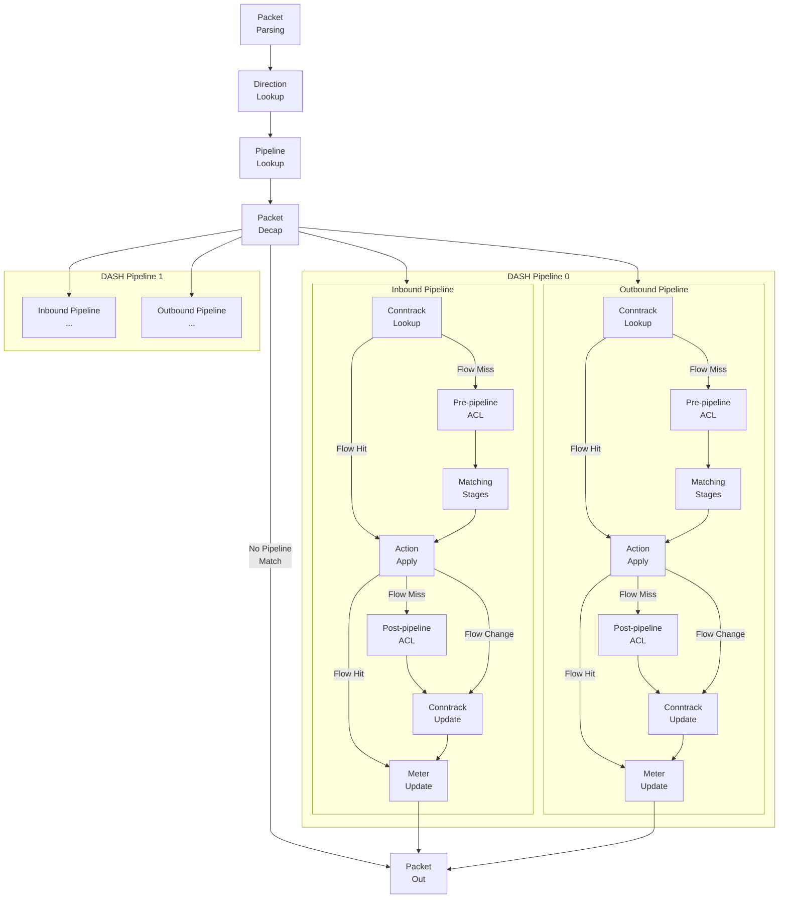
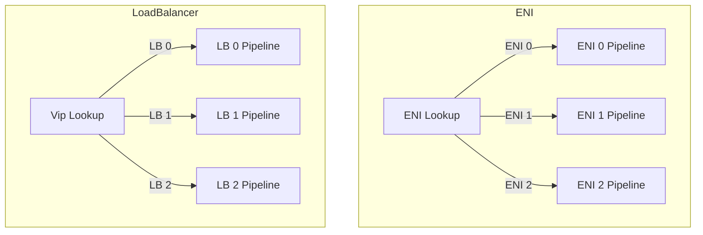
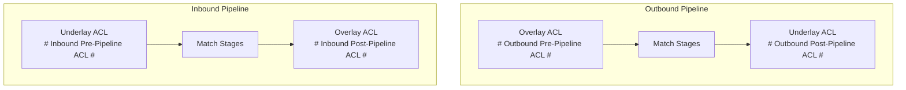
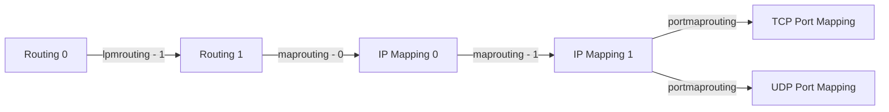
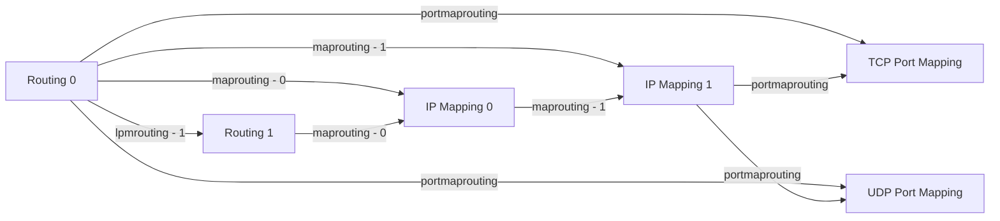

# DASH-SAI pipeline packet flow

1. [1. Overview](#1-overview)
2. [2. Data path logical architecture stack](#2-data-path-logical-architecture-stack)
3. [3. Packet Structure](#3-packet-structure)
4. [4. Pipeline Overview](#4-pipeline-overview)
5. [5. Pipeline components](#5-pipeline-components)
   1. [5.1. Per-packet metadata bus](#51-per-packet-metadata-bus)
   2. [5.2. Packet parsing](#52-packet-parsing)
      1. [5.2.1. Multi-layer encap parsing](#521-multi-layer-encap-parsing)
   3. [5.3. Direction Lookup](#53-direction-lookup)
   4. [5.4. Pipeline Lookup](#54-pipeline-lookup)
   5. [5.5. Packet Decap](#55-packet-decap)
      1. [5.5.1. Multi-layer encap handling](#551-multi-layer-encap-handling)
      2. [5.5.2. Stateless decap vs stateful decap](#552-stateless-decap-vs-stateful-decap)
      3. [5.5.3. Encap fields handling](#553-encap-fields-handling)
         1. [5.5.3.1. Handling DSCP](#5531-handling-dscp)
         2. [5.5.3.2. Handling TTL](#5532-handling-ttl)
      4. [5.5.4. Encap preservation](#554-encap-preservation)
   6. [5.6. Conntrack Lookup and Update](#56-conntrack-lookup-and-update)
      1. [5.6.1. Flow lookup](#561-flow-lookup)
      2. [5.6.2. Flow creation](#562-flow-creation)
         1. [5.6.2.1. Tunnel learning](#5621-tunnel-learning)
         2. [5.6.2.2. Asymmetrical encap handling](#5622-asymmetrical-encap-handling)
      3. [5.6.3. Flow resimulation](#563-flow-resimulation)
   7. [5.7. Pre-pipeline ACL and Post-pipeline ACL](#57-pre-pipeline-acl-and-post-pipeline-acl)
   8. [5.8. Routing actions and routing types](#58-routing-actions-and-routing-types)
      1. [5.8.1. Routing action](#581-routing-action)
      2. [5.8.2. Routing type](#582-routing-type)
   9. [5.9. Matching stages and metadata publishing](#59-matching-stages-and-metadata-publishing)
      1. [5.9.1. Matching stage](#591-matching-stage)
      2. [5.9.2. Pipeline profile and stage connections](#592-pipeline-profile-and-stage-connections)
      3. [5.9.3. Stage transitions](#593-stage-transitions)
         1. [5.9.3.1. Stage transition routing type](#5931-stage-transition-routing-type)
         2. [5.9.3.2. Stage skipping](#5932-stage-skipping)
         3. [5.9.3.3. Multi-stage chaining](#5933-multi-stage-chaining)
      4. [5.9.4. Action publishing](#594-action-publishing)
      5. [5.9.5. Metadata publishing](#595-metadata-publishing)
   10. [5.10. Action apply](#510-action-apply)
   11. [5.11. Meter update](#511-meter-update)
6. [6. Examples](#6-examples)
   1. [6.1. VNET routing](#61-vnet-routing)
   2. [6.2. VM level public IP inbound (L3 DNAT)](#62-vm-level-public-ip-inbound-l3-dnat)
   3. [6.3. VM level public IP outbound (L3 SNAT)](#63-vm-level-public-ip-outbound-l3-snat)
   4. [6.4. Load balancer (L4 DNAT)](#64-load-balancer-l4-dnat)
   5. [6.5. More](#65-more)

## 1. Overview

DASH-SAI pipeline packet flow is the core of the DASH project. It defines from device perspective, how the traffic is modeled in DASH, packets gets processed and transformation gets applied to the packets.

DASH-SAI pipeline is designed to work as a general purpose network function pipeline. Similar to [SAI](https://github.com/opencomputeproject/SAI), it works as a shim layer on top of DPU/ASIC SDKs, provides a set of low level hardware agnostic APIs that exposes the generic DPU primitives to the upper layer. So, the pipeline itself is not limited to any specific network function, but can be used to implement any network function.

## 2. Data path logical architecture stack

[DASH HLD](https://github.com/sonic-net/DASH/blob/main/documentation/general/dash-high-level-design.md)
 and and [SDN Pipeline Basic Elements](https://github.com/sonic-net/DASH/blob/main/documentation/general/sdn-pipeline-basic-elements.md) already provided a very good high level overview on the system architecture. And here, we are going to dive a bit deeper from the data path perspective.


DASH-SAI APIs are designed to be generic, with the intent to set up the data path in different ways as needed.

- The simplest way to set up the data path is to use the DASH-SAI APIs to create your pipeline and offload all your policy to ASIC.
- If your application requires more advanced policy, then the technology provider could also provide a inbox data plane app to implement these policies. And still, this is transparent to the upper layer, everything is hidden under the SAI level.
- If even more customized or complicated pipelines are needed for certain traffic, we could also provide our own customized data plane app and use the DASH policy to instruct the ASIC to trap these packets up when they shows up.

## 3. Packet Structure

Before diving into the pipeline and packet flow, to better describe the behaviors, let's first have a clear understanding on the packet structure that DASH supports.

Overall, the high-level packet structure looks like below:

- The inner most packet is the customer input, which is called overlay.
- The first encap is called underlay0, which is the most frequently used layer to implement any virtual network function, such as VNET routing, load balancer, etc.
- On top of underlay0, we can extend and have more layer of encaps, which can be used for implementing additional routing hops.

| ... (Outer most) | 2 | 1 | 0 (Inner most) |
| - | - | - | - |
| **...** | **Underlay 1** | **Underlay 0** | **Overlay** |

Today, DASH supports up to 2 layers of encaps: underlay0 and underlay1.

## 4. Pipeline Overview

DASH-SAI pipeline is modeled as a list of stages. Each stage defines its own tables, and use the table entries to match packets per the processing logic inside the match-action pipeline (key, action id, action data), and publish the corresponding metadata when an entry is matched. After all stages are processed, a list of final routing actions will be defined. Then, by executing these routing actions, the packet will be transformed accordingly, and corresponding flows will be generated for the direction of the packet.

At a high level the pipeline looks like below:



This design allows our upper layers to be flexible and doesn't limit to any specific object models for modeling their own policies. For example, [SONiC-DASH pipeline](https://github.com/sonic-net/SONiC/blob/master/doc/dash/dash-sonic-hld.md#2-packet-flows) uses DASH-SAI pipeline to implement VNET routing scenarios by translating the [SONiC DASH APIs](https://github.com/sonic-net/sonic-dash-api/tree/master/proto) to DASH-SAI model:

- A DASH-SAI pipeline is used to represent a VM NIC (ENI).
- The VxLAN VNI is used to do the direction lookup.
- The inner MAC address is used for pipeline lookup, a.k.a. ENI lookup (ENI).
- Once it enters the corresponding DASH pipeline, the `outbound` pipeline will be used to process the packets sourced from the VM, while the `inbound` pipeline will be used to process the packets destined to the VM.

## 5. Pipeline components

### 5.1. Per-packet metadata bus

First of all, since we have multiple matching stages in the pipeline, we need a way to pass the information from the matched entries in the earlier stages to the later ones to help us make final decisions on packet transformation. And this is what metadata bus is for.

At high-level, the metadata bus is a set of fields that are carried throughout the pipeline along with the packet. It contains:

- The information from the original packet, such as encap information.
- The information from each matched entry and related data structures, e.g., when a VNET mapping entry is matched, we will publish the information from VNET to the metadata bus.
- The routing action and its inline parameters from the matched entry.

Implementation-wise, this is similar to Packet Header Vector or Bus in NPL.

### 5.2. Packet parsing

In an ASIC, the parser is usually the first stage of the pipeline. It parses the incoming packet and extracts the information into the metadata bus, such as the source and destination MAC, IP, etc. And based on this information, we will invoke the rest of pipeline.

#### 5.2.1. Multi-layer encap parsing

Multi-layer encap generates a problem in the packet parsing, because of the encap layer detection and overlay packet handling:

1. In an ASIC, the parser is always parsing from the outermost bits to innermost bits. However, in DASH, the encap stack is defined reversely: underlay1 -> underlay0 -> overlay. Because the incoming packet could have various number of encaps, we need to be able to map the encaps to the right layer.
2. The overlay (customer) packet could be also using encaps, so we need to be able to tell which one is ours and which one is overlay.
3. The incoming packet could have various number of encaps, and each encap is not aware whether the inner packet is a overlay or not. For example, from the SDN pipeline basic element doc, the [Inbound from LB](./sdn-pipeline-basic-elements.md#inbound-from-lb) and [Internal Load Balancer in VNET communication](./sdn-pipeline-basic-elements.md#internal-load-balancer-in-vnet-communication) actually shares the same outer-most header.

To solve this problems, we use 2 methods for encap handling:

1. We can specify if parser should stop parsing more encaps or not for the VNI:

   ```json
   { "DASH_SAI_VNI_TABLE|12345": { "direction": "outbound", "final_encap": true } }
   ```

   When `final_encap` is set to true, the VNI will be sent to parser to force the parser to treat the next layer as overlay packet.

2. Since the parser doesn't know how many encaps existed prior, the parser can always start treating the outermost layer as underlay1. And whenever it sees that the protocol is not an encap, or the VNI is unknown, it will treat the packet as overlay packet. Then, after parsing is complete, we will fix the encap information in metadata bus.

   For example, in the [Inbound from LB](./sdn-pipeline-basic-elements.md#inbound-from-lb) case, the outer encap will initially be mapped to underlay1, the ethernet and IP part of the inner packet will be mapped into underlay0, while the TCP/UDP part will be mapped into overlay. Then, after parsing, we will extract the ethernet and IP parts in underlay0 as overlay, as well as extract the underlay1 as underlay0.

### 5.3. Direction Lookup

In the DASH-SAI pipeline, traffic has 2 directions: `inbound` and `outbound`. Each direction has its own pipeline (see pipeline overview above). When a new packet arrives, we will assign a direction to the packet, then process the packet in the corresponding pipeline. This ensures we match the flow and transform the packet correctly.

### 5.4. Pipeline Lookup

DASH supports a multi-tenancy model for traffic handling. A single device can have multiple pipelines, and each pipeline is used to handle traffic for a specific tenant, or the intended network function being modeled (such as a load balancer). When a packet arrives, besides direction lookup, we also need pipeline lookup to determine which pipeline to use for processing the packet.

For example, if we like to implement a VM NIC with DASH-SAI pipeline, then we can model one pipeline as one NIC, then use the inner packet MAC to find the pipeline. However, if we would like to implement a load balancer, we can use a DASH-SAI pipeline to represent a load balancer instance and use the Public IP to find the pipeline.



A pipeline can also define its initial matching stages, which will be used to start processing the packets if no flow is matched.

> NOTE:
>
> The DASH-SAI pipeline is a logical concept. It doesn't have to be a 1 to 1 mapping to a physical ASIC pipeline. The underlying implementation can be as simple as a metadata field update with a specific value, when the entry is matched, e.g., `ENI = Inner Source/Destination MAC`.

### 5.5. Packet Decap

If a pipeline is found, all outer encaps will be decap'ed before processing the packets, exposing the inner most packet going through the pipeline. This simplifies the flow matching logic and also allow us to create the reverse flow properly.

As [Packet Parsing](#52-packet-parsing) section described, this will not cause any key information to be lost, as they are saved in metadata bus, such as encap type, source IP and VNI / GRE Key.

#### 5.5.1. Multi-layer encap handling

The incoming packet to DASH pipeline could have multiple layers of encap, however, the ASIC capacity is usually limited. The more encaps we handle in the parser and decaps, adds latency.  Furthermore, using packet recirculation is also not ideal, because it can greatly reduce throughput and increase latency.

The limit of having 2 layers of encap at maximum is an attempt to help this problem and avoid the pipeline potentially experiencing unexpected latency.

#### 5.5.2. Stateless decap vs stateful decap

During the direction lookup stage, all other encaps will be examined, such as VNI lookup. For each VNI or GRE key, we can specify whether it is stateless or stateful.

Although the encap information will still be saved in the metadata bus, however, for stateless decap, we will not create the encap for the reverse flow. Otherwise (for the stateful decap), we will create the encap for the reverse flow by reversing the source and destination information.

```json
{
    "DASH_SAI_VNI_TABLE|12345": { "direction": "outbound", "stateless": false },
    "DASH_SAI_VNI_TABLE|12346": { "direction": "outbound", "stateless": true }
}
```

#### 5.5.3. Encap fields handling

##### 5.5.3.1. Handling DSCP

The DASH pipeline provides 2 modes for handling the DSCP: "Preserve model" and "Pipe model".

Preserve model works very similar to `SAI_TUNNEL_DSCP_MODE_UNIFORM_MODEL` with a slight difference:

- The DSCP value of outer most encap header will be preserved.
- When any encap being added, the preserved DSCP value will be copied to the new encap header.
- The DSCP value of overlay packet (customer packet) shall never be modified or preserved and copied to the outer header.

On the other hand, pipe model works very similar to `SAI_TUNNEL_DSCP_MODE_PIPE_MODEL`:

- The DSCP value of existing encaps will not be preserved.
- When any encap being added, the DASH pipeline will specify the DSCP value, and all routing action will take this value and copy it to the encaps.

If no encaps are added, say, for traffic sending to Internet, the DSCP value of overlay packet will be exposed as it is, even-if original packet arrives with a non-zero value.

This gives the cloud infra full control over the DSCP value and will prevent the customer from spoofing the fields.

##### 5.5.3.2. Handling TTL

TTL behavior for encap shall be "pipe" model (similar to SAI_TUNNEL_TTL_MODE_PIPE_MODEL):

- When adding encaps, TTL value shall be default set to 64.
- DASH pipeline shall not modify the TTL values in the overlay packet (customer packet).

#### 5.5.4. Encap preservation

Sometimes, depending upon the scenario to implement, the customer might want to preserve certain original encaps in the outgoing traffic. For example, say we receive a packet with structure: overlay -> underlay0 -> underlay1 -> underlay2. And we want to remove or update underlay0, preserve underlay1 and remove underlay2. This gives us the problem of handling all the CRUD combinations of all encaps, including structure changes: after removing underlay0, should underlay1 becomes underlay0 or should we keep it as underlay1? All these questions affect the encap related routing actions and final packet we create.

Since all of the encap information is preserved in the metadata bus for flow creation, to solve this problem, we can simply recreate them in the manner we want using the routing action: `tunnel_from_encap`. It allows the source and target encap and their override value to be set, which allows us to preserve the encaps exactly as intended, and also ensures the clarity of final transformation performed in the end.

Please note that: Encap preservation will not affect the reverse tunnel creation as "Stateless decap vs stateful decap" section described above. A encap can be preserved as well as used in reverse tunnel creation at the same time, since they are essentially 2 different things.

### 5.6. Conntrack Lookup and Update

After entering a specific pipeline, the first stage will be the Conntrack Lookup stage, which performs the flow lookup. If any flow is matched, the saved actions will be applied, the metering counters will be updated, and the rest of pipeline will be exited.

The core of the Conntrack Lookup and Update stage is the flow table.

#### 5.6.1. Flow lookup

First, let's define the flow lookup behavior.

The flow lookup **MUST** use the information of inner most packet. And the matching keys can be configurated via the DASH flow APIs during the DASH initialization. This allows us to support different flow matching behaviors for specific cases. For example, in L3 level routing, we don't need to create 5 tuple flows.

After the flow lookup, if a flow is matched, we will apply the saved actions in the flow direction and exit the rest of the pipeline. Otherwise, we will continue the pipeline processing.

#### 5.6.2. Flow creation

For new connections, after all packet transformations are applied, we will create a new flow in the flow table.

Since a connection can be bi-directional, the flows need to be created as flow pairs: the one in the same direction as the packet is usually called forwarding flow, while the other direction is called reverse flow. Of course, the flow pairs **MUST** be stored based on the pipeline direction.

- When the outbound pipeline creates a flow, the forwarding flow should be created on the outbound side, while the reverse flow should be created on the inbound side.
- When the inbound pipeline creates a flow, it creates the flow in reverse way.

And here is how to create the flow pairs:

- The forwarding flow creation is straight forward, because all the final transformations are defined in the flow actions and metadata bus.
- To properly create the reverse flow, we will learn the information from the original tunnels, and reverse them as return encaps, which is why we need to save all the original tunnel information when doing packet decaps.

##### 5.6.2.1. Tunnel learning

You might already notice that, although we uses the outer encap from the original packet to create the reverse flow, but the outer encaps are decap'ed and not used in flow matching. This creates a problem when source side fails over. Like the graph shows below, the traffic shifted from VTEP 1 (Green side) to VTEP 2 (Blue side), which changes the source IP in the encap. If we don't do anything (such as save the information), the existing reverse flow will continue to send the packet back to green side and cause the traffic to be dropped.


To address this problem, the source information of each encap **MUST** be saved in the flow and compared during flow match. These information should no be part of the key, but whenever they change, we should reprocess the packet and update the saved reverse tunnel in the existing flow.

##### 5.6.2.2. Asymmetrical encap handling

There could be cases where the encaps are asymmetrical, which means the incoming packet and return packet use different encaps. For example, in the case below, the encap of step 2 and 4 are not symmetrical. This means we could never recreate the flow on the DASH pipeline 2 side to tunnel the packet into the extra hop first with our current flow creation logic.


To fix this issue, a special action called `reverse_tunnel` is defined, which enables reverse side of the encaps.

#### 5.6.3. Flow resimulation

In the event of a policy change, we might need to update the flows associated with the policies. For example, when a VM is moved to another location, the VNET mapping entry will be changed, and we need to update the existing flows associated with the VNET mapping entry. Otherwise, the outgoing traffic will be tunneled to an incorrect location. This is called flow resimulation.

However, the flow resimulation is not as simple as removing the flow and sending the packet through the pipeline again. For example:

- When a ACL is changed in the outbound side, all flows needs to be resimulated. However, this cannot be implemented by removing all flow entries and let all flows to be recreated with the latest policy. The reason is that ACLs can be asymmetric and flows are created in pair. If the flows are removed, the inbound side traffic will be dropped immediately, because there is no inbound flow to make it bypass the ACLs.
- Certain actions might need to bypass the flow resimulation to maintain the per flow consistency. For example, in a load balancer case, we will want to ensure that flow resimulation will not cause the pipeline to forward existing connections to a different backend server.

These requires us to implement the flow resimulation in a more sophisticated way, which is not fully modeled in DASH today. But we will come back to this design later.

### 5.7. Pre-pipeline ACL and Post-pipeline ACL

Pre-pipeline ACL and Post-pipeline ACL are used to drop the unexpected traffic before and after the packet transformation. It works as below:

1. As the high-level pipeline shows above, if an incoming packet hits a flow (i.e. is in the FastPath), it will skip matching all the ACLs. If an incoming packet is denied by a ACL, the packet will be dropped without creating a flow.
2. Both the outbound and inbound pipeline have their own ACL stages, and are used for matching the packets in their own direction.

A typical usage of the ACLs is to implement security policies. For example, in SONiC-DASH pipeline, we use the pre/post-pipeline ACLs to implement the underlay and overlay ACLs in both directions, where overlay ACLs will be used for implementing customer policies, while underlay ACLs will be used for implementing the infrastructure policies.



### 5.8. Routing actions and routing types

#### 5.8.1. Routing action

In DASH-SAI pipeline, routing actions are the fundamental building blocks for packet transformations. Each routing action is designed to work as below:

1. Take a specific list of metadata fields as input parameters:
   1. For example, `staticencap` action will take the `underlay_dip`, `underlay_sip`, `encap_type` and `encap_key` to encapsulate the packet.
   2. The parameters can come from 2 places - the metadata defined associated with the entries in each table, or the routing action definition itself. More details will be discussed in the next section.
2. Transform the packet in a specific way, e.g., encapsulate the packet, NAT'ing the address and port, etc.
3. Independent to other actions.
   1. With this design, we don't have to worry about the order of the actions.
   2. This also enables the hardware to improve the E2E pipeline latency by executing the actions in parallel.

Take `staticencap` as an example, it can be defined as below:

- Action parameters:
  - `encap_type`: "nvgre|vxlan|..."
- Metadata parameters:
  - `underlay_dip`: Destination IP used in encap.
  - `underlay_sip`: Source IP used in encap.
  - `encap_key`: GRE key in NvGRE or VNI in VxLAN
- Actions:
  - Enable the underlay0 encap header based on the `encap_type`.
  - Update the underlay0 encap header with `encap_key`, `underlay_dip`, `underlay_sip`.

More routing action definitions can be found in the doc here: [DASH routing actions](../dataplane/dash-routing-actions.md).

#### 5.8.2. Routing type

To implement a network function, we usually need to do multiple packet transformations, such as adding a tunnel and NAT'ing the address or port. This requires us to be able to combine multiple routing actions together, and this is what routing type is for.

In DASH-SAI pipeline, routing type is defined as a list of routing actions. Each routing type can support at maximum 5 routing actions. And by combining different routing actions into different routing types, we will be able to implement different network functions.

For example:

- We can implement the VNET routing by creating a routing type named `vnet` with only 1 action `staticencap`, which takes the next hop information from the mapping table.
- We can also add additional hop to tunnel the traffic to an firewall or network virtual appliance first, which is known as [UDR](https://learn.microsoft.com/en-us/azure/virtual-network/virtual-networks-udr-overview), by creating another routing type named `vnetfw` with a `staticencap` action and an extra `tunnel` actions.
- We can even use `tunnel` action with multiple destinations as ECMP group to implement a simple load balancer!

This combination of routing actions is very flexible and powerful, and it enables us to implement any network function we want.

### 5.9. Matching stages and metadata publishing

#### 5.9.1. Matching stage

Matching stage is the one of the core part of the DASH-SAI pipeline and the components that gives the pipeline flexibility.

In DASH-SAI pipeline, a matching stage is a basic building block for packet matching and metadata publishing. And the DASH-SAI pipeline basically works as matching and metadata publishing until the final routing actions are executed. Currently, we support the following types of matching stages:

| Stage type | Match Type | Match Fields | Metadata Behavior |
| ---------- | ---------- | ------------ | -------- |
| Routing | LPM | Source IP or Destination IP | Publish metadata from matched routing entry |
| IP Mapping | Exact Match | Source IP or Destination IP | Publish metadata from matched VNET and VNET mapping entry |
| Port Mapping | Range Match | Source Port + Destination Port | Publish metadata from matched port mapping entry |

For more on the metadata publishing, please refer to the metadata publishing section below.

#### 5.9.2. Pipeline profile and stage connections

Ideally, when DASH initializes or whenever we create a new pipeline, by simply creating multiple numbers of different types of matching stages and connecting them in different ways, we can easily implement different pipeline and network functions.

| Stage 0 | Stage 1 | Stage 2 | Stage 3 | Stage 4 |
| ------- | ------- | ------- | ------- | ------- |
| Routing 0 | IP Mapping 0 | Port Mapping | X | X |
| Routing 0 | Routing 1 | IP Mapping 0 | IP Mapping 1 | Port Mapping |
| Routing 0 | IP Mapping 0 | Port Mapping | Routing 1 | IP Mapping 1 |

However, in reality, it might make the pipeline hard to implement, model, debug and validate or test at this moment. For example, changing matching fields, matching type and connection dynamically on pipeline creation is simply beyond the ability of P4, which is used by our behavior model today as well as many vendor's ASIC SDKs.

To address this problem, a set of predefined pipeline profile are defined in DASH. And each profile has their own predefined stages and connections in the pipeline.

For example, today the only profile we support is ENI, which is used to implement the VM NIC. To ensure we have enough flexibility:

- The match stages are designed to be connected from larger range to smaller range as below.
- There are 2 routing and IP mapping stages in the pipeline, so we can support either source and destination IP matching, as well as 2 layers of routing.



#### 5.9.3. Stage transitions

##### 5.9.3.1. Stage transition routing type

To transit between stages, we use `transition` field to specify the transition routing type.

A transition routing type is a special type of [Routing Type](#572-routing-type):

1. Each transition routing type can only have one single routing action.
2. Only a special list of routing actions will take effect in the routing types, which are all related to stage transitions, as listed below.
3. If `transition` field is not set, we consider the packet is reaching the end of the pipeline and start executing the final routing actions.

| `action_type` value | Stage |
| ---------------- | ----- |
| `drop` | Drop the packet |
| `trap` | Sending it to CPU |
| `lpmrouting` | Skip to next routing stage |
| `maprouting` | Skip to next mapping stage |
| `portmaprouting` | Skip to next TCP or UDP Port Mapping stage |

To help us to stay flexible, the transition routing actions can take a few parameters:

- All transition routing actions other than `drop` and `trap`:
  - `default_routing_type`: If no entry is found, use this routing type to route the packet. If `default_routing_type` is not set, the packet will be dropped by default.
  - `stage_index`: If there are multiple stage of the same stage type, use this field to specify which stage to transit to. The index is starting from 0 and by default 0.
- IP-based routing actions (`lpmrouting` and `maprouting`):
  - `use_src_ip`: Use source IP in routing and mapping stages.
  - `ip_mask`: IP mask to apply before matching the entries.

Here is an example that shows how the routing stage entry looks like:

```json
// Routing stage entry:
// When this entry is matched, we will move to VNET mapping stage, which executes maprouting action and jump to VNET mapping stage.
"DASH_SAI_ROUTE_TABLE|123456789012|0|10.0.1.0/24": {
    "transition": "vnetmap",
    "vnet": "Vnet1"
}

"DASH_SAI_ROUTING_TYPE_TABLE|vnetmap": [
    {
        "action_type": "maprouting",
        "stage_index": 0
    }
]
```

##### 5.9.3.2. Stage skipping

To avoid loops appearing in the pipeline, the pipeline is designed to be forward only. When transition routing action is invoked, we can simply update the target stage in the metadata, then the transition behavior can simply be described by the code below:

```c
apply {
    // ...
    if (meta.transit_to == DASH_MATCH_STAGE_MAPROUTING && meta.stage_index == 0) {
        maprouting0.apply();
    }
    if (meta.transit_to == DASH_MATCH_STAGE_MAPROUTING && meta.stage_index == 1) {
        maprouting1.apply();
    }
    // ...
}
```

This allows us easily bypass the stages as needed, also avoid loop being accidentally created. Take Routing stage + TCP flow as an example, it can use different transition to jump to different stages.



##### 5.9.3.3. Multi-stage chaining

With multiple instances of the same stage type, we can chain the stages together to implement more complicated policies.

For example, we can use 2 routing stages to implement 2 layers of routing with the second layer checking the source IP.

```json
{
    "DASH_SAI_ROUTE_TABLE|123456789012|0|10.0.1.0/24": {
        "transition": "srclpm",
        // ...
    },
    "DASH_SAI_ROUTING_TYPE_TABLE|srclpm": [{ "action_type": "lpmrouting", "stage_index": 1, "use_src_ip": true } ],
    
    "DASH_SAI_ROUTE_TABLE|123456789012|1|10.1.1.0/24": {
        // ...
    },
}
```

Or, with a slight change, we can implement another routing policy to enable a tunnel for a special destination IP range.

```json
{
    // First LPM
    "DASH_SAI_ROUTE_TABLE|123456789012|0|10.0.1.0/24": {
        "transition": "lpm2",
        // ...
    },
    "DASH_SAI_ROUTING_TYPE_TABLE|srclpm": [{ "action_type": "lpmrouting", "stage_index": 1 } ],
    
    // Second LPM
    "DASH_SAI_ROUTE_TABLE|123456789012|1|10.0.1.128/25": {
        "routing_type": "firewalltunnel",
        "underlay1_tunnel_id": "firewall_tunnel_0"
    },
    "DASH_SAI_ROUTING_TYPE_TABLE|firewalltunnel": [ { "action_type": "tunnel", "target": "underlay1" } ]
}
```

#### 5.9.4. Action publishing

Each entry in the matching stages can specify a [routing type](#572-routing-type) that specifies the routing actions for specifying the packet transformations. When an entry is matched in the matching stages, the actions will be populated into the metadata bus, and the actions will be applied when the packet reaches the action apply stage.

Populating the actions into the metadata bus are straightforward, which can be illustrated by the P4 code below:

```c
enum bit<16> routing_action_type_t {
    staticencap = 0,
    nat = 1,
    // ...
}

action lpmrouting0_set_action(routing_action_type_t action0, ...) {
    meta.stage0.action0 = action0;
    // ...
}
```

Since we can specify the both transition and actions in a single entry, this allows us to stack the actions as the pipeline moves forward:

```c
struct stage_actions_t {
    bit<16> action0;
    bit<16> action1;
    // ...
}

struct metadata_t {
    stage_actions_t stage0;
    stage_actions_t stage1;
    // ...
}
```

#### 5.9.5. Metadata publishing

Each entry in the matching stages can also specify a list of metadata. When an entry is matched in the matching stages, the metadata will be populated into the metadata bus, and the metadata will be used as the input parameters for the routing actions. These metadata are shared by all stages and actions, hence later ones will override the existing ones, if any.

With this design, all the entries in each matching stage can all be defined similarly as below:

```json
"DASH_SAI_SOME_ENTRY_TABLE|<entry partition key>|<stage_index>|<Unique Key of the entry>": {
    "transition": "<transition routing type name>",
    "routing_type": "<routing type name>",

    // Metadata properties/attributes ...
}
```

Take the VNET mapping as an example. When following VNET mapping is matched, `underlay_dip`, `4to6_sip_encoding`, `4to6_dip_encoding` and `metering_class` will be published to the metadata bus.

```json
// VNET mapping entry (VNET mapping stage)
"DASH_SAI_VNET_MAPPING_TABLE|Vnet1|0|10.0.1.1": {
    "transition": "vnetportmap",
    "routing_type": "do_something",

    // Underlay destination IP address. Used by staticencap action.
    "underlay_dip": "3.3.3.1",

    // Overlay IP address encoding from v4 to v6. Used by 4to6 action.
    "4to6_sip_encoding": "9988::/ffff::",
    "4to6_dip_encoding": "1122:3344:5566:7788::0303:0301/ffff:ffff:ffff:ffff:ffff:ffff:ffff:ffff",

    // Metering ID. Used in metering stage.
    "metering_class": 60001
}
```

This can be illustrated by the P4 code below:

```c
struct metadata_t {
    bit<32> underlay_dip;
    // ...
}

action vnetportmap0_set_metadata(bit<32> underlay_dip, ...) {
    meta.underlay_dip = underlay_dip;
    // ...
}
```

> NOTE:
>
> The Direction Lookup and Pipeline Lookup stages are also matching stages, so they can also populate metadatas too, e.g., ENI-level metadata for underlay encap.

This design also allows us to decouples the time of fulfilling the routing actions and their parameters.

For example, say, we have a network with this policy: all traffic that sends to an IP range needs to have a vxlan encap with encap key 12345, but different IP will have a different underlay IP. Also, for 10.0.1.1, a tunnel is enabled for tunneling traffic to a firewall first. Then this can be modeled as below:

```json
{
    // Routing entry for the destiation. All destination shares the same encap.
    "DASH_SAI_ROUTE_TABLE|123456789012|0|10.0.1.0/24": {
        "transition": "vnetmap",
        "routing_type": "vnetfwd",
        "vnet": "Vnet1",
        "encap_type": "vxlan",
        "encap_key": "12345"
    },
    "DASH_SAI_ROUTING_TYPE_TABLE|vnetmap": [ { "action_type": "maprouting" } ],
    "DASH_SAI_ROUTING_TYPE_TABLE|vnetfwd": [ { "action_type": "static_encap" } ],

    // If we are sending to 10.0.1.1, this entry will be matched and delay set the underlay destination IP for staticencap action, also specify the tunnel action.
    "DASH_SAI_VNET_MAPPING_TABLE|Vnet1|0|10.0.1.1": {
        "routing_type": "firewalltunnel",
        "underlay_dip": "3.3.3.1",
        "underlay1_tunnel_id": "firewall_tunnel_0"
    },
    "DASH_SAI_ROUTING_TYPE_TABLE|firewalltunnel": [ { "action_type": "tunnel", "target": "underlay1" } ]
}
```

### 5.10. Action apply

After all matching stages are done, we will start applying all the actions. All the latest values in the metadata bus will be used as the input parameters for the routing actions.

### 5.11. Meter update

After all actions are applied, post-pipeline ACLs are passed, we will update the metering counters if any metering class is specified.

## 6. Examples

Here are some examples to demo how to apply the DASH-SAI pipeline to implement different network functions. They might not be up-to-date or complete policies, but mostly demoing the high level ideas.

### 6.1. VNET routing

```json
[
    // When sending to anywhere in the VNET, we start to lookup the destination
    "DASH_SAI_ROUTE_TABLE|123456789012|0|10.0.1.0/24": {
        "transition": "vnetmap",
        "vnet": "Vnet1"
    },
    "DASH_SAI_ROUTING_TYPE_TABLE|vnetmap": [ { "action_type": "maprouting" } ],

    // If we are sending to 10.0.1.1, this entry will be matched and set the underlay destination IP for staticencap action.
    "DASH_SAI_VNET_MAPPING_TABLE|Vnet1|0|10.0.1.1": {
        "routing_type": "vnetfwd",
        "underlay_dip": "3.3.3.1",
    }

    // The corresponding table level information will also be populated, in this case - "encap_key"
    "DASH_SAI_VNET_TABLE|Vnet1": {
        "name": "559c6ce8-26ab-4193-b946-ccc6e8f930b2",
        "encap_key": 12345
    },

    // This is the final routing type that gets executed because VNET mapping table gets matched,
    // which addes the vxlan tunnel to the destination.
    "DASH_SAI_ROUTING_TYPE_TABLE|vnetfwd": [
        { "action_type": "static_encap", "encap_type": "vxlan" }
    ]
]
```

### 6.2. VM level public IP inbound (L3 DNAT)

```json
[
    "DASH_SAI_ENI_TABLE|123456789012": {
        "eni_id": "497f23d7-f0ac-4c99-a98f-59b470e8c7bd",
        "admin_state": "enabled",
        "mac_address": "12-34-56-78-90-12",

        // In inbound pipeline, this field will be published as underlay_dip used by staticencap action.
        "underlay_ip": "100.0.0.1",
    },

    // Routing to the public IP.
    "DASH_SAI_ROUTE_TABLE|123456789012|0|1.1.1.1/32": {
        "routing_type": "l3nat",

        // Another way to implement the underlay encap is to use the underlay_dip in the routing entry.
        "underlay_dip": "100.0.0.1",

        // NAT destination IP to VM IP.
        "nat_dips": "10.0.0.1"
    },

    // This is the final routing type that gets executed.
    // 
    // The nat action will nat the inner packet destination ip based on the nat_dips defined in the routing entry.
    // If we have multiple IPs, they will be treated as an ECMP group. And algorithm can be defined as metadata in the routing entry as well.
    "DASH_SAI_ROUTING_TYPE_TABLE|l3nat": [
        { "action_type": "nat" },
        { "action_type": "staticencap" }
    ]
]
```

### 6.3. VM level public IP outbound (L3 SNAT)

```json
[
    // Routing to Internet.
    // This is a simple implementation, basically means if nothing else is matched.
    "DASH_SAI_ROUTE_TABLE|123456789012|0|0.0.0.0/0": {
        "routing_type": "l3nat",
        "nat_sips": "1.1.1.1,2.2.2.2"
    },

    // This is the final routing type that gets executed.
    // 
    // The nat action will nat the inner packet destination ip based on the nat_dips defined in the routing entry.
    // If we have multiple IPs, they will be treated as an ECMP group. And algorithm can be defined as metadata in the routing entry as well.
    "DASH_SAI_ROUTING_TYPE_TABLE|l3nat": [
        { "action_type": "nat" }
    ]
]
```

### 6.4. Load balancer (L4 DNAT)

```json
[
    // When any traffic is sent to any VIP that this DPU owns, we will start to lookup the destination.
    "DASH_SAI_ROUTE_TABLE|123456789012|0|1.1.1.0/24": {
        "transition": "vipmap",
        "vnet": "vipmapping"
    },
    "DASH_SAI_ROUTING_TYPE_TABLE|vipmap": [ { "action_type": "maprouting" } ],

    // If the packet is sent to 1.1.1.1, we start to do port mapping
    "DASH_SAI_VNET_MAPPING_TABLE|Vnet1|0|1.1.1.1": {
        "transition": "vipportmap",
        "port_mapping_id": "lb-portmap-1-1-1-1"
    }
    "DASH_SAI_ROUTING_TYPE_TABLE|vipportmap": [ { "action_type": "maprouting" } ],

    // Load balancing rule for port 443.
    "DASH_SAI_TCP_PORT_MAPPING_TABLE|lb-portmap-1-1-1-1": [
        {
            "routing_type": "lbnat",

            "src_port_min": 0,
            "src_port_max": 65535,
            "dst_port_min": 443,
            "dst_port_max": 443,

            // Specify the VTEP info for the backend pool.
            "underlay0_tunnel_id": "lb-backend-pool-vtep-1-1-1-1-443",
            
            // NAT destination IP to multiple VM IPs as ECMP group and a different port.
            "nat_dips": "10.0.0.1,10.0.0.2",
            "nat_dport": "8443"
        }
    ]

    // Tunnel to VTEP for getting right underlay info.
    "DASH_SAI_ROUTING_TUNNEL_TABLE|lb-backend-pool-vtep-1-1-1-1-443": {
        "name": "lb-backend-pool-vtep-1-1-1-1-443",
        "dips": "100.1.0.1,100.1.0.2",
        "sip": "100.0.0.1",
        "encap_type": "vxlan",
        "encap_key": 12345
    }

    // This is the final routing type that gets executed. The tunnel_nat action will nat the inner packet destination
    // from public ip to VM IP, also adds the corresponding vxlan tunnel to the destination.
    //
    // To start simple, all destination IPs can be treated as an ECMP group. And algorithm can be defined as metadata
    // in the VIP entry as well.
    "DASH_SAI_ROUTING_TYPE_TABLE|lbnat": [
        { "action_type": "tunnel", "target": "underlay0" },
        { "action_type": "nat" }
    ]
]
```

### 6.5. More

- [SONiC-DASH packet flows](https://github.com/sonic-net/SONiC/blob/master/doc/dash/dash-sonic-hld.md#2-packet-flows)
