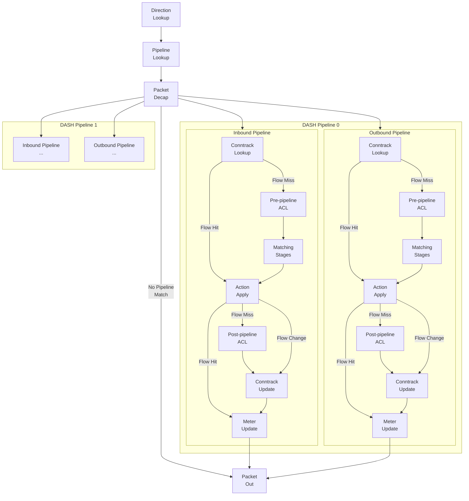

# DASH-SAI pipeline packet flow

1. [1. Overview](#1-overview)
2. [2. Packet Structure](#2-packet-structure)
3. [3. Pipeline Overview](#3-pipeline-overview)
4. [4. Pipeline components](#4-pipeline-components)
   1. [4.1. Per-packet metadata bus](#41-per-packet-metadata-bus)
   2. [4.2. Direction Lookup](#42-direction-lookup)
   3. [4.3. Pipeline Lookup](#43-pipeline-lookup)
   4. [4.4. Packet Decap](#44-packet-decap)
   5. [4.5. Conntrack Lookup and Update](#45-conntrack-lookup-and-update)
      1. [4.5.1. Flow lookup](#451-flow-lookup)
      2. [4.5.2. Flow creation](#452-flow-creation)
         1. [4.5.2.1. Tunnel learning](#4521-tunnel-learning)
         2. [4.5.2.2. Asymmetrical encap handling](#4522-asymmetrical-encap-handling)
      3. [4.5.3. Flow resimulation](#453-flow-resimulation)
   6. [4.6. Pre-pipeline ACL and Post-pipeline ACL](#46-pre-pipeline-acl-and-post-pipeline-acl)
   7. [4.7. Matching stages and metadata publishing](#47-matching-stages-and-metadata-publishing)
      1. [4.7.1. Matching stage](#471-matching-stage)
      2. [4.7.2. Device role and stage connections](#472-device-role-and-stage-connections)
      3. [4.7.3. Stage transitions](#473-stage-transitions)
      4. [4.7.4. Metadata publishing](#474-metadata-publishing)
   8. [4.8. Routing action](#48-routing-action)
   9. [4.9. Routing type](#49-routing-type)
5. [5. Examples](#5-examples)
   1. [5.1. VNET routing](#51-vnet-routing)
   2. [5.2. VM level public IP inbound (L3 DNAT)](#52-vm-level-public-ip-inbound-l3-dnat)
   3. [5.3. VM level public IP outbound (L3 SNAT)](#53-vm-level-public-ip-outbound-l3-snat)
   4. [5.4. Load balancer (L4 DNAT)](#54-load-balancer-l4-dnat)
   5. [5.5. More](#55-more)

## 1. Overview

DASH-SAI pipeline packet flow is the core of the DASH project. It defines from device perspective, how the traffic is modeled in DASH, packets gets processed and transformation gets applied to the packets.

DASH-SAI pipeline is designed to work as a general purpose network function pipeline. Similar to [SAI](https://github.com/opencomputeproject/SAI), it works as a shim layer on top of DPU/ASIC SDKs, provides a set of low level hardware agnostic APIs that exposes the generic DPU primitives to the upper layer. So, the pipeline itself is not limited to any specific network function, but can be used to implement any network function.

## 2. Packet Structure

Before diving into the pipeline and packet flow, to better describe the behaviors, let's first have a clear understanding on the packet structure that DASH supports.

Overall, the high-level packet structure looks like below:

- The inner most packet is whatever the customer sends, which is called overlay. 
- The first encap is called underlay, which is the most frequently used layer for implement any virtual network functions, such as VNET routing, load balancer, etc.
- On top of underlay, we can have multiple tunnels, which can be used for implementing additional routing hops.

| ... (Outer most) | 3 | 2 | 1 | 0 (Inner most) |
| - | - | - | - | - |
| **...** | **Tunnel1** | **Tunnel0** | **Underlay** | **Overlay** |

## 3. Pipeline Overview

DASH-SAI pipeline is modeled as a list of stages. Each stage defines its own tables, and use the table entries to match packets in certain way and publishing thecorresponding metadata when an entry is matched. After all stages are processed, a list of final routing actions will be defined. Then, by executing these routing actions, the packet will be transformed in the way we want and corresponding flows will be generated according to the direction of the packet.

On the high level the pipeline looks like below:



This design allows our upper layers to be flexible and doesn't limit to any specific object models for modeling their own policies. For example, [SONiC-DASH pipeline](https://github.com/sonic-net/SONiC/blob/master/doc/dash/dash-sonic-hld.md#2-packet-flows) uses DASH-SAI pipeline to implement VNET routing scenarios by translating the [SONiC DASH APIs](https://github.com/sonic-net/sonic-dash-api/tree/master/proto) to DASH-SAI model:

- A DASH-SAI pipeline is used to represent a VM NIC (ENI).
- The VxLAN VNI is used to do the direction lookup.
- The inner MAC address is used for pipeline lookup, a.k.a. ENI lookup (ENI). 
- Once it goes into the corresponding DASH pipeline, the `outbound` pipeline will be used to process the packets coming from the VM, while the `inbound` pipeline will be used to process the packets going into the VM.

## 4. Pipeline components

### 4.1. Per-packet metadata bus

First of all, since we have multiple matching stages in the pipeline, we need a way to pass the information from the matched entries in the earlier stages to the later ones to help us making final decisions on packet transformation. And this is what metadata bus is for.

At high-level, the metadata bus is a set of fields that being carried all the way through the pipeline along with the packet. It contains:

- The information from the original packet, such as encap information.
- The information from each matched entry and related data structures, e.g., when a VNET mapping entry is matched, we will publish the information from VNET to the metadata bus. 
- The routing action and its inline parameters from the matched entry.

Implementation-wise, this is similar to Packet Header Vector or Bus in NPL.

### 4.2. Direction Lookup

In DASH-SAI pipeline, traffic are split into 2 directions: `inbound` and `outbound`. Each direction has its own pipeline (see pipeline overview above). When a new packet arrives, we will assign a direction to the packet, then process the packet in the corresponding pipeline. This ensures us to match the flow and transform the packet in the right way.

### 4.3. Pipeline Lookup

DASH supports multi-tenancy model for traffic handling. A single device can have multiple pipelines, and each pipeline is used to handle traffic for a specific tenant. When a packet arrives, besides direction lookup, we also need pipeline lookup to determine which pipeline to use for processing the packet.

For example, if we like to implement a VM NIC with, then we can model one pipeline as one VM NIC, then use the inner packet MAC to find the pipeline. However, if we would like to implement a load balancer, we can use a DASH-SAI pipeline to represent a load balancer instance and use the Public IP to find the SAI pipeline.


A pipeline can also define its initial matching stages, which will be used for starting processing the packets if no flow is matched.

> NOTE:
> 
> DASH-SAI pipeline is a logical concept. It doesn't have to be 1 to 1 mapping to a physical ASIC pipeline. The underlying implementation can be as simple as a metadata field update with a specific value, when the entry getting matched, e.g., `ENI = Inner Source/Destination MAC`.

### 4.4. Packet Decap

If a pipeline is found, before processing the packets, all outer encaps will be decaped, and with key information saved in metadata bus, such as encap type, source IP and VNI / GRE Key, exposing the inner most packet going through the pipeline. This simplifies the flow matching logic and also allow us to create the reverse flow properly.

### 4.5. Conntrack Lookup and Update

After entering a specific pipeline, the first stage will be the Conntrack Lookup stage, which does the flow lookup. If any flow is matched, the saved actions will be applied, the metering counters will be updated, and the rest of pipeline will be skipped.

The core of the Conntrack Lookup and Update stage is the flow table.

#### 4.5.1. Flow lookup

First, let's define the flow lookup behavior.

The flow lookup **MUST** use the information of inner most packet. And the matching keys can be configurated via the DASH flow APIs during the DASH initialzation. This allows us to support different flow matching behaviors for certain cases. For example, in L3 level routing, we don't need to create 5 tuple flows.

After the flow lookup, if a flow is matched, we will apply the saved actions in the flow direction and skip the rest of the pipeline. Otherwise, we will continue the pipeline processing.

#### 4.5.2. Flow creation

For new connections, after all packet transformations are applied, we will create a new flow in the flow table. 

Since a connection can be bi-directional, the flows needs to be created as flow pairs: the one in the same direction as the packet is usually called forwarding flow, while the other direction is called reverse flow. Of course, the flow pairs **MUST** be stored based on the pipeline direction.

- When outbound pipeline creates a flow, the forwarding flow should be created on the outbound side, while reverse flow should be created on the inbound side.
- When inbound pipeline creates a flow, it creates the flow in reversed way.

And here is how to create the flow pairs:

- The forwarding flow creation is straight forward, because all the final transformations are defined in the flow actions and metadata bus.
- To properly create the reverse flow, we will learn the information from the original tunnels, and reverse them as return encaps, which is why we need to save all the original tunnel information when doing packet decaps.

##### 4.5.2.1. Tunnel learning

You might already notice that, although we uses the outer encap from the original packet to create the reverse flow, but the outer encaps are decap'ed and not used in flow matching. This creates a problem when source side fails over. Like the graph shows below, the traffic shifted from VTEP 1 (Green side) to VTEP 2 (Blue side), which changes the source IP in the encap. If we don't do anything, the existing reverse flow will continue to send the packet back to green side and causing the traffic being dropped.


To address this problem, the source information of each encap **MUST** be saved in te flow and compared during flow match. These information should no be part of the key, but whenever they change, we should reprocess the packet and update the saved reverse tunnel in the existing flow.

##### 4.5.2.2. Asymmetrical encap handling

There could be cases where the encaps are asymmetrical, which means the incoming packet and return packet uses different encaps. For example, in the case below, the encap of step 2 and 4 are not symmetrical. This means we could never recreate the flow on the DASH pipeline 2 side to tunnel the packet into the extra hop first with our current flow creation logic.


To fix this issue, a special action called `reverse_tunnel` is defined, which enables reverse side of the encaps.

#### 4.5.3. Flow resimulation

When certain policies are changed, we might need to update the flows that is associated with the policies. For example, when a VM is moved to another place, the VNET mapping entry will be changed, and we need to update the existing flows that is associated with the VNET mapping entry. Otherwise, the outgoing traffic will be tunneled to incorrect place. This is called flow resimulation.

However, the flow resimulation is not as simple as removing the flow and let the packet to going through the pipeline again. For example:

- When a ACL is changed in the outbound side, all flows needs to be resimulated. However, this cannot be implemented by removing all flow entries and let all flows to be recreated with the latest policy. The reason is that ACLs can be asymmetric and flows are created in pair. If the flows are removed, the inbound side traffic will be dropped immediately, because there is no inbound flow to make it bypass the ACLs.
- Certain actions might need to bypass the flow resimulatin to maintain the per flow consistency. For example, in load balancer case, we will want to ensure that flow resimulation will not causing us to forward existing connections to a different backend server.

These requires us to implement the flow resimulation in a more sophisticated way, which is not fully modeled in DASH today. But we will come back to this design later.

### 4.6. Pre-pipeline ACL and Post-pipeline ACL

Pre-pipeline ACL and Post-pipeline ACL are used to drop the unexpected traffic before and after the packet transformation. It works as below:

1. As the high-level pipeline shows above, if an incoming packet hits a flow, it will skip matching all the ACLs. If an incoming packet is denied by a ACL, the packet will be dropped without creating a flow.
2. Both outbound and inbound pipeline has its own ACL stages, and only used for matching the packets in their direction.

A typical usage of the ACLs is to implement security policies. For example, in SONiC-DASH pipeline, we use the pre/post-pipeline ACLs to implement the underlay and overlay ACLs in both directions, where overlay ACLs will be used for implementing customer policies, while underlay ACLs will be used for implementing the infrastructure policies.


### 4.7. Matching stages and metadata publishing

#### 4.7.1. Matching stage

Matching stage is the one of the core part of the DASH-SAI pipeline and the components that gives the pipeline flexibility.

In DASH-SAI pipeline, a matching stage is a basic building block for packet matching and metadata publishing. And the DASH-SAI pipeline basically works as matching and metadata publishing until the final routing actions are executed. Currently, we support the following types of matching stages:

| Stage type | Match Type | Match Fields | Metadata Behavior |
| ---------- | ---------- | ------------ | -------- |
| Routing | LPM | Source IP or Destination IP | Publish metadata from matched routing entry |
| VNET Mapping | Exact Match | Source IP or Destination IP | Publish metadata from matched VNET and VNET mapping entry |
| Port Mapping | Range Match | Source Port + Destination Port | Publish metadata from matched port mapping entry |

For more on the metadata publishing, please refer to the metadata publishing section below.

#### 4.7.2. Device role and stage connections

Although, ideally, by simply creating different matching stages and connecting them in different ways, we can easily implement different network functions. However, in reality, it might make the pipeline hard to implement, model, debug and validate or test at this moment. For example, changing matching fields, matching type and connection dynamically or on pipeline creation is simply beyond the ability of P4. 

To address this problem, we can define a set of predefined device roles, each device role has their own predefined stages and connections in the pipeline.

For example, today the only device role we support is ENI, which is used to implement the VM NIC. To ensure we have enough flexibility, the match stages are designed to be connected from larger range to smaller range as below:


#### 4.7.3. Stage transitions

To transit between stages, we can set the `transit_to` field in the matched entry. This will instruct the pipeline to skip the stages before the `transit_to` stage and resume from there. Now, DASH supports the following stages:

| `transit_to` value | Stage |
| --------------------- | ----- |
| `lpmrouting` | Routing stage by checking destination IP |
| `srclpmrouting` | Routing stage by checking source IP |
| `maprouting` | VNET Mapping stage by checking destination IP |
| `srcmaprouting` | VNET Mapping stage by checking source IP |
| `portmaprouting` | TCP or UDP Port Mapping stage |
| `rss` | Sending it to CPU |
| `drop` | Drop the packet |

Here is an example that shows how the routing stage entry looks like:

```json
// Routing stage entry:
// When this entry is matched, we will move to VNET mapping stage, which executes maprouting action and jump to VNET mapping stage.
"DASH_SAI_ROUTE_TABLE:123456789012:10.0.1.0/24": {
    "transit_to": "maprouting",
    "vnet": "Vnet1"
}
```

To avoid loop shows up in the pipeline, the pipeine is designed to be forward only. The transition behavior can simply be described by the code below:

```c
if (meta.transit_to == DASH_MATCH_STAGE_MAPROUTING) {
    maprouting.apply();
}
if (meta.transit_to == DASH_MATCH_STAGE_SRCMAPROUTING) {
    srcmaprouting.apply();
}
// ...
```

This allows us easily bypass the stages as needed, also avoid loop being accidentally created. Take Routing stage + TCP flow as an example, it can use different transition to jump to different stages. 


#### 4.7.4. Metadata publishing

When an entry is matched in the matching stages, we will publish the metadata defined in the entry to the metadata bus, and overrides the existing ones, if any. This means, all the entries in each matching stage can all be defined similarly as below:

```json
"DASH_SAI_SOME_OBJECT_TABLE:<Unique Key of the object>": {
    "transit_to": "<next stage name>",
    "routing_type": "<routing type name>",

    // Metadata properties/attributes ...
}
```

Take the VNET mapping as an example. When following VNET mapping is matched, `underlay_dip`, `4to6_sip_encoding`, `4to6_dip_encoding` and `metering_class` will be published to the metadata bus.

```json
// VNET mapping entry (VNET mapping stage)
"DASH_SAI_VNET_MAPPING_TABLE:Vnet1:10.0.1.1": {
    "transit_to": "portmaprouting",
    "routing_type": "do_something",

    // Underlay destination IP address. Used by staticencap action.
    "underlay_dip": "3.3.3.1",

    // Overlay IP address encoding from v4 to v6. Used by 4to6 action.
    "4to6_sip_encoding": "9988::/ffff::",
    "4to6_dip_encoding": "1122:3344:5566:7788::0303:0301/ffff:ffff:ffff:ffff:ffff:ffff:ffff:ffff",

    // Metering ID. Used in metering stage.
    "metering_class": "60001"
}
```

After all matching stages is done, we will start applying all the actions. All the latest values in the metadata bus will be used as the input parameters for the routing actions.

> NOTE:
> 
> The Direction Lookup and Pipeline Lookup stages are also matching stages, so they can also populate metadatas too, e.g., ENI-level metadata for underlay encap.

### 4.8. Routing action

In DASH-SAI pipeline, routing actions are the fundamental building blocks for packet transformations. Each routing action is designed to work as below:

1. Take a specific list of metadata fields as input parameters:
   1. For example, `staicencap` action will take the `underlay_dip`, `underlay_sip`, `encap_type` and `encap_key` to encapsulate the packet.
   2. The parameters can come from 2 places - the metadata defined associated with the entries in each table, or the routing action definition itself. More details will be discussed in the next section.
2. Transform the packet in a specific way, e.g., encapsulate the packet, natting the address and port, etc.
3. Independent to other actions.
   1. With this design, we don't have to worry about the order of the actions.
   2. This also enables the hardware to improve the E2E pipeline latency by doing the actions in parallel.

Take `staticencap` as an example, it can be defined as below:

- Action parameters:
    - `encap_type`: "nvgre|vxlan|..."
- Metadata parameters:
    - `underlay_dip`: Destination IP used in encap.
    - `underlay_sip`: Source IP used in encap.
    - `encap_key`: GRE key in NvGRE or VNI in VxLAN
- Actions:
    - Enable the underlay encap header based on the `encap_type`.
    - Update the underlay encap header with `encap_key`, `underlay_dip`, `underlay_sip`.

### 4.9. Routing type

To implement a network funtion, we usually need to do multiple packet transformations, such as adding a tunnel and natting the address or port. This requires us to be able to combine multiple routing actions together, and this is what routing type is for.

In DASH-SAI pipeline, routing type is defined as a list of routing actions. And by combining different routing actions into different routing types, we will be able to implement different network functions.

For example:

- We can implement the VNET routing by creating a routing type named `vnet` with only 1 action `staticencap`, which takes the next hop information from the mapping table.
- We can also add additional hop to tunnel the traffic to an firewall or network virtual appliance first, which is known as [UDR](https://learn.microsoft.com/en-us/azure/virtual-network/virtual-networks-udr-overview), by creating another routing type named `vnetfw` with a `staticencap` action and an extra `tunnel` actions.
- We can even use `tunnel` action with multiple destinations as ECMP group to implement a simple load balancer!

This combination of routing actions is very flexible and powerful, and it enables us to implement any network function we want.

## 5. Examples

Here are some examples to demo how to apply the DASH-SAI pipeline to implement different network functions. They might not be up-to-date or complete policies, but mostly demoing the high level ideas.

### 5.1. VNET routing

```json
[
    // When sending to anywhere in the VNET, we start to lookup the destination
    "DASH_SAI_ROUTE_TABLE:123456789012:10.0.1.0/24": {
        "transit_to": "maprouting",
        "vnet": "Vnet1"
    },

    // If we are sending to 10.0.1.1, this entry will be matched and set the underlay destination IP for staticencap action.
    "DASH_SAI_VNET_MAPPING_TABLE:Vnet1:10.0.1.1": {
        "routing_type": "vnet",
        "underlay_dip": "3.3.3.1",
    }

    // The corresponding table level information will also be populated, in this case - "encap_key"
    "DASH_SAI_VNET_TABLE:Vnet1": {
        "name": "559c6ce8-26ab-4193-b946-ccc6e8f930b2",
        "encap_key": "45654"
    },

    // This is the final routing type that gets executed because VNET mapping table gets matched,
    // which addes the vxlan tunnel to the destination.
    "DASH_SAI_ROUTING_TYPE_TABLE:vnet": [
        {
            "name": "action1",
            "action_type": "static_encap",
            "encap_type": "vxlan",
        }
    ]
]
```

### 5.2. VM level public IP inbound (L3 DNAT)

```json
[
    "DASH_SAI_ENI_TABLE:123456789012": {
        "eni_id": "497f23d7-f0ac-4c99-a98f-59b470e8c7bd",
        "admin_state": "enabled",
        "mac_address": "12-34-56-78-90-12",

        // In inbound pipeline, this field will be published as underlay_dip used by staticencap action.
        "underlay_ip": "100.0.0.1",
    },

    // Routing to the public IP.
    "DASH_SAI_ROUTE_TABLE:123456789012:1.1.1.1/32": {
        "routing_type": "l3nat",

        // Another way to implement the underlay encap is to use the underlay_dip in the routing entry.
        "underlay_dip": "100.0.0.1",

        // NAT destination IP to VM IP.
        "nat_dips": "10.0.0.1"
    },

    // This is the final routing type that gets executed.
    // 
    // The nat action will nat the inner packet destination ip based on the nat_dips defined in the routing entry.
    // If we have multiple IPs, they will be treated as an ECMP group. And algorithm can be defined as metadata in the routing entry as well.
    "DASH_SAI_ROUTING_TYPE_TABLE:l3nat": [
        {
            "name": "action1",
            "action_type": "nat"
        },
        {
            "name": "action2",
            "action_type": "staticencap"
        }
    ]
]
```

### 5.3. VM level public IP outbound (L3 SNAT)

```json
[
    // Routing to Internet.
    // This is a simple implementation, basically means if nothing else is matched.
    "DASH_SAI_ROUTE_TABLE:123456789012:0.0.0.0/0": {
        "routing_type": "l3nat",
        "nat_sips": "1.1.1.1,2.2.2.2"
    },

    // This is the final routing type that gets executed.
    // 
    // The nat action will nat the inner packet destination ip based on the nat_dips defined in the routing entry.
    // If we have multiple IPs, they will be treated as an ECMP group. And algorithm can be defined as metadata in the routing entry as well.
    "DASH_SAI_ROUTING_TYPE_TABLE:l3nat": [
        {
            "name": "action1",
            "action_type": "nat"
        }
    ]
]
```


### 5.4. Load balancer (L4 DNAT)

```json
[
    // When any traffic is sent to any VIP that this DPU owns, we will start to lookup the destination.
    "DASH_SAI_ROUTE_TABLE:123456789012:1.1.1.0/24": {
        "transit_to": "maprouting",
	    "vnet": "vipmapping"
    },

    // If the packet is sent to 1.1.1.1, we start to do port mapping
    "DASH_SAI_VNET_MAPPING_TABLE:Vnet1:1.1.1.1": {
        "transit_to": "portmaprouting",
        "port_mapping_id": "lb-portmap-1-1-1-1",
    }

    // Load balancing rule for port 443.
    "DASH_SAI_TCP_PORT_MAPPING_TABLE:lb-portmap-1-1-1-1": [
        {
            "routing_type": "lbdnat",

            "src_port_min": 0,
            "src_port_max": 65535,
            "dst_port_min": 443,
            "dst_port_max": 443,

            "underlay_tunnel_id": "lb-portmap-backend-1-1-1-1"
        }
    ]

    // The corresponding table level information will also be populated, in this case - "encap_key"
    "DASH_SAI_VNET_TABLE:vipmapping": {
        "name": "559c6ce8-26ab-4193-b946-ccc6e8f930b2",
        "encap_key": "45654"
    },

    // This is the final routing type that gets executed. The tunnel_nat action will nat the inner packet destination
    // from public ip to VM IP, also adds the corresponding vxlan tunnel to the destination.
    //
    // To start simple, all destination IPs can be treated as an ECMP group. And algorithm can be defined as metadata
    // in the VIP entry as well.
    "DASH_SAI_ROUTING_TYPE_TABLE:lbnat": [
        {
            "name": "action1",
            "action_type": "tunnel_nat",
            "target": "underlay"
        }
    ]
]
```

### 5.5. More

- [SONiC-DASH packet flows](https://github.com/sonic-net/SONiC/blob/master/doc/dash/dash-sonic-hld.md#2-packet-flows)
