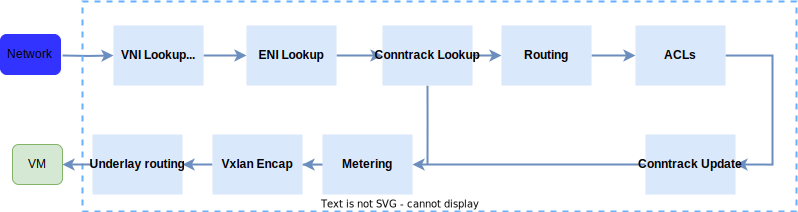
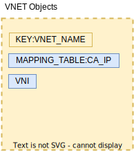

# SONiC-DASH HLD
## High Level Design Document
### Rev 0.7

# Table of Contents

  * [Revision](#revision)

  * [About this Manual](#about-this-manual)

  * [Definitions/Abbreviation](#definitionsabbreviation)
 
  * [1 Requirements Overview](#1-requirements-overview)
    * [1.1 Functional requirements](#11-functional-requirements)
    * [1.2 CLI requirements](#12-cli-requirements)
    * [1.3 Warm Restart requirements ](#13-warm-restart-requirements)
    * [1.4 Scaling requirements ](#14-scaling-requirements)
    * [1.5 Design considerations ](#15-design-considerations)
  * [2 Packet Flows](#2-packet-flows)
  * [3 Modules Design](#3-modules-design)
    * [3.1 Config DB](#31-config-db)
    * [3.2 Dash DB](#32-dash-app-db)
    * [3.3 Module Interaction](#33-module-interaction)
    * [3.4 CLI](#34-cli)
    * [3.5 Test Plan](#35-test-plan)
    * [3.6 Example Configuration](#36-example-configuration)

###### Revision

| Rev |     Date    |       Author          | Change Description                  |
|:---:|:-----------:|:---------------------:|:------------------------------------|
| 0.1 | 02/01/2022  |     Prince Sunny      | Initial version                     |
| 0.2 | 03/09/2022  |     Prince Sunny      | Packet Flows/DB Objects             |
| 0.3 | 05/24/2022  |      Oleksandr        | Memory Footprints                   |
| 0.4 | 06/01/2022  |     Prince Sunny      | Design Considerations               |
| 0.5 | 06/13/2022  |     Chris Sommers     | Schema Relationships                |
| 0.6 | 08/05/2022  |  Mukesh M Velayudhan  | Outbound VNI derivation in pipeline |
| 0.7 | 08/09/2022  |     Prince Sunny      | Add Inbound Routing rules           |
| 0.6 | 04/20/2022  |     Marian Pritsak    | APP_DB to SAI mapping               |
| 0.8 | 09/30/2022  |     Prabhat Aravind   | Update APP_DB table names           |


# About this Manual
This document provides more detailed design of DASH APIs, DASH orchestration agent, Config and APP DB Schemas and other SONiC buildimage changes required to bring up SONiC image on an appliance card. General DASH HLD can be found at [dash_hld](./dash-high-level-design.md).

# Definitions/Abbreviation
###### Table 1: Abbreviations
|                          |                                |
|--------------------------|--------------------------------|
| DASH                     | Disaggregated APIs for SONiC Hosts |
| VNI                      | Vxlan Network Identifier       |
| VTEP                     | Vxlan Tunnel End Point         |
| VNET                     | Virtual Network                |
| ENI                      | Elastic Network Interface      |
| gNMI                     | gRPC Network Management Interface |
| vPORT                    | VM's NIC. Eni, Vnic, VPort are used interchangeably |

# 1 Requirements Overview

## 1.1 Functional requirements

At a high level the following should be supported:
  
- Bringup SONiC image for DEVICE_METADATA subtype - `Appliance`
- Bringup Swss/Syncd containers for switch_type - `dpu`
- Able to program DASH objects configured via gRPC client to appliance card via SAI DASH API

  Phase 1
    - Vnet-Vnet scenario
    - Route/LPM support
    - Underlay IPv4 and IPv6
    - Stateful ACL support
    - TCP state tracking on flows
    - Telemetry and Monitoring

  Phase 2
    - Private Link
    - Service Tunnel
    - Overlay IPv6 
  

## 1.2 CLI requirements
Initial support is only for `show` and `clear` commands

- User shall be able to show the DASH configured objects
- User shall be able to clear state of ENI, VNET or all

## 1.3 Warm Restart requirements
Warm-restart support is not considered in Phase 1. TBD

## 1.4 Scaling requirements
Following are the minimal scaling requirements
| Item                     | Expected value              |
|--------------------------|-----------------------------|
| VNETs                    | 1024                     |
| ENI                      | 64 Per Card              |
| Routes per ENI           | 100k                     |
| NSGs per ENI             | 6                        |
| ACLs per ENI             | 6x100K prefixes          |
| ACLs per ENI             | 6x10K SRC/DST ports      |
| CA-PA Mappings           | 10M                      |
| Active Connections/ENI   | 1M (Bidirectional TCP or UDP)       |

## 1.5 Design Considerations

DASH Sonic implementation is targeted for appliance scenarios and must handles millions of updates. As such, the implementation is performance and scale focussed as compared to traditional switching and routing based solutions. The following are the design considerations.

1. Implementation must support single and bulk update of LPM and CA-PA Mapping tables. 
2. During startup, it is possible to have scaled configurations applied successively. Implementation must support such bulk updates
3. In normal operation, mapping updates can occur as much as 100 mappings/sec
4. In normal operation, route updates can occur every 30 sec. 
5. An add or delete of VM translates to updating ENI and routes in bulk context
6. ACL operations (rules adding/deleting) per group for a stage must be handled atomically and should not have transient drop/forward cases within the group. When a  rule is modified, controller shall send entire rules in the group and Sonic implementation replaces the old set with new set of rules.
7. Implementation must support ability to get all ACL rules/groups based on guid. 
8. In normal operation, mappings churn often followed by routes and least for ACLs.
9. ENIs shall have an admin-state that enables normal connections and forwarding only *after* all configurations for an ENI is applied during initial creation. When the ENI is admin-state down, the packets destined to this ENI shall be dropped. Order of operation/configuration shall be enforced by the controller. Sonic implementation shall honor the state set by controller and ENI shall accept and forward traffic only if the admin-state is set to 'up'. 
10. ENI must support 1M active bi-directional TCP connections or UDP flows however the connection pool can be oversubscribed. An oversubscription of 2:1 would be expected, so the connection pool can be more optimal if executed as one large table where ENI can be a part of the key.
11. During VNET or ENI delete, implementation must support ability to delete all *mappings* or *routes* in a single API call.
12. Add and Delete APIs are idempotent. As an example, deleting an object that doesn't exists shall not return an error. 
13. During a delete operation, if there is a dependency (E.g. mappings still present when a VNET is deleted), implementation shall return *error* and shall not perform any force-deletions or delete dependencies implicitly. 
14. During a bulk operation, if any part/subset of API fails, implementation shall return *error* for the entire API. Sonic implementation shall validate the entire API as pre-checks before applying and return accordingly.
15. Implementation must have flexible memory allocation for ENI and not reserve max scale during initial create (e.g 100k routes). This is to allow oversubscription.
16. Implementation must not have silent failures for APIs. E.g accepting an API from controller, returning success and failing in the backend. This is orthogonal to the idempotency of APIs described above for ADD and Delete operations. Intent is to ensure SDN controller and Sonic implementation is in-sync

# 2 Packet Flows
	
The following section captures at a high-level on the VNET packet flow. Detailed lookup and pipeline behavior can be referenced *here*.

## 2.1 Outbound packet processing pipeline
	
  
	
Based on the incoming packet's VNI matched against the reserved VNI assigned for VM->Appliance, the pipeline shall set the direction as TX(Outbound) and using the inner src-mac, maps to the corresponding ENI.The incoming packet will always be VXLAN encapsulated and outer dst-ip is the appliance VIP. The pipeline shall parse the VNI, and for VM traffic, the VNI shall be a special reserved VNI. Everything else shall be treated as as network traffic(RX). Pipeline shall use VNI to differentiate the traffic to be VM (Inbound) or Network (Outbound).

In the outbound flow, the appliance shall assume it is the first appliance to apply policy. It applies the outbound ACLs in three stages (VNIC, Subnet and VNET), processed in order, with the outcome being the most restrictive of the three ACLs combined. 

After the ACL stage, it does LPM routing based on the inner dst-ip and applies the respective action (encap, subsequent CA-PA mapping). Finally, update the connection tracking table for both inbound and outbound.

The figure below shows how the VNI to be encapsulated in the outgoing packet is derived based on the ENI, outbound routing and outbound CA-PA mapping table lookup in the Dash outbound packet processing pipeline.

  
	
## 2.2 Inbound packet processing pipeline
	
   

Based on the incoming packet's VNI, if it does not match against any reserved VNI, the pipeline shall set the direction as RX(Inbound) and using the inner dst-mac, maps to the corresponding ENI. In the inbound flow, Priority based "Routing Rule" lookup happens based on VNI and optionally SRC PA prefix and maps to a VNET. In other words, the VNET is derived from a VNI key or a combination of VNI key and SRC PA based on the routing rule entry. It is possible that in some cases, two VNETs in different region can have the same VNI key and hence Inbound routing rule shall have both SRC PA prefix and VNI key to uniquely determine the VNET. Using the derived VNET's mapping tables, source PA address is validated against the list of mappings. If the check passes, decap action is performed, else dropped. Note that, PA validation is conditional and routing rule shall specify (say, by a flag) whether to perform PA validation or not as there are some cases like SLB traffic for which PA validation is not required. After route lookup is the three stage ACL, processed in order. ACLs can have multiple src/dst IP ranges or port ranges as match criteria.
	
It is worth noting that CA-PA mapping table shall be used for both encap and decap process
	
# 3 Modules Design

The following are the schema changes. The NorthBound APIs shall be defined as sonic-yang in compliance to [yang-guideline](https://github.com/Azure/SONiC/blob/master/doc/mgmt/SONiC_YANG_Model_Guidelines.md)

For DASH objects, the proposal is to use the existing APP_DB instance and objects are prefixed with "DASH". DASH APP_DB objects are preserved only during warmboots and isolated from regular configurations that are persistent in the appliance across reboots. All the DASH objects are programmed by SDN and hence treated differently from the existing Sonic L2/L3 'switch' DB objects. Status of the configured objects shall be reflected in the corresponding STATE_DB entries. 

## 3.1 Config DB

### 3.1.1 DEVICE Metadata Table

```
"DEVICE_METADATA": {
    "localhost": {
        "subtype": "Appliance",
        "type": "SonicHost",
        "switch_type": "dpu",
        "sub_role": "None"
     }
}
```

## 3.2 DASH APP DB

Following diagram captures the object reference model.

      

### 3.2.1 VNET
  
```
DASH_VNET_TABLE:{{vnet_name}}
    "vni": {{vni}} 
    "guid": {{"string"}}
    "address_spaces": {{[list of addresses]}} (OPTIONAL)
    "peer_list": {{vnet_name_list}} (OPTIONAL)
```

### 3.2.2 QOS
  
```
DASH_QOS_TABLE:{{qos_name}}
    "qos_id": {{string}}
    "bw": {{bw}} 
    "cps": {{cps}}
    "flows": {{flows}}
```
```
key                      = DASH_QOS_TABLE:qos_name ; Qos name as key
; field                  = value 
bw                       = bandwidth in kbps
cps                      = Number of connection per second
flows                    = Number of flows
```

### 3.2.3 ENI
  
```
DASH_ENI_TABLE:{{eni}}
    "eni_id": {{string}}
    "mac_address": {{mac_address}} 
    "qos": {{qos_name}}
    "underlay_ip": {{ip_addr}}
    "admin_state": {{enabled/disabled}}
    "vnet": {{vnet_name}}
```
```
key                      = DASH_ENI_TABLE:eni ; ENI MAC as key
; field                  = value 
mac_address              = MAC address as string
qos                      = Associated Qos profile
underlay_ip              = PA address for Inbound encapsulation to VM
admin_state              = Enabled after all configurations are applied. 
vnet                     = Vnet that ENI belongs to
```
### 3.2.4 ACL
  
```
DASH_ACL_IN_TABLE:{{eni}}:{{stage}}
    "acl_group_id": {{group_id}} 
```
```
DASH_ACL_OUT_TABLE:{{eni}}:{{stage}}
    "acl_group_id": {{group_id}} 
```

```
key                      = DASH_ACL_IN_TABLE:eni:stage ; ENI name and stage as key; ACL stage can be {1, 2, 3 ..}
; field                  = value 
acl_group_id             = ACL group ID
```

```
DASH_ACL_GROUP_TABLE:{{group_id}}
    "ip_version": {{ipv4/ipv6}}
    "guid": {{string}}
```

```
DASH_ACL_RULE_TABLE:{{group_id}}:{{rule_num}}
    "priority": {{priority}}
    "action": {{action}}
    "terminating": {{bool}}
    "protocol": {{list of protocols}}
    "src_addr": {{list of address}}
    "dst_addr": {{list of address}}
    "src_port": {{list of range of ports}}
    "dst_port": {{list of range of ports}}
    
```

```
key                      = DASH_ACL_RULE_TABLE:group_id:rule_num ; unique rule num within the group.
; field                  = value 
priority                 = INT32 value  ; priority of the rule, lower the value, higher the priority
action                   = allow/deny
terminating              = true/false   ; if true, stop processing further rules
protocols                = list of INT ',' separated; E.g. 6-tcp, 17-udp; if not provided, match on all protocols
src_addr                 = list of source ip prefixes ',' separated
dst_addr                 = list of destination ip prefixes ',' separated
src_port                 = list of range of source ports ',' separated
dst_port                 = list of range of destination ports ',' separated
```

### 3.2.5 ROUTING TYPE
	
```
DASH_ROUTING_TYPE_TABLE:{{routing_type}}: [
        "action_name":{{string}}
        "action_type": {{action_type}} 
        "encap_type": {{encap type}} (OPTIONAL)
        "vni": {{vni}} (OPTIONAL)
    ]
```

```
key                      = DASH_ROUTING_TYPE_TABLE:routing_type; routing type can be {direct, vnet, vnet_direct, vnet_encap, appliance, privatelink, privatelinknsg, servicetunnel}; actions can be a list of action_types
; field                  = value
action_name              = action name as string
action_type              = action_type can be {maprouting, direct, staticencap, appliance, 4to6, mapdecap, decap, drop}
encap_type               = encap type depends on the action_type - {vxlan, nvgre}
vni                      = vni value associated with the corresponding action. Applicable if encap_type is specified. 
```

### 3.2.6 APPLIANCE
	
```
DASH_APPLIANCE_TABLE:{{appliance_id}}
    "sip": {{ip_address}}
    "vm_vni": {{vni}}
```

```
key                      = DASH_APPLIANCE_TABLE:id ; attributes specific for the appliance
; field                  = value 
sip                      = source ip address, to be used in encap
vm_vni                   = VM VNI that is used for setting direction. Also used for inbound encap to VM
```

### 3.2.7 ROUTE LPM TABLE - OUTBOUND

``` 
DASH_ROUTE_TABLE:{{eni}}:{{prefix}} 
    "action_type": {{routing_type}} 
    "vnet":{{vnet_name}} (OPTIONAL)
    "appliance":{{appliance_id}} (OPTIONAL)
    "overlay_ip":{{ip_address}} (OPTIONAL)
    "underlay_ip":{{ip_address}} (OPTIONAL)
    "overlay_sip":{{ip_address}} (OPTIONAL)
    "underlay_dip":{{ip_address}} (OPTIONAL)
    "metering_bucket": {{bucket_id}} (OPTIONAL) 
```
  
```
key                      = DASH_ROUTE_TABLE:eni:prefix ; ENI route table with CA prefix for packet Outbound
; field                  = value 
action_type              = routing_type              ; reference to routing type
vnet                     = vnet name                 ; destination vnet name if routing_type is {vnet, vnet_direct}
appliance                = appliance id              ; appliance id if routing_type is {appliance} 
overlay_ip               = ip_address                ; overlay_ip to override if routing_type is {servicetunnel}, overly_ip to lookup if routing_type is {vnet_direct}, use dst ip from packet if not specified
underlay_ip              = ip_address                ; underlay_ip to override if routing_type is {servicetunnel}, use dst ip from packet if not specified
overlay_sip              = ip_address                ; overlay_sip if routing_type is {servicetunnel}  
underlay_sip             = ip_address                ; overlay_sip if routing_type is {servicetunnel}
metering_bucket          = bucket_id                 ; metering and counter
```

### 3.2.8 ROUTE RULE TABLE - INBOUND

``` 
DASH_ROUTE_RULE_TABLE:{{eni}}:{{vni}}:{{prefix}} 
    "action_type": {{routing_type}} 
    "priority": {{priority}}
    "protocol": {{protocol_value}} (OPTIONAL)
    "vnet":{{vnet_name}} (OPTIONAL)
    "pa_validation": {{bool}} (OPTIONAL)
    "metering_bucket": {{bucket_id}} (OPTIONAL) 
```
  
```
key                      = DASH_ROUTE_RULE_TABLE:eni:vni:prefix ; ENI Inbound route table with VNI and optional SRC PA prefix
; field                  = value 
action_type              = routing_type              ; reference to routing type, action can be decap or drop
priority                 = INT32 value               ; priority of the rule, lower the value, higher the priority
protocol                 = INT32 value               ; protocol value of incoming packet to match; 0 (any)
vnet                     = vnet name                 ; mapped VNET for the key vni/pa
pa_validation            = true/false                ; perform PA validation in the mapping table belonging to vnet_name. Default is set to true 
metering_bucket          = bucket_id                 ; metering and counter
```

### 3.2.8 VNET MAPPING TABLE

``` 
DASH_VNET_MAPPING_TABLE:{{vnet}}:{{ip_address}} 
    "routing_type": {{routing_type}} 
    "underlay_ip":{{ip_address}}
    "mac_address":{{mac_address}} (OPTIONAL) 
    "metering_bucket": {{bucket_id}} (OPTIONAL)
    "use_dst_vni": {{bool}} (OPTIONAL)
```
```
key                      = DASH_VNET_MAPPING_TABLE:vnet:ip_address ; CA-PA mapping table for Vnet
; field                  = value 
action_type              = routing_type              ; reference to routing type
underlay_ip              = ip_address                ; PA address for the CA
mac_address              = MAC address as string     ; Inner dst mac
metering_bucket          = bucket_id                 ; metering and counter
use_dst_vni              = bool                      ; if true, use the destination VNET VNI for encap. If false or not specified, use source VNET's VNI
```

### 3.2.9 DASH orchagent (Overlay)

|     APP_DB Table      |      Key      |       Field      |             SAI Attributes/*objects*              |                     Comment                     |
|-----------------------|---------------|------------------|---------------------------------------------------|-------------------------------------------------|
| DASH_APPLIANCE_TABLE  |               |                  |                                                   |                                                 |
|                       | appliance_id  |                  |                                                   |                                                 |
|                       |               | sip              | sai_vip_entry_t.vip                               |                                                 |
|                       |               | vm_vni           | sai_direction_lookup_entry_t.VNI                  |                                                 |
| DASH_VNET_TABLE       |               |                  | *SAI_OBJECT_TYPE_VNET*                            |                                                 |
|                       | vnet_name     |                  |                                                   |                                                 |
|                       |               | vxlan_tunnel     |                                                   | VxLAN tunnel won't be used                      |
|                       |               | vni              | SAI_VNET_ATTR_VNI                                 |                                                 |
|                       |               | guid             |                                                   | Not relevant                                    |
|                       |               | address_spaces   |                                                   |                                                 |
|                       |               | peer_list        |                                                   |                                                 |
| DASH_QOS_TABLE        |               |                  |                                                   |                                                 |
|                       | qos_name      |                  |                                                   |                                                 |
|                       |               | qos_id           |                                                   |                                                 |
|                       |               | bw               | SAI_ENI_ATTR_PPS                                  |                                                 |
|                       |               | cps              | SAI_ENI_ATTR_CPS                                  |                                                 |
|                       |               | flows            | SAI_ENI_ATTR_FLOWS                                |                                                 |
| DASH_ENI_TABLE        |               |                  | *SAI_OBJECT_TYPE_ENI*                             |                                                 |
|                       | eni           |                  |                                                   |                                                 |
|                       |               | eni_id*          | SAI_ENI_ETHER_ADDRESS_MAP_ENTRY_ATTR_ENI_ID       |                                                 |
|                       |               | mac_address*     | sai_eni_ether_address_map_entry_t.address         |                                                 |
|                       |               | eni_id**         | sai_outbound_eni_to_vni_entry_t.ENI               |                                                 |
|                       |               | qos              |                                                   |                                                 |
|                       |               | vnet**           | SAI_ENI_ATTR_VNET_ID                              | VNET object ID                                  |
| DASH_ACL_V4_IN_TABLE  |               |                  |                                                   | Same for V6                                     |
|                       | eni           |                  |                                                   |                                                 |
|                       |               | stage            | SAI_ENI_ATTR_INBOUND_V4_stage_DASH_ACL_GROUP_ID   | STAGE1..STAGE5                                  |
|                       |               | acl_group_id     | SAI_ENI_ATTR_INBOUND_V4_stage_DASH_ACL_GROUP_ID   |                                                 |
| DASH_ACL_GROUP_TABLE  |               |                  | *SAI_OBJECT_TYPE_DASH_ACL_GROUP*                  |                                                 |
|                       | group_id      |                  |                                                   |                                                 |
|                       |               | ip_version       | SAI_DASH_ACL_GROUP_ATTR_IP_ADDR_FAMILY            |                                                 |
| DASH_ACL_RULE_TABLE   |               |                  | *SAI_OBJECT_TYPE_DASH_ACL_RULE*                   |                                                 |
|                       | group_id      |                  | SAI_DASH_ACL_RULE_ATTR_GROUP_ID                   |                                                 |
|                       | rule_num      |                  |                                                   |                                                 |
|                       |               | priority         | SAI_DASH_ACL_RULE_ATTR_PRIORITY                   |                                                 |
|                       |               | action           | SAI_DASH_ACL_RULE_ATTR_ACTION                     |                                                 |
|                       |               | terminating      | SAI_DASH_ACL_RULE_ATTR_ACTION                     | AND_CONTINUE if not terminating                 |
|                       |               | protocol         | SAI_DASH_ACL_RULE_ATTR_PROTOCOL                   |                                                 |
|                       |               | src_addr         | SAI_DASH_ACL_RULE_ATTR_SIP                        |                                                 |
|                       |               | dst_addr         | SAI_DASH_ACL_RULE_ATTR_DIP                        |                                                 |
|                       |               | dst_port         | SAI_DASH_ACL_RULE_ATTR_DST_PORT                   |                                                 |
|                       |               | src_port         | SAI_DASH_ACL_RULE_ATTR_SRC_PORT                   |                                                 |
| DASH_ROUTE_TABLE      |               |                  |                                                   |                                                 |
|                       | eni           |                  | sai_outbound_routing_entry_t.ENI                  |                                                 |
|                       | prefix        |                  | sai_outbound_routing_entry_t.destination          |                                                 |
|                       |               | action_type      |                                                   | Need action type for future cases               |
|                       |               | vnet             | SAI_OUTBOUND_ROUTING_ENTRY_ATTR_DEST_VNET_VNI     | VNI value taken from DASH_VNET table            |
|                       |               | appliance        |                                                   | Not supported yet                               |
|                       |               | overlay_ip       | SAI_OUTBOUND_ROUTING_ENTRY_ATTR_OVERLAY_IP        |                                                 |
|                       |               | underlay_ip      |                                                   | Not supported yet                               |
|                       |               | overlay_sip      |                                                   | Not supported yet                               |
|                       |               | underlay_dip     |                                                   | Not supported yet                               |
|                       |               | customer_addr    |                                                   | Not supported yet                               |
|                       |               | metering_bucket  | SAI_OUTBOUND_ROUTING_ENTRY_ATTR_COUNTER_ID        |                                                 |
| DASH_MAPPING_TABLE    |               |                  |                                                   |                                                 |
|                       | vnet          |                  | sai_outbound_ca_to_pa_entry_t.dest_vni            | VNET's VNI                                      |
|                       | ip_address    |                  | sai_outbound_ca_to_pa_entry_t.dip                 |                                                 |
|                       |               | routing_type     |                                                   |                                                 |
|                       |               | underlay_ip      | SAI_OUTBOUND_CA_TO_PA_ENTRY_ATTR_UNDERLAY_DIP     |                                                 |
|                       |               | mac_address      | SAI_OUTBOUND_CA_TO_PA_ENTRY_ATTR_OVERLAY_DMAC     |                                                 |
|                       |               | metering_bucket  | SAI_OUTBOUND_CA_TO_PA_ENTRY_ATTR_COUNTER_ID       |                                                 |
|                       | vnet*         |                  | sai_pa_validation_entry_t.vnet_id                 | VNET's VNI                                      |
|                       |               | underlay_ip*     | sai_pa_validation_entry_t.sip                     | SAI_PA_VALIDATION_ENTRY_ATTR_ACTION is permit   |
| DASH_ROUTE_RULE_TABLE |               |                  |                                                   |                                                 |
|                       | eni           |                  | sai_inbound_routing_entry_t.eni_id                |                                                 |
|                       | vni           |                  | sai_inbound_routing_entry_t.vni                   |                                                 |
|                       | prefix        |                  | sai_inbound_routing_entry_t.prefix                |                                                 |
|                       |               | action_type      |                                                   |                                                 |
|                       |               | priority         | sai_inbound_routing_entry_t.priority              |                                                 |
|                       |               | protocol         |                                                   |                                                 |
|                       |               | vnet             | SAI_INBOUND_ROUTING_ENTRY_ATTR_SRC_VNET_ID        |                                                 |
|                       |               | pa_validation    | SAI_INBOUND_ROUTING_ENTRY_ATTR_ACTION             | use PA_VALIDATE if true                         |
|                       |               | metering_bucket  |                                                   |                                                 |


## 3.3 Module Interaction

A high-level module interaction is captured in the following diagram.

  


### 3.3.1 DASH Schema Relationships
The [figure below](#schema_relationships) illustrates the various schema and their transformations into the various SONiC layers, including:
* gNMI northbound API, which uses YANG to specify schema
* Redis APP_DB, which uses [ABNF](https://github.com/Azure/SONiC/blob/master/doc/mgmt/Management%20Framework.md#12-design-overview) schema definition language. Redis objects can be directly manipulated using [SAI-redis](https://github.com/Azure/sonic-sairedis) clients.
* JSON import/export formats
* [SAI](https://github.com/Azure/DASH/tree/main/SAI) table and attribute objects

#### Canonical Test Data and schema transformations
For testing purposes, it is convenient to express test configurations in a single canonical format, and use this to drive the different API layers to verify correct behavior. A tentative JSON format for representing DASH service configurations is described in [Reference configuration example (JSON)](../gnmi/dash-reference-config-example.md). Test drivers can accept this input, transform it into different schemas and drive the associated interfaces. For example, a JSON representation of an ACL rule can be transformed into gNMI API calls, SAI-redis calls, SAI-thrift calls, etc.

### Figure - Schema Relationships


### 3.3.2 SONiC host containers

The following containers shall be enabled for SONiC host and part of the image. Switch specific containers shall be disabled for the image built for the appliance card.
  
| Container/Feature Name   | Is Enabled?     |
|--------------------------|-----------------|
|	SNMP | Yes |
|	Telemetry	| Yes |
|	LLDP | Yes |
|	Syncd |	Yes |
|	Swss | Yes |
|	Database | Yes |
|	BGP | Yes |
|	Teamd	| No |
|	Pmon | Yes |
|	Nat | No |
|	Sflow | No |
|	DHCP Relay | No |
|	Radv | No |
|	Macsec | No |
|	Resttapi | No |
|	gNMI | Yes |

### 3.3.3 DASHOrch (Overlay)
A new orchestration agent "dashorch" shall be implemented that subscribes to DASH APP DB objects and programs the ASIC_DB via the SAI DASH API. DASHOrch shall have sub-orchestrations to handle ACLs, Routes, CA-PA mappings. DASH orchestration agent shall write the state of each tables to STATEDB that applications shall utilize to fetch the programmed status of configured objects.
  
DASH APIs shall be exposed as gNMI interface and part of the SONiC gNMI container. Clients shall configure the SONiC via gRPC get/set calls. gNMI container has the config backend to translate/write DASH objects to CONFIG_DB and/or DASH APP_DB.

### 3.3.4 SWSS Lite (Underlay)
SONiC for DASH shall have a lite swss initialization without the heavy-lift of existing switch based orchestration agents that SONiC currently have. The initialization shall be based on switch_type "dpu". For the underlay support, the following SAI APIs are expected to be supported:
  
| Component                | SAI attribute                                         |
|--------------------------|-------------------------------------------------------|
| Host Interface           | SAI_HOSTIF_ATTR_NAME |
|                          | SAI_HOSTIF_ATTR_OBJ_ID |
|                          | SAI_HOSTIF_ATTR_TYPE |
|                          | SAI_HOSTIF_ATTR_OPER_STATUS |
|                          | SAI_HOSTIF_TABLE_ENTRY_ATTR_CHANNEL_TYPE |
|                          | SAI_HOSTIF_TABLE_ENTRY_ATTR_HOST_IF |
|                          | SAI_HOSTIF_TABLE_ENTRY_ATTR_TRAP_ID |
|                          | SAI_HOSTIF_TABLE_ENTRY_ATTR_TYPE |
|                          | SAI_HOSTIF_TRAP_ATTR_PACKET_ACTION |
|                          | SAI_HOSTIF_TRAP_ATTR_TRAP_GROUP |
|                          | SAI_HOSTIF_TRAP_ATTR_TRAP_PRIORITY |
|                          | SAI_HOSTIF_TRAP_ATTR_TRAP_TYPE |
|                          | SAI_HOSTIF_TRAP_GROUP_ATTR_POLICER |
|                          | SAI_HOSTIF_TRAP_GROUP_ATTR_QUEUE | 
| Neighbor                 | SAI_NEIGHBOR_ENTRY_ATTR_DST_MAC_ADDRESS |
| Nexthop                  | SAI_NEXT_HOP_ATTR_IP  | 
|                          | SAI_NEXT_HOP_ATTR_ROUTER_INTERFACE_ID  | 
|                          | SAI_NEXT_HOP_ATTR_TYPE  |
| Packet                   | SAI_PACKET_ACTION_FORWARD  | 
|                          | SAI_PACKET_ACTION_TRAP  | 
|                          | SAI_PACKET_ACTION_DROP  | 
| Policer                  | SAI_POLICER_ATTR_CBS |
|                          | SAI_POLICER_ATTR_CIR |
|                          | SAI_POLICER_ATTR_COLOR_SOURCE |
|                          | SAI_POLICER_ATTR_GREEN_PACKET_ACTION |
|                          | SAI_POLICER_ATTR_METER_TYPE |
|                          | SAI_POLICER_ATTR_MODE |
|                          | SAI_POLICER_ATTR_PBS  |      
|                          | SAI_POLICER_ATTR_PIR  |  
|                          | SAI_POLICER_ATTR_RED_PACKET_ACTION  |  
|                          | SAI_POLICER_ATTR_YELLOW_PACKET_ACTION  |  
| Port                     | SAI_PORT_ATTR_ADMIN_STATE  |  
|                          | SAI_PORT_ATTR_ADVERTISED_AUTO_NEG_MODE  |  
|                          | SAI_PORT_ATTR_ADVERTISED_FEC_MODE  |  
|                          | SAI_PORT_ATTR_ADVERTISED_INTERFACE_TYPE  |  
|                          | SAI_PORT_ATTR_ADVERTISED_MEDIA_TYPE  |  
|                          | SAI_PORT_ATTR_ADVERTISED_SPEED
|                          | SAI_PORT_ATTR_AUTO_NEG_MODE  |  
|                          | SAI_PORT_ATTR_FEC_MODE  |  
|                          | SAI_PORT_ATTR_HW_LANE_LIST  |  
|                          | SAI_PORT_ATTR_INTERFACE_TYPE  |  
|                          | SAI_PORT_ATTR_MTU  |  
|                          | SAI_PORT_ATTR_OPER_SPEED  |  
|                          | SAI_PORT_ATTR_OPER_STATUS  |  
|                          | SAI_PORT_ATTR_SPEED  |  
|                          | SAI_PORT_ATTR_SUPPORTED_SPEED |
| RIF                      | SAI_ROUTER_INTERFACE_ATTR_ADMIN_V4_STATE  |  
|                          | SAI_ROUTER_INTERFACE_ATTR_ADMIN_V6_STATE  |  
|                          | SAI_ROUTER_INTERFACE_ATTR_MTU  |
|                          | SAI_ROUTER_INTERFACE_ATTR_PORT_ID  |
|                          | SAI_ROUTER_INTERFACE_ATTR_TYPE  |  
|                          | SAI_ROUTER_INTERFACE_ATTR_VIRTUAL_ROUTER_ID  |  
| Route                    | SAI_ROUTE_ENTRY_ATTR_NEXT_HOP_ID  |  
|                          | SAI_ROUTE_ENTRY_ATTR_PACKET_ACTION  |  
| Switch                   | SAI_SWITCH_ATTR_CPU_PORT  |  
|                          | SAI_SWITCH_ATTR_DEFAULT_TRAP_GROUP  |  
|                          | SAI_SWITCH_ATTR_DEFAULT_VIRTUAL_ROUTER_ID  |
|                          | SAI_SWITCH_ATTR_DEFAULT_VLAN_ID  |
|                          | SAI_SWITCH_ATTR_ECMP_DEFAULT_HASH_SEED |
|                          | SAI_SWITCH_ATTR_INIT_SWITCH  |  
|                          | SAI_SWITCH_ATTR_PORT_LIST  |  
|                          | SAI_SWITCH_ATTR_PORT_NUMBER  |  
|                          | SAI_SWITCH_ATTR_PORT_STATE_CHANGE_NOTIFY  |  
|                          | SAI_SWITCH_ATTR_SHUTDOWN_REQUEST_NOTIFY  |  
|                          | SAI_SWITCH_ATTR_SRC_MAC_ADDRESS |
|                          | SAI_SWITCH_ATTR_SWITCH_ID   |  
|                          | SAI_SWITCH_ATTR_TYPE  |  
|                          | SAI_SWITCH_ATTR_VXLAN_DEFAULT_PORT  |  
|                          | SAI_SWITCH_ATTR_VXLAN_DEFAULT_ROUTER_MAC |  

### 3.3.5 Underlay Routing
DASH Appliance shall establish BGP session with the connected ToR and advertise the prefixes (VIP PA). In turn, the ToR shall advertise default route to appliance. With two ToRs connected, the appliance shall have route with gateway towards both ToRs and does ECMP routing. Orchagent install the route and resolves the neighbor (GW) mac and programs the underlay route/nexthop and neighbor. In the absence of a default-route, appliance shall send the packet back on the same port towards the receiving ToR and can derive the underlay dst mac from the src mac of the received packet or from the neighbor entry (IP/MAC) associated with the port. 

### 3.3.6 Memory footprints

#### 3.3.6.1 SONiC  memory usage

| Running components | Memory usage |
|--|--|
|Base Debian OS  | 159MB |
|Base Debian OS + docker containers | 1.3GB |

#### 3.3.6.2 SONiC docker containers memory usage

|Container| Memory usage |
|--|--|
| snmp | 52.5MB |
| telemetry | 88.38MB |
| lldp | 57.07MB |
| syncd\* | 36.36MB |
| swss | 53.5MB |
| bgp | 74.66MB |
| pmon\* | 108.1MB |
| database | 83.56MB |

\* These containers have vendor-specific components. Their memory usage will vary from vendor to vendor.

## 3.4 CLI

The following commands shall be added :

```
	- show dash eni <eni>
	- show dash eni <eni> routes all
	- show dash eni <eni> acls stage <ingress/egress/all>
	- show dash vnet <vnet>
	- show dash vnet <vnet> mappings
	- show dash route-types
	- show dash qos
	- show dash vnet brief
	- sonic-clear dash all
	- sonic-clear dash eni <eni>
	- sonic-clear dash vnet <vnet>
```

## 3.5 Test Plan

Refer DASH documentation for the test plan. 

## 3.6 Example configuration

```
[
    {
        "DASH_VNET_TABLE:Vnet1": {
            "vni": "45654",
            "guid": "559c6ce8-26ab-4193-b946-ccc6e8f930b2"
        },
        "OP": "SET"
    },
    {
        "DASH_ENI_TABLE:F4939FEFC47E": {
	    "eni_id": "497f23d7-f0ac-4c99-a98f-59b470e8c7bd",
	    "mac_address": "F4-93-9F-EF-C4-7E",
	    "underlay_ip": "25.1.1.1",
	    "admin_state": "enabled",
	    "vnet": "Vnet1"
        },
        "OP": "SET"
    },
    {
        "DASH_ROUTING_TYPE_TABLE:vnet": {
            "name": "action1",
            "action_type": "maprouting"
        },
        "OP": "SET"
    },
    {
        "DASH_ROUTING_TYPE_TABLE:vnet_direct": {
            "name": "action1",
            "action_type": "maprouting"
        },
        "OP": "SET"
    },
    {
        "DASH_ROUTING_TYPE_TABLE:vnet_encap": {
             "name": "action1",
             "action_type": "staticencap",
             "encap_type": "vxlan"
        },
        "OP": "SET"
    },
    {
        "DASH_ROUTE_TABLE:F4939FEFC47E:10.1.0.0/16": {
            "action_type":"vnet",
            "vnet":"Vnet1"
        },
        "OP": "SET"
    },
    {
        "DASH_ROUTE_TABLE:F4939FEFC47E:10.1.0.0/24": {
            "action_type":"vnet_direct",
            "vnet":"Vnet1",
            "overlay_ip":"10.0.0.6"
        },
        "OP": "SET"
    },
    {
        "DASH_ROUTE_TABLE:F4939FEFC47E:10.2.5.0/24": {
            "action_type":"drop"
        },
        "OP": "SET"
    },
    {
        "DASH_VNET_MAPPING_TABLE:Vnet1:10.0.0.6": {
            "routing_type":"vnet_encap",
            "underlay_ip":"2601:12:7a:1::1234",
            "mac_address":"F9-22-83-99-22-A2"
        },
        "OP": "SET"
    },
    {
        "DASH_VNET_MAPPING_TABLE:Vnet1:10.0.0.5": {
            "routing_type":"vnet_encap",
            "underlay_ip":"100.1.2.3",
            "mac_address":"F9-22-83-99-22-A2"
        },
        "OP": "SET"
    },
    {
        "DASH_VNET_MAPPING_TABLE:Vnet1:10.1.1.1": {
            "routing_type":"vnet_encap",
            "underlay_ip":"101.1.2.3",
            "mac_address":"F9-22-83-99-22-A2"
        },
        "OP": "SET"
    }
]

```

For the example configuration above, the following is a brief explanation of lookup behavior in the outbound direction:

	1. Packet destined to 10.1.1.1:
		a. LPM lookup hits for entry 10.1.0.0/16
		b. The action in this case is "vnet" and the routing type for "vnet" is "maprouting"
		c. Next lookup shall happen on the "mapping" table for Vnet "Vnet1"
		d. Mapping table for 10.1.1.1 shall be hit and it takes the action "vnet_encap". 
		e. Encap action shall be performed and use PA address as specified by "underlay_ip"
	2. Packet destined to 10.1.0.1:
		a. LPM lookup hits for entry 10.1.0.0/24
		b. The action in this case is "vnet_direct" and the routing type for "vnet" is "maprouting", with overlay_ip specified
		c. Next lookup shall happen on the "mapping" table for Vnet "Vnet1", but for overlay_ip 10.0.0.6
		d. Mapping table for 10.0.0.6 shall be hit and it takes the action "vnet_encap". 
		e. Encap action shall be performed and use PA address as specified by "underlay_ip"
	3. Packet destined to 30.0.0.1
		a. LPM lookup hits for entry 30.0.0.0/16
		b. The action in this case is "direct". 
		c. Direct routing happens without any further encapsulation
	4. Packet destined to 10.2.5.1
		a. LPM lookup hits for entry 10.2.5.0/24
		b. The action in this case is "drop". 
		c. Packets gets dropped
	
For the inbound direction, after Route/ACL lookup, pipeline shall use the "underlay_ip" as specified in the ENI table to VXLAN encapsulate the packet and VNI shall be the ```vm_vni``` specified in the APPLIANCE table 
