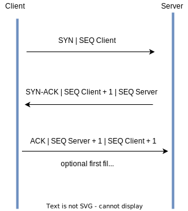

# Handling of Fragments

- [Background](#background)
  - [Protocol formats](#protocol-formats)
    - [IP header format](#ip-header-format)
    - [UDP header format](#udp-header-format)
    - [TCP header format](#tcp-header-format)
  - [Fragmentation contextual information](#fragmentation-contextual-information)
- [Issues and Nuances](#issues-and-nuances)
- [PUSH Flag](#push-flag)
- [Do Not Fragment Flag](#do-not-fragment-flag)
- [References](#references)

## Background

### Protocol formats

The information in this section is a quick reminder of the protocol formats.
#### IP header format

The **Internet Protocol** (IP) is designed for use in interconnected systems of
packet-switched computer communication networks. It provides for transmitting
blocks of data called datagrams from sources to destinations, where sources and
destinations are hosts identified by fixed length addresses.  The internet
protocol also provides for **fragmentation** and reassembly of long datagrams,
if necessary, for transmission through *small packet* networks.The figure below
shows the IP header format. For more information, see [RFC
791 - Internet Protocol](https://datatracker.ietf.org/doc/html/rfc791#section-3.1).

```
0                   1                   2                   3
0 1 2 3 4 5 6 7 8 9 0 1 2 3 4 5 6 7 8 9 0 1 2 3 4 5 6 7 8 9 0 1
+-+-+-+-+-+-+-+-+-+-+-+-+-+-+-+-+-+-+-+-+-+-+-+-+-+-+-+-+-+-+-+-+
|Version|  IHL  |Type of Service|          Total Length         |
+-+-+-+-+-+-+-+-+-+-+-+-+-+-+-+-+-+-+-+-+-+-+-+-+-+-+-+-+-+-+-+-+
|         Identification        |Flags|      Fragment Offset    |
+-+-+-+-+-+-+-+-+-+-+-+-+-+-+-+-+-+-+-+-+-+-+-+-+-+-+-+-+-+-+-+-+
|  Time to Live |    Protocol   |         Header Checksum       |
+-+-+-+-+-+-+-+-+-+-+-+-+-+-+-+-+-+-+-+-+-+-+-+-+-+-+-+-+-+-+-+-+
|                       Source Address                          |
+-+-+-+-+-+-+-+-+-+-+-+-+-+-+-+-+-+-+-+-+-+-+-+-+-+-+-+-+-+-+-+-+
|                    Destination Address                        |
+-+-+-+-+-+-+-+-+-+-+-+-+-+-+-+-+-+-+-+-+-+-+-+-+-+-+-+-+-+-+-+-+
|                    Options                    |    Padding    |
+-+-+-+-+-+-+-+-+-+-+-+-+-+-+-+-+-+-+-+-+-+-+-+-+-+-+-+-+-+-+-+-+
```
<figcaption><b><i>IP header format</i></b></figcaption><br/><br/>

The options may appear or not in datagrams.  They must be implemented by all IP
modules (host and gateways).  What is optional is their transmission in any
particular datagram, not their implementation. For more information, see [RFC
791 - Internet Protocol](https://datatracker.ietf.org/doc/html/rfc791#section-3.1), page 14.

Notice also when fragmentation occurs, some options are copied, but others remain with the first fragment only. For more information, see [RFC
791 - Internet Protocol](https://datatracker.ietf.org/doc/html/rfc791#section-3.1), page 24.
#### UDP header format

The **User Datagram  Protocol** (UDP) provides a datagram mode in
packet-switched computer communication networks, and in interconnected systems
of such networks. This protocol assumes  that the Internet  Protocol  (IP) is
used as the underlying protocol.

This protocol  provides  a procedure  for application  programs  to send
messages  to other programs  with a minimum  of protocol mechanism.  The
protocol  is transaction oriented, and delivery and duplicate protection are not
guaranteed. The figure below shows the UDP header format. For more information, see [RFC 768 - User Datagram Protocol](https://datatracker.ietf.org/doc/html/rfc768).

```
0      7 8     15 16    23 24    31
+--------+--------+--------+--------+
|     Source      |   Destination   |
|      Port       |      Port       |
+--------+--------+--------+--------+
|                 |                 |
|     Length      |    Checksum     |
+--------+--------+--------+--------+
|
|          data octets ...
+---------------- ...
```
<figcaption><b><i>UDP header format</i></b></figcaption> <br/>

#### TCP header format

The **Transmission Control Protocol** (TCP) is intended for use as a highly
reliable host-to-host protocol between hosts in packet-switched computer
communication networks, and in interconnected systems of such networks.

The figure below shows the TCP header format. For more information, see [RFC 793 - Transmission Control Protocol](https://datatracker.ietf.org/doc/html/rfc793#section-3.1).


```
0                   1                   2                   3
0 1 2 3 4 5 6 7 8 9 0 1 2 3 4 5 6 7 8 9 0 1 2 3 4 5 6 7 8 9 0 1
+-+-+-+-+-+-+-+-+-+-+-+-+-+-+-+-+-+-+-+-+-+-+-+-+-+-+-+-+-+-+-+-+
|          Source Port          |       Destination Port        |
+-+-+-+-+-+-+-+-+-+-+-+-+-+-+-+-+-+-+-+-+-+-+-+-+-+-+-+-+-+-+-+-+
|                        Sequence Number                        |
+-+-+-+-+-+-+-+-+-+-+-+-+-+-+-+-+-+-+-+-+-+-+-+-+-+-+-+-+-+-+-+-+
|                    Acknowledgment Number                      |
+-+-+-+-+-+-+-+-+-+-+-+-+-+-+-+-+-+-+-+-+-+-+-+-+-+-+-+-+-+-+-+-+
|  Data |           |U|A|P|R|S|F|                               |
| Offset| Reserved  |R|C|S|S|Y|I|            Window             |
|       |           |G|K|H|T|N|N|                               |
+-+-+-+-+-+-+-+-+-+-+-+-+-+-+-+-+-+-+-+-+-+-+-+-+-+-+-+-+-+-+-+-+
|           Checksum            |         Urgent Pointer        |
+-+-+-+-+-+-+-+-+-+-+-+-+-+-+-+-+-+-+-+-+-+-+-+-+-+-+-+-+-+-+-+-+
|                    Options                    |    Padding    |
+-+-+-+-+-+-+-+-+-+-+-+-+-+-+-+-+-+-+-+-+-+-+-+-+-+-+-+-+-+-+-+-+
|                             data                              |
+-+-+-+-+-+-+-+-+-+-+-+-+-+-+-+-+-+-+-+-+-+-+-+-+-+-+-+-+-+-+-+-+
```
<figcaption><b><i>TCP header format</i></b></figcaption> <br/>

### Fragmentation contextual information

1. After a connection has been identified and processed it should
result in an **entry** into the **flow table** to **enable fast path
processing** for the duration of the connection.

1. If a subsequent packet arrives that is the start of a fragmented packet
a **new temporal flow** should be created that can be
**uniquely identified** by the (**Frag ID**, **DST**, **SRC**, **Protocol ID**) tuple.

1. The fragment temporal flow should be **maintained until the last fragment arrives** OR
the flow is **aged** OR the connection is **closed**.

1. Fragment temporal flows should be removed after receiving the last packet of the 
fragmented frame. This is the most efficient way to keep temporal flows from consuming
flow table resources which are finite and in practice consume a large amount of memory. 

1. The aging of a stale temporal flow **should be different than the aging of TCP connections or 
UDP flows** as the packets are generated over a small period of time and should
arrive fairly close together. Stale temporal flows should be removed quickly as the
flow table is a finite resource that can be depleted. This 
is especially true when connections or UDP flows are arriving in the range of millions/sec. A
background or garbage collection task could be used for this purpose coupled with other
table management functions. The stale time-out period should be programmable per ENI.

1. It is also possible to have **several frames in flight** and hence there may
be **several temporal flows**, however they can be **uniquely identified** by
the (Frag ID, DST, SRC, Protocol ID) tuple as each frame will have a different Frag ID.

1. Although this will result in more flow entries **these flows will likely live
for `usecs/msec`** and can be aged much quicker than a connection.

1. If the connection is closed with the arrival of the **FIN packet** then all
**temporal flows must be closed** as well.

## Stats/Counters
The temporal flow should also support packet and byte counters.  This data should
be rolled/added back into the original/parent flow once the temporal flow is removed.

## Other considerations

1.  When a first fragment (with L4 header) arrives, a new temporal flow should be created.
This temporal flow should be associated (need to maintain some state) with the
**original/parent** flow against which the first fragment was matched.  
If the connection is terminated, all temporal flows should be terminated as well.  

1.  If the second fragment (first packet without L4 header and non-zero fragment offset)
arrives before the first fragment, the packet will be dropped and no temporal flow will be created.  

**Q**:  Since there is no 5-tuple information available, against which
**bucket** will we count these drop packets in the slow path or count out of order packets?

## Issues and Nuances

1. A connection that is reset should also result in the related
    connection flow including the temporal flows being closed.

    - 10-15% of all connections are ended with **RST** and **NOT FIN**.
    - Once a RST is set the only response to packets is RST.
    - There could be packets in flight so you may see another RST.
    - This may be the reason why VFP for example does not close connections
    immediately and waits for at least a round trip delay.
    - If we do not wait it is possible to black hole subsequent RSTs which could
    result in suboptimal connection performance at the end points

      <figcaption><b><i>Connection aborting</i></b></figcaption> 

       
     

1. Also, if the first packet comes in out of order then the fragments belonging
   to the same packet would be **dropped** as they **do not contain Layer-4
   information** and it **would not have an entry in the temporal flow table**.

    - Fortunately, as everything coming/going between VMs is **encapsulated
      within VXLAN** or methods, **out of order packets are unlikely (and again, they need to be dropped)** as
      switches/routers do not misorder frames of a single L4 flow.
    - The encapsulated packet will look like a **single L4 flow** to a
      router/switch. 
    - > **Also, to be clear, Azure does not support out-of-order packets. They
        are dropped primarily due to security concerns with Nov 2018
        FragmentSmack attacks and for the stated reasons above which should make
        them very unlikely in the first place as a natural occurrence.**

        <figcaption><b><i>Connection creation and deletion</i></b></figcaption>

        | Connection Creation  | Connection Deletion  |
        |-------------------|----------------------|
        ||| 
        

1. Questions may remain on whether to create a flow on the **SYN** regardless of
   the three-way handshake **SYN/SYN-ACK/ACK**.

   - There seems to be no reason to wait for the three way handshake
     SYN/SYN-ACK/ACK as we need to allow for the all subsequent control frames
     to flow through to the end points.

   - If the connection is not formed then a **reset** should be received or
     worst case the connection will be **aged out**.

   - There should also be a **SYN** policer that is imposed on an **ENI basis**
     to prevent denial of service.

1. Questions remain on whether to delete a flow on the **FIN**. 

   - For closing we need to keep the flow alive until we see both directions
     closed.

   - This means that **state must be kept** to transition to **FIN/ACK/FIN/ACK**
     to close the connection in both directions or worst case the connection
     will be aged out.

> [!WARNING] The behavior model needs to be updated to include the above
> behaviors so that standard IP conformance testers can validate the proper
> operation and so that fuzzing can also be applied looking for holes in the
> implementation.

## PUSH Flag

1. Because the appliances are not reassembling frames nor terminating user
   frames there is no need to provide any action whether the **PUSH flag** is
   set or not.
   
 ## URGENT Flag
 
 1. As Appliances are wire-rate, this flag can be ignored unless destined for the Operating System which is out of scope for this document.

## Do Not Fragment Flag

1. Although it is possible for an appliance to fragment packets we see no useful
    reason to do so. If the end points need to fragment, it is **out of the scope
    of bump-in-wire services** providing policy enforcement and switching.

1. In general **DASH is not covering use cases that require re-assembly of frames**
    as the primary purpose is to be transparent to the end points.

## References 

- [RFC 791 - Internet Protocol](https://datatracker.ietf.org/doc/html/rfc791)
- [RFC 768 - User Datagram Protocol](https://datatracker.ietf.org/doc/html/rfc768)
- [RFC 793 - Transmission Control Protocol](https://datatracker.ietf.org/doc/html/rfc793)
