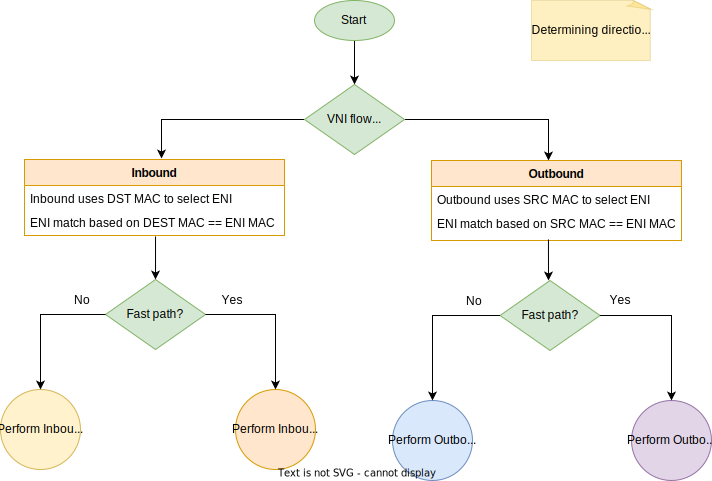
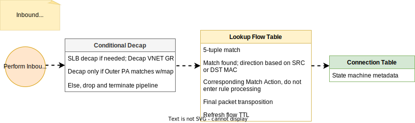

[<< Back to parent directory](../README.md) ]

[<< Back to DASH top-level Documents](../../README.md#contents) ]

# Packet direction flow and transforms

- [Packet flow - selecting packet direction](#packet-flow---selecting-packet-direction)
- [Packet flow - selecting packet path](#packet-flow---selecting-packet-path)
  - [Fast path](#fast-path)
    - [Inbound fast path](#inbound-fast-path)
    - [Outbound fast path](#outbound-fast-path)
  - [Slow path](#slow-path)
    - [Inbound slow path](#inbound-slow-path)
    - [Outbound slow path](#outbound-slow-path)
- [Packet processing pipeline (sequential prefix match lookups)](#packet-processing-pipeline-sequential-prefix-match-lookups)
  - [ACL](#acl)
    - [ACL levels](#acl-levels)
    - [ACL rules](#acl-rules)
    - [ACL actions](#acl-actions)
- [Packet transforms](#packet-transforms)
  - [VM to VM (in VNET) communication](#vm-to-vm-in-vnet-communication)
  - [Internal Load balancer (in VNET) communication](#internal-load-balancer-in-vnet-communication)
  - [Private Link](#private-link)
  - [Private Link Service](#private-link-service)
  - [Service Tunneling](#service-tunneling)
  - [Inbound from LB](#inbound-from-lb)
  - [Outbound NAT - L4](#outbound-nat---l4)
- [References](#references)

## Packet flow - selecting packet direction

On receiving a packet from the wire, the SDN appliance will determine the **packet direction**, **matching ENI**, and **packet processing strategy** based on *Encap Transformation and Rules Evaluation*. See also [2 Packet Flows](dash-sonic-hld.md#2-packet-flows) in the *SONiC-DASH integration high level design* document. 

- **Packet direction**. It is evaluated based on the most-outer **VNI** lookup (implementation dependent) from the left-side (see figure below, a DASH optimized VM sending Outbound packets) behind the Appliance.  If there is no match, the direction is Inbound.

- **ENI selection**. Outbound uses source-MAC, Inbound uses destination-MAC
- **SLB decap** if packet was encapped by SLB.
- **Decap VNET** GRE key

The following figure shows the preliminary steps to determine the packet direction prior to selecting a fast or slow path.

## Packet flow - selecting packet path

For the **first packet** of a TCP flow, the **slow path** is selected, running the transposition engine and matching at each layer.  
For **subsequent packets**, the **fast path** is selected,
matching a unified flow via UFID and applying a transposition directly against rules.

### Fast path

Once the ENI is matched, the packet is first matched with flow table to check whether an existing flow already matches.  If a flow match is found (**fast path**), a corresponding match action is executed without entering into rule processing. Flow match direction is identified based on source and destination MAC.

#### Inbound fast path

  

#### Outbound fast path

  

### Slow path

If no flow match is found (**slow path**), the ENI rule processing pipeline will execute.

#### Inbound slow path

**Inbound rule** processing pipeline is executed if destination MAC in the packet matches the ENI MAC. Once rule pipeline is executed corresponding flows are created.

#### Outbound slow path

**Outbound rule** processing pipeline is executed if source MAC in the packet matches the ENI MAC.

- Once outbound rule processing is complete and final transforms are identified, the corresponding flow is created in the flow table.

- Depending upon the implementation of the flow table, a corresponding inbound flow may also be inserted to enable response packets to match the flow and bypass the rule processing pipeline.
- Note: the VNI is **static** on the 'left-side' (most-outer) of the diagram (there is only 1 encap) from the reserved VNI range
- The VNI will be **different** depending upon the Inbound 'right-side' circumstance (Internet, ER Gateway for example)

<!-- 
**Example**: VM with IP 10.0.0.1 sends a packet to 8.8.8.8, VM Inbound ACL blocks all internet, VM outbound ACL allows 8.8.8.8 \- Response packet from 8.8.8.8 must be allowed without opening any inbound ACL due to the flow match.

 
-->
## Packet processing pipeline (sequential prefix match lookups)

### ACL

#### ACL levels

The ACL pipeline has 3-5 levels; an ACL decision is based on the most restrictive match across all 3 levels.  

- The first layer (contains default rules) is *controlled by Azure/MSFT*.  
- The second and 3rd layers are *Customer controlled*.
- The 4th and 5th layers might be for example, *VM/Subnet/Subscription* layers. These layers might be security rules or a top level entity controlled by an Administrator or an IT Department.

#### ACL rules

- If an ACL rule with bit exit ACL pipeline on hit is matched, the ACL pipeline is abandoned.
- Expected ACL scale \- max 100k prefixes, max 10k ports
- ACL table entry count = 1000 per table. (NOTE: Each table entry can have comma separated prefix list.)

#### ACL actions  

- Block (terminate)
- If ‘terminate’ is not used here, the last line is the most important in ACL Level1
- Soft Block (general block, with specific permits, non-terminating, proceed to next group) or think of this as a Block, and then a ‘no’ for ‘termination’.
- Allow (non-terminate, proceed to next, continue to FW rules)  
- Default action = Deny. This is the default value if no rules are matched; traffic should be dropped.  This is the default action of firewalls, however it is OK to be configurable.  If not, we want to default Deny/Drop if no rules are matched.

- ACL Group:  evaluate rules based on Priority (within an ACL Group); Terminate vs non\-Terminate pertains to the Pipeline

## Packet transforms

This section describes the packet transformations that are specific for each scenario.
After rule processing is complete and transforms are identified, the corresponding flow is created in the flow table.

> [!NOTE]
> The following diagrams show transforms as they are done currently, without the appliance in the path. 

### VM to VM (in VNET) communication

### Internal Load balancer (in VNET) communication

### Private Link

### Private Link Service

### Service Tunneling

### Inbound from LB

### Outbound NAT - L4

> [!NOTE]
> L3 works in same way except port re-write

## References

- [Disaggregated API for SONiC Hosts (DASH) high level design](dash-high-level-design.md)
- [SONiC-DASH integration high level design](dash-sonic-hld.md)