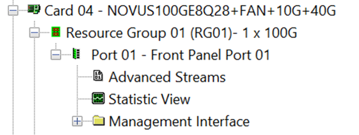
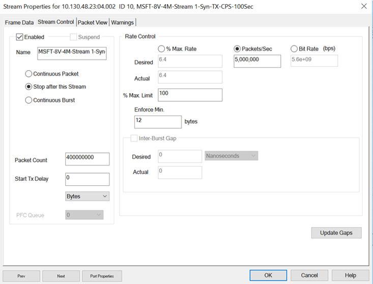
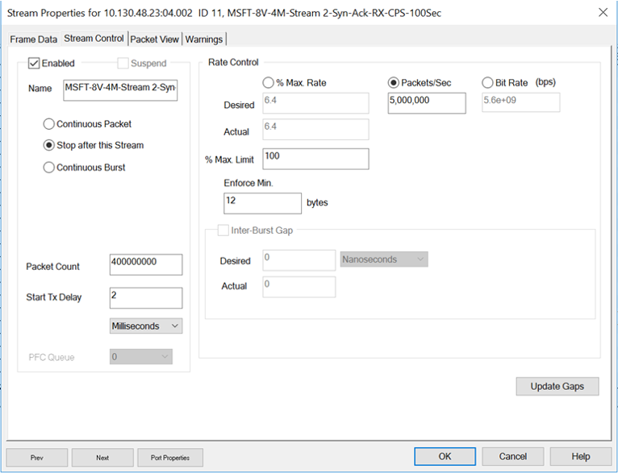

# Pre DASH Hero test implementation details

## Table of Contents

[MSFT LAB IXIA Configuration](#msft-lab-ixia-configuration)

- [Pre DASH Hero test implementation details](#pre-dash-hero-test-implementation-details)
  - [Table of Contents](#table-of-contents)
  - [MSFT LAB IXIA Configuration](#msft-lab-ixia-configuration)
    - [Module Configuration](#module-configuration)
    - [Streams](#streams)
      - [Learning Streams](#learning-streams)
      - [Traffic Streams](#traffic-streams)
      - [Bandwidth Streams](#bandwidth-streams)
    - [CPS Streams](#cps-streams)
    - [Sample Policy Configuration](#sample-policy-configuration)
      - [Device](#device)
      - [TEP](#tep)
      - [Route Table](#route-table)
      - [VPC](#vpc)
      - [VNIC](#vnic)
      - [Mappings](#mappings)
      - [Policer](#policer)
      - [Meter Policy](#meter-policy)

[Sample Policy Configuration](#sample-policy-configuration)

- [Device](#device)

- [TEP](#tep)

- [Route Table](#route-table)

- [Security Policy](#security-policy)

- [VPC](#vpc)

- [VNIC](#vnic)

- [Mappings](#mappings)

- [Policer](#policer)

- [UDR](#udr)

- [Meter Policy](#meter-policy)

<hr/>

## MSFT LAB IXIA Configuration

### Module Configuration

IXIA module: NOVUS100GE8Q28

 

 

### Streams

TX: Local vnic to remote vnic

RX: Remote vnic to local vnic

#### Learning Streams

Learning Streams will be used to establish 15M CPS connections and 15M UDP
background bi-directional flows prior to test execution. These 15M flows
will be split across 64 vnics that are pre-configured.



- MSFT-8V-1M-TX-PPS-Learning


**Packet view**

``` cmd
MAC: ------  MAC Header  ------
MAC: 
MAC: Destination Address : 00 AE CD 01 CD 26
MAC: Source Address      : 00 AE CD 20 00 01
MAC: Type                : 0x0800 (Ethernet II)
MAC: 
IP: ------  IP Header  -----------
IP: 
IP: Version                        = 04 (0x04)
IP: Header Length                  = 20 (0x14)
IP: Differentiated Services Field  = 0 (0x00)
IP:                      000000..  = DSCP: Default(0x00)
IP:                      ......0.  = ECN Capable Transport (ECT): 0
IP:                      .......0  = ECN-CE: 0
IP: Type of Service                = 00 (0x00)
IP:                    000.....    = Routine
IP:                    ...0....    = Normal Delay
IP:                    ....0...    = Normal Throughput
IP:                    .....0..    = Normal Reliability
IP:                    ......0.    = Normal Cost
IP:                    .......0    = Reserved
IP: Total Length                   = 100 (0x0064)
IP: Identification                 = 0 (0x0000)
IP: Flags  Bit1  .0.  May  Fragment
IP: Flags  Bit2  ..0  Last  Fragment
IP: Fragment Offset                = 0
IP: Time to Live                   = 64 (0x40)
IP: Protocol                       = UDP
IP: Checksum                       = 0x7885
IP: Source Address                 = 1.0.0.3
IP: Destination Address            = 1.0.0.2
IP: 
UDP: ------  UDP Header  -----------
UDP: 
UDP: Source Port         = 50686 (0xC5FE)
UDP: Destination Port    = 4789 (0x12B5)
UDP: Length              = 80 (0x0050)
UDP: Checksum            = 1770 (0x06EA)
UDP: 

```
- MSFT-8V-1M-RX-PPS-Learning


#### Traffic Streams

Traffic streams will be used for running the learning flows with 64
packets per flow. Traffic streams simulating 1/8/16 packets per flow
need to be created individually.

- MSFT-8V-1M-TX-PPS-64Pkt/Flow-100Sec


- MSFT-8V-1M-RX-PPS-64Pkt/Flow-100Sec


#### Bandwidth Streams

Bandwidth streams runs with a higher packet size -- 500 byte -- and
will be used to verify the total 100Gbps bandwidth.

- MSFT-8V-1M-TX-BW-Port1-100Sec


**Packet view**

```cmd
MAC: ------  MAC Header  ------
MAC: 
MAC: Destination Address : 00 AE CD 01 CD 26
MAC: Source Address      : 00 AE CD 20 00 01
MAC: Type                : 0x0800 (Ethernet II)
MAC: 
IP: ------  IP Header  -----------
IP: 
IP: Version                        = 04 (0x04)
IP: Header Length                  = 20 (0x14)
IP: Differentiated Services Field  = 0 (0x00)
IP:                      000000..  = DSCP: Default(0x00)
IP:                      ......0.  = ECN Capable Transport (ECT): 0
IP:                      .......0  = ECN-CE: 0
IP: Type of Service                = 00 (0x00)
IP:                    000.....    = Routine
IP:                    ...0....    = Normal Delay
IP:                    ....0...    = Normal Throughput
IP:                    .....0..    = Normal Reliability
IP:                    ......0.    = Normal Cost
IP:                    .......0    = Reserved
IP: Total Length                   = 1482 (0x05CA)
IP: Identification                 = 0 (0x0000)
IP: Flags  Bit1  .0.  May  Fragment
IP: Flags  Bit2  ..0  Last  Fragment
IP: Fragment Offset                = 0
IP: Time to Live                   = 64 (0x40)
IP: Protocol                       = UDP
IP: Checksum                       = 0x731F
IP: Source Address                 = 1.0.0.3
IP: Destination Address            = 1.0.0.2
IP: 
UDP: ------  UDP Header  -----------
UDP: 
UDP: Source Port         = 50686 (0xC5FE)
UDP: Destination Port    = 4789 (0x12B5)
UDP: Length              = 80 (0x0050)
UDP: Checksum            = 1770 (0x06EA)
UDP: 

```

- MSFT-8V-1M-RX-BW-Port1-100Sec


### CPS Streams

CPS streams will be used to simulate TCP connection establishment and termination.


-   MSFT-8V-4M-Stream 1-Syn-TX-CPS-100Sec




-   MSFT-8V-4M-Stream 2-Syn-Ack-RX-CPS-100Sec




-   MSFT-8V-4M-Stream 3-Ack-TX-CPS-100Sec


-   MSFT-8V-4M-Stream 4-Fin-Ack-RX-CPS-100Sec


-   MSFT-8V-4M-Stream 4-Fin-Ack-TX-CPS-100Sec


-   MSFT-8V-4M-Stream 6-Ack-for-Fin-RX-CPS-100Sec


### Sample Policy Configuration

#### Device

```cmd
\"gw-ip-addr\": \"1.0.0.1\",

\"kind\" : \"device\",

\"gw-ip-addr\": \"1.0.0.1\",

\"ip-addr\" : \"1.0.0.2\",

\"mac-addr\" : \"\",

\"dual-stack\": \"false\",

\"encap\": \"vxlan\",

\"oper-mode\": \"bitw-smart-switch\"
```

#### TEP

```cmd
\"kind\" : \"tep\",

\"count\" : \"2046\",

\"prefix\": \"1.0.0.0/8\"

```

#### Route Table

```cmd
\"kind\" : \"route-table\",

\"count\" : \"204800\",

\"prefix-start\" : \"4.0.0.0/8\",

\"meter\" : \"true\"

#### Security Policy

\"kind\" : \"security-policy\",

\"v4-count\" : \"1023\"
```

#### VPC

```cmd
\"kind\" : \"vpc\",

\"count\" : \"16\",

\"prefix\" : \"192.0.0.0/8\",

\"subnets\" : \"1\"
```
> [!NOTE]
> All VPCs will be configured with the same prefix.

#### VNIC

```cmd
\"kind\" : \"vnic\",

\"count\" : \"1\",

\"vlan-tagged\": \"false\"

Note: VNIC configuration per vpc, subnet

```

#### Mappings

```cmd
\"kind\" : \"mappings\",

\"remotes\" : \"64\",

\"locals\" : \"8\",

\"nat-prefix\" : \"3.0.0.0/8\"

```
> [!NOTE]
> Remotes are per subnet, tep.

#### Policer

```cmd
\"kind\" : \"policer\",

\"count\" : \"16\",

\"tx_policer_en\" : \"true\",

\"rx_policer_en\" : \"true\"

#### UDR

\"kind\" : \"udr\",

\"route-prefix\" : \"5.0.0.0/8\",

\"overlay-mac\" : \"\",

\"encap\" : \"\",

\"tos\" : \"\"

```

#### Meter Policy

```cmd
\"kind\" : \"meter-policy\",

\"count-xl\" : \"16383\",

\"count-m\" : \"1023\",

\"prefix\" : \"4.0.0.0/8\"

```
