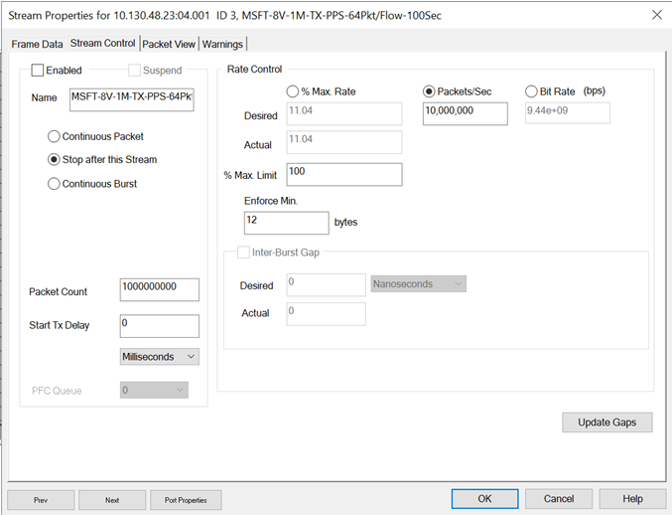
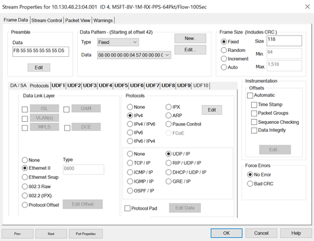
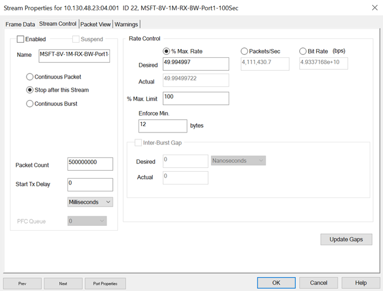
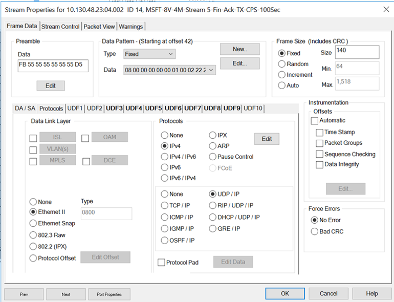
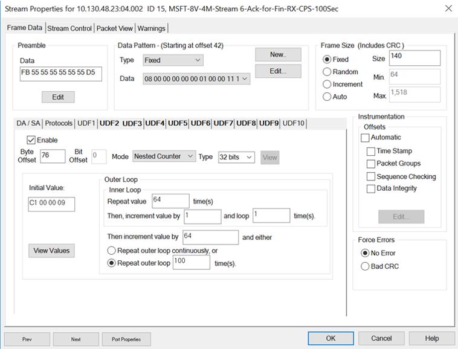

[ [ << Back to parent directory](../README.md) ]

[ [ << Back to DASH top-level Documents](../../README.md#contents) ]

# Program Scale Testing Requirements for LAB Validation
>**NOTE**: This prelimiary document includes a text description of a so-called **"Hero Test"** to establish minimum performance requirements and screen captures of Layer 2/3 packet generator stream configurations for IXIA IxExplorer packet tester device. These L23 streams simulate L4 connection establishment. This document, and the testing methodology, will be replaced by a more formal, complete requirements specification and  automated testing scripts in due time.

## Table of Contents

[Introduction](#introduction)

[Test Methodology and Definitions](#test-methodology-and-definitions)

[Feature Requirements](#feature-requirements)

[Policy and Route Requirements](#policy-and-route-requirements)

[MSFT LAB IXIA Configuration](#msft-lab-ixia-configuration)

- [Module Configuration](#module-configuration)

- [Streams](#streams)

    - [Learning Streams](#learning-streams)

    - [Traffic Streams](#traffic-streams)

    - [Bandwidth Streams](#bandwidth-streams)

    - [CPS Streams](#cps-streams)

[Sample Policy Configuration](#sample-policy-configuration)

- [Device](#device)

- [TEP](#tep)

- [Route Table](#route-table)

- [Security Policy](#security-policy)

- [VPC](#vpc)

- [VNIC](#vnic)

- [Mappings](#mappings)

- [Policer](#policer)

- [UDR](#udr)

- [Meter Policy](#meter-policy)

<hr/>

## Introduction

This document summarizes scale testing requirements for validating program deliverables.

This document will refer to Connection Per Second (CPS) capability as 5M
which correlates to 10M flow operations. This capability is a
placeholder for reference and the specific hardware supported value will
be used to evaluate different firmware drops.

What we are looking for in a series of testing is how well the NIC
handles:

1.  Connections/sec per ENI and per NIC
1.  Number of active connections per ENI and per NIC
1.  Number of flows per ENI and per NIC
1.  Throughput under max connections per second load with the remaining
    bandwidth is filled with pre-learned connections that receive at
    least one packet per second while driving the links to near 100%
    utilization. This requires some work up front to get the right mix
    of CPS and active connections with zero drops. **We do not accept
    results with drops as we cannot use that test to measure latency and
    jitter**. We therefore also run the test sufficiently long to see if
    there were any queue build-ups which would eventually lead to drops
    and distort both latency and jitter results.
1.  Aging of (TCP connections) and (UDP bi-directional flows) such that
    after the test is complete all connections are aged within the 1
    second interval or any other interval we program.
1.  We are expecting to cover below scenarios as follow-on tests:

        a. Age arbitrary connections to verify that aging is also working
        properly under maximum load.

        b. Download new policies and delete old policies at a significant
        rate to ensure that CPS, Active Connections, Aging, and new
        Policies are properly handled with the external memory, which is
        often the bottleneck for performance.

Why are we running these tests?

1.  Many NICs require software to inspect the SYN/ACK/ACK and
    FIN/ACK/ACK packets of a connection. The software is responsible for
    the formation, deletion connection and forwarding table entries
    after significant and complex cloud policy enforcement along with
    any associated accounting. Software based connection management
    often results in poor connections/second with limits in the 10s of
    thousands/sec. The set of test and associated table parameters found
    in this document are designed to find the maximum CPS with the
    maximum number of connections all actively receiving packets every
    second. The more that is done in specialized hardware the more we
    expect the CPS to increase. **Any NIC for the application that
    cannot achieve millions of connections/sec will automatically be
    disqualified from further testing.**
1.  Many NICs can create (a large number) of connections simply by
    adding more external memory for the connection table. For example, a
    NIC can create 1M connections in its external table, however if
    packets arrive across the entire connection set in a random order,
    it forces the NIC out of its internal **connection cache** and to
    use the external connection table instead. Under this condition we
    have measured some NICs to achieve 10% advertised link throughput.
    The testing below will ensure this condition is exercised and
    provide the true worst-case throughput that is reflective of some
    real-world conditions like firewalls, load balancers, DDoS,
    v-routers etc. **It should also be noted that creating a connection
    in a table that never receives a subsequent packet (other than
    keepalives once every few minutes) is referred to as an idle
    connection and is a useless parameter that should never be
    advertised and will not be tested other than for conformance.**
1.  Aging is also a vital component of tracking connections. Even under
    the worst load the system must be able to age connections. All
    packets will require either connection setup/teardown or policy
    lookups/updates involving external memory and hence the memory
    management of the connection table is extremely important. The tests
    in this document will ensure that no matter what processing is going
    on, the connection table will be maintained providing the proper
    aging intervals to each connection.
1.  We need to be able to enter/delete many new policies at any time
    regardless of load. For this reason, we will run the test without
    updates to policy to get a baseline and then again with some
    extensive policies being added/deleted during the same test. We will
    look for any regressions while adding/deleting policies at a
    significant rate. This matches the real-world requirement of adding
    and deleting VMs to a node or to the VNET.

In the end we are looking for total invisibility for the end customer.
Customers are used to their NICs in the enterprise forwarding at
Layer-3. Most NICs and switches can do this at wire rate under a wide
variety of conditions. When the customer enters the cloud, they expect
the same behavior. When they setup their solution for the first time,
often, they will not see the same performance and in the worst case will
have to totally re-architect their already working solutions with a
scale-out model. This means that their hybrid and cloud architectures
will diverge and create a large amount of extra work for IT or solution
integrators to track and test the designs in a common manner.

## Test Methodology and Definitions

-   **CPS**: Sustained Connections Per Second. 5M and 10M flows are only
    placeholders and will be determined by the supplier as each
    implementation will vary depending on the maturity of the DASH
    design.

    -   5M CPS means that 5M new connections are established and
        destroyed over a one second interval.

    -   Every connection consists of two flows hence 5M new connections
        mean:

        -   10M flow additions every second to insert connections.

        -   10M flow deletions every second because of expiry of old
            connections which will also allow capacity for new
            connections to be formed in the next second.

        -   20M total flow operations every second

    -   5M CPS is a "per card" goal. Card must be able to sustainably
        handle 5M CPS irrespectively if either single ENI is configured
        on a card or multiple ENIs are configured. Total CPS per card
        must always be reaching same 5M goal, and this goal must not be
        degraded if card will have multiple ENIs programmed with
        different policy each. Same goes for total flows supported on a
        card.

-   **Test Runtime**: 100 seconds. We feel this is sufficient time to
    pick up any anomalies the NIC may have running interval tasks
    unknown to the tester.

-   **Effective CPS**: CPS results over 100 seconds by the Ixia
    setup/teardown rates, however, will not be accepted if there are any
    drops for any reason. Drops end up deviating the true latency and
    jitter numbers.

-   **Performance Testing Methodology**:

    -   2M TCP background connections setup before testing.

    -   2M UDP background bi-directional flows setup before testing.

    -   We use an equal mix of TCP and UDP although in the real world we
        expect more TCP and in fact in some cases we meter UDP as a
        potential source of DoS.

    -   Connection aging set to 1 sec and requires each connection or
        bi-directional flow to receive one packet every second in each
        direction at a size that will fill up the links to near 100% in
        conjunction with the dynamically setup connection traffic. For
        this to be run successfully it may take a few runs as each TCP
        connection setup and teardown takes 6 packets.

    -   For UDP a bidirectional flow is created for the first packet
        seen that meets the policy for the bi-directional flow setup.
        When using this in CPS testing, we will send a total of 6
        packets to match TCP to make things more balanced. UDP
        bi-directional flows will be aged within 1 second after
        receiving the last packet. I would set all UDP bi-directional
        flows to 0.5 - 1.0 second aging to ensure that we do not inflate
        the connection table over time.

    -   One packet should be sent in each direction to be able to keep
        connections active in the flow table. Packet size should be set
        to a minimum that allows 6 CPS packets at maximum rate and at
        least one packet on each of the active connections in both
        directions that also allows for close to 100% link utilization
        while not exceeding the TCP aging time of 1 sec.

    -   TCP connection is established and terminated without any data
        packets.
        -   Real use case
        -   6 packets: SYN, SYN-ACK, ACK, FIN, FIN-ACK, ACK
        -   Flow Table Size: (2 \* CPS) + 2M + 2M
            //For 5M CPS, Flow Table Size: (2 \* 5M) +2M +2M = 14M
        -   Effective PPS: Sustained CPS \* 6 + PPS for background flows.

-   CPS and flow results will be measured while channel bandwidth is
    saturated at 100Gbps for the duration of test runtime. At the same
    time we want as close to 100Gbps without losing packets.

-   Inactivity based aging timer of 1 second.

    -   All TCP connections should be deleted from the table after the
        test completes.

    -   The connection table should therefore be zero.

    -   All UDP bi-directional flows need to age out before the 1 second
        interval to allow for new UDP bi-directional flows to be
        established. If everything works as advertised, we should never
        see the connection table go above the 8M connections. If we do
        then it is likely that UDP bi-directional flows were not aged
        within the 1 second interval. To check this, we need to see a
        high water counter for maximum connection table size.

## Feature Requirements

The following features are required to be enabled during scale testing:

-   VNET
    -   VXLAN-IN and VXLAN-OUT
    -   Encap based on lookup table, which can change/be updated
        similarly as ENI policy

-   UDR

    -   200k routes per ENI with:
        -   MAC rewrite
        -   VNID rewrite
        -   DSCP rewrite

-   ACL
    -   3-level NSG on connection (receive/transmit) in accordance with
        the Packet Transformation document detailing our unique NSG
        requirements.

    -   For clarity, the first NSG is used by Azure to set policy for
        the connection while the next two NSGs are set by the customer.
        Think of it as a customer building their own firewall rules to
        control which VMs can communicate with any other VM with a
        unique set of policies. This allows the customer to setup the
        VMs with similar control they would have in their own
        enterprise. We cannot prevent the customer from forming complex
        policy sets. They will likely use similar policies they use in
        their own environment.

        -   NSG on VNET, vport, subnet both on ingress and egress
            traffic
        -   100k SIP prefixes/ranges per policy
        -   100k DIP prefixes/ranges per policy

-   Metering

    -   <span style="color:red">Enabled on all routes in all v-ports (Currently 15 classes are
        supported)</span>.

-   QoS per ENI BW

-   VNET Peering

## Policy and Route Requirements

The following scale of policies and routes are at minimum required to be
configured during validation and test plan needs to be executed covering
both scenarios:

1. &nbsp; 8 ENI Scenario
    - 8 ENIs/VPorts
    - 200k \* 8 = 1.6M routes
    - 8 \* 6 = 48 NSGs
    - 48 \* 1000 rules = 48000 ACL rules
    - 48 \* 200k prefixes per NSG = 9.6M Prefixes
    - 2M Mapping Table

1. &nbsp; 1 ENI Scenario
    - 1 ENI/VPort
    - 1.6M routes
    - 48 NSGs
    - 48000 ACL rules
    - 9.6M Prefixes (upper limit per DPU - sum of the above)
    - 2M Mapping Table

## MSFT LAB IXIA Configuration

### Module Configuration

IXIA module: NOVUS100GE8Q28

 

 

### Streams

TX: Local vnic to remote vnic

RX: Remote vnic to local vnic

#### Learning Streams

Learning Streams will be used to establish 2M CPS connections and 2M UDP
background bi-directional flows prior to test execution. These 2M flows
will be split across 8 vnics that are pre-configured.


- MSFT-8V-1M-TX-PPS-Learning


**Packet view**

``` cmd
MAC: ------  MAC Header  ------
MAC: 
MAC: Destination Address : 00 AE CD 01 CD 26
MAC: Source Address      : 00 AE CD 20 00 01
MAC: Type                : 0x0800 (Ethernet II)
MAC: 
IP: ------  IP Header  -----------
IP: 
IP: Version                        = 04 (0x04)
IP: Header Length                  = 20 (0x14)
IP: Differentiated Services Field  = 0 (0x00)
IP:                      000000..  = DSCP: Default(0x00)
IP:                      ......0.  = ECN Capable Transport (ECT): 0
IP:                      .......0  = ECN-CE: 0
IP: Type of Service                = 00 (0x00)
IP:                    000.....    = Routine
IP:                    ...0....    = Normal Delay
IP:                    ....0...    = Normal Throughput
IP:                    .....0..    = Normal Reliability
IP:                    ......0.    = Normal Cost
IP:                    .......0    = Reserved
IP: Total Length                   = 100 (0x0064)
IP: Identification                 = 0 (0x0000)
IP: Flags  Bit1  .0.  May  Fragment
IP: Flags  Bit2  ..0  Last  Fragment
IP: Fragment Offset                = 0
IP: Time to Live                   = 64 (0x40)
IP: Protocol                       = UDP
IP: Checksum                       = 0x7885
IP: Source Address                 = 1.0.0.3
IP: Destination Address            = 1.0.0.2
IP: 
UDP: ------  UDP Header  -----------
UDP: 
UDP: Source Port         = 50686 (0xC5FE)
UDP: Destination Port    = 4789 (0x12B5)
UDP: Length              = 80 (0x0050)
UDP: Checksum            = 1770 (0x06EA)
UDP: 

```
- MSFT-8V-1M-RX-PPS-Learning


#### Traffic Streams

Traffic streams will be used for running the learning flows with 64
packets per flow. Traffic streams simulating 1/8/16 packets per flow
need to be created individually.

- MSFT-8V-1M-TX-PPS-64Pkt/Flow-100Sec




- MSFT-8V-1M-RX-PPS-64Pkt/Flow-100Sec




#### Bandwidth Streams

Bandwidth streams runs with a higher packet size -- 1500 byte -- and
will be used to verify the total 100Gbps bandwidth.

- MSFT-8V-1M-TX-BW-Port1-100Sec


**Packet view**

```cmd
MAC: ------  MAC Header  ------
MAC: 
MAC: Destination Address : 00 AE CD 01 CD 26
MAC: Source Address      : 00 AE CD 20 00 01
MAC: Type                : 0x0800 (Ethernet II)
MAC: 
IP: ------  IP Header  -----------
IP: 
IP: Version                        = 04 (0x04)
IP: Header Length                  = 20 (0x14)
IP: Differentiated Services Field  = 0 (0x00)
IP:                      000000..  = DSCP: Default(0x00)
IP:                      ......0.  = ECN Capable Transport (ECT): 0
IP:                      .......0  = ECN-CE: 0
IP: Type of Service                = 00 (0x00)
IP:                    000.....    = Routine
IP:                    ...0....    = Normal Delay
IP:                    ....0...    = Normal Throughput
IP:                    .....0..    = Normal Reliability
IP:                    ......0.    = Normal Cost
IP:                    .......0    = Reserved
IP: Total Length                   = 1482 (0x05CA)
IP: Identification                 = 0 (0x0000)
IP: Flags  Bit1  .0.  May  Fragment
IP: Flags  Bit2  ..0  Last  Fragment
IP: Fragment Offset                = 0
IP: Time to Live                   = 64 (0x40)
IP: Protocol                       = UDP
IP: Checksum                       = 0x731F
IP: Source Address                 = 1.0.0.3
IP: Destination Address            = 1.0.0.2
IP: 
UDP: ------  UDP Header  -----------
UDP: 
UDP: Source Port         = 50686 (0xC5FE)
UDP: Destination Port    = 4789 (0x12B5)
UDP: Length              = 80 (0x0050)
UDP: Checksum            = 1770 (0x06EA)
UDP: 

```

- MSFT-8V-1M-RX-BW-Port1-100Sec




### CPS Streams

CPS streams will be used to simulate TCP connection establishment and termination.


-   MSFT-8V-4M-Stream 1-Syn-TX-CPS-100Sec


-   MSFT-8V-4M-Stream 2-Syn-Ack-RX-CPS-100Sec


-   MSFT-8V-4M-Stream 3-Ack-TX-CPS-100Sec


-   MSFT-8V-4M-Stream 4-Fin-Ack-RX-CPS-100Sec


-   MSFT-8V-4M-Stream 4-Fin-Ack-TX-CPS-100Sec




-   MSFT-8V-4M-Stream 6-Ack-for-Fin-RX-CPS-100Sec




### Sample Policy Configuration

#### Device

```cmd
\"gw-ip-addr\": \"1.0.0.1\",

\"kind\" : \"device\",

\"gw-ip-addr\": \"1.0.0.1\",

\"ip-addr\" : \"1.0.0.2\",

\"mac-addr\" : \"\",

\"dual-stack\": \"false\",

\"encap\": \"vxlan\",

\"oper-mode\": \"bitw-smart-switch\"
```

#### TEP

```cmd
\"kind\" : \"tep\",

\"count\" : \"2046\",

\"prefix\": \"1.0.0.0/8\"

```

#### Route Table

```cmd
\"kind\" : \"route-table\",

\"count\" : \"204800\",

\"prefix-start\" : \"4.0.0.0/8\",

\"meter\" : \"true\"

#### Security Policy

\"kind\" : \"security-policy\",

\"v4-count\" : \"1023\"
```

#### VPC

```cmd
\"kind\" : \"vpc\",

\"count\" : \"16\",

\"prefix\" : \"192.0.0.0/8\",

\"subnets\" : \"1\"
```
> [!NOTE]
> All VPCs will be configured with the same prefix.

#### VNIC

```cmd
\"kind\" : \"vnic\",

\"count\" : \"1\",

\"vlan-tagged\": \"false\"

Note: VNIC configuration per vpc, subnet

```

#### Mappings

```cmd
\"kind\" : \"mappings\",

\"remotes\" : \"64\",

\"locals\" : \"8\",

\"nat-prefix\" : \"3.0.0.0/8\"

```
> [!NOTE]
> Remotes are per subnet, tep.

#### Policer

```cmd
\"kind\" : \"policer\",

\"count\" : \"16\",

\"tx_policer_en\" : \"true\",

\"rx_policer_en\" : \"true\"

#### UDR

\"kind\" : \"udr\",

\"route-prefix\" : \"5.0.0.0/8\",

\"overlay-mac\" : \"\",

\"encap\" : \"\",

\"tos\" : \"\"

```

#### Meter Policy

```cmd
\"kind\" : \"meter-policy\",

\"count-xl\" : \"16383\",

\"count-m\" : \"1023\",

\"prefix\" : \"4.0.0.0/8\"

```
