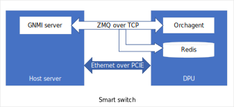
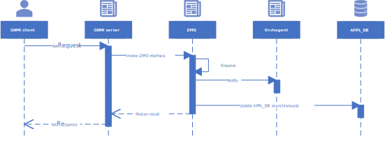
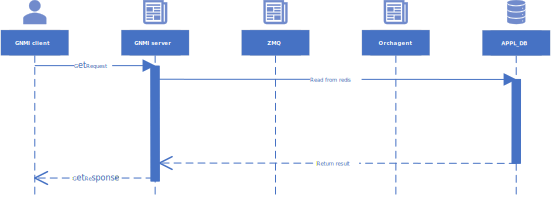
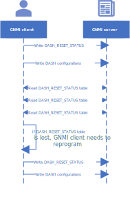

# GNMI Interface for DASH

## Overview

SONiC should provide a gNMI server interface for DASH project.
Below diagram shows the architecture of the DASH project, the host server and DPU card are connected through PCIE, and together they form a smart switch.



Both host server and DPU card are running SONiC image. GNMI server and redis for APPL_DB are on host server, orchagent is on DPU card, GNMI server will use ZMQ over TCP to communicate with orchagent and redis.

### Requirements

* Set and get RPCs must be supported. Customers will use get RPC to retrieve DASH configurations and use set PRC to apply new DASH configurations.
* Need to configure huge DASH table entries to APPL_DB, with high speed.
* Minimal redis table scaling requirements: [scaling requirement](../general/dash-sonic-hld.md#14-scaling-requirements)

### Design considerations

* For set RPC, GNMI calls the ZMQ interface, and ZMQ updates redis asynchronously.
* For get RPC, GNMI reads from redis db directly.
* The DASH table of APPL_DB would be encoded as protobuf to save memory consumption, and then GNMI needs to support protobuf encoding for DASH table.

```
127.0.0.1:6379> hgetall "DASH_VNET_TABLE:vnet1"
1\) "pb"
2\) "\n\x010\x12$b6d54023-5d24-47de-ae94-8afe693dd1fc…"
```

And proto message for DASH_VNET_TABLE is:

```
message Vnet {
    uint32 vni = 1;
    string guid = 2;
    repeated types.IpPrefix address_space = 3;
    repeated string peer_list = 4;
}
```

Protobuf encoding message would be: "\n\x010\x12$b6d54023-5d24-47de-ae94-8afe693dd1fc…"
IETF JSON encoding message would be: "{'vni':'1000', 'guid':'b6d54023-5d24-47de-ae94-8afe693dd1fc'}"

* GNMI would not run Yang validation for protobuf encoding data.
  * GNMI server can check ENI and VNET if necessary.

# Design
## Set RPC
### Work flow


GNMI server would not run Yang validation, and it would invoke ZMQ interface to update.
ZMQ would update APPL_DB asynchronously, so client needs to wait for a few seconds to get latest update from APPL_DB.
### Message schema
Below table shows message example for SetRequest, including delete operation, replace operation and update operation:
SetRequest Message:
```
delete {
    path {
        origin: "sonic_db"
        elem {name: “APPL_DB”} elem {name: “DASH_VNET_TABLE”} elem {name: “vnet1”}
    }
}
replace {
    path {
        origin: "sonic_db"
        elem {name: “APPL_DB”} elem {name: “DASH_VNET_TABLE”} elem {name: “vnet2”}
    }
}
replace {
    path {
        origin: “sonic_db"
        elem {name: “APPL_DB”} elem {name: “DASH_VNET_TABLE”} elem {name: “vnet3”}
    }
    val {
        proto_bytes: “\n\x010\x12$b6d54023-5d24-47de-ae94-8afe693dd1fc…”
    }
}
update {
    path {
        origin: "sonic_db"
        elem {name: “APPL_DB”} elem {name: “DASH_VNET_TABLE”} elem {name: “vnet4”}
    }
    val {
        proto_bytes: “\n\x010\x12$b6d54023-5d24-47de-ae94-8afe693dd1fc…”
    }
}
```

GNMI message has below constraints for DASH table:
* Path origin must be “sonic_db”.
* Path length must be 3, the first element must be “APPL_DB”, the second element must be DASH table name like “DASH_VNET_TABLE”, the third element must be DASH table key. And GNMI does not support wildcards for SetRequest.
* Value must use protobuf encoding.

## Get RPC
### Work flow


GNMI reads from APPL_DB directly.
### Message schema

```
++++++++ Sending get request: ++++++++
path {
    origin: "sonic_db"
    elem {name: "APPL_DB"} elem {name: "DASH_VNET_TABLE"} elem {name: "vnet1"}
}
encoding: PROTO
++++++++ Recevied get response: ++++++++
notification {
    update {
        path {
            origin: "sonic_db"
            elem {name: "APPL_DB"} elem {name: "DASH_VNET_TABLE"} elem {name: "vnet1"}
        }
        val {
            proto_bytes: "\n\x010\x12$b6d54023-5d24-47de-ae94-8afe693dd1fc…"
        }
    }
}
```

## GNMI Server Restart

DASH configuration is not persistent, if device rebooted, GNMI client needs to reconfigure DASH tables.
GNMI will add DASH_RESET_STATUS table to detect GNMI server restart.



GNMI client must write DASH_RESET_STATUS before any other DASH configurations, and GNMI client should periodically check the DASH_RESET_STATUS table. If DASH_RESET_STATUS table does not exist, GNMI client needs to reprogram all the DASH tables.


# References

- [SONiC GNMI Server Interface Design](https://github.com/sonic-net/SONiC/blob/master/doc/mgmt/gnmi/SONiC_GNMI_Server_Interface_Design.md)
- [SONiC-DASH HLD](https://github.com/sonic-net/DASH/blob/main/documentation/general/dash-sonic-hld.md)
- [Proto for DASH table](https://github.com/Pterosaur/DASH-benchmark/tree/master/memory/proto)


