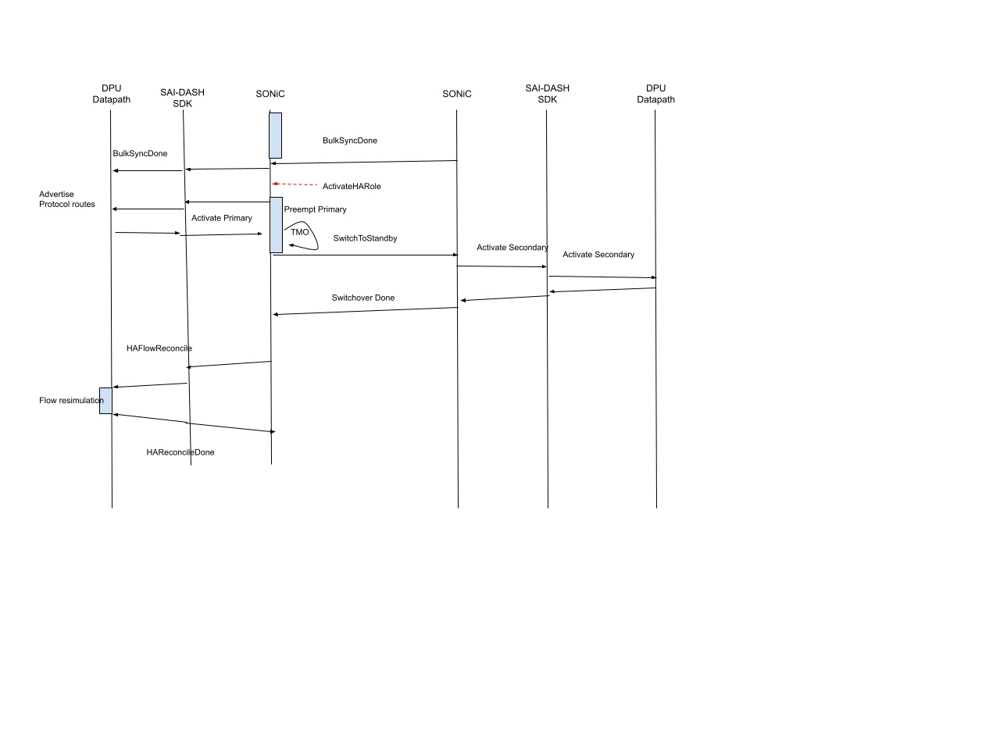

# DASH High Availability proposal

## Overview

This document describes the High availability mechanisms for DPUs in the DASH framework. High Availability is achieved by pairing DPUs such that a failure in any one in the pair results in the surviving DPU taking over forwarding on behalf of the failed DPU. Since forwarding on the DPU is stateful, all forwarding state from each DPU is synchronized with the other so that the switchover is seamless for user traffic. This document describes the procedures for such pairing and the mechanisms for synchronizing state between the pair.

## Design Goals

This proposal has the following design goals

1. All connections setup before switchover should work reliably after planned and unplanned switchovers
2. 0 downtime planned switchover, <2 sec downtime unplanned switchover
3. Data packets should not be dropped due to flow replication delays
4. Sync connection setup and teardown at datapath rate to support high CPS
5. Sync only required packets to conserve PPS for data traffic
6. Allow controller to trigger flow reconciliation to fixup flows after all switchovers
7. Allow Preemption so admin active becomes the operation active in steady state. Preemption in such cases should be controllable by the controller.


## Functional Description

### Terminology


The above picture shows the terminology used for the layers in this document. The SONIC stack represents the sonic stack including gnmi, swss, syncd etc.. DASH SDK is the vendor implementation specific DASH SDK. The DPU is the vendor implementation of the hardware datapath and any associated sw components.

### Network Topology

The 2 DPUs in the pairing relation is administratively defined via configuration. Pairing and synchronization happens via the data network. Each DPU is typically connected to the data fabric via 2 interfaces which provides high availability in case of  failure in one of the network paths (link or tor). Each DPU has the following IPs

1. Link IPs connecting to the the TOR
1. A Control plane Loopback IP unique to each DPU
1. 2 Datapath VIPs shared between the pair of DPUs

The loopback IPs (#2, and #3 above) are advertised and maintained via dynamic advertisements from the DPU. The picture below shows the network topology with 2 paired DPUs.


#### Control Network Loopback IP (CNIP)

The control plane Loopback IP, also referred to in this document as the CNIP, is unique to each DPU and provides the ability to address each DPU as long as some connectivity exists between the DPU and the network fabric. This is used to communicate between the paired DPUs. All control plane traffic between the DPUs is sourced from this IP and addressed to this IP. The Peer DPU is identified by its control plane loopback IP. The CNIP is used for pairing between the DPUs by exchanging control messages, for all flow synchronization packets - both bulk and datapath sync (covered later) and datapath heartbeat messages . The Same IP address is used by the datapath to originate and terminate flow sync packets.

#### Datapath VIP

The Datapath VIP IPs are the addresses that are used to direct traffic towards the DPU by the rest of the network. The use of 2 VIP loopback IPs allows for the DPUs to provide an ENI based active-active forwarding paradigm.

### ENI based active-active

The 2 Datapath VIPs (DP-VIP) are shared between the paired DPUs. Each DP-VIP is associated with a primary and a secondary DPU. In steady state each DPU has one primary DP-VIP and a secondary DP-VIP while on the peer DPU the roles are flipped. The DPU attracts traffic such that traffic for each DP-VIP lands on the primary DPU for the VIP. The DPU achieves this by signaling via network protocols to the fabric.

Each ENI configured on the DPU is associated with a DP-VIP by the controller. In steady state for the set of ENIs managed by a DPU pair, traffic to and from a set of ENIs land on one of the DPUs while traffic to/from the remaining ENIs are handled by the other DPU. Thus the dataplanes on both the DPUs are actively forwarding traffic. On failure or administrative switchover, the secondary DPU takes over the active DPUs role for the DP-VIP and hence the DPU ends up handling traffic for both the DP-VIPs at the same time. State synchronization between the 2 DPUs ensures that on switchover there is no loss in state and switchover is seamless for user traffic.

### Datapath Heartbeat

Each DPU sends heartbeat messages at a configured interval to its peer. When a peer loses a set number of heartbeats it declares the peer unreachable and a switchover is initiated. The interval between heartbeats and the number of missed heartbeats are configurable. The Heartbeats can be aggressive hence it is left to the DPU to perform the heartbeat. The Heartbeats can be aggressive hence it is left to the DPU to perform the heartbeat.

The heartbeat has to use a separate channel than any other control plane messages. This is to avoid any head of line blocking and delays in the heartbeat responses due to processing of control messages. The heartbeat frequency can be quite aggressive and can be sensitive to such delays if it uses the same channel as other control plane messages. The packets on the wire are tagged with a high priority DSCP so the network can give it the right treatment.

## State Synchronization

State synchronization between the 2 DPUs uses the CNIP IP. All state synchronization happens at the granularity of the DP-VIP and happens from the primary of the DP-VIP towards the secondary. 

One of the goals of this design is to ensure that any traffic that was forwarded before switchover continues to be forwarded after switchover. This is important because although the controller ensures that configured policies on the two paired nodes will be eventually consistent, there are windows where the configurations can be out of sync between the nodes for windows of time since the configuration push is not atomic between the paired nodes. To provide consistency in forwarding on switchover the design uses the policy lookup on the primary to be the source of truth between the pair. State synchronization from the primary to the secondary carries for each flow the results of the lookup on the primary. On switchover the new Primary continues to forward based on the old primary’s results hence maintaining continuity. The Controller can then trigger an update of the state (Flow reconciliation) when configuration on the new primary is up-to-date.

Flow state synchronization hence involves 2 components
Flow key
Policy lookup results on the primary (metadata)

Actually flow lookup results and format will depend on the underlying implementation hence exact formats are not defined in this document. But the below 2 lists show the classes of state that are synchronized and not synchronized

**State Synchronized**
1. Policy results from Security Lookup
2. Mapping/Route lookup results
3. Rewrite information, Src IP/Dst/IP/Src Port/Dst Port/VNI translations etc.
4. Metering Class

**State that is not synchronized**
1. Metering data
2. All Statistics
3. TCP Flow sequence number and acknowledgment numbers used for tracking
4. Dynamic underlay forwarding results like routing next hops etc.


State synchronization happens in 2 parallel stages

1. Bulk Sync
2. Data path sync

The below figure shows the channels used for synchronization. The Bulk sync and the datapath synchronization uses 2 different channels.  It should be noted that once Bulk sync has started Datapath Sync can be happening in parallel.


The Control Plane channel is managed by SONiC stack. The SONiC stack relays messages from the DPU to the remote DPU in addition to originating and consuming messages. The Control Plane Channel is used to relay messages between the primary and active. This channel carries Bulk Sync messages, Control messages between the SONIC stack and control messages between the DPUs. This channel is a gRPC bidirectional stream between the 2 SONIC instances in this proposal

In addition to the Control Plane Channel, there is a DP Sync channel. This channel is between the data paths of the DPUs. This channel is used for Datapath Synchronization which  is covered in a later section.

### Bulk Sync

On bootup of a DPU, the DPU attempts to look for the configured peer. If the DPU is not able to reach its peer in a given interval of time, the state of the DPU is said to be “standalone” mode. Both the DP-VIPs are set to PRIMARY-STANDALONE mode. This causes the DP-VIP IP addresses to be advertised to the network. Traffic received on the DP-VIP is forwarded and flow state is built accordingly.

As the peer DPU comes online at some later point in time and Control Plane connectivity is established between the two DPUs, the peer requests for a sync of all accumulated states. This sync is called the Bulk sync.

The picture above shows a block schematic. The SONiC stack establishes the Control Plane Channel on discovering the liveness of the peer. The Control Plane channel is a bi-directional channel. This channel is defined as a bi-dir streaming grpc channel. The bidirectional stream allows the peers to sync in lock step in an efficient way. The messages used on the channel are defined in a later section. The usage of the message in different workflows is defined later.

Bulk sync follows the perfect-sync method of marking all flows created during the bulk sync process with a color and syncing all flows not that color to the secondary.

### Datapath Synchronization

An Inline flow replication synchronization is employed to allow for reliable and timely synchronization. This synchronization models the primary and the secondary DPUs as one logical DSC. Flow setup and delete are complete only once the operation is performed on both the primary and the secondary. The primary`s policy evaluation result is honored on the secondary so no policy evaluation happens on the secondary. There is a reconciliation that is performed on switchover when the secondary becomes primary. That is discussed in a later section.


Only Control packets for a flow are synched to the secondary. Once the flow has been synchronized to the secondary the primary does not forward any packets to the secondary. The Primary tracks the status of the synchronization to achieve the short circuit. The exact mechanisms for doing this will vary for each hardware implementation and is not covered here. The inline synchronization mechanism has the advantage that there is no buffering of data packets in the DPU. any network losses either in the Source-DPU, DPU-DPU, DPU-Dest paths are handled due to retransmission by the source (in case of TCP) or handled as regular network drops (in case of UDP/ICMP)

The sync packets between the DPUs are logically structured as below.


### Interaction between Bulk Sync and Datapath Sync

Due to the scale requirements for DASH the flow table size that needs to be handled during bulk sync can be very large and hence the bulk sync process can take a long time to complete. It is not possible to halt all traffic that would create new flows during this time. Hence the sync mechanism has to handle creation of new flows during bulk sync. It is also possible that there might be changes in the policy that might affect existing flows. The perfect sync mechanism calls for marking different  “color”s to flows that are created after the start of bulk sync. The flow table is walked and all flows not the current color are synchronized to the peer. Any flows that are created during the bulk sync phase are inline synchronized via the datapath synchronization path. Other challenges include

- Handling of flows that are affected by policy changes
- Flows that terminate during bulk sync
- Flow aging during bulk sync

All these problems require the hw implementation maintain a mechanism of marking the flows with a synchronization status and handle these events as per that status. During Bulk sync there might be flows that are in the bulk sync snapshot that are affected by changes. The actual mechanism of handling would differ by implementation and is not covered here. When implementation specific signaling is needed between the DPUs for such optimizations, the control plane channel allows for such messages to be relayed.

At any given time during bulk sync, there are flows that are in the bulk sync snapshot and flows that were created after the bulk sync started. These classes of flows can be differentiated by the "color". Apart from this within the flows that are in the bulk sync snapshot, there are flows that have already been synched to the peer  and flows that are yet to be synched. It is okay to rely on DP sync for the former (for flow updates) but not for the latter.

## Switchover
Switchover of traffic from primary to secondary can happen due to either planned or unplanned events. Planned switchover occurs when there is an administrative trigger possibly due to maintenance. Since it is planned there is an opportunity to manage the transition such that there is minimal disruption and close to 0.

The following components are in the critical path and  contribute to switchover times
1. Detection of the event that should trigger a switchover
2. Network reconvergence (fabric connecting the traffic sources and primary and secondary nodes)
3. Actions on the secondary to transition datapath from secondary to primary-standalone mode.
With Planned switchover, (1) is via an administrative event so there is no detection involved. (2) is coordinated such that both nodes are forwarding during this network convergence time hence mitigating any traffic loss and (3) is also planned in such a way that it happens before the primary stops forwarding hence mitigating that component.

With Unplanned switchover since it is happening due to an external trigger all 3 components come into play. Heartbeat exchange discovers the failure of the primary node, the loss of the primary node also triggers the network reconvergence.

Detailed flows for both these scenarios are discussed in a later section.

## Flow Reconciliation
Once Switchover is complete the controller triggers Flow Reconciliation on the DPU after ensuring that all configuration on the newly active DPU is up to date. On receipt of the Flow reconciliation event the DPU reevaluates the existing flows against the current configuration and fixes up the flow state as needed. Any fixed up flows will be synchronized with the peer as needed.

## Flow Aging
Once the initial flow has been synchronized to the secondary, the traffic is seen only by the primary and not seen by the secondary in steady state. Hence aging functionality for stale flows is driven by the Primary. Aged out flows are then synchronized to the secondary on the control plane channel..

## HA State Machine


**Bootup**

This is the initial state for the box on bootup. The statemachine waits for external input to indicate that config is complete. At which point it progresses to the next state

**Init**

In this state the get\_capabilities call retrieves the local datapath capabilities. The SAI SDK call returns the local DPs capabilities as defined in the capabilities struct previously. This will be used in later exchanges with the peer. Validations of the local configuration as well as any other local checks are performed in this state. If there are configuration errors the state machine moves to Cfg\_err state and waits for configuration changes to fix the errors.

**Peer Connect**

There is a timed attempt made to connect to the peer in this stage. If there is no connectivity established with the peer within a configured timeout interval, the operational state moves to standalone-primary.

**Standalone Primary**

In the standalone primary mode all datapath functions are enabled and the DPU starts forwarding traffic. Since there is no peer connectivity established, no flow synchronization is needed.

**Compat Check**

The peer connect sequence exchanges capabilities with the peer. These received capabilities are then compared with the local capabilities for compatibility. The compat is done in 2 stages. The first is compatibility at the SONIC stack level. Any common attributes (across all implementations) is checked here. The next stage is to check compatibility between the underlying DASH implementations. This is done via a SAI-DASH call to the SDK.

**Start Sync**

Once the two peers are deemed compatible bulk sync is initiated between the peers. First the SONIC stack establishes a bidirectional streaming sync channel between the peers (Control Plane Channel). This channel is then passed to the DASH SDK. The underlying DPU implementation then uses the CP Channel to exchange messages between the peers. The data transfer involves Flow sync messages from Primary to Secondary. There can also be messages from the Secondary to the Primary to back pressure or optimize the primary->secondary flow data.

**Wait Sync**

The State machine on the SONIC stack then waits for the DP to signal completion of bulk sync in this state. The completion of the bulk sync is notified by the DP in a CP control message. At this point further states are defined by the configured Admin role of the DPU.

**Wait Peer Sync**

This state is on node that is in standalone primary and is servicing a bulk sync request from the newly booting up peer. SInce the Bulk sync is initiated from the new node, the existing node waits for a signal from the SDK that  bulk sync has been completed. When the BulkSyncDone message is received it is relayed to the peer and also triggers the transition out of this state.

**Wait HA Role Activation**

As per deployment requirements the controller has the control to activate the HA role. Transition to Primary or Secondary happens only after the controller signals so. This state waits on such an external trigger to activate.

**Activate Primary**

This state is reached when bulk sync is complete and the admin role of the node is primary. The node then attempts to take over as the primary. This is triggered by notifying the underlying datapath to switch to the primary role. At this point the VIP routes are advertised to attract traffic.

**Wait Primary**

In this state the node is waiting for the Datapath to signal completion of taking over as primary. The datapath indicates this by notifying the SONIC stack via an oper status update message. At this point the peer is notified to move to standby.

**Primary**

This is the terminal state for the node when the node is configured as the primary. In this state the local datapath is forwarding traffic actively and synching state to the peer.

**Wait Switchover**
The Primary can be forced to drain all traffic and have the secondary take over as primary by an admin trigger. The next four states go through this sequence of planned switchover. In this state the Secondary is signaled to prepare to receive traffic. The secondary switches to primary and on completion sends a switchover done back to this node.

**Shutdown Prepare**
In this state a notification is sent to the DPU to prepare for shutdown. Network advertisements for the VIP are also withdrawn at this time, hence allowing the network to redirect all traffic to the secondary.

**Wait Shutdown Prepare**
A timer is started, the duration of which depends on the network convergence time of the network. On expiry of this timer a notification is sent to the secondary to switch to standalone mode and the state machine exits this state.

**Wait Shutdown**
This state waits for confirmation from the Secondary that it has switched to secondary mode and once that is received the statemachine terminates on the primary.

**Activate Secondary**

This state is reached when bulk sync is complete and the admin role of the node is secondary. The node then attempts to get to the secondary state. This is triggered by notifying the underlying datapath to switch to the secondary role. At this point the VIP routes are advertised. The routes may be advertised with a less desirable metric.

**Wait Secondary**

In this state the node is waiting for the Datapath to signal completion of state as secondary. The datapath indicates this by notifying the SONIC stack via an oper status update message.

**Secondary**

If the configured role is secondary the node goes to terminal state secondary. The DPU then waits for a switchover event to switch to primary. In this state the node keeps receiving flow sync messages from the peer and keeps the datapath ready for switchover. In this state switchover can occur due to 2 triggers
1. Failure of the Primary
2. Admin initiated switchover.

Failure of the Primary leads the Secondary to switchover to the Standalone-Primary State. When an administrative switchover is initiated the Secondary reaches the Standalone-Primary state via a sequence of states. This sequence helps reduce any drops in user traffic.

**Switch Primary**
This state is triggered on the secondary when there is a user trigger to drain traffic from the Primary and have the secondary take over. This user trigger itself is applied on the Primary by the admin and relayed to the secondary. In this state the DPU Dataplane is notified to switch to Primary state. When the DPU receives this notification the DP switches state to Primary and hence syncs any new flows and updates to the peer. At the same time it processes any flow updates from its peer. This is a short lived state where there is a 2 way sync between the peers. This is setup this way in preparation because during the subsequent states the Network advertisements are withdrawn from the old primary. While the network is converging traffic can be forwarded by the network to either the primary and the secondary. The 2 way sync between the peers handles this.

**Wait Switch Primary**
In this state the node waits for the DPU to complete switching the Dataplane to Active state and notify the State machine.

**Switch Standalone**
In this state the DPU is notified to switchover to standalone. The Primary (this node's peer) triggers this once the network convergence timeout has expired on the primary side. The Datapath switches to an intermediate state PRE_STANDALONE. In this state, datapath still accepts flow sync acknowledgments that were in flight from the peer. This state is needed for a duration of time so as to allow for draining all in flight messages.

**Wait Switch Standalone**
Once the DPU drain timer expires the DPU notifies switchover done which takes the state machine to exit this state and move to full standalone primary. A message is sent to the old primary to shutdown before exiting this state.


### SAI Definitions

The SAI API calls necessary for communication between the SONIC stack and the SAI-DASH SDK are defined below.

```cpp
#if !defined (__SAIEXPERIMENTALDASHHA_H_)
#define __SAIEXPERIMENTALDASHHA_H_

#include <saitypes.h>

/**
 * @brief Enumeration pf control plane operations for sai_cp_control_message
 */
typedef enum _sai_dash_ha_dpu_message_types_t {
    /**
     * @brief Start of attributes
     */
    SAI_DASH_HA_DPU_MESSAGE_TYPE_START,

    /**
     * @brief Vendor specific message
     */
    SAI_DASH_HA_DPU_MESSAGE_TYPE_VENDOR_SPECIFIC = SAI_DASH_HA_DPU_MESSAGE_TYPE_START,

    /**
     * @brief End of attributes
     */
    SAI_DASH_HA_DPU_MESSAGE_TYPE_END,

} sai_dash_ha_dpu_message_types_t;

/**
 * @brief Notification data format for the DPU Control message
 *  callback.
 */
typedef struct _sai_dash_ha_dpu_control_message_notification_data_t {
    /**
     * @brief Control message Type
     */
     sai_dash_ha_dpu_message_types_t type;

    /**
     * @brief Data for the message
     */
     sai_u8_list_t data;
} sai_dash_ha_dpu_control_message_notification_data_t;

/**
 * @brief DPU Message notification
 *
 * Notification for DPU message to be relayed
 *
 * @param[in] sai_object_id_t vipID
 * @param[in] attr_count Number of attributes
 * @param[in] attr_list Array of attributes
 *
 */
typedef void (*sai_dash_ha_dpu_message_notification_fn) (
        _In_ sai_object_id_t *dash_ha_vip_id,
        _In_ uint32_t attr_count,
        _In_ const sai_attribute_t *attr_list);

/**
 * @brief Policy Result Enumeration
 */
typedef enum _sai_dash_ha_policy_result_t {
     /**
      * @brief Default result - undefined
      */
     SAI_DASH_HA_POLICY_RESULT_NONE,

     /**
      * @brief Permit flow
      */
     SAI_DASH_HA_POLICY_RESULT_ALLOW,

     /**
      * @brief Deny flow
      */
     SAI_DASH_HA_POLICY_RESULT_DENY,

} _sai_dash_ha_policy_result_t;

/**
 * @brief Bitmap values for HA Rewrite flags
 */
typedef enum _sai_dash_ha_rewrite_flags_t {

    /**
     * @brief Rewrite Initiator Flow DMAC
     */
    SAI_DASH_HA_REWRITE_IFLOW_DMAC = 1 << 0;

    /**
     * @brief Rewrite Initiator Flow Source IP Address
     */
    SAI_DASH_HA_REWRITE_IFLOW_SIP = 1 << 1;

    /**
     * @brief Rewrite Initiator Flow Source Port
     */
    SAI_DASH_HA_REWRITE_IFLOW_SPORT = 1 << 2;

    /**
     * @brief Rewrite Initiator Flow VNI
     */
    SAI_DASH_HA_REWRITE_IFLOW_VNI = 1 << 3;

    /**
     * @brief Rewrite Reverse Flow Source IP addresss
     */
    SAI_DASH_HA_REWRITE_RFLOW_SIP = 1 << 4;

    /**
     * @brief Rewrite Reverse Flow Destination IP Address
     */
    SAI_DASH_HA_REWRITE_RFLOW_DIP = 1 << 5;

    /**
     * @brief Rewrite Reverse Flow L4 Destination Port
     */
    SAI_DASH_HA_REWRITE_RFLOW_DPORT = 1 << 6;

    /**
     * @brief Rewrite Reverse Flow L4 Source Port
     */
    SAI_DASH_HA_REWRITE_RFLOW_SPORT = 1 << 7;

    /**
     * @brief Rewrite Reverse Flow VNI
     */
    SAI_DASH_HA_REWRITE_RFLOW_VNI = 1 << 8;

} sai_dash_ha_rewrite_flags_t;

/**
 * @brief Rewrite info for Flow sync messages
 *
 */
typedef struct _sai_dash_ha_rewrite_info_t {
    /**
     * @brief Flow Rewrite Flags expressed as a bit map of sai_dash_ha_rewrite_flags_t
     */
    sai_uint64_t rewrite_flags;

    /**
     * @brief Initiator Flow DMAC
     */
    sai_mac_t iflow_dmac;

    /**
     * @brief Initiator Flow Source IP address
     */
    sai_ip_address_t iflow_sip;

    /**
     * @brief Initiator Flow L4 Source Port
     */
    sai_uint16_t iflow_sport;

    /**
     * @brief Initiator Flow VNID
     */
    sai_uint32_t iflow_vni;

    /**
     * @brief Reverse Flow Source IP address
     */
    sai_ip_address_t rflow_sip;

    /**
     * @brief Reverse Flow Destination IP address
     */
    sai_ip_address_t rflow_dip;

    /**
     * @brief Reverse Flow Destination Port
     */
    sai_uint16_t rflow_dport;

    /**
     * @brief Reverse Flow Source Port
     */
    sai_uint16_t rflow_sport;

    /**
     * @brief Reverse Flow VNID
     */
    sai_uint32_t rflow_vni;
} sai_dash_ha_rewrite_info_t;

/**
 * @brief data format for the Flow Sync Message
 *
 */
typedef struct _sai_dash_ha_flow_sync_message_metadata_t {

    /**
     * @brief Policy results for this flow
     */
    sai_dash_ha_policy_result_t policy_result;

    /**
     * @brief Dest PA from mapping lookup if available.
     */
    sai_ip_address_t dest_pa;

    /**
     * @brief ID of metering class to be used
     */
    sai_uint64_t metering_class;

    /**
     * @brief Rewrite information for the flow
     */
    sai_dash_ha_rewrite_info_t rewrite_info;

    /**
     * @brief Vendor specific metadata
     */
     sai_u8_list_t vendor_metadata;

} sai_dash_ha_flow_sync_message_metadata_t;

/**
 * @brief Data format for received flow sync messages from the DPU
 */
typedef struct _sai_dash_ha_flow_sync_message_notification_data_t {
    /**
     * @brief ENI MAC for this flow
     */
    sai_mac_t eni_mac;

    /**
     * @brief Source IP address
     */
    sai_ip_address_t src_ip;

    /**
     * @brief Destination IP address
     */
    sai_ip_address_t dst_ip;

    /**
     * @brief IP Protocol
     */
    sai_uint8_t protocol;

    /**
     * @brief L4 Information (TCP/UDP/ICMP)
     */
    sai_dash_ha_flow_l4_info_t l4_info;

    /**
     * @brief policy results metadata
     */
     sai_u8_list_t metadata;
} sai_dash_ha_flow_sync_message_notification_data_t;

/**
 * @brief Notification Data format for received operational state updates from the DPU
 */
typedef struct _sai_dash_ha_oper_role_status_notification_data_t {
    /**
     * @brief VIP ID this update corresponds to
     */
    sai_object_id_t vipID;

    /**
     * @brief Status update
     */
    sai_dash_ha_oper_role_status_val_t status;

    /**
     * @brief Optional data for the message
     */
     sai_u8_list_t data;
}

/**
 * @brief HA Operational Role notification
 *
 * Notification of change of HA Operational role
 *
 * @param[in] sai_object_id_t vipID
 * @param[in] attr_count Number of attributes
 * @param[in] attr_list Array of attributes
 *
 */
typedef void (*sai_dash_ha_oper_role_notification_fn) (
        _In_ sai_object_id_t *dash_ha_vip_id,
        _In_ uint32_t attr_count,
        _In_ const sai_attribute_t *attr_list);

/**
 * @brief L4 information for TCP and UDP flows.
 */
typedef struct _sai_dash_ha_flow_tcp_udp_info_t {
    /** Source port */
    sai_uint16_t src_port;

    /** Destination port */
    sai_uint16_t dst_port;
} sai_dash_ha_flow_tcp_udp_info_t;

/**
 * @brief L4 flow information for ICMP flows.
 */
typedef struct _sai_dash_ha_flow_icmp_info_t {
    /** ICMP Type */
    sai_uint32_t type;

    /** ICMP code */
    sai_uint32_t code;

    /** ICMP ID */
    sai_uint32_t id;
} sai_dash_ha_flow_icmp_info_t;

/**
 * @brief L4 Flow information
 */
typedef union _sai_dash_ha_flow_l4_info_t {
    /** TCP/UDP info */
    sai_dash_ha_flow_tcp_udp_info_t tcp_udp;

    /** ICMP Info */
    sai_dash_ha_flow_icmp_info_t icmp;
} sai_dash_ha_flow_l4_info_t;

/**
 * @brief HA Session Roles enumeration
 */
typedef enum _sai_dash_ha_session_role_t
{
    /**
     * @brief Admin role Primary. Becomes primary when peering is active.
     */
    SAI_DASH_HA_SESSION_ROLE_PRIMARY,

    /**
     * @brief Admin role Secondary. Becomes Secondary when peering is active.
     */
    SAI_DASH_HA_SESSION_ROLE_SECONDARY,

} sai_dash_ha_session_role_t;

/**
 * @brief HA Session Encapsulations enumeration
 */
typedef enum _sai_dash_ha_session_dp_encap_t
{
    /**
     * @brief UDP encapsulation.
     */
    SAI_DASH_HA_SESSION_ENCAP_UDP,
} sai_dash_ha_session_dp_encap_t;

/**
 * @brief Attribute ID for DASH HA session
 */
typedef enum _sai_dash_ha_session_attr_t
{
    /**
     * @brief Start of attributes
     */
    SAI_DASH_HA_SESSION_ATTR_START,

    /**
     * @brief Peer's IP address
     *
     * @type sai_ip_address_t
     * @flags MANDATORY_ON_CREATE | CREATE_ONLY
     */
    SAI_DASH_HA_SESSION_ATTR_PEER_IP,

    /**
     * @brief Source IP address
     *
     * @type sai_ip_address_t
     * @flags MANDATORY_ON_CREATE | CREATE_ONLY
     */
    SAI_DASH_HA_SESSION_ATTR_SOURCE_IP,

    /**
     * @brief IP DSCP value for control messages
     *
     * @type sai_uint8_t
     * @flags MANDATORY_ON_CREATE | CREATE_ONLY
     */
    SAI_DASH_HA_SESSION_ATTR_IP_DSCP,

    /**
     * @brief Encapsulation used for DP control messages
     *
     * @type sai_dash_ha_session_dp_encap_t
     * @flags MANDATORY_ON_CREATE | CREATE_ONLY
     */
    SAI_DASH_HA_SESSION_ATTR_DP_ENCAP,

    /**
     * @brief Sessions Admin role
     *
     * @type sai_dash_ha_session_role_t
     * @flags CREATE_AND_SET
     * @default SAI_DASH_HA_SESSION_ROLE_PRIMARY
     */
    SAI_DASH_HA_SESSION_ATTR_ADMIN_ROLE,

    /**
     * @brief HB Interval in milliseconds
     * @type sai_uint16_t
     */
    SAI_DASH_HA_SESSION_ATTR_HB_INTERVAL,

    /**
     * @brief HB Miss Count
     * @type sai_uint16_t
     */
    SAI_DASH_HA_SESSION_ATTR_HB_MISS_COUNT,

    /**
     * @brief Named pipe for bi-directional control stream
     *  Used for FLow sync message and DPU control messages
     * @type sai_uint8_list_t
     */
    SAI_DASH_HA_REGISTER_CP_CHANNEL_ATTR_NAMED_PIPE,

    /**
     * @brief End of attributes
     */
    SAI_DASH_HA_SESSION_ATTR_END,

} sai_dash_ha_session_attr_t;

/**
 * @brief Create DASH HA session
 *
 * @param[out] dash_ha_session_id Entry id
 * @param[in] attr_count Number of attributes
 * @param[in] attr_list Array of attributes
 *
 * @return #SAI_STATUS_SUCCESS on success Failure status code on error
 */
typedef sai_status_t (*sai_create_dash_ha_session_fn)(
        _In_ sai_object_id_t *dash_ha_vip_id,
        _In_ uint32_t attr_count,
        _In_ const sai_attribute_t *attr_list);

/**
 * @brief Remove DASH HA session
 *
 * @param[in] dash_ha_session_id Entry id
 *
 * @return #SAI_STATUS_SUCCESS on success Failure status code on error
 */
typedef sai_status_t (*sai_remove_dash_ha_session_fn)(
        _In_ sai_object_id_t dash_ha_vip_id);

/**
 * @brief Set attribute for DASH HA session
 *
 * @param[in] dash_ha_session_id Entry id
 * @param[in] attr Attribute
 *
 * @return #SAI_STATUS_SUCCESS on success Failure status code on error
 */
typedef sai_status_t (*sai_set_dash_ha_session_attribute_fn)(
        _In_ sai_object_id_t dash_ha_vip_id,
        _In_ const sai_attribute_t *attr);

/**
 * @brief Get attribute for DASH HA session
 *
 * @param[in] dash_ha_vip_id Entry id
 * @param[in] attr_count Number of attributes
 * @param[inout] attr_list Array of attributes
 *
 * @return #SAI_STATUS_SUCCESS on success Failure status code on error
 */
typedef sai_status_t (*sai_get_dash_ha_session_attribute_fn)(
        _In_ sai_object_id_t dash_ha_vip_id,
        _In_ uint32_t attr_count,
        _Inout_ sai_attribute_t *attr_list);

/**
 * @brief Attributes ID for get_capabilities
 */
typedef enum  _sai_dash_ha_get_capabilities_attr_t {

    /**
     * @brief Start of attributes
     */
    SAI_DASH_HA_GET_CAPABILITIES_ATTR_START,

    /**
     * @brief HB Interval minimum
     * @type sai_uint16_t
     */
    SAI_DASH_HA_GET_CAPABILITIES_ATTR_HB_MIN_INTERVAL = SAI_DASH_HA_GET_PEER_CAPABILITIES_ATTR_START,

    /**
     * @brief HB Miss Count
     * @type sai_uint16_t
     */
    SAI_DASH_HA_GET_CAPABILITIES_ATTR_HB_MISS_COUNT,

    /**
     * @brief Encap for DP messages
     * @type sai_dash_ha_session_dp_encap_t
     */
    SAI_DASH_HA_GET_CAPABILITIES_ATTR_DP_ENCAP,

    /**
     * @brief Capabilities
     * @type sai_uint8_list_t
     */
    SAI_DASH_HA_GET_CAPABILITIES_ATTR_CAPABILITIES,

    /**
     * @brief End of attributes
     */
    SAI_DASH_HA_GET_CAPABILITIES_ATTR_END,

} sai_dash_ha_get_capabilities_attr_t;

/**
 * @brief Get Capabilities of the DP
 *
 * @param[in] sai_object_id_t vipID
 * @param[in] attr_count Number of attributes
 * @param[in] attr_list Array of attributes
 *
 * @return #SAI_STATUS_SUCCESS on success Failure status code on error
 */
typedef sai_status_t (*sai_dash_ha_get_capabilities_fn) (
    _In_ sai_object_id_t vipID;
    _In_ uint32_t attr_count,
    _InOut_ sai_attribute_t *attr_list);

/**
 * @brief Attributes ID for process_peer_capabilities
 */
typedef enum  _sai_dash_ha_process_peer_capabilities_attr_t {

    /**
     * @brief Start of attributes
     */
    SAI_DASH_HA_PROCESS_PEER_CAPABILITIES_ATTR_START,

    /**
     * @brief HB Interval
     * @type sai_uint16_t
     */
    SAI_DASH_HA_PROCESS_PEER_CAPABILITIES_ATTR_HB_INTERVAL = SAI_DASH_HA_PROCESS_PEER_CAPABILITIES_ATTR_START,

    /**
     * @brief HB Miss Count
     * @type sai_uint16_t
     */
    SAI_DASH_HA_PROCESS_PEER_CAPABILITIES_ATTR_HB_MISS_COUNT,

    /**
     * @brief Encap for DP messages
     * @type sai_dash_ha_session_dp_encap_t
     */
    SAI_DASH_HA_GET_CAPABILITIES_ATTR_DP_ENCAP,

    /**
     * @brief Capabilities
     * @type sai_uint8_list_t
     */
    SAI_DASH_HA_PROCESS_PEER_CAPABILITIES_ATTR_CAPABILITIES,

    /**
     * @brief End of attributes
     */
    SAI_DASH_HA_PROCESS_PEER_CAPABILITIES_ATTR_END,

} sai_dash_ha_process_peer_capabilities_attr_t;

/**
 * @brief Process peer capabilities of peer DPU
 *
 * @param[in] sai_object_id_t vipID
 * @param[in] attr_count Number of attributes
 * @param[in] attr_list Array of attributes
 *
 * @return #SAI_STATUS_SUCCESS on success Failure status code on error
 */
typedef sai_status_t (*sai_dash_ha_process_peer_capabilities_fn) (
    _In_ sai_object_id_t vipID;
    _In_ uint32_t attr_count,
    _Inout_ sai_attribute_t *attr_list);

/**
 * @brief Attributes ID for process_dpu_control_message
 */
typedef enum _sai_dash_ha_process_dpu_control_message_attr_t {

    /**
     * @brief Start of attributes
     */
    SAI_DASH_HA_PROCESS_DPU_CONTROL_MESSAGE_ATTR_START,

    /**
    * @brief Type
    * @type sai_dash_ha_dpu_message_types_t
    */
    SAI_DASH_HA_PROCESS_DPU_CONTROL_MESSAGE_ATTR_TYPE = SAI_DASH_HA_PROCESS_DPU_CONTROL_MESSAGE_ATTR_START,

    /**
    * @brief Data
    * @type sai_u8_list_t
    */
    SAI_DASH_HA_PROCESS_DPU_CONTROL_MESSAGE_ATTR_DATA,

    /**
     * @brief End of attributes
     */
    SAI_DASH_HA_PROCESS_DPU_CONTROL_MESSAGE_ATTR_END,

} sai_dash_ha_process_dpu_control_message_attr_t;

/**
 * @brief Control Messages exchanged between Datapaths of DPU
 *
 * @param[in] sai_object_id_t vipID
 * @param[in] attr_count Number of attributes
 * @param[in] attr_list Array of attributes
 *
 * @return #SAI_STATUS_SUCCESS on success Failure status code on error
 */
typedef sai_status_t (*sai_dash_ha_process_dpu_control_message_fn) (
    _In_ sai_object_id_t vipID;
    _In_ uint32_t attr_count,
    _In_ sai_attribute_t *attr_list);

/**
 * @brief Attributes ID for process_flow_sync_message
 */
typedef enum _sai_dash_ha_process_flow_sync_message_attr_t {

    /**
     * @brief Start of attributes
     */
    SAI_DASH_HA_PROCESS_FLOW_SYNC_MESSAGE_ATTR_START,

    /**
    * @brief Flow information
    * @type sai_dash_flow_sync_message_notification_data_t
    */
    SAI_DASH_HA_PROCESS_FLOW_SYNC_MESSAGE_ATTR_FLOW_INFO = SAI_DASH_HA_PROCESS_FLOW_SYNC_MESSAGE_ATTR_START,

    /**
     * @brief End of attributes
     */
    SAI_DASH_HA_PROCESS_FLOW_SYNC_MESSAGE_ATTR_END,

} sai_dash_ha_process_flow_sync_message_attr_t;

/**
 * @brief FLow Sync messages exchanged between of DPU
 *
 * @param[in] sai_object_id_t vipID
 * @param[in] attr_count Number of attributes
 * @param[in] attr_list Array of attributes
 *
 * @return #SAI_STATUS_SUCCESS on success Failure status code on error
 */
typedef sai_status_t (*sai_dash_ha_process_flow_sync_message_fn) (
    _In_ sai_object_id_t vipID;
    _In_ uint32_t attr_count,
    _In_ sai_attribute_t *attr_list);

/**
 * @brief Enumeration of operational states.
 */
typedef enum _sai_dash_ha_oper_status_val_t {

    /*
     * @brief Oper status none.
     */
    SAI_DASH_HA_OPER_ROLE_STATUS_NONE,

    /*
     * @brief Oper status Peer discovered and connected.
     */
    SAI_DASH_HA_OPER_ROLE_STATUS_PEER_CONNECTED,

    /*
     * @brief Oper status lost peer connectivity.
     */
    SAI_DASH_HA_OPER_ROLE_STATUS_PEER_LOST,

    /*
     * @brief Oper status bulk sync is complete.
     */
    SAI_DASH_HA_CONTROL_MESSAGE_BULK_SYNC_DONE,

    /*
     * @brief Oper status Standalone.
     */
    SAI_DASH_HA_OPER_ROLE_STATUS_STANDALONE,

    /*
     * @brief Oper status Primary.
     */
    SAI_DASH_HA_OPER_ROLE_STATUS_PRIMARY,

    /*
     * @brief Oper status Secondary.
     */
    SAI_DASH_HA_OPER_ROLE_STATUS_SECONDARY,

    /*
     * @brief Oper status PRE_STABDALONE.
     */
    SAI_DASH_HA_OPER_ROLE_STATUS_PRE_STANDALONE,

    /*
     * @brief Oper status flow reconciliation is complete.
     */
    SAI_DASH_HA_CONTROL_MESSAGE_RECONCILE_DONE,

    /*
     * @brief Oper status switchover is complete.
     */
    SAI_DASH_HA_CONTROL_MESSAGE_SWITCHOVER_DONE,

    /*
     * @brief Oper Role none.
     */
    SAI_DASH_HA_CONTROL_MESSAGE_SWITCH_STANDALONE_DONE,

    /*
     * @brief Oper status ready to shutdown.
     */
    SAI_DASH_HA_CONTROL_MESSAGE_SHUTDOWN_READY,

}  sai_dash_ha_oper_role_status_val_t;

/**
 * @brief Attributes ID for oper_role_status
 */
typedef enum _sai_dash_ha_oper_role_status_attr_t {

    /**
     * @brief Start of attributes
     */
    SAI_DASH_HA_OPER_ROLE_STATUS_ATTR_START,

    /**
    * @brief OperState
    * @type sai_dash_ha_oper_status_val_t
    */
    SAI_DASH_HA_OPER_ROLE_STATUS_ATTR_OPER_STATE = SAI_DASH_HA_OPER_ROLE_STATUS_ATTR_START,

    /**
     * @brief End of attributes
     */
    SAI_DASH_HA_OPER_ROLE_STATUS_ATTR_END,

};

/**
 * @brief Update Oper Role state
 *
 * Updates from DPU for the operational role. Current state is passed as a attribute.
 *
 * @param[in] sai_object_id_t vipID
 * @param[in] attr_count Number of attributes
 * @param[in] attr_list Array of attributes
 *
 * @return #SAI_STATUS_SUCCESS on success Failure status code on error
 */
typedef sai_status_t (*sai_dash_ha_oper_status_fn) (
    _In_ sai_object_id_t vipID;
    _In_ uint32_t attr_count,
    _In_ sai_attribute_t *attr_list);

/**
 * @brief Enumeration of control plane operations for sai_cp_control_message
 */
typedef enum _sai_dash_ha_cp_control_message_operation_t {

    /*
     * @brief Control message none.
     */
    SAI_DASH_HA_CONTROL_MESSAGE_NONE,

    /*
     * @brief control message start bulk sync
     */
    SAI_DASH_HA_CONTROL_MESSAGE_BULK_SYNC_START,

    /*
     * @brief control message bulk sync done.
     */
    SAI_DASH_HA_CONTROL_MESSAGE_BULK_SYNC_DONE,

    /*
     * @brief control message to activate as primary.
     */
    SAI_DASH_HA_CONTROL_MESSAGE_ACTIVATE_PRIMARY,

    /*
     * @brief control message activate as secondary.
     */
    SAI_DASH_HA_CONTROL_MESSAGE_ACTIVATE_SECONDARY,

    /*
     * @brief control message start flow reconciliation.
     */
    SAI_DASH_HA_CONTROL_MESSAGE_FLOW_RECONCILE,

    /*
     * @brief control message switchover to primary.
     */
    SAI_DASH_HA_CONTROL_MESSAGE_SWITCHOVER_PRIMARY,

    /*
     * @brief control message switch to standalone.
     */
    SAI_DASH_HA_CONTROL_MESSAGE_SWITCH_STANDALONE,

    /*
     * @brief control message prepare for shutdown.
     */
    SAI_DASH_HA_CONTROL_MESSAGE_SHUTDOWN_PREPARE,

    /*
     * @brief control message shutdown.
     */
    SAI_DASH_HA_CONTROL_MESSAGE_SHUTDOWN,

}  sai_dash_ha_cp_control_message_operation_t;

/**
 * @brief Attributes ID for cp_control_message
 */
typedef enum _sai_dash_ha_cp_control_message_attr_t {
    /**
     * @brief Start of attributes
     */
    SAI_DASH_HA_CP_CONTROL_MESSAGE_ATTR_START,

    /**
    * @brief Operation
    * @type sai_dash_ha_cp_control_message_operation_t
    */
    SAI_DASH_HA_CP_CONTROL_MESSAGE_ATTR_OPERATION = SAI_DASH_HA_CP_CONTROL_MESSAGE_ATTR_START,

    /**
     * @brief End of attributes
     */
    SAI_DASH_HA_CP_CONTROL_MESSAGE_ATTR_END,

} sai_dash_ha_cp_control_message_attr_t;

/**
 * @brief Process CP control message
 *
 * Process control messages between DPUs. The Operation is passed as a attribute.
 *
 * @param[in] sai_object_id_t vipID
 * @param[in] attr_count Number of attributes
 * @param[in] attr_list Array of attributes
 *
 * @return #SAI_STATUS_SUCCESS on success Failure status code on error
 */
typedef sai_status_t (*sai_dash_ha_cp_control_message_fn) (
    _In_ sai_object_id_t vipID;
    _In_ uint32_t attr_count,
    _In_ sai_attribute_t *attr_list;
)

typedef struct _sai_dash_ha_api_t {
    sai_create_dash_ha_session_fn               create_dash_ha_session;
    sai_remove_dash_ha_session_fn               remove_dash_ha_session;
    sai_set_dash_ha_session_attribute_fn        set_dash_ha_session_attribute;
    sai_get_dash_ha_session_attribute_fn        get_dash_ha_session_attribute;

    sai_dash_ha_get_capabilities_fn             get_dash_ha_capabilities;
    sai_dash_ha_process_peer_capabilities_fn    process_dash_ha_peer_capabilities;
    sai_dash_ha_process_dpu_control_message_fn  process_dash_ha_dpu_control_message;
    sai_dash_ha_process_flow_sync_message_fn    process_dash_ha_flow_sync_message;
    sai_dash_ha_oper_status_fn                  dash_ha_oper_status;
    sai_dash_ha_cp_control_message_fn           dash_ha_cp_control_message;
} sai_dash_ha_api_t;

```

### Examples

```cpp
/*
 * Get capabilities
 */
    sai_object_id vip_id;
    sai_attribute_t sai_attrs_list[3];

    dash_ha_api->get_dash_ha_capabilities(3, sai_attrs_list)
    // Process and save received capabilities

/*
 * Process DASH HA capabilities received from the peer on the gRPC channel
 * DPU Info received on the GRPC channel is passed to the DPU.
 */
    sai_attribute_t sai_attrs_list[3];
    sai_attrs_list[0].id = SAI_DASH_HA_PROCESS_PEER_CAPABILITIES_ATTR_HB_INTERVAL;
    sai_attr_list[0].value = recvd_dpu_info.hbinterval();


    sai_attrs_list[1].id = SAI_DASH_HA_PROCESS_PEER_CAPABILITIES_ATTR_HB_MISS_COUNT;
    sai_attrs_list[1].value = recvd_dpu_info.misscount();

    sai_attrs_list[2].id = SAI_DASH_HA_PROCESS_PEER_CAPABILITIES_ATTR_CAPABILITIES;
    sai_attrs_list[2].value.count = recvd_dpu_info.capabilities().size();
    sai_attrs_list[2].value.list = recvd_dpu_info.capabilities().c_str();
    dash_ha_api->process_dash_ha_peer_capabilities(3, sai_attrs_list);

/*
 * Create new HA Session ID once peer is deemed compatible
 * create a bi direction named FIFO for messages to-from DPU
 * pass negotiated HB values.
 */
    sai_object_id vip_id;
    sai_attribute_t sai_attrs_list[5];
    sai_attrs_list[0].id = SAI_DASH_HA_SESSION_ATTR_PEER_IP;
    sai_attrs_list[0].value.ipaddr.addr.addr_family = SAI_IP_ADDR_FAMILY_IPV4;
    sai_attrs_list[0].value.ipaddr.addr.ipv4 = 0x0a0a0a01;

    sai_attrs_list[1].id = SAI_DASH_HA_SESSION_ATTR_ADMIN_ROLE;
    sai_attrs_list[1].value = SAI_DASH_HA_SESSION_ROLE_PRIMARY;

    sai_attrs_list[2].id = SAIDASH_HA_SESSION_ATTR_HB_INTERVAL;
    sai_attrs_list[2].value = 150;

    sai_attrs_list[3].id = SAI_DASH_HA_SESSION_ATTR_HB_MISS_COUNT;
    sai_attrs_list[3].value = 3;

    sai_attrs_list[4].id = SAI_DASH_HA_REGISTER_CP_CHANNEL_ATTR_NAMED_PIPE;
    sai_attrs_list[4].value.count = len(vip_named_pipe_path);
    sai_attrs_list[5].value.list = vip_named_pipe_path;

    vip_id = 1;
    dash_ha_api->create_dash_ha_session(&vip_id, 5, sai_attrs_list)

/*
 * Process DPU Control messages
 * Pass any DPUControlMsg received on the gRPC channel to the DPU.
 */
     sai_attribute_t sai_attrs_list[2];
     sai_attrs_list[0].id = SAI_DASH_HA_PROCESS_DPU_CONTROL_MESSAGE_ATTR_TYPE;
     // only SAI_DASH_HA_DPU_MESSAGE_TYPE_VENDOR_SPECIFIC is defined now
     sai_attr_list[0].value = SAI_DASH_HA_DPU_MESSAGE_TYPE_VENDOR_SPECIFIC;

     sai_attrs_list[1].id = SAI_DASH_HA_PROCESS_DPU_CONTROL_MESSAGE_ATTR_DATA;
     sai_attr_list[1].value.count = recvd_dpu_msg.data().size();
     sai_attr_list[1].value.list = recvd_dpu_msg.data().c_str();

     dash_ha_api->process_dash_ha_dpu_control_message(2, sai_attrs_list);

/*
 * Process CP Control messages
 */
    sai_object_id vip_id;
    sai_attribute_t sai_attrs_list[1];
    sai_attrs_list[0].id = SAI_DASH_HA_CP_CONTROL_MESSAGE_ATTR_OPERATION;
    sai_attr_list[0].value = SAI_DASH_HA_CONTROL_MESSAGE_BULK_SYNC_START;

    vip_id = 1;
    dash_ha_api->dash_ha_cp_control_message(&vip_id, 1, sai_attrs_list);
```
### Control Plane Channel Message Definitions

The below definitions pertain to the GRPC channel defined as the Control Plane Channel. This channel is established between the SONIC stacks on the two peer nodes. These messages can be originated from SONIC or sent by the DPU implementation and relayed via SONIC.

```protobuf
syntax = "proto3";
package dashsync;

// IP address families
enum IPAF {
  IP_AF_NONE  = 0;
  IP_AF_INET  = 1; // IPv4
  IP_AF_INET6 = 2; // IPv6
}

// Admin Roles for a VIP
enum AdminRole {
  // Unspecified
  AdminNone      = 0;
  // Primary node for peering session.
  AdminPrimary   = 1;
  // Secondary node for peering session.
  AdminSecondary = 2;
}

// Operational state of the VIP
enum OperRole {
  // Unspecified
  OperNone      = 0;
  // Primary node for peering session.
  OperPrimary   = 1;
  // Secondary node for peering session.
  OperSecondary = 2;
  // Standalone mode. No active peering.
  OperStandalone = 3;
}

// Encap used by DP
enum MsgEncap {
  // default UDP encap
  UDP = 0;
}

// IP Address object
message IPAddress {
  IPAF      Af     = 1;
  // IP address family
  oneof v4_or_v6 {
    // IPv4 address
    fixed32 V4Addr = 2;
    // IPv6 address
    bytes   V6Addr = 3;
  }
}

// L4 portion of flow key tuple
message FlowL4Info {
  // key fields for TCP/UDP flows
  message TCPUDPInfo {
    uint32 SrcPort  = 1;
    uint32 DstPort  = 2;
  }
  // key fields for ICMP flows
  message ICMPInfo {
    uint32 Type = 1;
    uint32 Code = 2;
    uint32 Id   = 3;
  }
  oneof l4_info {
    TCPUDPInfo TcpUdpInfo = 1;
    ICMPInfo   IcmpInfo   = 2;
  }
}

// flow key for IP flows
message IPFlowKey {
  // ENI MAC address
  uint64     EniMAC     = 1;
  // source IP seen in the packet
  IPAddress  SrcIP      = 2;
  // destination IP seen in the packet
  IPAddress  DstIP      = 3;
  // IP protocol
  uint32     IPProtocol = 4;
  // L4 information of the flow key
  FlowL4Info L4Info     = 5;
}

// policy result enumeration
enum PolicyResult {
  NONE  = 0;
  ALLOW = 1;
  DENY  = 2;
}

enum RewriteFlags {
  IFLOW_DMAC    = 0;
  IFLOW_SIP     = 1;
  IFLOW_SPORT   = 2;
  IFLOW_VNI     = 3;
  RFLOW_SIP     = 4;
  RFLOW_DIP     = 5;
  RFLOW_DPORT   = 6;
  RFLOW_SPORT   = 7;
  RFLOW_VNI     = 8;
}
// Packet rewrite information for a flow
message RewriteInfo {
  uint64                  IFlowMAC      = 1;
  IPAddress               IFlowSIp      = 2;
  uint32                  IFlowSPort    = 3;
  uint32                  IFlowVNI      = 4;
  IPAddress               RFlowSIp      = 5;
  IPAddress               RFlowDIp      = 6;
  uint32                  RFlowDPort    = 7;
  uint32                  RFlowSPort    = 8;
  uint32                  RFlowVNI      = 9;
  repeated RewriteFlags   RewriteFlags  = 10;
}

// Metadata for the flow
message FlowMetadata {
  // Policy results for the flow
  PolicyResult    PolicyResult    = 1;
  // Destination PA from mapping lookup if available
  IPAddress       DestPA          = 2;
  // Metering class for the flow if available
  bytes           MeteringClass   = 3;
  // Rewrite Information for the flow
  RewriteInfo     RewriteInfo     = 4;
  // Vendor specific metadata results
  bytes           VendorData      = 5;
}

// Flow Sync Msg
message FlowSyncMsg {
  message FlowInfo {
    // DP-VIP associated to the flow
    bytes VipId     = 1;
    // IP Flow tuple
    IPFlowKey Key   = 2;
    // Metadata containing policy results
    FlowMetadata Metadata  = 3;
  }
  repeated FlowInfo Info = 1;
}

// Control plane operations carried in CPControlMsg
enum CPControlOperation {
  OpNone                = 0;
  OpStartBulkSync       = 1;
  OpBulkSyncDone        = 2;
  OpShutdownPrepare     = 3;
  OpShutdownReady       = 4;
  OpShutdown            = 5;
  OpSwitchover          = 6;
  OpSwitchoverReady     = 7;
  OpSwitchoverDone      = 8;
  OpSwitchToPrimary     = 9;
  OpSwitchToStandalone  = 10;
  OpSwitchToSecondary   = 11;
}

// Message used to trigger/Notify state change events between peers.
message CPControlMsg {
  // The VIP this event pertains to.
  bytes VipId  = 1;
  // Operation/Event
  CPControlOperation Operation = 2;
}

// CompatCheck used to carry the compatibility information for the node
//  contains information about the DP-VIPs, the DPUs capabilities and any
//  other relevant capabilities to be checked.
message CompatCheck {
  // VIP related parameters. One added per VIP.
  message DpVIPInfo {
    bytes     VipId           = 1;
    // Address configured
    IPAddress VipIP           = 2;
    // Role of the VIP on this Node
    AdminRole AdminRole       = 3;
    // Metric used for the protocol to differentiate the primary/secondary routes.
    // Valid when using BGP as the underlay protocol.
    uint32    ProtocolMetric  = 4;
  }
  // DPU capabilities on this node.
  message DPUInfo {
    // Configured interval for HB messages
    uint32 HBinterval  = 1;
    // Number of HB misses that will trigger switchover
    uint32 MissCount   = 2;
    // Encap used for Messages
    MsgEncap Encap = 3;
    // Opaque
    bytes Capabilities = 4;
  }
  // Compatibility/Capability information for each VIP on the node. Typically two entries.
  repeated DpVIPInfo VipInfo = 1;
  // Copability information for the Datapath.
  DPUInfo DPUCapabilities    = 2;
  // Version Information
  string  Version            = 3;
}

// Results from the Compatibility check between the nodes.
enum CompatResult {
  CompatSuccess = 0;
  CompatFailure = 1;
}

// Results from the Compatibility check between the nodes.
message CompatResults {
  // Compatibility Error information pertaining to the VIP
  message DpVIPCompatError {
    // VIP this pertains to
    bytes         VipID   = 1;
    // Error code
    uint32        Code    = 2;
    // detailed user readable reason
    string        Reason  = 3;
  }

  message DPUCompatError {
    // Error code
    uint32        Code    = 2;
    // detailed user readable reason
    string        Reason  = 3;
  }
  CompatResult              Result          = 1;
  repeated DpVIPCompatError DpVIPInfo       = 2;
  DPUCompatError            DPUInfo         = 3;
}

// Control Message. This can be either from the Primary to Secondary or vice-versa
message DPUControlMsg {
  // Control Message type
  uint32 Type = 1;
  // Data for the message
  bytes Data  = 2;
}

// Wrapper message for all control messages between peers
message ControlMsg {
  oneof ctrl_msg {
    DPUControlMsg   DPUControlMsg   = 2;
    CompatCheck     CompatCheck     = 3;
    CompatResults   CompatResults   = 4;
    CPControlMsg    CPControlMsg    = 5;
  }
}

// Wrapper message for all messages between the peers.
message SyncMsg {
  oneof sync_msg {
    FlowSyncMsg FlowSyncMsg = 1;
    ControlMsg  ControlMsg  = 2;
  }
}

service CPSync {
  rpc SyncChannel(stream SyncMsg) returns (stream SyncMsg) {};
}
```

## Message Flows

The following are some important procedures and corresponding control message flows

### Node Pairing and Bulk Sync


Node pairing follows the state machine defined in the previous section. SONIC stack does initial connection to the peer. For each DPU pair the sonic stack establishes a bi-directional streaming channel to the peer. All control messages including bulk sync uses this channel. There is also a parallel channel registered between the DPU data paths directly. This channel will carry the DP flow sync messages between the DPUs (represented by the orange dotted lines in the picture above.

The initial compatibility messages exchanged between the peers ensures that capabilities match. These could be hardware capabilities, software capabilities, scale limits etc. As was mentioned earlier these capabilities are a combination of capabilities from the SONIC and capabilities of the DPU.

The SONIC stack initiates bulk sync between the peers and also notifies the DPU via the SDK to start bulk sync. The DPU sends and receives flow synchronization messages via the CP stream. DPUs can back pressure or optimize the bulk sync process with its DPU peer by exchanging the DPUControlMsgs on the channel.

As is evident from the picture above the Datapath flow synchronization may be initiated by the DPUs in parallel to the bulk sync process.

### Unplanned Switchover


This is triggered by failures in the network or a failure on the peer DPU. This is typically detected via loss of heartbeat message between the DPUs. The DPU then notifies the SONIC stack of the change via the notification message about the HB loss and initiates the switchover to standalone state on the DPU. Once the switchover is complete the SONIC stack is notified of the change via a notification.

All flows inserted on the secondary before switchover are after evaluation of primary`s policies. Flow resimulation triggers the flows to be evaluated as per local policies. The SONIC stack waits for confirmation from the SDN controller that all policy configurations on the DPU are updated and then initiates flow reconciliation on the DPU. This triggers flow resimulation to update policy results on flows as per current policy configuration.

### Planned Switchover


Switchover can be a planned event for maintenance and other reasons. With planned switchover the goal is to have close to zero loss and to coordinate between the primary and secondary to achieve this goal. Both the DP-VIPs will switch roles to primary on this trigger.

The controller initiates the planned switchover and notifies the secondary DPU to initiate switchover. Once switchover is complete the newly primary DPU relays a SwitchoverDone message to the old primary DPU. The old primary initiates a withdrawal of protocol routes so the network can drain traffic. During this time the old primary continues to forward traffic so any traffic in transit is forwarded without being dropped. During this network convergence timeout both the primary and secondary are forwarding traffic and flow sync messages may be exchanged in both directions.

After the network convergence time the new Primary enters PRE\_STANDALONE state and waits for a flush time out and transitions to standalone state. During the PRE_STANDALONE state the node processes any acknowledgments that are received from the old peer, but does not originate any flow sync messages.

### Primary Preemption



Primary Preemption happens when the Administrative Primary comes up and peers with the administrative secondary. The peer has all the latest state, which the admin Primary synchronizes via bulk sync and the DP sync as discussed earlier. Once this state is synchronized the primary is ready to initiate the preemption. On receiving notification from the controller the node initiates Preemption.

The Admin Primary first switches the role to the primary. This also triggers the Network Protocol routes to be advertised so traffic can be attracted to the active. At this point in time the network drains the traffic from the secondary and starts forwarding traffic to the primary. As with the case with planned switchover, there is a window during the network reconvergence where some traffic may hit the secondary and the rest hits the standby. There is a timer started on the primary to track this time. During this time both the primary and the secondary are actively forwarding and synchronizing state to each other. Once the timer expires the Active signals the secondary to switch to standby.

As with any switchover the controller then initiates a Flow Reconciliation to bring the flows up to the latest configuration on the Primary.

**AMD-Pensando** 25
