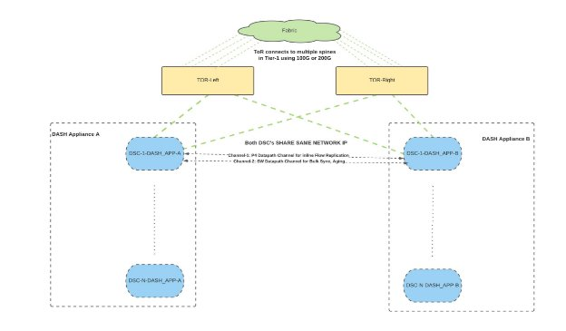
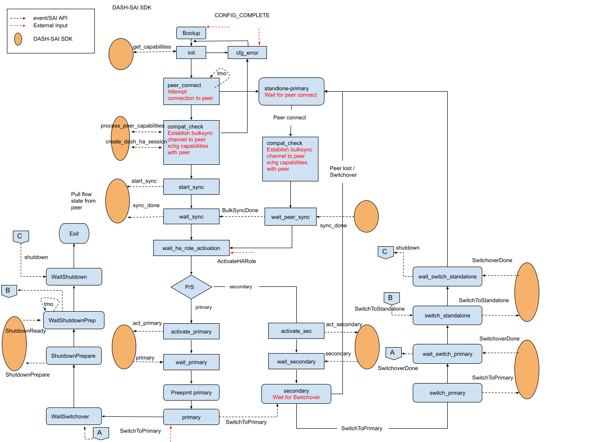
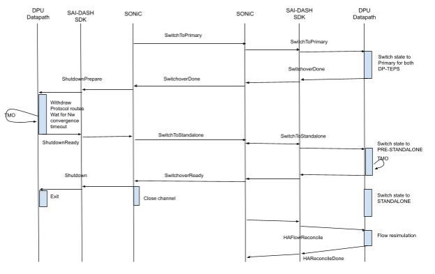

# DASH High Availability proposal

## Overview

This document describes the High availability mechanisms for DPUs in the DASH framework. High Availability is achieved by pairing DPUs such that a failure in any one in the pair results in the surviving DPU taking over forwarding on behalf of the failed DPU. Since forwarding on the DPU is stateful, all forwarding state from each DPU is synchronized with the other so that the switchover is seamless for user traffic. This document describes the procedures for such pairing and the mechanisms for synchronizing state between the pair.

## Design Goals

This proposal has the following design goals

1. All connections setup before switchover should work reliably after planned and unplanned switchovers
1. 0 downtime planned switchover, <2 sec downtime unplanned switchover
1. Data packets should not be dropped due to flow replication delays
1. Sync connection setup and teardown at datapath rate to support high CPS
1. Sync only required packets to conserve PPS for data traffic

## Functional Description

### Terminology


The above picture shows the terminology used for the layers in this document. The SONIC stack represents the sonic stack including gnmi, swss, syncd etc.. DASH SDK is the vendor implementation specific DASH SDK. The DPU is the vendor implementation of the hardware datapath and any associated sw components.

### Network Topology

The 2 DPUs in the pairing relation is administratively defined via configuration. Pairing and synchronization happens via the data network. Each DPU is typically connected to the data fabric via 2 interfaces which provides high availability in case of  failure in one of the network paths (link or tor). Each DPU has the following IPs

1. Link IPs connecting to the the TOR
1. A Control plane Loopback IP unique to each DPU
1. 2 Datapath VIPs shared between the pair of DPUs

The loopback IPs (#2, and #3 above) are advertised and maintained via dynamic advertisements from the DPU. The picture below shows the network topology with 2 paired DPUs.



#### Control Network Loopback IP (CNIP)

The control plane Loopback IP, also referred to in this document as the CNIP, is unique to each DPU and provides the ability to address each DPU as long as some connectivity exists between the DPU and the network fabric. This is used to communicate between the paired DPUs. All control plane traffic between the DPUs is sourced from this IP and addressed to this IP. The Peer DPU is identified by its control plane loopback IP. The CNIP is used for pairing between the DPUs by exchanging control messages, for all flow synchronization packets - both bulk and datapath sync (covered later) and datapath heartbeat messages . The Same IP address is used by the datapath to originate and terminate flow sync packets.

#### Datapath VIP

The Datapath VIP IPs are the addresses that are used to direct traffic towards the DPU by the rest of the network. The use of 2 VIP loopback IPs allows for the DPUs to provide an ENI based active-active forwarding paradigm.

### ENI based active-active

The 2 Datapath VIPs (DP-VIP) are shared between the paired DPUs. Each DP-VIP is associated with a primary and a secondary DPU. In steady state each DPU has one primary DP-VIP and a secondary DP-VIP while on the peer DPU the roles are flipped. The DPU attracts traffic such that traffic for each DP-VIP lands on the primary DPU for the VIP. The DPU achieves this by signaling via network protocols to the fabric.

Each ENI configured on the DPU is associated with a DP-VIP by the controller. In steady state for the set of ENIs managed by a DPU pair, traffic to and from a set of ENIs land on one of the DPUs while traffic to/from the remaining ENIs are handled by the other DPU. Thus the dataplanes on both the DPUs are actively forwarding traffic. On failure or administrative switchover, the secondary DPU takes over the active DPUs role for the DP-VIP and hence the DPU ends up handling traffic for both the DP-VIPs at the same time. State synchronization between the 2 DPUs ensures that on switchover there is no loss in state and switchover is seamless for user traffic.

### Datapath Heartbeat

Each DPU sends heartbeat messages at a configured interval to its peer. When a peer loses a set number of heartbeats it declares the peer unreachable and a switchover is initiated. The interval between heartbeats and the number of missed heartbeats are configurable. The Heartbeats can be aggressive hence it is left to the DPU to perform the heartbeat.

## State Synchronization

State synchronization between the 2 DPUs uses the CNIP IP. All state synchronization happens at the granularity of the DP-VIP and happens from the primary of the DP-VIP towards the secondary. State synchronization happens in 2 parallel stages

1. Bulk Sync
1. Data path sync

The below figure shows the channels used for synchronization. The Bulk sync and the datapath synchronization uses 2 different channels.


The Control Plane channel is managed by SONiC stack. The SONiC stack relays messages from the DPU to the remote DPU in addition to originating and consuming messages. The Control Plane Channel is used to relay messages between the primary and active. This channel carries Bulk Sync messages, Control messages between the SONIC stack and control messages between the DPUs. This channel is a gRPC bidirectional stream between the 2 SONIC instances in this proposal

In addition to the Control Plane Channel, there is a DP Sync channel. This channel is between the data paths of the DPUs. This channel is used for Datapath Synchronization which  is covered in a later section.

### Bulk Sync

On bootup of a DPU, the DPU attempts to look for the configured peer. If the DPU is not able to reach its peer in a given interval of time, the state of the DPU is said to be “standalone” mode. Both the DP-VIPs are set to PRIMARY-STANDALONE mode. This causes the DP-VIP IP addresses to be advertised to the network. Traffic received on the DP-VIP is forwarded and flow state is built accordingly.

As the peer DPU comes online at some later point in time and Control Plane connectivity is established between the two DPUs, the peer requests for a sync of all accumulated states. This sync is called the Bulk sync.

The picture above shows a block schematic. The SONiC stack establishes the Control Plane Channel on discovering the liveness of the peer. The Control Plane channel is a bi-directional channel. This channel is defined as a bi-dir streaming grpc channel. The bidirectional stream allows the peers to sync in lock step in an efficient way. The messages used on the channel are defined in a later section. The usage of the message in different workflows is defined later.

Bulk sync follows the perfect-sync method of marking all flows created during the bulk sync process with a color and syncing all flows not that color to the secondary.

### Datapath Synchronization

An Inline flow replication synchronization is employed to allow for reliable and timely synchronization. This synchronization models the primary and the secondary DPUs as one logical DSC. Flow setup and delete are complete only once the operation is performed on both the primary and the secondary. The primary`s policy evaluation result is honored on the secondary so no policy evaluation happens on the secondary. There is a reconciliation that is performed on switchover when the secondary becomes primary. That is discussed in a later section.


Only Control packets for a flow are synched to the secondary. Once the flow has been synchronized to the secondary the primary does not forward any packets to the secondary. The Primary tracks the status of the synchronization to achieve the short circuit. The exact mechanisms for doing this will vary for each hardware implementation and is not covered here. The inline synchronization mechanism has the advantage that there is no buffering of data packets in the DPU. any network losses either in the Source-DPU, DPU-DPU, DPU-Dest paths are handled due to retransmission by the source (in case of TCP) or handled as regular network drops (in case of UDP/ICMP)

The sync packets between the DPUs are logically structured as below.


### Interaction between Bulk Sync and Datapath Sync

Due to the scale requirements for DASH the flow table size that needs to be handled during bulk sync can be very large and hence the bulk sync process can take a long time to complete. It is not possible to halt all traffic that would create new flows during this time. Hence the sync mechanism has to handle creation of new flows during bulk sync. It is also possible that there might be changes in the policy that might affect existing flows. The perfect sync mechanism calls for marking different  “color”s to flows that are created after the start of bulk sync. The flow table is walked and all flows not the current color are synchronized to the peer. Any flows that are created during the bulk sync phase are inline synchronized via the datapath synchronization path. Other challenges include

- Handling of flows that are affected by policy changes
- Flows that terminate during bulk sync
- Flow aging during bulk sync

All these problems require the hw implementation maintain a mechanism of marking the flows with a synchronization status and handle these events as per that status. During Bulk sync there might be flows that are in the bulk sync snapshot that are affected by changes. The actual mechanism of handling would differ by implementation and is not covered here. When implementation specific signaling is needed between the DPUs for such optimizations, the control plane channel allows for such messages to be relayed.

## HA State Machine



**Bootup**

This is the initial state for the box on bootup. The statemachine waits for external input to indicate that config is complete. At which point it progresses to the next state

**Init**

In this state the get\_capabilities call retrieves the local datapath capabilities. The SAI SDK call returns the local DPs capabilities as defined in the capabilities struct previously. This will be used in later exchanges with the peer. Validations of the local configuration as well as any other local checks are performed in this state. If there are configuration errors the state machine moves to Cfg\_err state and waits for configuration changes to fix the errors.

**Peer Connect**

There is a timed attempt made to connect to the peer in this stage. If there is no connectivity established with the peer within a configured timeout interval, the operational state moves to standalone-primary.

**Standalone Primary**

In the standalone primary mode all datapath functions are enabled and the DPU starts forwarding traffic. Since there is no peer connectivity established, no flow synchronization is needed.

**Compat Check**

The peer connect sequence exchanges capabilities with the peer. These received capabilities are then compared with the local capabilities for compatibility. The compat is done in 2 stages. The first is compatibility at the SONIC stack level. Any common attributes (across all implementations) is checked here. The next stage is to check compatibility between the underlying DASH implementations. This is done via a SAI-DASH call to the SDK.

**Start Sync**

Once the two peers are deemed compatible bulk sync is initiated between the peers. First the SONIC stack establishes a bidirectional streaming sync channel between the peers (Control Plane Channel). This channel is then passed to the DASH SDK. The underlying DPU implementation then uses the CP Channel to exchange messages between the peers. The data transfer involves Flow sync messages from Primary to Secondary. There can also be messages from the Secondary to the Primary to back pressure or optimize the primary->secondary flow data.

**Wait Sync**

The State machine on the SONIC stack then waits for the DP to signal completion of bulk sync in this state. The completion of the bulk sync is notified by the DP in a CP control message. At this point further states are defined by the configured Admin role of the DPU.

**Wait Peer Sync**

This state is on node that is in standalone primary and is servicing a bulk sync request from the newly booting up peer. SInce the Bulk sync is initiated from the new node, the existing node waits for a signal from the SDK that  bulk sync has been completed. When the BulkSyncDone message is received it is relayed to the peer and also triggers the transition out of this state.

**Wait HA Role Activation**

As per deployment requirements the controller has the control to activate the HA role. Transition to Primary or Secondary happens only after the controller signals so. This state waits on such an external trigger to activate.

**Activate Primary**

This state is reached when bulk sync is complete and the admin role of the node is primary. The node then attempts to take over as the primary. This is triggered by notifying the underlying datapath to switch to the primary role. At this point the VIP routes are advertised to attract traffic.

**Wait Primary**

In this state the node is waiting for the Datapath to signal completion of taking over as primary. The datapath indicates this by notifying the SONIC stack via an oper status update message. At this point the peer is notified to move to standby.

**Activate Secondary**

This state is reached when bulk sync is complete and the admin role of the node is secondary. The node then attempts to get to the secondary state. This is triggered by notifying the underlying datapath to switch to the secondary role. At this point the VIP routes are advertised. The routes may be advertised with a less desirable metric.

**Wait Secondary**

In this state the node is waiting for the Datapath to signal completion of state as secondary. The datapath indicates this by notifying the SONIC stack via an oper status update message.

**Secondary**

If the configured role is secondary the node goes to terminal state secondary. The DPU then waits for a switchover event to switch to primary. In this state the node keeps receiving flow sync messages from the peer and keeps the datapath ready for switchover.

**Primary**

This is the terminal state for the node when the node is configured as the primary. In this state the local datapath is forwarding traffic actively and synching state to the peer.

### SAI Definitions

The SAI API calls necessary for communication between the SONIC stack and the SAI-DASH SDK are defined below.

```cpp
#include <saitypes.h>

/**
 * @brief Notification data format for received for the DPU Control message
 *  callback.
 */
typedef struct _sai_dash_dpu_control_message_notification_data_t {
    /**
     * @brief Control message Type
     */
     sai_uint16_t type;

    /**
     * @brief Data for the message
     */
     sai_u8_list_t data;
} sai_dash_dpu_control_message_notification_data_t;

/**
 * @brief L4 information for TCP and UDP flows.
 */
typedef struct _sai_dash_flow_tcp_udp_info_t {
    /** Source port */
    sai_uint16_t src_port;

    /** Destination port */
    sai_uint16_t dst_port;
} sai_dash_flow_tcp_udp_info_t;

/**
 * @brief L4 flow information for ICMP flows.
 */
typedef struct _sai_dash_flow_icmp_info_t {
    /** ICMP Type */
    sai_uint32_t type;

    /** ICMP code */
    sai_uint32_t code;

    /** ICMP ID */
    sai_uint32_t id;
} sai_dash_flow_icmp_info_t;

/**
 * @brief L4 Flow information
 */
typedef union _sai_dash_flow_l4_info_t {
    /** TCP/UDP info */
    sai_dash_flow_tcp_udp_info_t tcp_udp;

    /** ICMP Info */
    sai_dash_flow_icmp_info_t icmp;
} sai_dash_flow_l4_info_t;

/**
 * @brief Notification Data format for received flow sync messages from the DPU
 */
typedef struct _sai_dash_flow_sync_message_notification_data_t {
    /**
     * @brief ENI MAC for this flow
     */
    sai_mac_t eni_mac;

    /**
     * @brief Source IP address
     */
    sai_ip_address_t src_ip;

    /**
     * @brief Destination IP address
     */
    sai_ip_address_t dst_ip;

    /**
     * @brief IP Protocol
     */
    sai_uint8_t protocol;

    /**
     * @brief L4 Information (TCP/UDP/ICMP)
     */
    sai_dash_flow_l4_info_t l4_info;

    /**
     * @brief policy results metadata
     */
     sai_u8_list_t metadata;
} sai_dash_flow_sync_message_notification_data_t;

/**
 * @brief Attributes ID for get_peer_capabilities
 */
typedef enum  _sai_get_peer_capabilities_attr_t {
    /**
     * @brief HB Interval
     * @type sai_uint16_t
     */
    SAI_DASH_GET_PEER_CAPABILITIES_ATTR_HB_INTERVAL,

    /**
     * @brief HB Miss Count
     * @type sai_uint16_t
     */
    SAI_DASH_GET_PEER_CAPABILITIES_ATTR_HB_MISS_COUNT,

    /**
     * @brief Capabilities
     * @type sai_uint8_list_t
     */
    SAI_DASH_GET_PEER_CAPABILITIES_ATTR_CAPABILITIES,

} sai_get_peer_capabilities_attr_t;

/**
 * @brief Get Capabilities of the DP
 *
 * @param[in] sai_object_id_t vipID
 * @param[in] attr_count Number of attributes
 * @param[in] attr_list Array of attributes
 *
 * @return #SAI_STATUS_SUCCESS on success Failure status code on error
 */
typedef sai_status_t (*sai_get_capabilities_fn) (
    _In_ sai_object_id_t vipID;
    _In_ uint32_t attr_count,
    _InOut_ sai_attribute_t *attr_list);

/**
 * @brief Attributes ID for register_cp_channel
 */
typedef enum  _sai_register_cp_channel_attr_t {
    /**
     * @brief Named pipe for bi-directional control stream
     * @type sai_uint8_list_t
     */
    SAI_DASH_REGISTER_CP_CHANNEL_ATTR_NAMED_PIPE,
}

/**
 * @brief Register the CP control channel with the DP
 *
 * @param[in] sai_object_id_t vipID
 * @param[in] attr_count Number of attributes
 * @param[in] attr_list Array of attributes
 *
 * @return #SAI_STATUS_SUCCESS on success Failure status code on error
 */
typedef sai_status_t (*sai_register_cp_channel_fn) (
    _In_ sai_object_id_t vipID;
    _In_ uint32_t attr_count,
    _In_ sai_attribute_t *attr_list);

/**
 * @brief Attributes ID for process_peer_capabilities
 */
typedef enum  _sai_process_peer_capabilities_attr_t {
    /**
     * @brief HB Interval
     * @type sai_uint16_t
     */
    SAI_DASH_PROCESS_PEER_CAPABILITIES_ATTR_HB_INTERVAL,

    /**
     * @brief HB Miss Count
     * @type sai_uint16_t
     */
    SAI_DASH_PROCESS_PEER_CAPABILITIES_ATTR_HB_MISS_COUNT,

    /**
     * @brief Capabilities
     * @type sai_uint8_list_t
     */
    SAI_DASH_PROCESS_PEER_CAPABILITIES_ATTR_CAPABILITIES,

} sai_process_peer_capabilities_attr_t;

/**
 * @brief Process peer capabilities of peer DPU
 *
 * @param[in] sai_object_id_t vipID
 * @param[in] attr_count Number of attributes
 * @param[in] attr_list Array of attributes
 *
 * @return #SAI_STATUS_SUCCESS on success Failure status code on error
 */
typedef sai_status_t (*sai_process_peer_capabilities_fn) (
    _In_ sai_object_id_t vipID;
    _In_ uint32_t attr_count,
    _Inout_ sai_attribute_t *attr_list);

/**
 * @brief Attributes ID for process_dpu_control_message
 */
typedef enum _sai_process_dpu_control_message_attr_t {
    /**
    * @brief Type
    * @type sai_uint16_t
    */
    SAI_DASH_PROCESS_DPU_CONTROL_MESSAGE_ATTR_TYPE,

    /**
    * @brief Data
    * @type sai_u8_list_t
    */
    SAI_DASH_PROCESS_DPU_CONTROL_MESSAGE_ATTR_DATA,
} sai_process_dpu_control_message_attr_t;

/**
 * @brief Control Messages exchanged between Datapaths of DPU
 *
 * @param[in] sai_object_id_t vipID
 * @param[in] attr_count Number of attributes
 * @param[in] attr_list Array of attributes
 *
 * @return #SAI_STATUS_SUCCESS on success Failure status code on error
 */
typedef sai_status_t (*sai_process_dpu_control_message_fn) (
    _In_ sai_object_id_t vipID;
    _In_ uint32_t attr_count,
    _In_ sai_attribute_t *attr_list);

/**
 * @brief Attributes ID for process_flow_sync_message
 */
typedef enum _sai_process_flow_sync_message_attr_t {
    /**
    * @brief Flow information
    * @type sai_dash_flow_sync_message_notification_data_t
    */
    SAI_DASH_PROCESS_FLOW_SYNC_MESSAGE_ATTR_FLOW_INFO,
} sai_process_flow_sync_message_attr_t;

/**
 * @brief FLow Sync messages exchanged between of DPU
 *
 * @param[in] sai_object_id_t vipID
 * @param[in] attr_count Number of attributes
 * @param[in] attr_list Array of attributes
 *
 * @return #SAI_STATUS_SUCCESS on success Failure status code on error
 */
typedef sai_status_t (*sai_process_flow_sync_message_fn) (
    _In_ sai_object_id_t vipID;
    _In_ uint32_t attr_count,
    _In_ sai_attribute_t *attr_list);

/**
 * @brief Attributes ID for oper_role_status
 */
typedef enum _sai_oper_role_status_attr_t {
    /**
    * @brief OperState
    * @type sai_uint16_t
    */
    SAI_DASH_OPER_ROLE_STATUS_ATTR_OPER_STATE,
};

/**
 * @brief Update Oper Role state
 *
 * Updates from DPU for the operational role. Current state is passed as a attribute.
 *
 * @param[in] sai_object_id_t vipID
 * @param[in] attr_count Number of attributes
 * @param[in] attr_list Array of attributes
 *
 * @return #SAI_STATUS_SUCCESS on success Failure status code on error
 */
typedef sai_status_t (*sai_oper_role_status_fn) (
    _In_ sai_object_id_t vipID;
    _In_ uint32_t attr_count,
    _In_ sai_attribute_t *attr_list);

/**
 * @brief Attributes ID for cp_control_message
 */
typedef enum _sai_cp_control_message_attr_t {
    /**
    * @brief Operation
    * @type sai_uint16_t
    */
    SAI_DASH_CP_CONTROL_MESSAGE_ATTR_OPERATION,
} sai_cp_control_message_attr_t;

/**
 * @brief Process CP control message
 *
 * Process control messages between DPUs. The Operation is passed as a attribute.
 *
 * @param[in] sai_object_id_t vipID
 * @param[in] attr_count Number of attributes
 * @param[in] attr_list Array of attributes
 *
 * @return #SAI_STATUS_SUCCESS on success Failure status code on error
 */
typedef sai_status_t (*sai_cp_control_message_fn) (
    _In_ sai_object_id_t vipID;
    _In_ uint32_t attr_count,
    _In_ sai_attribute_t *attr_list;
)

typedef struct _sai_dash_ha_api_t {
    sai_register_cp_channel_fn          register_cp_channel;
    sai_get_capabilities_fn             get_capabilities;
    sai_process_peer_capabilities_fn    process_peer_capabilities;
    sai_process_dpu_control_message_fn  process_dpu_control_message;
    sai_process_flow_sync_message_fn    process_flow_sync_message;
    sai_oper_role_status_fn             oper_role_status;
    sai_cp_control_message_fn           cp_control_message;
} sai_dash_ha_api_t;
```

### Control Plane Channel Message Definitions

The below definitions pertain to the GRPC channel defined as the Control Plane Channel. This channel is established between the SONIC stacks on the two peer nodes. These messages can be originated from SONIC or sent by the DPU implementation and relayed via SONIC.

```protobuf
syntax = "proto3";
package dashsync;

// IP address families
enum IPAF {
  IP_AF_NONE  = 0;
  IP_AF_INET  = 1; // IPv4
  IP_AF_INET6 = 2; // IPv6
}

// Admin Roles for a VIP
enum AdminRole {
    // Unspecified
    AdminNone      = 0;
    // Primary node for peering session.
    AdminPrimary   = 1;
  // Secondary node for peering session.
    AdminSecondary = 2;
}

// Operational state of the VIP
enum OperRole {
  // Unspecified
  OperNone      = 0;
  // Primary node for peering session.
  OperPrimary   = 1;
  // Secondary node for peering session.
  OperSecondary = 2;
  // Standalone mode. No active peering.
  OperStandalone = 3;
}


// IP Address object
message IPAddress {
  IPAF      Af     = 1;
  // IP address family
  oneof v4_or_v6 {
    // IPv4 address
    fixed32 V4Addr = 2;
    // IPv6 address
    bytes   V6Addr = 3;
  }
}

// L4 portion of flow key tuple
message FlowL4Info {
  // key fields for TCP/UDP flows
  message TCPUDPInfo {
    uint32 SrcPort  = 1;
    uint32 DstPort  = 2;
  }
  // key fields for ICMP flows
  message ICMPInfo {
    uint32 Type = 1;
    uint32 Code = 2;
    uint32 Id   = 3;
  }
  oneof l4_info {
    TCPUDPInfo TcpUdpInfo = 1;
    ICMPInfo   IcmpInfo   = 2;
  }
}

// flow key for IP flows
message IPFlowKey {
  // ENI MAC address
  uint64     EniMAC     = 1;
  // source IP seen in the packet
  IPAddress  SrcIP      = 2;
  // destination IP seen in the packet
  IPAddress  DstIP      = 3;
  // IP protocol
  uint32     IPProtocol = 4;
  // L4 information of the flow key
  FlowL4Info L4Info     = 5;
}

// Flow Sync Msg
message FlowSyncMsg {
  message FlowInfo {
    // DP-VIP associated to the flow
    bytes VipId     = 1;
    // IP Flow tuple
    IPFlowKey Key   = 2;
    // Metadata containing policy results
    bytes Metadata  = 3;
  }
  repeated FlowInfo Info = 1;
}

// Control plane operations carried in CPControlMsg
enum CPControlOperation {
  OpNone                = 0;
  OpStartBulkSync       = 1;
  OpBulkSyncDone        = 2;
  OpShutdownPrepare     = 3;
  OpShutdownReady       = 4;
  OpShutdown            = 5;
  OpSwitchover          = 6;
  OpSwitchoverReady     = 7;
  OpSwitchoverDone      = 8;
}

// Message used to trigger/Notify state change events between peers.
message CPControlMsg {
  // The VIP this event pertains to.
  bytes VipId  = 1;
  // Operation/Event
  CPControlOperation Operation = 2;
}

// CompatCheck used to carry the compatibility information for the node
//  contains information about the DP-VIPs, the DPUs capabilities and any
//  other relevant capabilities to be checked.
message CompatCheck {
  // VIP related parameters. One added per VIP.
  message DpVIPInfo {
    bytes     VipId           = 1;
    // Address configured
    IPAddress VipIP           = 2;
    // Role of the VIP on this Node
    AdminRole AdminRole       = 3;
    // Metric used for the protocol to differentiate the primary/secondary routes.
    // Valid when using BGP as the underlay protocol.
    uint32    ProtocolMetric  = 4;
  }
  // DPU capabilities on this node.
  message DPUInfo {
    // Configured interval for HB messages
    uint32 HBinterval  = 1;
    // Number of HB misses that will trigger switchover
    uint32 MissCount   = 2;
    // Opaque
    bytes Capabilities = 3;
  }
  // Compatibility/Capability information for each VIP on the node. Typically two entries.
  repeated DpVIPInfo VipInfo = 1;
  // Copability information for the Datapath.
  DPUInfo DPUCapabilities    = 2;
}

// Results from the Compatibility check between the nodes.
enum CompatResult {
  CompatSuccess = 0;
  CompatFailure = 1;
}

// Results from the Compatibility check between the nodes.
message CompatResults {
  // Compatibility Error information pertaining to the VIP
  message DpVIPCompatError {
    // VIP this pertains to
    bytes         VipID   = 1;
    // Error code
    uint32        Code    = 2;
    // detailed user readable reason
    string        Reason  = 3;
  }

  message DPUCompatError {
    // Error code
    uint32        Code    = 2;
    // detailed user readable reason
    string        Reason  = 3;
  }
  CompatResult              Result          = 1;
  repeated DpVIPCompatError DpVIPInfo       = 2;
  DPUCompatError            DPUInfo         = 3;
}

// Control Message. This can be either from the Primary to Secondary or vice-versa
message DPUControlMsg {
  // Control Message type
  uint32 Type = 1;
  // Data for the message
  bytes Data  = 2;
}

// Wrapper message for all control messages between peers
message ControlMsg {
  oneof ctrl_msg {
    DPUControlMsg   DPUControlMsg   = 2;
    CompatCheck     CompatCheck     = 3;
    CompatResults   CompatResults   = 4;
    CPControlMsg    CPControlMsg    = 5;
  }
}

// Wrapper message for all messages between the peers.
message SyncMsg {
  oneof sync_msg {
    FlowSyncMsg FlowSyncMsg = 1;
    ControlMsg  ControlMsg  = 2;
  }
}

service CPSync {
  rpc SyncChannel(stream SyncMsg) returns (stream SyncMsg) {};
}
```

## Message Flows

The following are some important procedures and corresponding control message flows

### Node Pairing and Bulk Sync


Node pairing follows the state machine defined in the previous section. SONIC stack does initial connection to the peer. For each DPU pair the sonic stack establishes a bi-directional streaming channel to the peer. All control messages including bulk sync uses this channel. There is also a parallel channel registered between the DPU data paths directly. This channel will carry the DP flow sync messages between the DPUs (represented by the orange dotted lines in the picture above.

The initial compatibility messages exchanged between the peers ensures that capabilities match. These could be hardware capabilities, software capabilities, scale limits etc. As was mentioned earlier these capabilities are a combination of capabilities from the SONIC and capabilities of the DPU.

The SONIC stack initiates bulk sync between the peers and also notifies the DPU via the SDK to start bulk sync. The DPU sends and receives flow synchronization messages via the CP stream. DPUs can back pressure or optimize the bulk sync process with its DPU peer by exchanging the DPUControlMsgs on the channel.

As is evident from the picture above the Datapath flow synchronization may be initiated by the DPUs in parallel to the bulk sync process.

### Unplanned Switchover


This is triggered by failures in the network or a failure on the peer DPU. This is typically detected via loss of heartbeat message between the DPUs. The DPU then notifies the SONIC stack of the change via the notification message about the HB loss and initiates the switchover to standalone state on the DPU. Once the switchover is complete the SONIC stack is notified of the change via a notification.

All flows inserted on the secondary before switchover are after evaluation of primary`s policies. Flow resimulation triggers the flows to be evaluated as per local policies. The SONIC stack waits for confirmation from the SDN controller that all policy configurations on the DPU are updated and then initiates flow reconciliation on the DPU. This triggers flow resimulation to update policy results on flows as per current policy configuration.

### Planned Switchover



Switchover can be a planned event for maintenance and other reasons. With planned switchover the goal is to have close to zero loss and to coordinate between the primary and secondary to achieve this goal. Both the DP-VIPs will switch roles to primary on this trigger.

The controller initiates the planned switchover and notifies the secondary DPU to initiate switchover. Once switchover is complete the newly primary DPU relays a SwitchoverDone message to the old primary DPU. The old primary initiates a withdrawal of protocol routes so the network can drain traffic. During this time the old primary continues to forward traffic so any traffic in transit is forwarded without being dropped. During this network convergence timeout both the primary and secondary are forwarding traffic and flow sync messages may be exchanged in both directions.

After the network convergence time the new Primary enters PRE\_STANDALONE state and waits for a flush time out and transitions to standalone state.
**AMD-Pensando** 25
