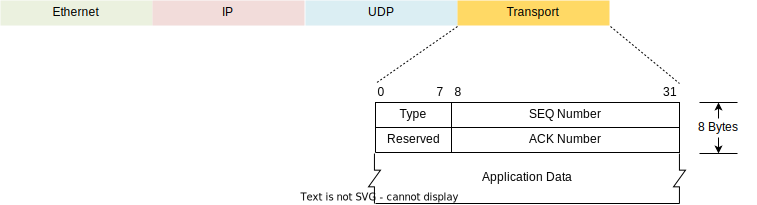

# Reliable Transport for DASH State Synchronization (Xsight Labs Proposal)
# Introduction
Synchronization of connection state across paired DPU devices requires a transport protocol between the devices. Ideally, a dedicated point-to-point physical link would be provisioned for synchronizing state between the two DPU devices and would provide the following characteristics: high bandwidth, low latency, lossless, and flow controlled. However, this dedicated point-to-point link is not practical. With some reasonable constraints, it is possible to meet the transport requirements for DASH state synchronization, while also minimizing complexity.

In normal operation, each direction of a TCP connection may be routed to the same DPU of the HA pair or to different DPUs of the pair. This routing is statistical and depends on ECMP hashing. Regardless of whether the two directions of the connection are on the same DPU or opposite DPUs, state updates must be communicated to the paired DPU. In the event of a failure (of a DPU, switch or link), a single DPU can take over all data plane processing for existing and new connections, albeit at degraded performance.

During the life of a typical TCP connection, state may be synchronized between paired DPUs up to six times. Long lived connections may require additional periodic synchronization to ensure that a passive DPU will not inadvertently age out a connection while the connection is still active on the partner DPU.

Connection state synchronization messages are approximately 24B for IPV4 connections. To amortize transport overhead, multiple messages may be coalesced into a single packet. A reasonable estimate is that 60 IPv4 state update messages can be coalesced into a single 1500B packet. Since 1 million CPS (connections per second) will require 60 million state update messages per second, this equates to 1 MPPS of 1500B packets. In other words, every 1 MCPS requires 12 Gbps of bandwidth for state synchronization. Suppose a DPU has 200GE of Ethernet interfaces and processes 5 MCPS. When this DPU is paired with another DPU of the same capability, 60 Gbps of bidirectional bandwidth is required to synchronize the combined 10 MCPS of the two DPUs. Of course, DPUs capable of handling higher CPS loads will require proportionately more bandwidth for state synchronization. 

The channel for connection state synchronization will be in-band, using the same Ethernet interfaces as the main DASH data plane. The network topology between the two paired DPUs should have as few switch hops as possible. Typically, in a DASH deployment, there will be at most two switch hops between HA partners. To the extent possible, the network should be engineered to minimize dropping of state synchronization packets. To prevent dropping of state synchronization packets caused by network congestion, QoS in the DPUs and switches should be configured to provision dedicated priority buffers and queues for state synchronization packets. Network dropping of state synchronization packets should be very infrequent.

A reliable transport protocol must be selected to recover the infrequently dropped packets since lost and unrecovered synchronization messages can result in broken TCP connections. One obvious choice for this transport is TCP. To achieve high throughput, TCP typically requires parallel streams. Parallel streams are also required to balance state synchronization bandwidth across multiple Ethernet ports of the DPU. State synchronization messages can be load balanced over these multiple TCP streams. The only restriction is that all synchronization messages for a given connection and direction (inbound vs outbound) should always be bound to the same TCP stream. This restriction is not too onerous.

Considering the operating environment, it is possible to define a light-weight reliable UDP transport protocol that achieves higher per-stream throughput than TCP, while also utilizing fewer DPU resources. The remainder of this document defines an alternative reliable protocol, based on UDP, for the purpose of transporting state synchronization messages.
# Reliable UDP Transport
##
## Operation
There are several factors that allow a purpose-built reliable UDP transport for state synchronization to be high performing, while also being simple to implement.

It is assumed that a TCP connection will be used as a control channel between the two paired DPUs. This control channel will be used for multiple purposes such as negotiation of capabilities and exchange of health information. This same control channel may also be used for configuration, opening, and closing of reliable UDP transport connections, eliminating the complexity of implementing these control functions within the transport protocol itself.

A block diagram of the transport protocol is shown in the following figure.

*Figure 1 - Reliable UDP Transport Block Diagram*

The basic concept is that state synchronization messages will be coalesced into larger UDP data packets, using a vendor selected algorithm (such as Nagle’s algorithm). Sequence numbers will be inserted on all transmitted data packets, starting at 0, and incremented for each packet transmitted. Acknowledgement numbers will also be inserted on all transmitted packets. The acknowledgement number represent the number of received packets that have been consumed by the application. Acknowledgement numbers generally will piggyback on data packets that carry messages. However, in the absence of any available data packets to transmit, keepalive control packets will be transmitted to convey acknowledgement information.

Due to the low/bounded latency of the network, a fixed window size will be used. The window size represents the maximum number of unacknowledged packets that will be buffered. The transmitter will buffer up to a window size worth of packets and then will stop accepting new messages from the application for transmission. When the application is flow controlled in this manner, it will not generate new state synchronization messages. Note: for the DASH data plane to not generate state synchronization messages, it must drop packets that cause connection state changes. Degraded connection setup and closure performance will occur during periods of state synchronization flow control. While this is an extreme circumstance that is not expected to occur in normal operation, this is a necessary behavior to protect the system from unrecoverable losses of state synchronization.

The transmitter buffers packets in its window size buffer by inserting new packets at the ***tail*** index. The ***tx*** index represents the packets that have been transmitted. Transmission will stop when the ***tx*** index reaches the ***tail*** index. The ***head*** index represents the packets that have been acknowledged. As packets are received, the transmitter’s ***head*** index will be advanced to the acknowledgement number.

Whenever a packet arrives at the receiver that is in sequence, the packet will be buffered in the receiver’s window size buffer at the ***tail*** index. The application will consume packets and advance the ***head*** index. The ***head*** index of the receiver will be conveyed in each transmitted packet as the acknowledgement number.

If a packet arrives at the receiver with a sequence number that is not continuous with the previously received packet, the receiver will trigger a control packet with a nack number indicating the sequence number of the missing packet. All subsequent packets will be dropped by the receiver until a packet with the expected sequence number arrives. When a control packet with a nack is received, the transmitter’s ***tx*** index will be reset to the nack value. This will cause the transmitter to retransmit all packets, starting from the packet that was missing at the receiver. Retransmitted packets will contain the original sequence numbers, however acknowledgement numbers in packets will always be the most up to date value.

The description above represents the simple operation of the transport protocol. However, there are a few edge conditions that must be handled.

1. **The control packet containing the nack indication is dropped by the network**

Whenever a nack is transmitted, a nack timer is started. When the retransmitted packet is successfully received, the timer is cancelled. If the timer expires, the nack control packet is retransmitted. The nack timeout value should be configured to be longer than maximum expected network round trip time. A counter will track the number of repeated nack retransmits. If this exceeds a configured maximum, then the transport connection will be deemed broken. The handling of a broken connection is TBD.

1. **Packets are only being transmitted in one direction, such that piggybacked acknowledgements never flow in the opposite direction.**

Whenever any packet is transmitted, a keepalive timer is reset. If the timer expires, a keepalive control packet containing the current acknowledgement number is transmitted. The keepalive timeout value should be configured to less than the expected network round trip time.

Whenever a packet is received, an idle timer is reset. If the idle timer expires, the transport connection will be deemed broken. The handling of a broken connection is TBD. The idle timeout value should be configured to be several times that of the keepalive timer.

1. **Packet(s) are transmitted and dropped by the network. The application has no more packets to transmit. The receiver at the other end never detects a sequence number discontinuity and never triggers the nack control packet for retransmission of the dropped packet(s).**

Keepalive control packets will also contain the sequence number that will be used for the next data packet to be transmitted. The receiver will use this value to detect a sequence number discontinuity and will trigger a nack control packet.
##
## Packet Format
The packet format is shown in the following diagram. The transport layer contains an 8-byte header following the packet’s UDP header. For control packets, no application data is contained in the transport layer. For data packets, a variable number of bytes of application data, including 0 bytes will follow the 8-byte transport layer header.

*Figure 2- Transport Packet Format*

The following fields are defined for the transport layer header:

|**Field**|**Description**|
| :- | :- |
|**Type**|
An enumeration value of the packet type.

0	Data packet

1	Keep alive control packet

2	Nack control packet

3-255	Reserved
|
|**SEQ Number**|
A 24-bit sequence number

For data packets, this is the sequence number of the packet. For keepalive control packets, this is the sequence number that will be used for the next data packet. For nack control packets, this is the sequence number of the dropped packet.
|
|**ACK Number**|
A 24-bit acknowledgement number

This is the count of received packets that have been consumed by the application.
|
*Table 1 – Transport Layer Header Fields*
##
## Configuration Parameters
The following parameters are defined for each reliable transport connection:

|**Parameter**|**Description**|
| :- | :- |
|**Window Size**|The number of packets that may be buffered by each transmitter and receiver. For simplicity of implementation, this will be constrained to be a power of 2, from 2 to 224. This should be set to buffer at least one round trip time of data transmission at the maximum expected data rate for the connection.|
|**Nack Timeout**|The time from transmitting a nack control packet to retransmitting the nack control packet when the indicated dropped packet is not subsequently received. This should be set to be larger than the expected maximum round trip time.|
|**Max Nack**|The maximum number of nack retransmits. A subsequent timeout of the Nack timer after the maximum number of nack retransmits will cause the transport connection to be deemed broken. This should be set to a value of 3 or greater.|
|**Keepalive Timeout**|The time from transmission any packet to transmission of a keep alive control packet when no other intervening packets are transmitted. This should be set to be less than the expected round trip time.|
|**Idle timeout**|The time from the last received packet to deeming a broken connection. This should be set to be at least 3 times the keepalive timeout.|
*Table 2 – Transport Configuration Parameters*

