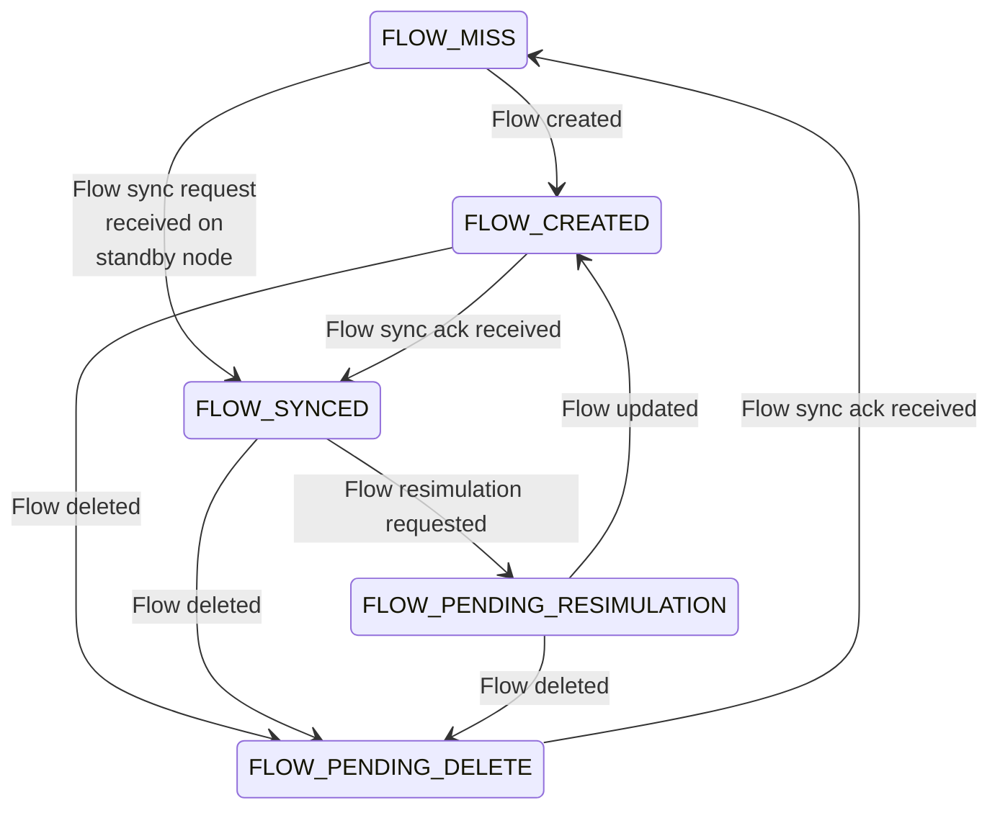
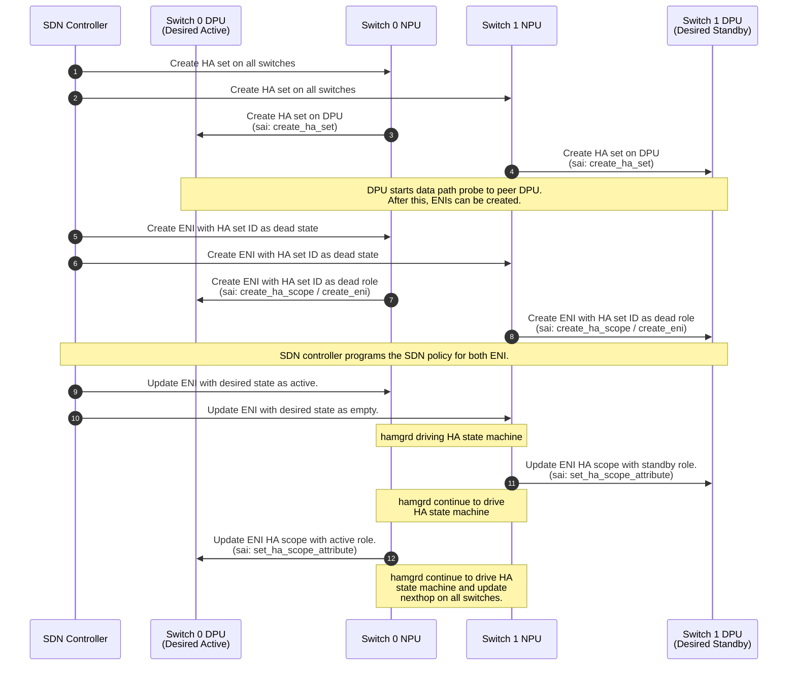
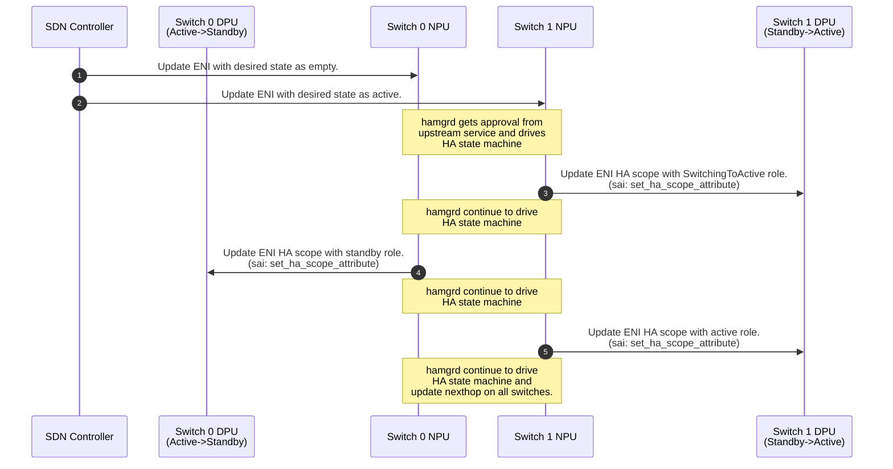
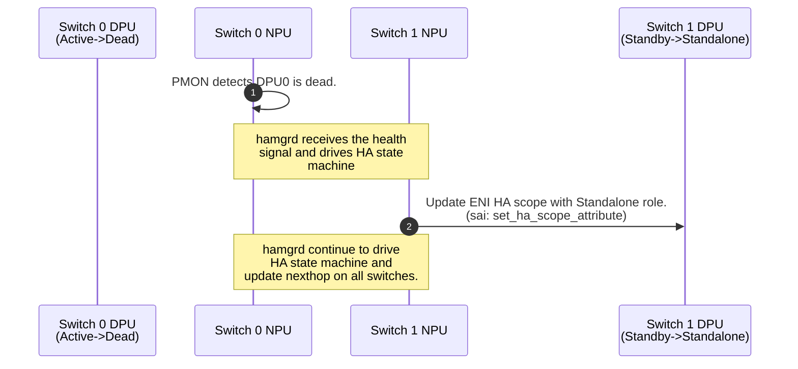
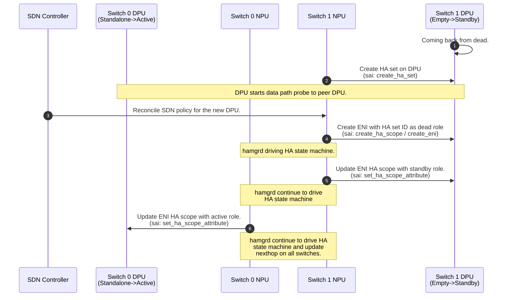

# DASH High Availability API

| Rev | Date | Author | Change Description |
| --- | ---- | ------ | ------------------ |
| 0.1 | 03/02/2024 | Riff Jiang | Initial version. |
| 0.2 | 03/15/2024 | Riff Jiang | Added HA set notification. |
| 0.3 | 03/21/2024 | Riff Jiang | Added capabilities for HA topology and stats. |
| 0.4 | 04/01/2024 | Riff Jiang | Added capabilities for HA owner, simplified capabilities for HA topology. |
| 0.5 | 04/08/2024 | Riff Jiang | Added support for bulk sync. |
| 0.6 | 04/09/2024 | Riff Jiang | Added support for flow reconcile for planned and unplanned switchover. |
| 0.7 | 06/20/2024 | Mukesh Velayudhan  | Added DPU scope DPU driven attributes and description. |

1. [1. Terminology](#1-terminology)
2. [2. Background](#2-background)
3. [3. Overview](#3-overview)
4. [4. SAI APIs](#4-sai-apis)
   1. [4.1. HA Set](#41-ha-set)
   2. [4.2. HA Scope](#42-ha-scope)
   3. [4.3. Flow table](#43-flow-table)
   4. [4.4. Flow](#44-flow)
   5. [4.5. ENI](#45-eni)
   6. [4.6. Event notifications](#46-event-notifications)
      1. [4.6.1. HA set event notifications](#461-ha-set-event-notifications)
      2. [4.6.2. HA scope event notifications](#462-ha-scope-event-notifications)
   7. [4.7. Counters](#47-counters)
      1. [4.7.1. Port stats](#471-port-stats)
      2. [4.7.2. HA set stats](#472-ha-set-stats)
         1. [4.7.2.1. Data plane channel related stats](#4721-data-plane-channel-related-stats)
         2. [4.7.2.2. Control plane data channel related stats](#4722-control-plane-data-channel-related-stats)
      3. [4.7.3. ENI stats](#473-eni-stats)
         1. [4.7.3.1. ENI-level traffic counters](#4731-eni-level-traffic-counters)
         2. [4.7.3.2. ENI-level flow operation counters](#4732-eni-level-flow-operation-counters)
         3. [4.7.3.3. ENI-level flow sync packet counters](#4733-eni-level-flow-sync-packet-counters)
         4. [4.7.3.4. ENI-level flow sync operations counters](#4734-eni-level-flow-sync-operations-counters)
         5. [4.7.3.5. ENI-level drop counters](#4735-eni-level-drop-counters)
   8. [4.8. Capability](#48-capability)
      1. [4.8.1. Topology related capabilities](#481-topology-related-capabilities)
      2. [4.8.2. Stats related capabilities](#482-stats-related-capabilities)
5. [5. HA in DASH behavior model](#5-ha-in-dash-behavior-model)
   1. [5.1. HA stage](#51-ha-stage)
   2. [5.2. Packet type and flow operations](#52-packet-type-and-flow-operations)
   3. [5.3. Life of the packet](#53-life-of-the-packet)
6. [6. Workflows](#6-workflows)
   1. [6.1. ENI level HA](#61-eni-level-ha)
      1. [6.1.1. HA set and ENI creation](#611-ha-set-and-eni-creation)
      2. [6.1.2. Switchover](#612-switchover)
      3. [6.1.3. Unplanned failover](#613-unplanned-failover)
      4. [6.1.4. Recover from unplanned failover](#614-recover-from-unplanned-failover)

## 1. Terminology

| Term | Explanation |
| ---- | ----------- |
| HA | High Availability. |
| NPU | Network Processing Unit. |
| DPU | Data Processing Unit. |
| ENI | Elastic Network Interface. |
| VIP | Virtual IP address. |

## 2. Background

The DASH high availability APIs are a set of APIs to support flow HA feature for DASH. It follows the [SmartSwitch high availability design](https://github.com/sonic-net/SONiC/blob/master/doc/smart-switch/high-availability/smart-switch-ha-hld.md) and used to ensure the flow created on the active DPU can be correctly synchronized to the peered DPU.

For how the network topology is setup and how flow HA works, such as lifetime management, inline sync, bulk sync, and packet format, please refer to the [SmartSwitch high availability design](https://github.com/sonic-net/SONiC/blob/master/doc/smart-switch/high-availability/smart-switch-ha-hld.md). In this doc, we will only focus on the design from SAI API perspective.

These APIs also support the mode described in [SmartSwitch HA Design - DPU-scope-DPU-driven setup](https://github.com/sonic-net/SONiC/blob/master/doc/smart-switch/high-availability/smart-switch-ha-dpu-scope-dpu-driven-setup.md), in which the vendor SDK on the DPU owns the HA state machine and drives state transitions on its own by directly communicating with its HA pair underneath the SAI layer.

## 3. Overview

To support the [SmartSwitch HA workflows](https://github.com/sonic-net/SONiC/blob/master/doc/smart-switch/high-availability/smart-switch-ha-hld.md), from SAI perspective, there are a few key components involved:

- **HA set**: It defines the peer DPU and data plane channel that used for inline flow sync.
- **HA scope**: It controls the failover scope, such as HA role, such as active, standby or standalone, and expected flow version for new flows. Depends on the HA role of the ENI, the packet will be processed differently to get the flow synched.
- **Flow table**: It is the container of all flow entries. It can be attached to all ENIs in a DPU or being attached to a single DPU, depends on at which level we like to provide the flow HA, i.e. HA scope.
- **Flow**: It is used to represent a network connection, which contains match conditions and packet transformations. In HA, each flow will have it own HA-related states, such flow version, flow sync state and etc.
- **ENI**: In ENI-level HA, each ENI will be connected to a different HA scope. In DPU scope HA, all ENIs or a group of ENIs will be associated with a HA scope.

The components is designed to be conceptually simple and reusable, hence we can use these components to support different HA setup. For example, to support the current ENI-level HA design, these components can be put together as below:


If more complex scenario support is needed, we can reuse the same components to represent them easily. For example, here is the topology that can be used to represent DPU-level HA:


Or, with even more complicated topology, such as each ENI owns 2 dedicated flow tables and a single DPU can pair with multiple DPUs:


> Note: The graphs here is to show the flexibiilty of these concepts, but not require all the possible topology to be supported by the DASH providers.

## 4. SAI APIs

To illustrate how these concepts look, their SAI API design is shown as below.

### 4.1. HA Set

HA set is defined as a SAI object and contains the following SAI attributes:

| Attribute name | Type | Description |
| -------------- | ---- | ----------- |
| SAI_HA_SET_ATTR_LOCAL_IP | `sai_ip_address_t` | The IP address of the local DPU. |
| SAI_HA_SET_ATTR_PEER_IP | `sai_ip_address_t` | The IP address of the peer DPU. |
| SAI_HA_SET_ATTR_CP_DATA_CHANNEL_PORT | `sai_uint16_t` | The port used for control plane data channel. |
| SAI_HA_SET_ATTR_DP_CHANNEL_DST_PORT | `sai_uint16_t` | The destination port of the data plane channel. |
| SAI_HA_SET_ATTR_DP_CHANNEL_SRC_PORT_MIN | `sai_uint16_t` | The minimum source port of the data plane channel. |
| SAI_HA_SET_ATTR_DP_CHANNEL_SRC_PORT_MAX | `sai_uint16_t` | The maximum source port of the data plane channel. |
| SAI_HA_SET_ATTR_DP_CHANNEL_PROBE_INTERVAL_MS | `sai_uint32_t` | The interval of the data plane channel probe. |
| SAI_HA_SET_ATTR_DP_CHANNEL_PROBE_FAIL_THRESHOLD | `sai_uint32_t` | The threshold of the data plane channel probe fail. |
| SAI_HA_SET_ATTR_DP_CHANNEL_IS_ALIVE | `bool` | (Read-only) Is data plane channel alive. |
| SAI_HA_SET_ATTR_DPU_DRIVEN_HA_SWITCHOVER_WAIT_TIME_MS | sai_uint32_t | Time to wait for the network to switchover traffic in DPU driven HA mode. |

### 4.2. HA Scope

HA scope is also defined as a SAI object and contains the following SAI attributes:

| Attribute name | Type | Description |
| -------------- | ---- | ----------- |
| SAI_HA_SCOPE_ATTR_HA_SET_ID | `sai_object_id_t` | The HA set ID for this scope. |
| SAI_HA_SCOPE_ATTR_HA_ROLE | `sai_dash_ha_role_t` | The HA role. |
| SAI_HA_SCOPE_ATTR_FLOW_VERSION | `sai_uint32_t` | The flow version for new flows. |
| SAI_HA_SCOPE_ATTR_FLOW_RECONCILE_REQUESTED | `bool` | When set to true, flow reconcile will be initiated. |
| SAI_HA_SCOPE_ATTR_FLOW_RECONCILE_NEEDED | `bool` | (Read-only) If true, flow reconcile is needed. |
| SAI_HA_SCOPE_ATTR_VIP_V4 | `sai_ip_address_t` | IPv4 VIP of the HA scope (Used in DPU driven HA mode only). |
| SAI_HA_SCOPE_ATTR_VIP_V6 | `sai_ip_address_t` | IPv6 VIP of the HA scope (Used in DPU driven HA mode only). |
| SAI_HA_SCOPE_ATTR_ADMIN_STATE | `bool` | Administrative control of HA scope (In case of DPU driven HA mode, this is used to start or stop HA state machine). |
| SAI_HA_SCOPE_ATTR_HA_STATE | `sai_dash_ha_state_t` | (Read-only) Operational HA state. |
| SAI_HA_SCOPE_ATTR_ACTIVATE_ROLE | `bool` | Trigger DPU driven HA state machine to transition to steady state and prepare to start receiving traffic destined to VIP. |

The HA role is defined as below:

```c
typedef enum _sai_dash_ha_role_t
{
    SAI_DASH_HA_ROLE_DEAD,
    SAI_DASH_HA_ROLE_ACTIVE,
    SAI_DASH_HA_ROLE_STANDBY,
    SAI_DASH_HA_ROLE_STANDALONE,
    SAI_DASH_HA_ROLE_SWITCHING_TO_ACTIVE,
} sai_dash_ha_role_t;
```

The read-only HA state for DPU driven HA state machine is defined as below:

```c
typedef enum _sai_dash_ha_state_t
{
    SAI_DASH_HA_STATE_DEAD,
    SAI_DASH_HA_STATE_CONNECTING,
    SAI_DASH_HA_STATE_CONNECTED,
    SAI_DASH_HA_STATE_INITIALIZING_TO_ACTIVE,
    SAI_DASH_HA_STATE_INITIALIZING_TO_STANDBY,
    SAI_DASH_HA_STATE_PENDING_STANDALONE_ACTIVATION,
    SAI_DASH_HA_STATE_PENDING_ACTIVE_ACTIVATION,
    SAI_DASH_HA_STATE_PENDING_STANDBY_ACTIVATION,
    SAI_DASH_HA_STATE_STANDALONE,
    SAI_DASH_HA_STATE_ACTIVE,
    SAI_DASH_HA_STATE_STANDBY,
    SAI_DASH_HA_STATE_DESTROYING,
    SAI_DASH_HA_STATE_SWITCHING_TO_STANDALONE,
} sai_dash_ha_state_t;
```

### 4.3. Flow table

HA uses the DASH flow table to achieve the flow state manipulation. Since the flow table already provides the CRUD operations, we don't need any extra APIs from flow table.

For more information, please refer to DASH flow API documentation.

In the case of DPU driven mode, the flow table is fully managed by the vendor SDK on the DPU and is not exposed via the DASH flow APIs.

### 4.4. Flow

To support HA, each flow contains the following SAI attributes:

| Attribute name | Type | Description |
| -------------- | ---- | ----------- |
| SAI_FLOW_ATTR_FLOW_VERSION | `sai_uint32_t` | The flow version. |
| SAI_FLOW_ATTR_FLOW_SYNC_STATE | `sai_dash_ha_flow_sync_state_t` | The flow sync state. |

The flow sync state is defined as below:

```c
typedef enum _sai_dash_ha_flow_sync_state_t
{
    SAI_DASH_HA_FLOW_SYNC_STATE_FLOW_MISS,
    SAI_DASH_HA_FLOW_SYNC_STATE_FLOW_CREATED,
    SAI_DASH_HA_FLOW_SYNC_STATE_FLOW_SYNCED,
    SAI_DASH_HA_FLOW_SYNC_STATE_FLOW_PENDING_DELETE,
    SAI_DASH_HA_FLOW_SYNC_STATE_FLOW_PENDING_RESIMULATION
} sai_dash_ha_flow_sync_state_t;
```

The flow sync state is a small state machine that represents if the flow is synched or not, so we can make the packet processing decision accordingly to achieve HA.



For more information, please refer to DASH flow API documentation.

### 4.5. ENI

To provide the ENI-level HA control, each ENI will have the following SAI attributes:

| Attribute name | Type | Description |
| -------------- | ---- | ----------- |
| SAI_ENI_ATTR_HA_SCOPE_ID | `sai_object_id_t` | The HA scope ID of the ENI. |
| SAI_ENI_ATTR_IS_HA_FLOW_OWNER | `bool` | Determines which DPU in the pair creates flows belonging to this ENI in steady-state. Typically this is set to True for the ENIs on the Active DPU and False for the Standby DPU. |

### 4.6. Event notifications

To receive the HA related updates from the DASH implementation, the following SAI notification attributes are added on the switch object:

| Attribute name | Type | Description |
| -------------- | ---- | ----------- |
| SAI_SWITCH_ATTR_HA_SET_EVENT_NOTIFY | `sai_ha_set_event_notification_fn` | The callback function for receiving events on the HA set. |
| SAI_SWITCH_ATTR_HA_SCOPE_EVENT_NOTIFY | `sai_ha_scope_event_notification_fn` | The callback function for receiving events on the HA scope. |

#### 4.6.1. HA set event notifications

Whenever a HA set state is changed, it will be reported back via HA set event notification, such as data plane channel goes down. The detailed definition is shown as below:

```c
/**
 * @brief HA set event type
 */
typedef enum _sai_ha_set_event_t
{
    /** Data plane channel goes up. */
    SAI_HA_SET_DP_CHANNEL_UP,

    /** Data plane channel goes down. */
    SAI_HA_SET_DP_CHANNEL_DOWN,

} sai_ha_set_event_t;

/**
 * @brief Notification data format received from SAI HA set callback
 */
typedef struct _sai_ha_set_event_data_t
{
    /** Event type */
    sai_ha_set_event_t event_type;

    /** HA set id */
    sai_object_id_t ha_set_id;

} sai_ha_set_event_data_t;

/**
 * @brief HA set event notification
 *
 * Passed as a parameter into sai_initialize_switch()
 *
 * @count data[count]
 *
 * @param[in] count Number of notifications
 * @param[in] data Array of HA set events
 */
typedef void (*sai_ha_set_event_notification_fn)(
        _In_ uint32_t count,
        _In_ const sai_ha_set_event_data_t *ha_set_event_data);
```

#### 4.6.2. HA scope event notifications

Similar to HA set, whenever any HA scope state is changed, it will be reported back via HA scope event notification. The detailed definition is shown as below:

```c
/**
 * @brief HA set event type
 */
typedef enum _sai_ha_scope_event_t
{
    /** HA scope state changed */
    SAI_HA_SCOPE_EVENT_STATE_CHANGED,

    /** Flow reconcile is needed */
    SAI_HA_SCOPE_EVENT_FLOW_RECONCILE_NEEDED,

    /** DPU driven HA split brain detected */
    SAI_HA_SCOPE_EVENT_SPLIT_BRAIN_DETECTED,

} sai_ha_scope_event_t;

/**
 * @brief Notification data format received from SAI HA scope callback
 */
typedef struct _sai_ha_scope_event_data_t
{
    /** Event type */
    sai_ha_scope_event_t event_type;

    /** HA scope id */
    sai_object_id_t ha_scope_id;

    /** HA role */
    sai_dash_ha_role_t ha_role;

    /** Flow version */
    sai_uint32_t flow_version;

    /** HA state */
    sai_dash_ha_state_t ha_state;

} sai_ha_scope_event_data_t;

/**
 * @brief HA scope event notification
 *
 * Passed as a parameter into sai_initialize_switch()
 *
 * @count data[count]
 *
 * @param[in] count Number of notifications
 * @param[in] data Array of HA scope events
 */
typedef void (*sai_ha_scope_event_notification_fn)(
        _In_ uint32_t count,
        _In_ const sai_ha_scope_event_data_t *ha_scope_event_data);
```

### 4.7. Counters

To check how HA works, we will provide the following counters, which follows the [SmartSwitch HA detailed design doc](https://github.com/sonic-net/SONiC/blob/master/doc/smart-switch/high-availability/smart-switch-ha-detailed-design.md).

#### 4.7.1. Port stats

Since the packet could be dropped before it hits any ENI, e.g. ENI is not found, we have the follow counters added for showing these packet drops:

| SAI stats name | Description |
| -------------- | ----------- |
| SAI_PORT_STAT_ENI_MISS_DROP_PACKETS | Number of packets that are dropped due to ENI not found. |
| SAI_PORT_STAT_VIP_MISS_DROP_PACKETS | Number of packets that are dropped due to VIP not found. |

#### 4.7.2. HA set stats

Here are the new stats we added for monitoring HA on HA set (DPU pair).

##### 4.7.2.1. Data plane channel related stats

| SAI stats name | Description |
| -------------- | ----------- |
| SAI_HA_SET_STAT_DP_PROBE_(REQ/ACK)_RX_BYTES | The bytes of data plane probes that this HA set received. |
| SAI_HA_SET_STAT_DP_PROBE_(REQ/ACK)_RX_PACKETS | The number of packets of data plane probes that this HA set received. |
| SAI_HA_SET_STAT_DP_PROBE_(REQ/ACK)_TX_BYTES | The bytes of data plane probes that this HA set sent. |
| SAI_HA_SET_STAT_DP_PROBE_(REQ/ACK)_TX_PACKETS | The number of packets of data plane probes that this HA set sent. |
| SAI_HA_SET_STAT_DP_PROBE_FAILED | The number of probes that failed. The failure rate = the number of failed probes / the number of tx packets. |

##### 4.7.2.2. Control plane data channel related stats

| Name | Description |
| --- | --- |
| SAI_HA_SET_STAT_CP_DATA_CHANNEL_CONNECT_ATTEMPTED | Number of connect called to establish the data channel. |
| SAI_HA_SET_STAT_CP_DATA_CHANNEL_CONNECT_RECEIVED | Number of connect calls received to establish the data channel. |
| SAI_HA_SET_STAT_CP_DATA_CHANNEL_CONNECT_SUCCEEDED | Number of connect calls that succeeded. |
| SAI_HA_SET_STAT_CP_DATA_CHANNEL_CONNECT_FAILED | Number of connect calls that failed because of any reason other than timeout / unreachable. |
| SAI_HA_SET_STAT_CP_DATA_CHANNEL_CONNECT_REJECTED | Number of connect calls that rejected due to certs and etc. |
| SAI_HA_SET_STAT_CP_DATA_CHANNEL_TIMEOUT_COUNT | Number of connect calls that failed due to timeout / unreachable. |

Besides the channel status, we should also have the following counters for the bulk sync messages:

| Name | Description |
| --- | --- |
| SAI_HA_SET_STAT_BULK_SYNC_MESSAGE_RECEIVED | Number of messages we received for bulk sync via data channel. |
| SAI_HA_SET_STAT_BULK_SYNC_MESSAGE_SENT | Number of messages we sent for bulk sync via data channel. |
| SAI_HA_SET_STAT_BULK_SYNC_MESSAGE_SEND_FAILED | Number of messages we failed to sent for bulk sync via data channel. |
| SAI_HA_SET_STAT_BULK_SYNC_FLOW_RECEIVED | Number of flows received from bulk sync message. A single bulk sync message can contain many flow records. |
| SAI_HA_SET_STAT_BULK_SYNC_FLOW_SENT | Number of flows sent via bulk sync message. A single bulk sync message can contain many flow records. |

#### 4.7.3. ENI stats

##### 4.7.3.1. ENI-level traffic counters

To monitor the traffic on ENI level, the following stats are added:

| SAI stats name | Description |
| -------------- | ----------- |
| SAI_ENI_STAT_(/OUTBOUND_/INBOUND_)RX_BYTES | Total bytes received on ENI (overall/outbound/inbound) pipeline. |
| SAI_ENI_STAT_(/OUTBOUND_/INBOUND_)RX_PACKETS | Total number of packets received on ENI (overall/outbound/inbound) pipeline. |
| SAI_ENI_STAT_(/OUTBOUND_/INBOUND_)TX_BYTES | Total bytes sent by ENI (overall/outbound/inbound) pipeline. |
| SAI_ENI_STAT_(/OUTBOUND_/INBOUND_)TX_PACKETS | Total number of packets sent by ENI (overall/outbound/inbound) pipeline. |

The packet size of all the counters should contain the size of both the customer packet and the encap, to reflect the real traffic size. For the traffic volume of the customer packet only, they are counted using metering buckets.

##### 4.7.3.2. ENI-level flow operation counters

Here are the new stats added for monitoring flow operations on each ENI:

| SAI stats name | Description |
| -------------- | ----------- |
| SAI_ENI_STAT_FLOW_CREATED | Total flow created on ENI. |
| SAI_ENI_STAT_FLOW_CREATE_FAILED | Total flow failed to create on ENI. |
| SAI_ENI_STAT_FLOW_UPDATED | Total flow updated on ENI. |
| SAI_ENI_STAT_FLOW_UPDATE_FAILED | Total flow failed to update on ENI. |
| SAI_ENI_STAT_FLOW_DELETED | Total flow deleted on ENI. |
| SAI_ENI_STAT_FLOW_DELETE_FAILED | Total flow failed to delete on ENI. |
| SAI_ENI_STAT_FLOW_AGED | Total flow aged out on ENI. A flow is aged out doesn't mean the flow entry is deleted. It could be marked as pending deletion and get deleted later. |

##### 4.7.3.3. ENI-level flow sync packet counters

Here are the new stats added for monitoring flow sync packets on each ENI:

- The flow can be synched inline with the packet, or on a timer such as idle timeout.

| SAI stats name | Description |
| -------------- | ----------- |
| SAI_ENI_STAT_(INLINE/TIMED)_FLOW_SYNC_PACKET_RX_BYTES | The bytes of inline/timed flow sync packet received by the ENI. |
| SAI_ENI_STAT_(INLINE/TIMED)_FLOW_SYNC_PACKET_RX_PACKETS | The number of inline/timed flow sync packets received by the ENI. |
| SAI_ENI_STAT_(INLINE/TIMED)_FLOW_SYNC_PACKET_TX_BYTES | The bytes of inline/timed flow sync packet that this ENI sent. |
| SAI_ENI_STAT_(INLINE/TIMED)_FLOW_SYNC_PACKET_TX_PACKETS | The number of inline/timed flow sync packets that this ENI sent. |

##### 4.7.3.4. ENI-level flow sync operations counters

Here are the new stats added for monitoring flow sync operations on each ENI:

- The number of flow operations can be different from the number of flow sync packets. Depending on implementation, a single flow sync packet can carry multiple flow operations.
- The flow operation could fail or be ignored by ENI.
  - Failed means it is unexpected to receive packet, and we failed to process it.
  - Ignored means packet is expected be received, but we should ignore the flow operation inside and move on without dropping the packet. E.g., more packet arrives before flow sync is ack'ed.

| SAI stats name | Description |
| -------------- | ----------- |
| SAI_ENI_STAT_(INLINE/TIMED)\_FLOW\_(CREATE/UPDATE/DELETE)_REQ_SENT | The number of inline/timed flow create/update/delete request that the ENI sent. |
| SAI_ENI_STAT_(INLINE/TIMED)\_FLOW\_(CREATE/UPDATE/DELETE)_REQ_RECV | The number of inline/timed flow create/update/delete request that the ENI received. |
| SAI_ENI_STAT_(INLINE/TIMED)\_FLOW\_(CREATE/UPDATE/DELETE)_REQ_FAILED | The number of inline/timed flow create/update/delete request that the ENI received but failed to process. |
| SAI_ENI_STAT_(INLINE/TIMED)\_FLOW\_(CREATE/UPDATE/DELETE)_REQ_IGNORED | The number of inline/timed flow create/update/delete request that the ENI received but its flow operation is processed as ignored. |
| SAI_ENI_STAT_(INLINE/TIMED)\_FLOW\_(CREATE/UPDATE/DELETE)_ACK_RECV | The number of inline/timed flow create/update/delete ack that the ENI is received. |
| SAI_ENI_STAT_(INLINE/TIMED)\_FLOW\_(CREATE/UPDATE/DELETE)_ACK_FAILED | The number of inline/timed flow create/update/delete ack that the ENI is received but failed to process. |
| SAI_ENI_STAT_(INLINE/TIMED)\_FLOW\_(CREATE/UPDATE/DELETE)_ACK_IGNORED | The number of inline/timed flow create/update/delete ack that the ENI is received but its flow operation is processed as ignored. |

##### 4.7.3.5. ENI-level drop counters

When the packet is landed on the ENI going through each match stages, it might be dropped due to no entries can be matched, such as routing or CA-PA mapping. In order to show these drops, we should have the following counters:

| SAI stats name | Description |
| -------------- | ----------- |
| SAI_ENI_STAT_OUTBOUND_ROUTING_ENTRY_MISS_DROP_PACKETS | Number of packets that are dropped due to outbound routing entry not found. |
| SAI_ENI_STAT_OUTBOUND_CA_PA_ENTRY_MISS_DROP_PACKETS | Number of packets that are dropped due to outbound routing entry not found. |
| SAI_ENI_STAT_TUNNEL_MISS_DROP_PACKETS | Number of packets that are dropped due to outbound routing entry not found. |
| SAI_ENI_STAT_INBOUND_ROUTING_MISS_DROP_PACKETS| Number of packets that are dropped due to outbound routing entry not found. |

### 4.8. Capability

To check which type of topology is supported in the DASH implementation, the following read only attributes is added on the switch level for capability queries:

#### 4.8.1. Topology related capabilities

To describe how the topology looks like, we need to use at least 4 different attributes:

- \# of HA set that can be created
- \# of HA scope per HA set that can be created
- \# of ENI per HA scope that can be created
- \# of flow table that can be created

However, since we only support DPU level pairing with a single flow table and the topology we supported at this moment is limited, the topology related capability is added as high level modes, instead of individual attributes:

| Attribute name | Type | Description |
| -------------- | ---- | ----------- |
| SAI_SWITCH_ATTR_DASH_CAPS_HA_OWNER_NEEDED | `bool` | If `true`, the DASH host will own driving the HA state machine. |
| SAI_SWITCH_ATTR_DASH_CAPS_HA_SCOPE_LEVEL | `sai_dash_caps_ha_scope_level_t` | HA scope that supported by the DASH implementation. |

The HA scope capability enum is defined as below:

```c++
typedef enum _sai_dash_caps_ha_scope_level_t
{
    Card,
    ENI,
} sai_dash_caps_ha_scope_level_t;
```

And here is how the topology looks like for type of HA scope:

| HA scope | DPU | ENI |
| --- | --- | --- |
| \# of HA set | 1 | 1 |
| \# of HA scope per HA set | 1 | (Max \# of ENI) |
| \# of ENI per HA scope | (Max \# of ENI) | 1 |
| \# of flow table | 1 | 1 |

#### 4.8.2. Stats related capabilities

Stats related capabilities can help with 2 things:

1. Specify which stats is supported now, so we can start pulling to avoid errors.
2. Return internal debug stats to help with troubleshooting.

To query the HA stats related capabilities, we will use the existing SAI stats capabilities. For more details on the API, please refer to the [SAI object APIs](https://github.com/opencomputeproject/SAI/blob/master/inc/saiobject.h).

## 5. HA in DASH behavior model

With these concepts, we can now use them to build a pipeline with flow HA supported.

To illustrate how HA works in DASH, we implements HA in our behavior model. However it should only be treated as a logical example, but doesn't require the DASH providers to follow the exact same implementation. The goal is still to satisfy the requirements that defined in [our HA HLD](https://github.com/sonic-net/SONiC/blob/master/doc/smart-switch/high-availability/smart-switch-ha-hld.md).

> NOTE: This work is currently in progress, but how it will work is described here.

### 5.1. HA stage

In the DASH pipeline, the HA can be considered as a sub-stage of the Conntrack Lookup stage or a stage that follows the Conntrack Lookup stage.

When a packet arrives, it will:

1. From ENI, pick up the flow table id and HA scope id.
2. From flow table, pick up the current flow info, such as if flow exists and synched.
3. From HA scope, pick up the HA set id, HA role and expected flow version if it will create a new flow.
4. From HA set, pick up the peer DPU information.

Then, based on these information, the HA stage will make a decision on whether this packet should be forwarded directly, or going through slow path to get flow created or updated, or tunneled to its peer for flow sync or sending to active.

### 5.2. Packet type and flow operations

To support the flow HA, due to the nature of having different type of packets, such as regular packets vs flow sync packets, and different type of flow operations, such as flow creations vs flow updates, we have these things defined:

```c
// Packet source
enum bit<8> dash_packet_source_t {
    EXTERNAL = 0,           // Packets from external sources.
    DPAPP = 1,              // Packets from data plane app.
    PEER = 2                // Packets from the paired DPU.
};

// Packet type
enum bit<8> dash_packet_type_t {
    REGULAR = 0,            // Regular packets from external sources.
    FLOW_SYNC_REQ = 1,      // Flow sync request packet.
    FLOW_SYNC_ACK = 2,      // Flow sync ack packet.
    DP_PROBE_REQ = 3,       // Data plane probe packet.
    DP_PROBE_ACK = 4        // Data plane probe ack packet.
};

// HA flow sync operations
enum bit<8> dash_ha_flow_sync_op_t {
    FLOW_CREATE = 0, // New flow creation.
    FLOW_UPDATE = 1, // Flow resimulation or any other reason causing existing flow to be updated.
    FLOW_DELETE = 2  // Flow deletion.
};
```

### 5.3. Life of the packet

With these ingredients, we can enhance our current DASH behavior model to support flow HA.

To simplify the scenario, let's say a packet arrives at the active DPU in active-standby steady state. At a high level, the packet will transverse our pipeline as below, which syncs the flow inline:


1. (Green Lines) First, the packet for a new flow arrives to the active DPU. After ENI lookup, it will try to find the flow in the flow table. Due to flow being missing, the packet will go through the rest of the pipeline and eventually trapped into the data plane app.
2. (Black Lines in Active DPU) The data plane app will get the lookup result from the packet and insert the flow entry in not synched state to flow table using the DASH SAI flow APIs.
3. (Red Line in Active DPU) The data plane app recirculate the packet back to the pipeline and hit the flow table again, because the flow is not synched and this ENI is active side, HA stage will kick in and change this packet to a flow sync request packet, then forward it to its peer DPU.
4. (Yellow Lines) The flow sync packet goes to the standby side, which will also hit the flow miss, skip the HA stage and trapped into data plane app.
5. (Black Line in Standby DPU) The data plane app takes the flow decision from the flow sync packet, inserts the flow entry in synched state.
6. (Red Lines in Standby DPU) The data plane app recirculate the packet back to the pipeline and hit the flow table again, because the packet is a flow sync request and flow is in synched state, HA stage will transform this packet into flow sync ack and sending it back to its active side.
7. (Blue Lines) The packet goes back to the active side, which will hit the flow again. Since it is flow sync ack and flow is in not-synched state, the packet will be trapped into data plane app again.
8. (Black Line in Active DPU) The data plane app will update the flow sync state into synched state and recirculate the packet again.
9. (Purple Lines) The final packet will be sent to the pipeline again, hit the flow entry in synched state, applying all the transformation and send out to the network.

## 6. Workflows

### 6.1. ENI level HA

In ENI-level HA, the HA SAI APIs is designed to act passively according to the HA control plane decision.

To explain how HA API works from SAI API perspective, here are the examples of the common HA workflows.

> NOTE: The following workflow only shows the sequence of how each SAI API being called. But to achieve HA, besides this, we have HA control plane services that drives the HA state machine which ensures the APIs are called in the expected sequence. For more information, please refer to the planned operations and unplanned operations in [our HA HLD](https://github.com/sonic-net/SONiC/blob/master/doc/smart-switch/high-availability/smart-switch-ha-hld.md).

#### 6.1.1. HA set and ENI creation

The first step to start using HA is to create the HA set to form the DPU pair.

> The full workflow can be found in the ["Clean launch on both sides" section in SmartSwitch HA HLD](https://github.com/sonic-net/SONiC/blob/master/doc/smart-switch/high-availability/smart-switch-ha-hld.md#811-clean-launch-on-both-sides).



#### 6.1.2. Switchover

After the DPU goes into steady state, we can start initiating the switchover process.

In the ENI-level HA, the switchover starts from the standby side, so we can make sure the standby is ready to pick up the traffic before switching over.

> The full workflow can be found in the ["Planned switchover" section in SmartSwitch HA HLD](https://github.com/sonic-net/SONiC/blob/master/doc/smart-switch/high-availability/smart-switch-ha-hld.md#82-planned-switchover).



#### 6.1.3. Unplanned failover

Whenever the network or one DPU having problem, unplanned failover will be triggered.

In ENI-level HA, the unplanned events are monitored by the HA control plane via various of different event sources, such as PMON, counters and etc. Once any event is triggered, we will trigger the unplanned failover as below:

> The full workflow can be found in the ["Working as standalone setup" section in SmartSwitch HA HLD](https://github.com/sonic-net/SONiC/blob/master/doc/smart-switch/high-availability/smart-switch-ha-hld.md#101-working-as-standalone-setup).



#### 6.1.4. Recover from unplanned failover

During recovery, bulk sync will be used to ensure both sides contains the same set of flows.

In ENI-level HA today, perfect sync will be used as the default mechanism to sync the flows. It is done via the DASH flow APIs as below. For more information, please refer to the DASH flow API design doc.

> The full workflow can be found in the ["Launch with standalone peer" section in SmartSwitch HA HLD](https://github.com/sonic-net/SONiC/blob/master/doc/smart-switch/high-availability/smart-switch-ha-hld.md#812-launch-with-standalone-peer).



### 6.2. DPU scope DPU driven HA

The HA workflows for this mode are described in [SmartSwitch HA Design - DPU-scope-DPU-driven setup](https://github.com/sonic-net/SONiC/blob/master/doc/smart-switch/high-availability/smart-switch-ha-dpu-scope-dpu-driven-setup.md). In this mode, the hamgrd / swss act as pass-through and relay any HA state machine triggers from the SDN controller to the DPU via SAI API calls.

As described in the [DPU-driven setup HA set creation](https://github.com/sonic-net/SONiC/blob/master/doc/smart-switch/high-availability/smart-switch-ha-dpu-scope-dpu-driven-setup.md#81-ha-set-creation), the hamgrd/swss also listen to the HA state change event notification from the DPU and start BFD responder on the DPU to the NPUs based on the HA state.
