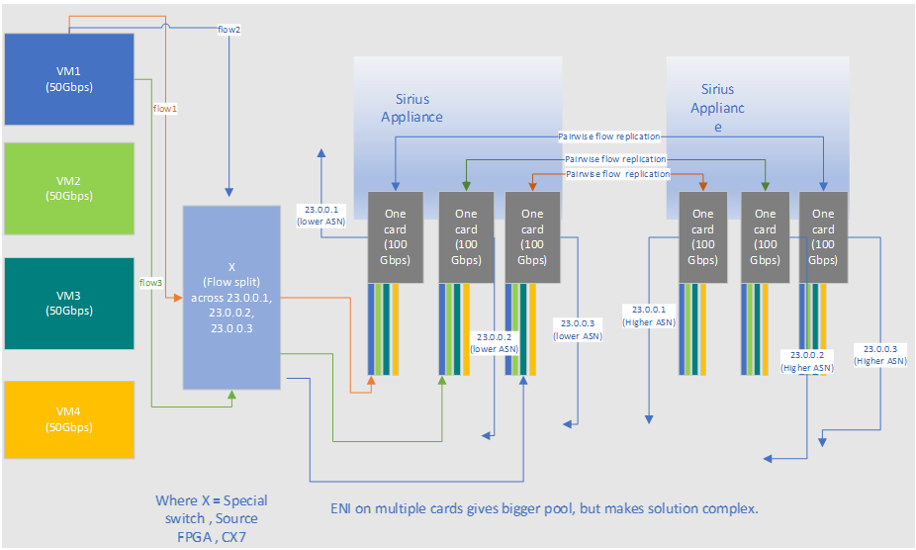

# High Availability and Scale

## Overview

This document covers the aspect of High Availability and Scalability of
the project in the SDN Appliance implementation.

High Availability is achieved via the following concepts:

-   Active-Passive architecture with Two (2) SDN Appliances
-   Overprovisioning -- same ENI handled by multiple appliance cards
-   Pairing -- each card from one SDN Appliance will have "paired" card
    in second SDN Appliance, with shared/same VIP

Scaling is achieved via the following concepts:

-   Overprovisioning -- same ENI handled by multiple appliance cards,
    each card with different VIP
-   Flow splitting -- TOR (or source node) splitting traffic equally
    across different VIPs

# Requirements

1. 0 downtime planned failover
1. <2 sec downtime unplanned failover
1. Ability to resume connections in event of both unplanned and planned
    failover
1. No complicated hashing logic in switches to ensure packets
    land on right appliance
1. If appliance receives a valid packet, it must not drop it due to
    flow replication delays
1. Ensure both inbound and outbound packets transit the same appliance for a
    given flow
1. Interoperability (in both failover and live migration?)

Protocol Requirements:

1. HA Interoperability is required between vendors
   - Pairing cards from different vendors is not the typical deployment, but must work
1. The HA packet format and protocol must be public
   - This allows sniffed/mirrored HA messages to be analyzed
   - No vendor-private protocol is allowed
1. The HA protocol for syncing active flows could have a base mode and optional modes 
   - Additional modes could be defined, for example to the reduce PPS/bps needed for the active sync messages
   - A vendor only needs to support the base mode
   - Any optional modes must also be public
1. The HA protocol does not need to reliably sync 100% of the flows between cards
   - Ideally all flows are synced. But is ok if a small number of flows (hundreds out of 10s of millions) are missed.

## Architecture

### High-level architecture of Rack Design for High Availability and Scale
Two architectures are presented. In both cases, communications channels between DPUs are routed through the network.

* The near-term solution uses separate switches wired to "DASH Appliances" carrying six, 2-port DPUs. For redundancy, each DPU is wired to both switches (one link to each) as shown.
* The longer-term solution uses integrated Smart Switches, containing captive DPUs wired to a main switching ASIC(s); DPU ports are not wired to front panels.

See the following diagrams.

**ToRs + DASH Appliances - HA Cross-wired Configuration**

**Smart ToRs - HA Cross-wired Configuration**

**Considerations**

1. Active/Active hardware design
1. Active/Passive ENI design (software)
1. Two TORs, Cross Wire design
1. Each card connected to both TORs for availability and scale
1. Both SDN Appliances remain available in case of single TOR
    failure
1. Some ENIs are "Active" on SDN Appliance 1, and "Passive" on SDN
    Appliance 2. Other ENIs are "Active" on SDN Appliance 2 and
    "Passive" on SDN Appliance 1
1. Both SDN Appliances are in use for traffic
1. Each SDN Appliance is provisioned only up to a set threshold of
    capacity (to allow for failovers)

    - We use 80% in this document and describe in more detail in
        subsequent sections
    - If interested in full throughput redundancy -- a party may
        choose to run at 50%
1. Single TOR failure does not impact CPS
1. Single TOR failure reduces available bandwidth

### Traffic flow in Highly Available and Scalable Sirius Appliance Set

**Considerations**

1. ENIs from single VM provisioned on multiple cards on same SDN Appliance
1. Card from SDN Appliance 1 is "paired" with card from SDN Appliance 2 (each card participates only in single pairing relationship)
1. Pairwise flow replication
1. Single card handles multiple ENIs
1. Some ENIs on same card are in "Active" mode, some other ENIs on same card are in "Passive" mode
1. Each card has two VIPs: one VIP announced with short path thru BGP (used by ENIs in "Active" mode), 
second VIP announced with longer path thru BGP (used by ENIs in "Passive" mode)
1. Paired cards announce same set of VIPs
1. ENI-based (not card based) flow replication (direction of flow replication: "Active ENI" -\> "Passive ENI")
1. Single ENI is programmed on multiple cards (each card with different VIP)
1. TOR (or source node where VM is located) performs traffic load balancing/splitting/sharding for 
selected ENI across VIPs of the cards on which this ENI is provisioned

## High Availability Architecture

### Active-Passive model

Active-Passive model will ensure high availability in case either (1)
one of the TOR/SDN Appliance dies, or (2) single card dies.

**Setup details**

1. Each card from "SDN Appliance 1" will have "paired" card from "SDN Appliance 2"
1. "Paired" cards will be serving same ENI with exact same policies setup on each
1. "Paired" cards will be continuously replicating active flows from Active card to Passive card
1.  Both cards will be announcing same VIP via BGP
1. "SDN Appliance 1" will be in Active mode (announcing preferred, shorter path to itself thru BGP)
1. "SDN Appliance 2" will be in Passive mode (announcing less preferred, longer path to itself thru BGP)

**Normal traffic pattern**

Normal traffic pattern for ENIs handled by cards will always transit through "SDN Appliance 1" (Active one).

**Failure mode**

In case of failure the BGP routes from "SDN Appliance 1" (previously active) will be withdrawn and TOR will prefer 
"SDN Appliance 2" and redirect traffic there, ensuring continuous traffic and uninterrupted customer experience.

### Pairing

Cards between "SDN Appliance 1" and "SDN Appliance 2" will be paired with each other to created described "Active-Passive" model.

Control plane will be responsible for creating "pairing" relationship between cards -- select which cards create a pair.

### ENI Policy configuration

"Paired" cards will be configured (by control plane) with same ENI and same policy.

Control plane will be responsible for configuring same ENI and same policy across both paired cards. 
To clarify - no replication of ENI policy is required by card -- control plane will do this.

### Flow replication

Once "pairing" relationship is established, flows will need to start being replicated and synced.

Cards are responsible for replicating and syncing flows across cards in "paired" relationship.

**Important consideration**

In case of outage (ex. entire SDN Appliance not available for longer period of time), the "Pairing" 
relationship might be changed by control plane.

In this case control plane will:

1. Withdraw "pairing" relationship from card (unpair the card)

1. Establish new "pairing" relationship to another card (pair different card)

The original card (which is currently in active state) might and most likely will still continue to receive 
traffic when the pairing relationship will change.

Once new pairing is established, the flow transfer/sync should start. New card will become "passive" from the point of view of 
traffic and to ensure no outage happens - **must not become "active" until all flows are fully synced with original card**.

### Overprovisioning

Same ENI will be handled by multiple cards

## Scalability

Overprovisioning and flow splitting will provide capability of possibly "infinite" CPS as well as "infinite" 
bandwidth for customers, as all the connections will be distributed across multiple cards.

Control plane will be able to provision different number of cards depending on customer needs for scale.

### Overprovisioning

Single ENI will be provisioned on multiple cards in a single SDN Appliance. Same policy (with exemption of card 
VIP which will different) will be setup on each card.

Each card will be announcing different VIP.

TOR (or source side) will be responsible for splitting (spreading) traffic going thru SDN Appliances across multiple 
VIPs to ensure traffic is equally distributed across all the overprovisioned cards.

In addition, for the purpose of High Availability (as described in previous section), same ENI will be 
also setup on "paired" cards on secondary SDN Appliance.

### Flow splitting

The goal is to ensure that ECMP or any other mechanism will ensure that any set of flows that were active and synced actually 
end up on the passive node. We do not want a ECMP or other mechanism to land a different set of flows that are already synced.

Flow splitting will therefore be done either by "intelligent" TOR or directly on a source based on stable hashing, or directly on the source node (where VM is).

As single ENI will be handled by multiple VIPs (overprovisioned) -- example 23.0.0.1, 23.0.0.2, 23.0.0.3, the TOR will 
equally rewrite destination address to ensure similar outcome as "ECMP" protocol (with additional explicit destination address rewrite).

## Scenarios

### Single TOR Failure

What happens

-   Single TOR becomes inaccessible

How traffic pattern changes

-   SDN Appliance behind this TOR is still accessible thru second TOR

-   Loss of 50% bandwidth, no loss of CPS - second TOR must now handle double the bandwidth and double the CPS. 
Assuming card is actually the bottleneck for CPS (not TOR), there is no CPS loss, the only impact is on bandwidth

-   TOR becomes bottleneck for bandwidth and CPS

-   Both SDN Appliances are still operating at 100% capacity

By splitting the load across multiple cards we only lose 50% of the
connections from the card that failed ... not the entire load of the VM.

### Single link failure

What happens

-   Single link between TOR and single card becomes unavailable

How traffic pattern changes

-   Card is still being served by link to second TOR

-   Loss of 50% bandwidth to that card as we are using single connection
    for both ingress and egress

-   No impact on CPS

By splitting the load across multiple cards we only lose 50% of the
connections from the card that failed ... not the entire load of the VM.

### Single card failure

What happens

-   Single card becomes unavailable

-   This card was setup as "active" for some ENIs and "passive" for
    other ENIs

-   This card no longer serves traffic for "active" ENIs

How traffic pattern changes

-   This card no longer announces own VIPs via BGP

-   Longer route for same VIP is used by TORs

-   "Paired" card becomes "active" for all ENIs (it was already "active" for some ENIs, and "passive" 
for other ENIs, now the "passive" ENIs are becoming "active")

-   ENIs served by this card reduces utilization from 80% each -\> 50% each (loss of 3/8^th^ 37.5% capacity per card). 
This assumes original card was allocated up to only 80% (to allow for failover). 

This number can be adjusted.

-   Considering single ENI is load balanced across multiple cards, other cards are not affected and the actual capacity reduction 
(bandwidth + CPS) is much lower then the 30%. Assuming 5 cards allocated per ENI, loss of single card reduces capacity by 7.5%

    -   Previously: 100%, 100%, 100%, 100%, 100% = 100% capacity

    -   Now: 62.5%, 100%, 100%, 100%, 100% = 92.5% capacity

What happens next

-   If outage of single card persists, the control plane will select
    different card on another SDN Appliance (SDN Appliance 3) and
    initiate pairing with that card

    -   We will have backup and "empty" SDN Appliance to handle this
        scenario

-   Flow sync will start between card currently processing traffic (half
    of "active" ENIs) and new card added to pairing relationship

-   **Only once** flow sync completes **for all ENIs**, the newly paired
    card will start announce its VIP as "active" (with shorter BGP path)

-   Traffic switches again to new card, as it became primary

-   Capacity is fully restored

### Single SDN Appliance failure (all cards on that appliance)

What happens

-   All cards on that appliance becomes inaccessible

How traffic pattern changes

-   Each card was paired with other card from second SDN Appliance

-   Second SDN Appliance becomes active for all ENIs

-   Capacity is reduced (both bandwidth and CPS)

What happens next

-   If outage persists, the control plane removes existing pairing
    relationship, allocates new SDN Appliance and creates pairing
    relationship with that new SDN Appliance

### Flow Replication using Perfect Sync 

Consistent sync of flows between paired cards as those cards are active
and receive new connections is important.

"Perfect Sync" algorithm below is proposed to ensure consistent state
replication between pair of the cards during sync process after pairing
relationship is established, re-established or recovered.

#### Prerequisites

1.  We have at least 2 colors (suggested: 8 colors represented by 3
    bits)

1.  All connections/entries in the flow table are colored

1.  Pairing relationship is established between two cards (primary card
    and secondary card)

1.  There exists a way to replicate connection (entry in a flow table)
    to paired device.

#### "Perfect Sync" algorithm steps

1.  **When card comes online, it chooses color** ("Color A")

1.  As card starts receiving traffic it creates new flows (entries in flow table)

1.  New flows are added to the flow table with chosen color ("Color A") and immediately 
replicated to paired device (colors do not get replicated)

1.  **All connections/flows** **use the same color until the pairing fails**, and continues 
using the color if there is no pairing active

1.  **When pairing is re-established, the device "changes" color to new color ("Color B")**

1.  New flows are added to the flow table using new color ("Color B") and immediately 
replicated to paired device (colors do not get replicated).

1.  **Device starts replicating (sync) existing connections** (new device to which either 
new pairing was created or existing device to which pairing was re-established)

1.  **Sync** method replicates **only** connections (entries in flow table) which have 
color **different then actively used color** (different then "Color B")

1.  Entries with currently active color ("Color B") are not replicated via sync algorithm, as they are 
replicated in real-time (immediately as they are created).

1. Algorithm finishes. Flow replication has been completed.

#### Notes

-   The above algorithm ensures two sync are happening in parallel:

    -   Real-time immediate sync of new changes (which will remain
        active after "Perfect Sync" is completed)

    -   Sync of existing connections (happening during "Perfect Sync")

-   As the sync is happening, new connections as well as changes in state of existing connections 
(irrespectively of color) is being replicated immediately in real-time (outside of the sync algorithm).

-   It is possible a connection will end (FIN) and will result in the primary card removing flow and immediately 
sending the new connection state change to close the connection to paired devices 
(before the existing connection was even journaled/synced to the paired device). 
To deal with this possibility on the paired device side, if the connection does not already 
exist in its table then this update message should be ignored.

-   When pairing is re-established, it is recommended that the secondary card for simplicity to empty entire state of 
the flow table. This will allow it to receive clean state.
