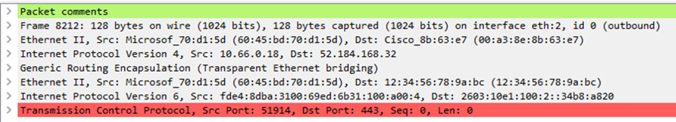

# Fast Path ICMP flow redirection

## Overview

FastPath is the feature that switches traffic from using VIP-to-VIP connectivity (which involves transiting SLB MUXes), into using a direct path between VMs (direct PA to PA path).

## Definitions

| Acronym | Definition |
|---------|------------|
| VIP     | Virtualized IP (load balanced IP). <br/> This is load balanced IP. |
| DIP/PA  | Physical Address / Directly Assigned IP. <br/> Actual physical address of the VM (underlay). |

## Architecture


## How it works?

1. The VM begins communicating with a Service (or other VM) using VIP connectivity.
    - Source IP: VIP (of the source VM).
    - Destination IP: VIP (of destination service/VM).
    - In this case traffic in both directions transits SLB MUXes.

1. When traffic destined toward the VIP lands on SLB MUX (SYN packet), the MUX picks the actual destination VM (from a list of healthy VMs in the backend pool). It should redirect the packet accordingly (standard load balancing functionality).

    Once the VM is selected, the SLB MUX forwards the packet to the destination VM.

1. The SLB MUX (in addition to forwarding packet to destination) **may** (often is!!!) sending the ICMP redirect packet towards the source VM from which the SYN packet originated.

    This ICMP redirect will have information that the SLB MUX selected specific destination VM (will have VM PA information).

1. The Source side (currently VFP) listens for ICMP redirect packets, and once received performs "flow fixup" (updates the flow to redirect next packets not to Destination VIP, but directly to the Destination PA/DIP that arrived in the ICMP redirect packet from SLB MUX).

1. Once flow is "fixed up", the next packets are direct and bypass the SLB MUX in that direction.  This achieves high performance, as after initial connection handshake (SYN, SYN+ACK, ACK), the remaining traffic is direct between VMs and does not transit the SLB MUXes.

**Notes:**

- Two (2) MUXes are used for the VIP to VIP traffic.
  - The Destination SLB MUX is used to advertise destination VIP.
  - The Source SLB MUX is used to advertise the return VIP of the VM (to which VM SNATs the outbound traffic).

- Each SLB MUX *may* send ICMP redirect independently.

- Receiving ICMP redirects from single SLB MUX means that *only flows about that specific VIP* (either destination or source VIP) must be "fixed up" (updated to point to PA instead of VIP).

- ICMP redirect is sent by SLB MUX to both: source VM and destination VM.

- It is not guaranteed that SLB MUX will send ICMP redirect packets.

- It is not guaranteed that ICMP redirect packet will be sent after initial SYN (it might be sent later).

- The ICMP redirect packet might get *lost* (SLB MUX will resend it when next packet arrives on the SLB MUX and still uses VIP) *or possibly duplicated* (multiple packets that have VIP might arrive on SLB MUX, and SLB MUX may send ICMP redirect for all the packets that it receives as still using VIP).

## Packet transformation


## Flow redirection packet

The fast path ICMP flow redirection packet is based on ICMP redirect packet ([IPv4 - RFC762](https://datatracker.ietf.org/doc/html/rfc792) / [IPv6 - RFC2461](https://datatracker.ietf.org/doc/html/rfc2461#section-4.5)).

The detailed packet format is described as below:

|SLB IP|APPL IP|GRE|SLB MAC|VM MAC|IP|Inner Src IP|Inner Dst IP|ICMP v4/v6 Redirect|Redirect Option (IPv6 only)|Redirection Info|
|------|-------|---|-------|------|--|------------|------------|------------------|---------------------------|----------------|

The `RedirectOption` and `RedirectInfo` structs are defined as below:

- ICMP redirect shall have the original inner IPv6 address as the IP header's src and dst address.
- Redirect info shall contain the transposed IPv6 address, src and dst ports, sequence number and the encap type (NVGRE in this case) in addition to redirect address.

```c
struct 
{
    uint8 Type;
    uint8 Length;
    uint8 Reserved2[6];            
    IPV6_HEADER Ipv6Header;
    uint16 SourcePort;
    uint16 DestinationPort;
    uint32 SequenceNumber;
} RedirectOption;

struct 
{ 
    uint32 Version; 
    uint16 AddrFamily; 
    uint16 EncapType; 
    uint32 EncapId; 
    union { 
        struct { 
            in_addr DipPAv4; 
            char VMMac[MAC_ADDR_SIZE]; 
        } Info4; 
        struct { 
            in6_addr DipPAv6; 
            char VMMac[MAC_ADDR_SIZE]; 
        } Info6; 
} RedirectInfo; 
```

The following shall be used for translations:

| Field                         | Mapping                       |
| ----------------------------- | ----------------------------- |
| VM Mac                        | Source ENI                    |
| Inner Src IP                  | Original Src IP               |
| Inner Dst IP                  | Original Dst IP               |
| Target Address                | Original Dst IP               |
| Redirect Header               | Original IPv6 Header + TCP ports (5 tuple) |
| Addr Family                   | AF_INET/AF_INET6              |
| Encap Type                    | NVGRE 1/VXLAN 2               |
| Encap Id                      | Redirect GRE Key/ VXLAN Id    |
| Custom Redirect Info          | Redirect DIP and Dst Mac      |

### Packet signatures from captures

- TCP handshake uses VIP (52.184.168.32)

  

- ICMP Redirect packet

  

- After the ICMP redirect, the packets start using DIP/PA (100.110.225.76)

  

## Detailed design

### SAI API for fast path implementation

All fast path packet handling and flow manipulation are done under the SAI API, hence there is no SAI API added for implementing the feature.

### SAI API for enabling and disabling fast path

In case of live sites, for example, fast path goes wrong and incorrectly updates the flow, we will need a toggle to disable this behavior.

This toggle is added as an attribute to ENI:

```c
typedef enum _sai_eni_attr_t
{
    // ...

    /**
     * @brief Action set_eni_attrs parameter FAST_PATH_ICMP_FLOW_REDIRECTION
     *
     * @type bool
     * @flags CREATE_AND_SET
     * @default false
     */
    SAI_ENI_ATTR_DISABLE_FAST_PATH_ICMP_FLOW_REDIRECTION,

    // ...
} sai_eni_attr_t;
```

### Fast Path counters

For debugging purposes, we will also need to add counters in order to give insights on how fast path works internally.

In order provide a unified way for retriving all counters for any DASH counters, all counters below will be generated as stats, because many DASH counters are not [regular data path counters that modeled in SAI](https://github.com/opencomputeproject/SAI/blob/master/inc/saicounter.h), which tracks packets and bytes.

#### Port stats attributes

Port level counter will be added as port stats extensions following the [SAI extension model](https://github.com/opencomputeproject/SAI/blob/master/doc/SAI-Extensions.md#extension-custom-attributes).

| Attribute name | Description |
| -------------- | ----------- |
| SAI_PORT_ATTR_LB_FAST_PATH_ICMP_IN_PKTS | The number of fast path packets received |
| SAI_PORT_ATTR_LB_FAST_PATH_ICMP_IN_BYTES | The total bytes of fast path packets received |
| SAI_PORT_ATTR_LB_FAST_PATH_ENI_MISS_PKTS | The number of fast path packet received but could not find corresponding ENI to process |
| SAI_PORT_ATTR_LB_FAST_PATH_ENI_MISS_BYTES | The total bytes of fast path packet received but could not find corresponding ENI to process |

#### ENI stats attributes

| Attribute name | Description |
| -------------- | ----------- |
| SAI_ENI_ATTR_LB_FAST_PATH_ICMP_IN_PKTS | The number of fast path packets received |
| SAI_ENI_ATTR_LB_FAST_PATH_ICMP_IN_BYTES | The total bytes of fast path packets received |

#### Flow table stats attributes

| Attribute name | Description |
| -------------- | ----------- |
| SAI_ENI_ATTR_LB_FAST_PATH_FLOW_REDIRECTED_COUNT | The number of flows that redirected due to fast path packet received |
| SAI_ENI_ATTR_LB_FAST_PATH_FLOW_MISS_COUNT | The number of flows that is missing when trying to redirected by fast path packets |
