# NAT scenario

## Overview

NAT scenario decribes 2 NAT use cases:

* VMs in VNET access Internet, aka SNAT.
* Users from Internet access servcies hosted on the cloud VMs in VNET, aka DNAT.

We use network appliance in this HLD, acting the role of NAT gateway as well as underlay router.
This scenario provides the following capabilites:

* SNAT service for TCP, UDP and ICMP packets.
* DNAT service for TCP, UDP and ICMP packets.
* Routing service for underlay forwarding.
* Billing service(by traffic volumn and by commited traffic rate).

The goal is to test the following properties:

* Connection set up rate in Connections per Second (CPS)
* Data traffic bandwidth in Bits per Second (BPS)
* Data traffic performance in Packet per Second (PPS)
* Connection Flow Scale

## NAT scenario architecture

*Figure 1 - NAT scenario architecture*

Tenant1 access Internet service, with VM1 in VNET1 through NAT gateway running on a smart switch. Tenant2 provide service to the public, hosted on VM2 in VNET2, Internet user access this service through NAT gateway running on a smart switch.

For both case, VMs in different VNET connects to Internet through a NAT gateway.

## Packet proccessing pipeline in NAT scenario

### 1. SNAT scenario

#### 1.1 Outbound packet processing pipeline

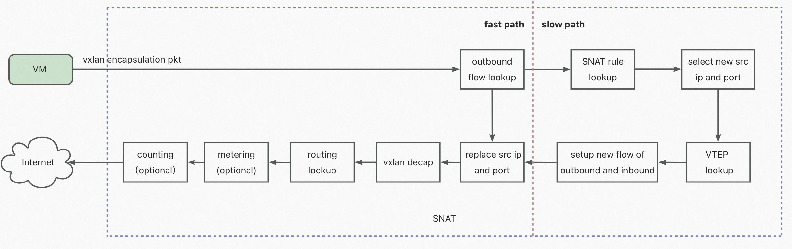
*Figure 2 - SNAT outbound packet processing pipeline*

* The pipeline determines the **outbound direction** based on the presence of a VXLAN header in the incoming packet.  The tenant's VNI is a part of the key in flow table entries.

* An outbound flow table lookup is launched. If a match is found, the packet is processed through the **fast path**(H/W table processing).  If a match is not found, the packet is handled through the **slow path** processing, also referred as the **first packet** processing. A search for an SNAT rule table is then initiated to select a new public source IP address and port number.

* The pipeline lanuch a VTEP lookup to retrieve the VTEP IP of the VM from which the incoming packet originates(i.e VM's SIP to VTEP mapping). This VTEP IP is used to create an inbound flow table entry(for the responding traffic).

* Both an outbound flow table entry and an inbound flow table entry are added to their respective flow tables(H/W tables).

* A search of the outbound flow table is triggered once the packet is re-inserted. The packet will match the outbound flow table entry created(with previouse **slow path** processing), and the flow action will be applied to the packet, including the replacement of the source IP address/port number and the decapsulation of the VXLAN header.

* A routing lookup is performed based on destination IP address in order to retrieve the nexthop. This nexthop is used rewrite destination MAC address and determine egress interface.

* Metering and counting are performed for billing purposes before the packet is sent to the Internet.

#### 1.2 Inbound packet processing pipeline

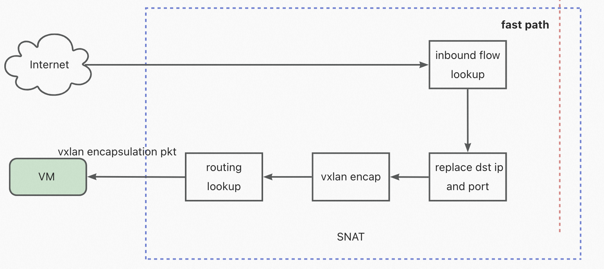
*Figure 3 - SNAT inbound packet processing pipeline*

* As desribed in section 1.1, during the handling of the **first packet** processing, the inbound flow table entry has been created in the H/W table. So the incoming packet from Internet(the responding packet) will result in a match during the inbound flow lookup. Then action will be applied, replacing the destination IP address/port number, encapsulating the VXLAN header, performing a routing lookup with DIP(the VTEP IP) obtained from inbound flow table, and finally sends the packet to the destionation VM.

### 2. DNAT scenario

#### 2.1 Inbound packet proccessing pipeline


*Figure 4 - DNAT inbound packet processing pipeline*

* The pipeline determines the **inbound direction** based on the absence of a VXLAN header in the incoming packet.

* A search of the inbound flow table is initiated. If a match is found, the packet is processed through the **fast path**(H/W flow table actions obtained and applied). If no match is found, the packet is handled through the **slow path**. A search for a DNAT rule is then initiated, if found, it replaces the public destination IP address and port number with the mapped VM IP address and port number.

* The pipeline also initiates an VTEP lookup to obtain the VTEP IP of the DNAT mapped VM, which is then used to create an inbound flow table entry.

* Both an outbound flow table entry and an inbound flow table entry are added to corresponding flow tables.

* A search of the inbound flow table is triggered once the packet is re-injected. The packet will match the inbound flow table entry created previously and the flow action will be applied, which includes replacing the destination IP address/port number and adding VXLAN encapsulation.

* A routing lookup is performed based on destination VTEP IP address before sending the VXLAN encapsulated packet to VM.

### 2.2 Outbound packet processing pipeline

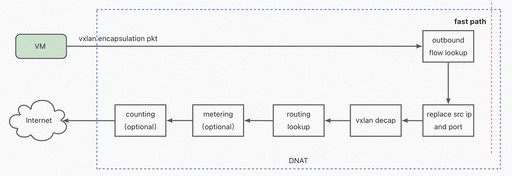
*Figure 5 - DNAT outbound packet processing pipeline*

* As described in section 2.1, the outbound flow table entry has been created during the handling of the *first packet* processing, when the responding packet arrives from VM, it matches the entry and performs the specified action of replacing the source IP address/port number and removing the VXLAN header before being sent to the internet.

* Then it routes the packet based on DIP of the decapsulated packet.

* Counting and/or metering is done, and they are optional based on the Vnet user's billing mode.

● The packet is sent to Internet via the selected interface.

## Configuration example

``` JSON

/* Define Vnet1 */
DASH_VNET:Vnet1 {
    "vni": 12345
}

/* Define Vnet2 */
DASH_VNET:Vnet2 {
    "vni": 45678
}

/* Define routing types */
DASH_ROUTING_TYPE:vnet_encap: [
    {
         "name": "action1",
         "action_type: "staticvxlan",
         "encap_type" "vxlan"
    }
]

/* Define Overlay routing tables */
DASH_VNET_ROUTE_TABLE:Vnet1:10.1.0.10 {
    "routing_type":"vnet_encap", 
    "dst_vtep":[30.0.0.22]
    "mac_address":002244AABBCC
},
DASH_VNET_ROUTE_TABLE:Vnet1:10.1.0.2 {
    "routing_type":"vnet_encap", 
    "dst_vtep":[30.0.0.23]
    "mac_address":002244AABBDD
}


/* Define SNAT rules */
DASH_SNAT_RULE_TABLE:Vnet1:10.1.0.0/24 {
    "0.0.0.0/0": {
        "src_ip_list":[111.1.1.237, 111.1.1.238]
    }
},
DASH_SNAT_RULE_TABLE:Vnet1:10.1.1.0/24 {
    "0.0.0.0/0": {
        "src_ip_list":[111.1.1.239, 111.1.1.240]
    }
},
DASH_SNAT_RULE_TABLE:Vnet2:10.1.0.0/24 {
    "0.0.0.0/0": {
        "src_ip_list":[111.1.1.241]
    },
    "102.0.0.0/8": {
        "src_ip_list":[111.1.1.242]
    },
}

/* Define DNAT rules */
DASH_DNAT_RULE_TABLE:111.2.190.195:80 {
    "mapping_vnet": Vnet1,
    "mapping_address": 10.1.0.2:80
},
DASH_DNAT_RULE_TABLE:114.66.253.4:8080 {
    "mapping_vnet": Vnet1,
    "mapping_address": 10.1.0.2:80
},
DASH_DNAT_RULE_TABLE:111.2.190.196 {
    "mapping_vnet": Vnet1,
    "mapping_address": 10.1.0.3
},
DASH_DNAT_RULE_TABLE:114.66.253.5 {
    "mapping_vnet": Vnet1,
    "mapping_address": 10.1.0.3
},

/* Define NAT gateway vtep ip */
DASH_NAT_GW_VTEP_TABLE{
    "vtep_ip": [30.0.0.250]
}

```

## Packet flow example

### SNAT packet flow

`Source: VM in Vnet1, VNI 12345, SIP 10.1.0.10`
`Destination: IP 8.8.8.8, port 53, protocol UDP`

* **first packet** processing flow of outbound packet

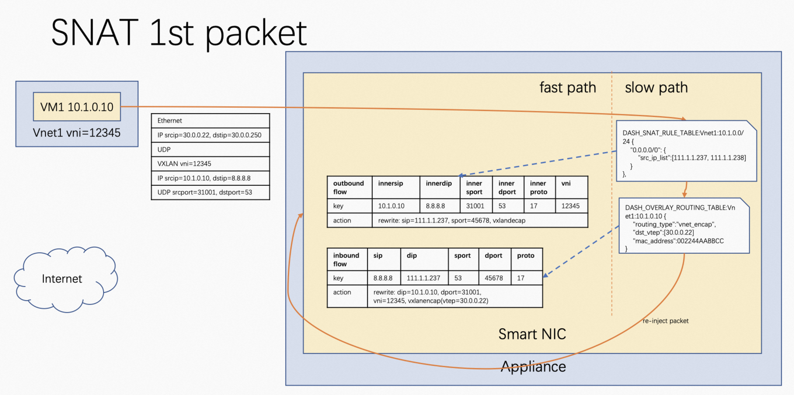
*Figure 6 - SNAT first packet processing outbound packet flow*

* Subsequent processing flow of outbound packet

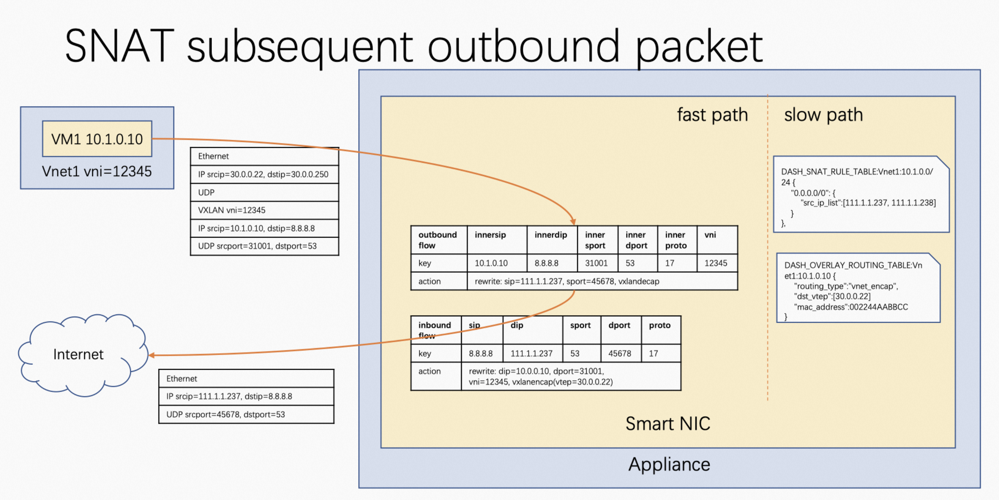
*Figure 7 - SNAT subsequent processing outbound packet flow*

* Subsequent processing flow of inbound packet

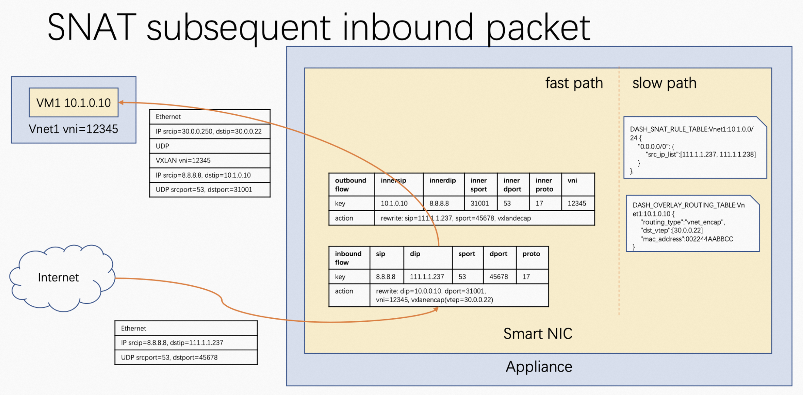
*Figure 8 - SNAT subsequent processing inbound packet flow*

### DNAT packet flow

`Source: IP 220.1.0.24, port 40002, protocol TCP`
`Destination: VM in Vnet1, VNI 12345, IP 10.1.0.2, port 80`

* **first packet** processing flow of inbound packet

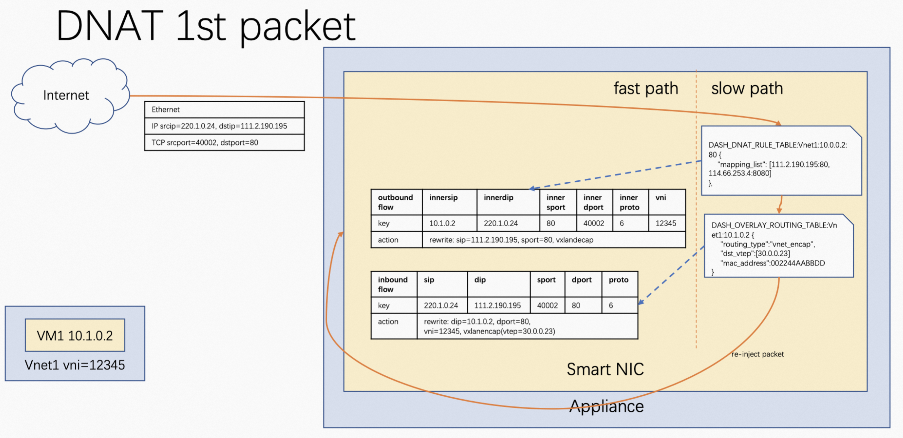
*Figure 9 - DNAT first packet processing inbound packet flow*

* Subsequent processing flow of inbound packet

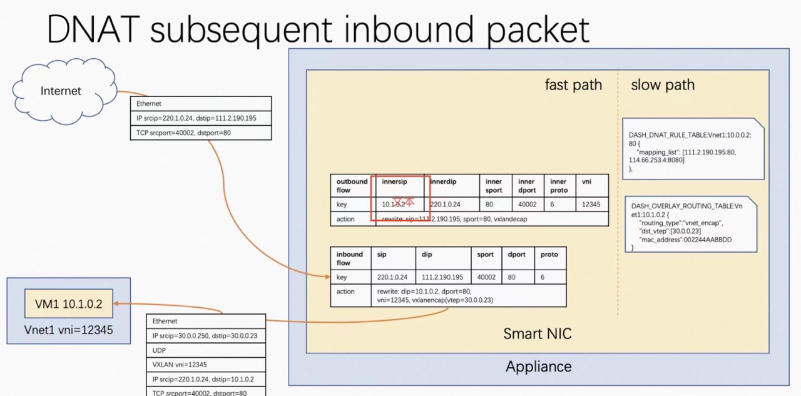
*Figure 10 - DNAT subsequent processing inbound packet flow*

* Subsequent processing flow of outbound packet

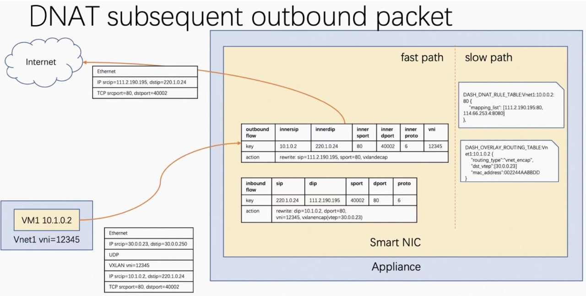
*Figure 11 - DNAT subsequent processing outbound packet flow*

* Generic NAT outbound packet processing pipeline
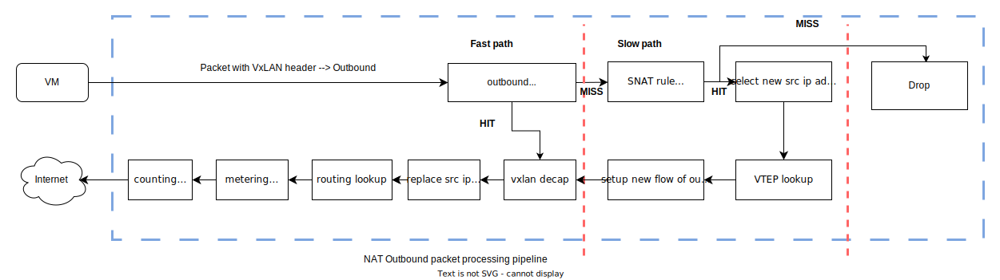
*Figure 12 - Generic NAT processing outbound packet flow*

* Generic NAT inbound packet processing pipeline
*Figure 13 - Generic NAT processing inbound packet flow*
