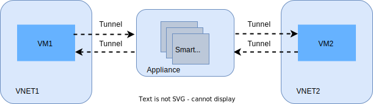
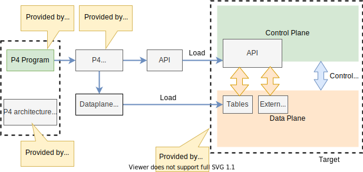

[[<< Back to parent directory](../README.md)]

[[<< Back to DASH top-level Documents](../../README.md#contents)]

# VNET to VNET scenario

- [Overview](#overview)
- [Moving packets from source VM to destination VM](#moving-packets-from-source-vm-to-destination-vm)
- [Packet transforms](#packet-transforms)
- [Packet transform example](#packet-transform-example)
  - [V-Port definition](#v-port-definition)
  - [VNET definition](#vnet-definition)
  - [VNET mapping table](#vnet-mapping-table)
  - [Understanding packet transform](#understanding-packet-transform)
    - [Match action tables](#match-action-tables)
      - [Table ACL1](#table-acl1)
      - [Table ACL2](#table-acl2)
      - [Table ACL3](#table-acl3)
    - [Routing table](#routing-table)
    - [Mapping](#mapping)
  - [Packet transform summary](#packet-transform-summary)
- [References](#references)
- [Appendix](#appendix)
  - [VNET to VNET without appliance](#vnet-to-vnet-without-appliance)
  - [Programming Protocol-independent Packet Processors (P4)](#programming-protocol-independent-packet-processors-p4)

## Overview

This scenario is the starting point to design, implement and test the core DASH
mechanisms. In particular it allows the following:

- VM to VM communication in VNET, using an Appliance for rules and routing offload
- Route support
- LPM support
- ACL support

The intent is to verify the following performance properties: **CPS**, **flow**, **PPS**, and **rule scale**.

<figcaption><i>Figure 1 - VM to VM communiczation using appliance</i></figcaption> 

## Moving packets from source VM to destination VM

To understand DASH *performance enhancements and programmability*, it is
important to understand the path where packets are transferred from source to
destination; in this scenario - from source VM to destination VM in a VNET
environment.

To make an analogy, it is similar to establishing a dedicated circuit between
Point A and Point B for the duration of a call in a telephonic switch, between a
caller and a receiver. The first time the connection (circuit) is initiated and
established, it takes more time due to the full setup for exchange that is
required. We call this a **slow path**. After the connection is established, the
messages between caller and receiver can be exchanged via the established path
and flow (without overhead). We call this **fast path**.

With respect to packets and flows between VMs in VNET, a tunnel (equivalent to
the circuit of a telephonic switch) is established between the source VM to the
Appliance, and from the Appliance to the destination VM (after packet rules,
routing, and transforms). This tunnel (along with some SDN feature work) will
redirect the packets to a DPU, for example - in an appliance. This is where the
DASH performance enhancements (so called *bump in the wire*) happens.

## Packet transforms

Packet transformation plays a crucial role when moving a packet from a source to
a destination. Before we look at the example, let's define a few terms.

- **Flows**. It describes a specific *conversation* between two hosts (SRC/DST
  IP, SRC/DST Port). When flows are processed and policy is applied to them and
  then routed, the SmartNIC (or DPU) records the outcomes of all those decisions in a
  **transform** and places them in the **flow table** which resides locally on
  the card itself.  

  > [!NOTE] This is why sometimes the term *transform* and *flow* are used
  > interchangeably.

- **Transforms**. It is represented either by *iflow* (initiator) or *rflow*
  (responder) in the **flow table**. It contains everything the SmartNIC needs to
  route a packet to its destination without first having to apply a policy.
  Whenever the SmartNIC receives a packet, it checks the local *flow table* to see if
  the preparatory work has been done for this flow. The following can happen:

  - When a *transform* or *flow* doesn’t exist in the *flow table*, a **slow
    path** is executed and policy applied.
  - When a *transform* or *flow* does exist in the *flow table*, a **fast path**
    is executed and the values in the transform are used to forward the packet
    to its destination without having to apply a policy first.

- **Mapping table**. It is tied to the V-Port, and contains the CA:PA (IPv4,
  IPv6) mapping, along with the FNI value of the CA for Inner Destination MAC
  re-write and VNID to use for VXLAN encapsulation.

  > [!NOTE] The Flexible Network Interface (FNI) is a 48-bit value which easily
  > maps to MAC values. The MAC address of a VNIC (VM NIC or BareMetal NIC) is
  > synonymous with FNI. It is one of the values used to identify a V-Port
  > container ID.  

- **Routing table**. A longest prefix match (LPM) table that once matched on
  destination specifies the action to perform VXLAN encapsulation based on
  variables already provided, VXLAN encap using a **mapping table** or *Overlay
  Tunnel* lookup for variables, or *L3/L4 NAT*. Routing tables are mapped to the
  V-Port.

- **Flow table**. A global table on a SmartNIC that contains the transforms for all
  of the per-FNI flows that have been processed through the data path pipeline.

## Packet transform example

The following is an example of packet transformation in VM to VM communication in VNET.

### V-Port definition

- Physical address = `100.0.0.2`
- V-Port Mac = `V-PORT_MAC`

### VNET definition

- VNET1 ?? `10.0.0.0/24`
- VNET2 ?? `20.0.0.0/24`

### VNET mapping table

| | V4 underlay| V6 underlay| Mac-Address| Mapping Action | VNI
|:----------|:----------|:----------|:----------|:----------|:----------
| 10.0.0.1| 100.0.0.1| 3ffe :: 1| Mac1| VXLAN_ENCAP_WITH_DMAC_DE-WRITE| 100
| 10.0.0.2| 100.0.0.2| 3ffe :: 2| Mac2| VXLAN_ENCAP_WITH_DMAC_DE-WRITE| 200
| 10.0.0.3| 100.0.0.3| 3ffe :: 3| Mac3| VXLAN_ENCAP_WITH_DMAC_DE-WRITE| 300
| | | | | |

### Understanding packet transform

When talking about packet transforms, we need to think about a process that
involves three main steps: transforming, mapppng and routing. Let's walk
through these steps using  the table shown above.

#### Match action tables

The transform step, as per the P4 model, see [P416 Language
Specification](https://p4.org/p4-spec/docs/P4-16-v1.2.2.html), is executed based
on a set of **match/action** tables which are traversed sequentially by the P4
parser.

> [!NOTE] A P4 program defines a packet-processing pipeline, but the rules
> within each table are inserted by the control plane. When a rule matches a
> packet, its action is invoked with parameters supplied by the control plane as
> part of the rule.

The following are the example applicable tables.

##### Table ACL1

|Match/Action|Value              |
|------------|-------------------|
|match       |dst add=`10.0.0.10`|
|action      |Block              |
|match       |dst add==`*`       |
|action      |allow              |

##### Table ACL2

|Match/Action|Value              |
|------------|-------------------|
|match       |dst add=`10.0.0.11`|
|action      |Block              |
|match       |dst add==`*`       |
|action      |allow              |

##### Table ACL3

|Match/action|Value              |
|------------|-------------------|
|match       |dst add==`*`       |
|action      |allow              |

#### Routing table

The routing step shown in the following routing table defines when a packet is routed from the source to the destination.

|Match/action|Value                 |
|------------|----------------------|
|match       |dst add==`20.0.0.0/24`|
|            |src add=`10.0.0.0/24` |
|action      |allow                 |

The last step is mapping that is shown in the following summary.

#### Mapping

|Source               |Destination                   |Action                    |Routing/Mapping                    |
|---------------------|------------------------------|--------------------------|-----------------------------------|
|`10.0.0.1`           |`10.0.0.10`                   |Blocked (ACL1)            |Blocked                            |
|`10.0.0.1` SMAC1     |`10.0.0.11` DMAC_FAKE         |Blocked (ACL1, ACL2)      |Blocked                            |
|`10.0.0.1` (1) SMAC1 |`10.0.0.2` (2) DMAC_FAKE      |Allowed (ACL1, ACL2. ACL3)|Matched LPM route `10.0.0.0/24` (3)|

**Notes**

- (1) Outer: Physical host IP, VXLAN VNI: custom, Inner Mac: SMAC1
- (2) Outer: Physical SDN Appliance IP, DMAC_FAKE
- (3) Execute action VNET that will look up in the mapping table and take mapping action.
This mapping action is (from row 2 of the mapping table):
  - Outer:
    - SRC: `100.0.0.2`
    - DST: `100.0.0.1`
  - VXLAN
    - VNI: 200
  - Inner Mac:
    - SRC - SMAC1 DST
  - Mac1
    - Inner IP: `10.0.0.1` -> `10.0.0.2`.

- [DMAC_FAKE](https://github.com/Azure/DASH/wiki/Glossary#dmac_fake). A hardcoded MAC address (ex: 12:34:56:78:9a:bc). It is not a MAC of an actual VM, it is simply a MAC address to "satisfy" the TCP/IP stack of Windows/Linux.

### Packet transform summary

The following table summarizes the process of transforming, mapping and routing.  

| SRC -> DST | Out-ACL1| Out-ACL2| Out-ACL3| Routing | Final |
|:----------|:----------|:----------|:----------|:----------|:----------
| | Block 10.0.0.10 Allow *| Block 10.0.0.11 Allow * | Allow*| 10.0.0.0/24 - Route Action = VNET 20.0.0.0/24 - Route Action = VNET|
| 10.0.0.1 -> 10.0.0.10  SMAC1-> DMAC_FAKE| Block| | | | Blocked
| 10.0.0.1 -> 10.0.0.11  SMAC1-> DMAC_FAKE| Allow| Block| | | Blocked
| 10.0.0.1 -> 10.0.0.2  SMAC1-> DMAC_FAKE  Outer: SRC: [Physical IP of host]  DST: [Physical IP of SDN Appliance]  VXLAN  &nbsp;&nbsp;&nbsp;&nbsp;VNI: custom  Inner Mac:  &nbsp;&nbsp;&nbsp;&nbsp;SRC - SMAC1 DST - DMAC_FAKE  Inner IP:  &nbsp;&nbsp;&nbsp;&nbsp;[10.0.0.1] -> [10.0.0.2]| Allow| Allow| Allow| Matched LPM route 10.0.0.0/24 Execute action VNET - which will lookup in mapping table and take mapping action.| Highlighted the changes in packet  Outer: SRC: [100.0.0.2]  DST: [100.0.0.1]  VXLAN  &nbsp;&nbsp;&nbsp;&nbsp;VNI: 200  Inner Mac:  &nbsp;&nbsp;&nbsp;&nbsp;SRC - SMAC1 DST - Mac1  Inner IP:  &nbsp;&nbsp;&nbsp;&nbsp;[10.0.0.1] -> [10.0.0.2]
| 10.0.0.1 -> 10.0.0.3 SMAC1-> DMAC_FAKE| | | | |
| | | | | |

## References

- [P4-16 Language Specification](https://p4.org/p4-spec/docs/P4-16-v1.2.2.html)
- [P4 Language Consortium videos](https://www.youtube.com/results?search_query=P4+LANGUAGE+CONSORTIUM)

## Appendix

### VNET to VNET without appliance

The following figure shows the transformation steps in a traditional VNET setting i.e., without appliance.

<figcaption><i>Figure 2 - VNET to VNET without appliance</i></figcaption>  

### Programming Protocol-independent Packet Processors (P4)

P4 is protocol independent, but it enables programmers to express a rich set of
protocols and other data plane behaviors.

The following figure shows the workflow when programming a target using P4.

<figcaption><i>Figure 3 - Programming target using P4</i></figcaption>  