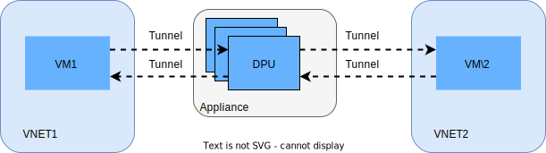
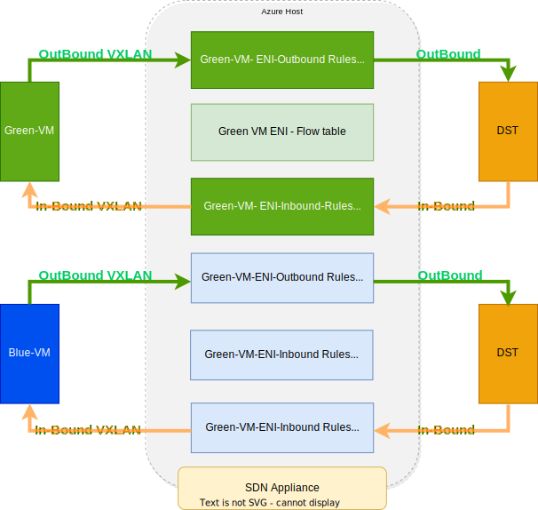

[[<< Back to parent directory](../README.md)]

[[<< Back to DASH top-level Documents](../../README.md#contents)]

- [Overview](#overview)
- [Moving packets from source to destination VM](#moving-packets-from-source-to-destination-vm)
- [Packet handling detailed steps](#packet-handling-detailed-steps)
  - [Rule processing pipeline](#rule-processing-pipeline)
    - [Inbound rule](#inbound-rule)
    - [Outbound rule](#outbound-rule)
  VM](#moving-packets-from-source-to-destination-vm)
- [Overview](#overview)
- [Moving packets from source to destination VM](#moving-packets-from-source-to-destination-vm)
- [Packet handling detailed steps](#packet-handling-detailed-steps)
  - [Rule processing pipeline](#rule-processing-pipeline)
    - [Inbound rule](#inbound-rule)
    - [Outbound rule](#outbound-rule)

# VNET to VNET scenario

## Overview

This scenario is the starting point to design, implement and test the core DASH
mechanisms. In particular it allows the following features: 

- VM to VM communication in VNET
- Route support
- LPM support
- ACL support 

The intent is to verify the following performance properties: **CPS**, **flow**, **PPS**, and **rule scale**.

<figcaption><i>Figure 1 - VNET to VNET with DPU</i></figcaption> 

## Moving packets from source to destination VM

To understand DASH *magic*, it is important to understand the path where packets
are transferred from source to destination; in this scenario - from source VM to
destination VM in a VNET environment.

To make an analogy, it is similar to establishing a dedicated circuit between
Point A and Point B for the duration of a call in a telephonic switch, between a
caller and a receiver. The first time the connection (circuit) is initiated and
established, it takes more time due to the full setup for exchange that is
required. We call this a **slow path**. After the connection is established, the
messages between caller and receiver can be exchanged via the established path
and flow (without overhead). We call this **fast path**.

With respect to packets and flows between VMs in VNET, a tunnel (equivalent to
the circuit of a telephnonic switch) is established between the two VMs. This
tunnel (along with some SDN feature work) will redirect the packets to a DPU,
for example - in an appliance. This is where the DASH magic (so called *bump in
the wire*) happens.

## Packet handling detailed steps

Upon receiving a packet, the SDN appliance will determine:

- **Packet direction**. It is evaluated based off of the most-outer **VNI**
  lookup (implementation dependent) from the left-side (see figure below, a DASH
  optimized VM sending Outbound packets) behind the Appliance.  If there is no
  match, the direction is Inbound.
- **ENI selection**. Outbound uses source-MAC, Inbound uses destination-MAC.
- **SLB decap**. If packet was encapped by SLB.
- **Decap VNET**  GRE key.
- **Packet match**. Once the ENI is matched, the packet is compared with flow
  table to determine whether there is an existing flow.

  - If a **flow match is found**, a corresponding **match action is executed
    without entering into rule processing**. Flow match direction is identified
    based on source and destination MAC.
  - If **no flow match is found**, the ENI **rule processing pipeline will
    execute**. See next steps.

### Rule processing pipeline

#### Inbound rule

The processing pipeline is executed if the **destination MAC** in the packet
**matches the ENI MAC**. Once rule pipeline is executed corresponding flows are
created.

#### Outbound rule 

The processing pipeline is executed if the **source MAC** in the packet
**matches the ENI MAC**.

- Once outbound rule processing is complete and final transforms are identified,
  the corresponding flow is created in the flow table.

- Depending upon the implementation of the flow table, a corresponding inbound
  flow may also be inserted to enable response packets to match the flow and
  bypass the rule processing pipeline.

**Example**

- VM with IP 10.0.0.1 sends a packet to 8.8.8.8.
- VM Inbound ACL blocks all internet.
- VM outbound ACL allows 8.8.8.8. Response packet from 8.8.8.8 must be allowed
without opening any inbound ACL due to the flow match.

	
