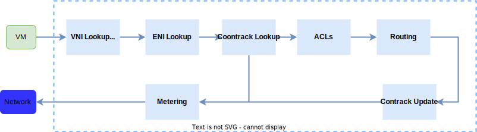
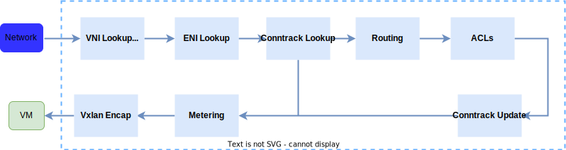
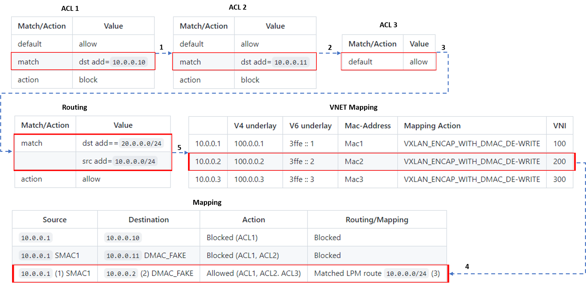

[[<< Back to parent directory](../README.md)]

[[<< Back to DASH top-level Documents](../../README.md#contents)]

# VNET to VNET scenario

- [Overview](#overview)
- [Moving packets from source VM to destination VM](#moving-packets-from-source-vm-to-destination-vm)
- [Packet flow in VNET to VNET](#packet-flow-in-vnet-to-vnet)
  - [Outbound packet processing pipeline](#outbound-packet-processing-pipeline)
  - [Inbound packet processing pipeline](#inbound-packet-processing-pipeline)
- [VM to VM communication in VNET example](#vm-to-vm-communication-in-vnet-example)
  - [Configuration example](#configuration-example)
  - [Routing a packet to address 10.1.1.1](#routing-a-packet-to-address-10111)
- [Appendix](#appendix)
  - [VNET to VNET without DASH optimization](#vnet-to-vnet-without-dash-optimization)
- [References](#references)
  
## Overview

The VNET to VNET scenario is the starting point to design, implement and test
core DASH mechanisms in VM to VM communication, using an Appliance for rules and
routing offload. In particular it allows the following:

- Route/LPM support
- Underlay IPv4 and IPv6
- Stateful ACL support
- TCP state tracking on flows
- Telemetry and Monitoring

The goal is to test the following performance properties: 

- **Connections per Second** (CPS)
- **Flow** 
- **Packet per Second** (PPS)
- **Rule Scale**


<figcaption><i>Figure 1 - VM to VM communication using appliance</i></figcaption><br/>

## Moving packets from source VM to destination VM

To understand DASH *performance enhancements and programmability*, it is
important to understand the path where packets are transferred from source to
destination; in this scenario - from source VM to destination VM in a VNET
environment.

To make an analogy, it is similar to establishing a dedicated circuit between
Point A and Point B for the duration of a call in a telephonic switch, between a
caller and a receiver. The first time the connection (circuit) is initiated and
established, it takes more time due to the full setup for exchange that is
required. We call this a **slow path**. After the connection is established, the
messages between caller and receiver can be exchanged via the established path
and flow (without overhead). We call this **fast path**.

With respect to packets and flows between VMs in VNET, a tunnel (equivalent to
the circuit of a telephonic switch) is established between the source VM to the
Appliance, and from the Appliance to the destination VM (after packet rules,
routing, and transforms). This tunnel (along with some SDN feature work) will
redirect the packets to a DPU, for example - in an appliance. This is where the
DASH performance enhancements (so called *bump in the wire*) happens.

## Packet flow in VNET to VNET

When talking about packet flow, we need to think about a process that involves
several steps, as explained below. 

> [!NOTE] From [SONiC-DASH HLD](../../general/design/dash-sonic-hld.md)
### Outbound packet processing pipeline



<figcaption><i>Figure 2 - Outbound packet processing pipeline</i></figcaption><br/><br/>

- The pipeline sets the **direction** as TX(**outbound**) based on the
  **incoming packet's VNI** that is matched against the **reserved VNI**
  assigned to the **VM->Appliance**.
- Using the inner `src-mac`, **maps to the corresponding ENI**.
- The incoming packet will always be **VXLAN encapped** and the outer `dst-ip`
  is the **appliance VIP**. 
- The pipeline parses the VNI, and for **VM traffic**, the VNI shall be a
  **special reserved VNI**-
- Everything else shall be treated as network traffic(RX). 
- The pipeline uses VNI to differentiate the traffic to be VM (**inbound**) or
  Network (**outbound**).

In the outbound flow, the criteria listed below are applied.

- The appliance assumes it is the first appliance to apply the policy. 
- It applies the outbound ACLs in three stages: **VNIC**, **Subnet** and
  **VNET**. The stages are processed in order, with the outcome being the most
  restrictive of the three ACLs combined.
- After the ACL stages, the appliance performs **LPM routing** based on the
  **inner dst-ip** and applies the respective action: **encap**, **subsequent**
  **CA-PA mapping**. 
- Finally, it **updates** the **connection tracking table** for both inbound and
  outbound.

### Inbound packet processing pipeline
	
  

<figcaption><i>Figure 3 - Intbound packet processing pipeline</i></figcaption><br/><br/>

- The pipeline sets the direction as RX(**inbound**) based on the **incoming
  packet's VNI**, if it does not match against any reserved VNI.
- Using the inner `dst-mac`, **maps to the corresponding ENI**. 
- In the inbound flow, Routing (LPM) lookup happens based on VNI and SRC PA
  prefix and maps to VNET. 
- Using the VNET mapping tables, source PA address is validated against the list
  of mappings. If the check passes, **decap** action is performed, else dropped. 
- After LPM, the three ACL stages are processed in order. ACLs can have multiple
  `src/dst` IP ranges or port ranges as match criteria.

> [!NOTE] CA-PA mapping table are used for both encap and decap processing.

## VM to VM communication in VNET example

The configuration example shown below defines the values for VNET, ENI, routing
types, match/action tables, and routing tables.


### Configuration example

``` 

/* Define Vnet1 */

DASH_VNET:Vnet1: {
    "vni": 45654,
    "guid": "559c6ce8-26ab-4193-b946-ccc6e8f930b2"
}

/* Define ENI */
DASH_ENI:F4939FEFC47E : { 
    "eni_id": "497f23d7-f0ac-4c99-a98f-59b470e8c7bd",
    "mac_address": "F4939FEFC47E",
    "pa_addr": 25.1.1.1,
    "admin_state": "enabled",
    "vnet": "Vnet1"
}

/* Define routing types */

DASH_ROUTING_TYPE:vnet: [
    {
         "name": "action1", 
         "action_type: "maprouting" 
    } 
]

DASH_ROUTING_TYPE:vnet_direct: [
    {
         "name": "action1", 
         "action_type: "maprouting" 
    }
]

DASH_ROUTING_TYPE:vnet_encap: [
    {
         "name": "action1",
         "action_type: "staticencap",
         "encap_type" "vxlan"
    }
]

DASH_ROUTING_TYPE:privatelink: [
    {
         "name": "action1",
         "action_type:"staticencap",
         "encap_type":"vxlan"
    },
    {
         "name": "action2",
         "action_type:"staticencap",
         "encap_type":"nvgre",
         "vni":100
    }
]

/* Define routing tables */

DASH_ROUTE_TABLE:F4939FEFC47E:10.1.0.0/16: {
    "action_type":"vnet",
    "vnet":"Vnet1"
}

DASH_ROUTE_TABLE:F4939FEFC47E:10.1.0.0/24: {
    "action_type":"vnet",
    "vnet":"Vnet1",
    "overlay_ip":"10.0.0.6"
}

DASH_ROUTE_TABLE:F4939FEFC47E:30.0.0.0/16: {
    "action_type":"direct",
}

DASH_ROUTE_TABLE:F4939FEFC47E:10.2.5.0/24: {
    "action_type":"drop",
}

DASH_VNET_MAPPING_TABLE:Vnet1:10.0.0.6: {
    "routing_type":"vnet_encap",
    "underlay_ip":2601:12:7a:1::1234,
    "mac_address":F922839922A2
}

DASH_VNET_MAPPING_TABLE:Vnet1:10.0.0.5: {
    "routing_type":"vnet_encap", 
    "underlay_ip":100.1.2.3,
    "mac_address":F922839922A2
}

DASH_VNET_MAPPING_TABLE:Vnet1:10.1.1.1: {
    "routing_type":"vnet_encap", 
    "underlay_ip":101.1.2.3,
    "mac_address":F922839922A2
}
```

The next sections describe the lookup behavior in the outbound direction. For
the inbound direction, after LPM/ACL lookup, the pipeline uses the `underlay_ip`
as specified in the ENI table to Vxlan encapsulate the packet. ??

### Routing a packet to address 10.1.1.1

Using the previous configuration, let's analyze the steps involved in routing a
packet destined to `10.1.1.1`. Below are the processing pipeline (lookup) steps. 


<figcaption><i>Figure 4 - processing pipeline lookup steps</i></figcaption> <br/><br/>

1. Perform LPM lookup. 
2. Select routing table `DASH_ROUTE_TABLE:10.1.0.0/16`. The action is `vnet` and the value is `Vnet1`.
2. Look up `DASH_ROUTING_TYPE:vnet`. The value for `vnet` is `maprouting`.
3. Look up `DASH_VNET_MAPPING_TABLE:Vnet1:10.1.1.1`. 
   1. The routing for `routing` is `vnet_encap`.
4. Perform encap using the Public Address (PA) as specified by the
   `underlay_ip`=`101.1.2.3` and `mac_address`=`F922839922A2`. 
5. Route the packet. 

<!-- 
## VM to VM communication in VNET example 2

(from SDN document)

The following is an example of packet transfer in VM to VM communication in
VNET.

### V-Port definition

- Physical address = `100.0.0.2`
- V-Port Mac = `V-PORT_MAC`

### VNET definition

- VNET1 `10.0.0.0/24`
- VNET2 `20.0.0.0/24`

### VNET mapping table

| | V4 underlay| V6 underlay| Mac-Address| Mapping Action | VNI
|:----------|:----------|:----------|:----------|:----------|:--------------|
| 10.0.0.1| 100.0.0.1| 3ffe :: 1| Mac1| VXLAN_ENCAP_WITH_DMAC_DE-WRITE| 100 |
| 10.0.0.2| 100.0.0.2| 3ffe :: 2| Mac2| VXLAN_ENCAP_WITH_DMAC_DE-WRITE| 200 |
| 10.0.0.3| 100.0.0.3| 3ffe :: 3| Mac3| VXLAN_ENCAP_WITH_DMAC_DE-WRITE| 300 |

### Match action tables

This step, as per the P4 model, see [P416 Language
Specification](https://p4.org/p4-spec/docs/P4-16-v1.2.2.html), is executed based
on a set of **match/action** tables which are traversed sequentially by the P4
parser.

> [!NOTE] A P4 program defines a packet-processing pipeline, but the rules
> within each table are inserted by the control plane. When a rule matches a
> packet, its action is invoked with parameters supplied by the control plane as
> part of the rule.

The following are the example applicable tables.

#### ACL1 table

The following table prescribes that the packets directed to the destination
address `10.0.0.10` are blocked, while the packets directed to all other
destinations are allowed (default). 

|Match/Action|Value              |
|------------|-------------------|
|default     |allow              |
|match       |dst add=`10.0.0.10`|
|action      |block              |

#### ACL2 table

The following table prescribes that the packets directed to the destination
address `10.0.0.11` are blocked, while the packets directed to all other
destinations are allowed (default). 

|Match/Action|Value              |
|------------|-------------------|
|default     |allow              |
|match       |dst add=`10.0.0.11`|
|action      |block              |

#### ACL3 table

The following table prescribes that the packets directed to all destinations are
allowed (default). 

|Match/Action|Value              |
|------------|-------------------|
|default     |allow              |

#### Routing table

The routing step shown in the following table defines when a packet is routed
from the source to the destination.

|Match/Action|Value                 |
|------------|----------------------|
|match       |dst add==`20.0.0.0/24`|
|            |src add=`10.0.0.0/24` |
|action      |allow                 |

#### Mapping table

From the previopus [VNET mapping table](#vnet-mapping-table) table and
considering the routing discussed before you get the following:

|Source               |Destination                   |Action                    |Routing/Mapping                    |
|---------------------|------------------------------|--------------------------|-----------------------------------|
|`10.0.0.1`           |`10.0.0.10`                   |Blocked (ACL1)            |Blocked                            |
|`10.0.0.1` SMAC1     |`10.0.0.11` DMAC_FAKE         |Blocked (ACL1, ACL2)      |Blocked                            |
|`10.0.0.1` (1) SMAC1 |`10.0.0.2` (2) DMAC_FAKE      |Allowed (ACL1, ACL2. ACL3)|Matched LPM route `10.0.0.0/24` (3)|

**Notes**

- (1) Outer: Physical host IP, VXLAN VNI: custom, Inner Mac: SMAC1
- (2) Outer: Physical SDN Appliance IP, DMAC_FAKE
- (3) **Execute action VNET** that will look up in the mapping table and take
mapping action. This mapping action is (row 2 of the [VNET mapping
table](#vnet-mapping-table)):
  - Outer:
    - SRC: `100.0.0.1`
    - DST: `100.0.0.2`
  - VXLAN
    - VNI: 200
  - Inner Mac:
    - SRC - SMAC1 DST
  - Mac1
    - Inner IP: `10.0.0.1` -> `10.0.0.2`.

- [DMAC_FAKE](https://github.com/Azure/DASH/wiki/Glossary#dmac_fake). A
  hardcoded MAC address (ex: 12:34:56:78:9a:bc). It is not a MAC of an actual
  VM, it is simply a MAC address to "satisfy" the TCP/IP stack of Windows/Linux.

The following figure shows the example processing pipeline.



<figcaption><i>Figure 2 - Example processing pipeline</i></figcaption> <br/>

-->

## Appendix

### VNET to VNET without DASH optimization 

The following figure shows the transformation steps in a traditional VNET
setting i.e., without DASH optimization.


<figcaption><i>Appendix Figure 1 - VNET to VNET without DASH optimization</i></figcaption> 

## References

- [Disaggregated API for SONiC Hosts (DASH) high level
  design](../../general/design/dash-high-level-design.md)
- [SONiC-DASH HLD](../../general/design/dash-sonic-hld.md)
- [P4 Getting
  Started](https://github.com/p4lang/education/blob/master/GettingStarted.md)
- [P4-16 Language Specification](https://p4.org/p4-spec/docs/P4-16-v1.2.2.html)
