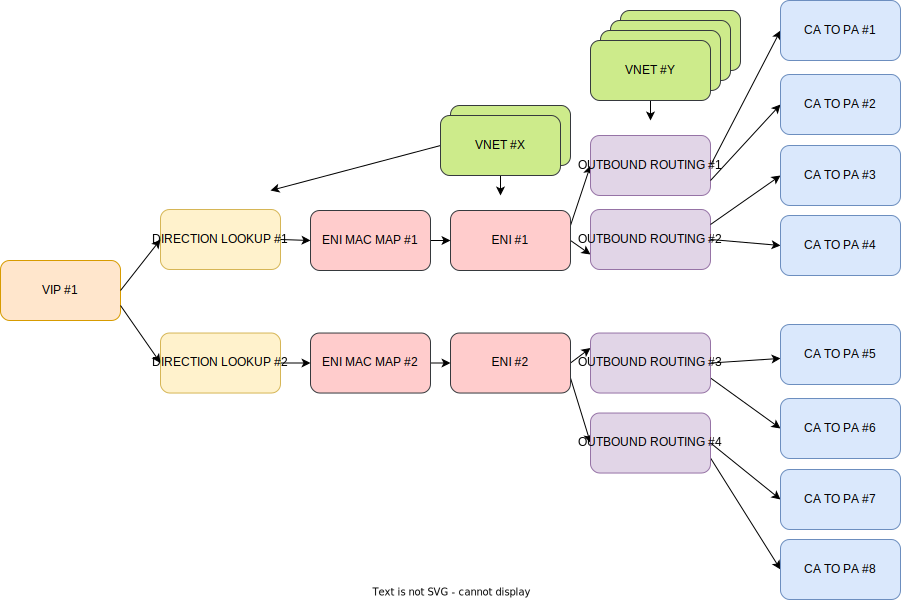

# DASH configuration specification

- [DASH configuration specification](#dash-configuration-specification)
- [Generator input format](#generator-input-format)
  - [Sequence generator](#sequence-generator)
    - [Sequence generator attributes:](#sequence-generator-attributes)
    - [Sequence generator expressions examples:](#sequence-generator-expressions-examples)
      - [Integers](#integers)
      - [IP-addresses and IP-prefixes](#ip-addresses-and-ip-prefixes)
      - [MAC-addresses](#mac-addresses)
      - [Object IDs](#object-ids)
      - [Lists](#lists)
  - [Example of generator output using scale configuration](#example-of-generator-output-using-scale-configuration)
    - [Input:](#input)
    - [Output:](#output)
  - [Outbound DASH config example](#outbound-dash-config-example)
  - [Known issues](#known-issues)
- [Generator output format (Unified SAI format)](#generator-output-format-unified-sai-format)
  - [General description](#general-description)
  - [Unified SAI commands examples](#unified-sai-commands-examples)
- [Traffic scaling](#traffic-scaling)
  - [VNET Outbound Routing scenario explanation](#vnet-outbound-routing-scenario-explanation)
  - [DASH and traffic configuration visualization](#dash-and-traffic-configuration-visualization)
    - [DASH configuration based on the picture above:](#dash-configuration-based-on-the-picture-above)
  - [Resulting traffic configuration examples](#resulting-traffic-configuration-examples)
      - [**Example #1**](#example-1)
      - [**Example #2**](#example-2)
  - [**Example #3**](#example-3)


# Generator input format

In general a DASH config consists of such entries:

```
DASH_OBJECT_TYPE:
    object_name:
        count: NUMBER_OF_OBJECTS
        attribute_name: CONST_OR_GENERATOR
```

Where,
* `DASH_OBJECT_TYPE` - Can be **DASH_VNET**, **DASH_VIP**, **DASH_ENI**, etc.
* `object_name` - Name of the object
* `NUMBER_OF_OBJECTS` - Number of such objects to create
* `attribute_name` - Specific attributes of every object. Depend on `DASH_OBJECT_TYPE`.
* `CONST_OR_GENERATOR` - The value of the attribute. Could be a constant value or a sequence generator expression.

If `NUMBER_OF_OBJECTS` is greater than the number of values generated by the sequence generator - after reaching the last value generator must produce values from the start again.

If number of values generated by the sequence generator is greater than `NUMBER_OF_OBJECTS` - only first `NUMBER_OF_OBJECTS` values of the sequence generator should be used.

## Sequence generator

For scaling purposes sequence generator could be used for creating big number of objects. It produces a range of values according to the given attributes.

### Sequence generator attributes:

* `count` - The number of entries (default is 1)
* `start` - The first entry (no default values)
* `step`  - Increment step (default is 1)
* `delay`<sup>[1](#known-issues)</sup> - Delay increment for `delay` iterations (default is 1, which means increment at every iteration)
* `list`  - Use this specific list of values instead of the generated values. If this attribute is present `start`, `step`, `delay` must be ignored. `count` still will be used.

### Sequence generator expressions examples:

#### Integers

```JSON
{ count: 4, start: 100, step: 10 } => 100, 110, 120, 130
{ count: 4, start: 100, step: 5 } => 100, 105, 110, 115
{ count: 4, start: 100, step: 10, delay: 2} => 100, 100, 105, 105
{ count: 4, start: 100 } => 100, 101, 102, 103
{ start: 100 } => 100
```

#### IP-addresses and IP-prefixes

```JSON
{ count: 4, start: "10.0.0.1", step: "0.0.0.1" } => "10.0.0.1", "10.0.0.2", "10.0.0.3", "10.0.0.4"
{ count: 4, start: "10.0.0.1", step: "0.0.1.0" } => "10.0.0.1", "10.0.1.1", "10.0.2.1", "10.0.3.1"
{ count: 4, start: "10.0.0.1", step: "0.0.1.0", delay: 2 } => "10.0.0.1", "10.0.0.1", "10.0.1.1", "10.0.1.1"
{ count: 4, start: "10.0.0.1" } => "10.0.0.1", "10.0.0.2", "10.0.0.3", "10.0.0.4"
{ start: "10.0.0.1" } => "10.0.0.1"

{ count: 4, start: "10.0.0.0/24", step: "0.0.1.0" } => "10.0.0.0/24", "10.0.1.0/24", "10.0.2.0/24", "10.0.3.0/24"
{ count: 4, start: "10.0.0.0/24", step: "0.1.1.0" } => "10.0.0.0/24", "10.1.1.0/24", "10.2.2.0/24", "10.3.3.0/24"
{ count: 4, start: "10.0.0.0/24", step: "0.1.1.0", delay: 2 } => "10.0.0.0/24", "10.0.0.0/24", "10.2.2.0/24", "10.2.2.0/24"
{ start: "10.0.0.1/24" } => "10.0.0.1/24"
```

#### MAC-addresses

```JSON
{ count: 4, start: "00:CC:CC:CC:CC:00", step: "00:00:00:00:00:01" } => "00:CC:CC:CC:CC:00", "00:CC:CC:CC:CC:01", "00:CC:CC:CC:CC:02", "00:CC:CC:CC:CC:03"
{ count: 4, start: "00:CC:CC:CC:CC:00", step: "00:00:00:00:00:10" } => "00:CC:CC:CC:CC:00", "00:CC:CC:CC:CC:10", "00:CC:CC:CC:CC:20", "00:CC:CC:CC:CC:30"
{ count: 4, start: "00:CC:CC:CC:CC:00", step: "00:00:00:00:00:10", delay: 2 } => "00:CC:CC:CC:CC:00", "00:CC:CC:CC:CC:00", "00:CC:CC:CC:CC:10", "00:CC:CC:CC:CC:10"
{ count: 4, start: "00:CC:CC:CC:CC:00" } => "00:CC:CC:CC:CC:00", "00:CC:CC:CC:CC:01", "00:CC:CC:CC:CC:02", "00:CC:CC:CC:CC:03"
{ start: "00:CC:CC:CC:CC:00" } => "00:CC:CC:CC:CC:00"
```

#### Object IDs

```JSON
{ count: 4, start: "DASH_VNET#vnet#0", step: 1 } => "$DASH_VNET#vnet#0", "$DASH_VNET#vnet#1", "$DASH_VNET#vnet#2", "$DASH_VNET#vnet#3"
{ count: 4, start: "DASH_VNET#vnet#0", step: 2 } => "$DASH_VNET#vnet#0", "$DASH_VNET#vnet#2", "$DASH_VNET#vnet#4", "$DASH_VNET#vnet#6"
{ count: 4, start: "DASH_VNET#vnet#0", step: 2, delay: 2} => "$DASH_VNET#vnet#0", "$DASH_VNET#vnet#0", "$DASH_VNET#vnet#2", "$DASH_VNET#vnet#2"
{ count: 4, start: "DASH_VNET#vnet#0"} => "$DASH_VNET#vnet#0", "$DASH_VNET#vnet#1", "$DASH_VNET#vnet#2", "$DASH_VNET#vnet#3"
{ start: "DASH_VNET#vnet#0"} => "$DASH_VNET#vnet#0"
```

#### Lists

```JSON
{ count: 4, start: 100, step: 10, list: [3, 5, 7, 9] } => 3, 5, 7, 9
{ count: 4, list: [3, 5, 7, 9] } => 3, 5, 7, 9
{ count: 2, list: [3, 5, 7, 9] } => 3, 5
{ count: 6, list: [3, 5, 7, 9] } => 3, 5, 7, 9, 3, 5
```

## Example of generator output using scale configuration

Here is an example of DASH_OUTBOUND_ROUTING scale configuration using DASH config

### Input:

```yaml
NUMBER_OF_ORE:  5
NUMBER_OF_ENI:  4
NUMBER_OF_DST:  3
NUMBER_OF_VNET: 10

DASH_OUTBOUND_ROUTING:
  ore:
    count: NUMBER_OF_ORE
    SWITCH_ID: $SWITCH_ID
    ENI_ID:
      count: NUMBER_OF_ENI
      start: "$eni_#0"
      delay: NUMBER_OF_DST
    DESTINATION:
      count: NUMBER_OF_DST
      start: "10.1.0.0/24"
      step: "0.0.1.0"
    ACTION: ROUTE_VNET
    DST_VNET_ID:
      count: NUMBER_OF_VNET
      start: "$vnet_#0"
```

### Output:

```json
  {
    "name": "DASH_OUTBOUND_ROUTING#ore#0",
    "op": "create",
    "type": "SAI_OBJECT_TYPE_OUTBOUND_ROUTING_ENTRY",
    "key": {
      "switch_id": "$SWITCH_ID",
      "eni_id": "$DASH_ENI#eni#0",
      "destination": "10.1.0.0/24"
    },
    "attributes": [
      "SAI_OUTBOUND_ROUTING_ENTRY_ATTR_ACTION", "SAI_OUTBOUND_ROUTING_ENTRY_ACTION_ROUTE_VNET",
      "SAI_OUTBOUND_ROUTING_ENTRY_ATTR_DST_VNET_ID", "$DASH_VNET#vnet#0"
    ]
  },
  {
    "name": "DASH_OUTBOUND_ROUTING#ore#1",
    "op": "create",
    "type": "SAI_OBJECT_TYPE_OUTBOUND_ROUTING_ENTRY",
    "key": {
      "switch_id": "$SWITCH_ID",
      "eni_id": "$DASH_ENI#eni#0",
      "destination": "10.1.1.0/24"
    },
    "attributes": [
      "SAI_OUTBOUND_ROUTING_ENTRY_ATTR_ACTION", "SAI_OUTBOUND_ROUTING_ENTRY_ACTION_ROUTE_VNET",
      "SAI_OUTBOUND_ROUTING_ENTRY_ATTR_DST_VNET_ID", "$DASH_VNET#vnet#1"
    ]
  },
  {
    "name": "DASH_OUTBOUND_ROUTING#ore#2",
    "op": "create",
    "type": "SAI_OBJECT_TYPE_OUTBOUND_ROUTING_ENTRY",
    "key": {
      "switch_id": "$SWITCH_ID",
      "eni_id": "$DASH_ENI#eni#0",
      "destination": "10.1.2.0/24"
    },
    "attributes": [
      "SAI_OUTBOUND_ROUTING_ENTRY_ATTR_ACTION", "SAI_OUTBOUND_ROUTING_ENTRY_ACTION_ROUTE_VNET",
      "SAI_OUTBOUND_ROUTING_ENTRY_ATTR_DST_VNET_ID", "$DASH_VNET#vnet#2"
    ]
  },
  {
    "name": "DASH_OUTBOUND_ROUTING#ore#3",
    "op": "create",
    "type": "SAI_OBJECT_TYPE_OUTBOUND_ROUTING_ENTRY",
    "key": {
      "switch_id": "$SWITCH_ID",
      "eni_id": "$DASH_ENI#eni#1",
      "destination": "10.0.1.0/24"
    },
    "attributes": [
      "SAI_OUTBOUND_ROUTING_ENTRY_ATTR_ACTION", "SAI_OUTBOUND_ROUTING_ENTRY_ACTION_ROUTE_VNET",
      "SAI_OUTBOUND_ROUTING_ENTRY_ATTR_DST_VNET_ID", "$DASH_VNET#vnet#3"
    ]
  },
  {
    "name": "DASH_OUTBOUND_ROUTING#ore#4",
    "op": "create",
    "type": "SAI_OBJECT_TYPE_OUTBOUND_ROUTING_ENTRY",
    "key": {
      "switch_id": "$SWITCH_ID",
      "eni_id": "$DASH_ENI#eni#1",
      "destination": "10.1.1.0/24"
    },
    "attributes": [
      "SAI_OUTBOUND_ROUTING_ENTRY_ATTR_ACTION", "SAI_OUTBOUND_ROUTING_ENTRY_ACTION_ROUTE_VNET",
      "SAI_OUTBOUND_ROUTING_ENTRY_ATTR_DST_VNET_ID", "$DASH_VNET#vnet#4"
    ]
  }
```

## Outbound DASH config example

```YAML
NUMBER_OF_VIP: 3
NUMBER_OF_DLE: 3
NUMBER_OF_IN_ACL_GROUP: 10
NUMBER_OF_OUT_ACL_GROUP: 10
NUMBER_OF_VNET: 50
NUMBER_OF_ENI: 10
NUMBER_OF_EAM: NUMBER_OF_ENI * 2
NUMBER_OF_ORE: 5
NUMBER_OF_DST: 10
NUMBER_OF_OCPE: 5

DASH_VIP:
    vpe: NUMBER_OF_VIP
        SWITCH_ID: $SWITCH_ID
        IPv4: { count: NUMBER_OF_VIP, start: "172.1.0.100", step: "0.1.0.0" }

DASH_DIRECTION_LOOKUP:
    dle: NUMBER_OF_DLE
        SWITCH_ID: $SWITCH_ID
        VNI: { count: NUMBER_OF_DLE, start: 100, step: 100 }
        ACTION: SET_OUTBOUND_DIRECTION

DASH_ACL_GROUP:
    in_acl_group_id: NUMBER_OF_IN_ACL_GROUP
        ADDR_FAMILY: IPv4
    out_acl_group_id: NUMBER_OF_OUT_ACL_GROUP
        ADDR_FAMILY: IPv4

DASH_VNET:
    vnet: NUMBER_OF_VNET
        VNI: { count: NUMBER_OF_VNET, start: 1000, step: 10 }

DASH_ENI:
    eni: NUMBER_OF_ENI
        ACL_GROUP:
            INBOUND:
                STAGE1: { list: "DASH_ACL_GROUP#in_acl_group_id#0" }
                STAGE2: { list: "DASH_ACL_GROUP#in_acl_group_id#0" }
                STAGE3: { list: "DASH_ACL_GROUP#in_acl_group_id#0" }
                STAGE4: { list: "DASH_ACL_GROUP#in_acl_group_id#0" }
                STAGE5: { list: "DASH_ACL_GROUP#in_acl_group_id#0" }
            OUTBOUND:
                STAGE1: 0
                STAGE2: 0
                STAGE3: 0
                STAGE4: 0
                STAGE5: 0
        ADMIN_STATE: True
        CPS: 10000
        FLOWS: 10000
        PPS: 100000
        VM_UNDERLAY_DIP: { count: NUMBER_OF_ENI, start: "172.16.1.0", step: "0.0.1.0" }
        VM_VNI: { count: NUMBER_OF_ENI, start: 50 }
        VNET_ID: { count: NUMBER_OF_ENI, start: "DASH_VNET#vnet#0" }

DASH_ENI_ETHER_ADDRESS_MAP:
    eam: NUMBER_OF_EAM
        SWITCH_ID: $SWITCH_ID
        MAC: { count: NUMBER_OF_EAM, start: "00:CC:CC:CC:00:00" }
        ENI_ID: { count: NUMBER_OF_ENI, start: "DASH_ENI#eni#0" }

DASH_OUTBOUND_ROUTING:
    ore: NUMBER_OF_ORE
        SWITCH_ID: $SWITCH_ID
        ENI_ID: { count: NUMBER_OF_ENI, start: "DASH_ENI#eni#0", delay: NUMBER_OF_DST }
        DESTINATION: { count: NUMBER_OF_DST, start: "10.1.0.0/24", step: "0.0.1.0" }
        ACTION: ROUTE_VNET
        DST_VNET_ID: { count: NUMBER_OF_VNET, start: "DASH_VNET#vnet#0" }

DASH_OUTBOUND_CA_TO_PA:
    ocpe: NUMBER_OF_OCPE
        SWITCH_ID: $SWITCH_ID
        DST_VNET_ID:  { count: NUMBER_OF_VNET, start: "DASH_VNET#vnet#0" }
        DIP: { count: NUMBER_OF_OCPE, start: "10.1.2.50", step: "0.0.1.0" }
        UNDERLAY_DIP: { count: NUMBER_OF_OCPE, start: "172.16.1.20", step: "0.0.1.0" }
        OVERLAY_DMAC: { count: NUMBER_OF_OCPE, start: "00:DD:DD:DD:00:00" }
        USE_DST_VNET_VNI: True
```


## Known issues

1. "duration" key might be replaced with nested loops approach.

# Generator output format (Unified SAI format)

## General description

Config generator generates a list of commands that should be applied to SAI. These commands consist of the following fields:

- `op` - operation. (mandatory)
- `type` - object type. See *sai_object_type_t*. (mandatory when op is "create" or "bulk_create")
- `name` - name of the object. (mandatory when "op" is "remove", "bulk_remove" or "set")
- `key` - key of the specific object. Not all objects have key. See SAI headers for more information. (mandatory for some object types)
- `attributes` - a list of attributes and their values. See SAI headers for more information. (optional)

Possible operations (`op`):
- create
- remove
- get
- set
- bulk_create *(currently not supported)*
- bulk_remove *(currently not supported)*

If `op` is "bulk_create" or "bulk_remove" SAI expects `name` and `key` to be lists of values and `attributes` to be a list of lists.

If you need to refer to some object in `attributes` or `key` you should use its name with a '$' sign at the beginning. Example: "$vnet".

## Unified SAI commands examples

Create an object without a key:

```JSON
  {
    "op": "create",
    "type": "SAI_OBJECT_TYPE_VNET",
    "name": "vnet",
    "attributes": [
      "SAI_VNET_ATTR_VNI", "100"
    ]
  }
```

Create an object with key:

```JSON
  {
    "op": "create",
    "type": "SAI_OBJECT_TYPE_VIP_ENTRY",
    "name": "vpe",
    "key": {
      "switch_id": "$SWITCH_ID",
      "vip": "172.16.1.100"
    },
    "attributes": [
      "SAI_VIP_ENTRY_ATTR_ACTION", "SAI_VIP_ENTRY_ACTION_ACCEPT"
    ]
  }
```

Remove object:
```JSON
  {
    "name": "vnet",
    "op": "remove"
  }
```
NOTE: For removal it's enough to provide only name and skip attributes.

Bulk create:
```JSON
  {
    "op": "bulk_create",
    "type": "SAI_OBJECT_TYPE_VIP_ENTRY",
    "name": [ "vpe#0", "vpe#1" ],
    "key": [
      { "switch_id": "$SWITCH_ID",
        "vip": "172.16.1.100" },
      { "switch_id": "$SWITCH_ID",
        "vip": "172.16.1.200" }
    ],
    "attributes": [
      [ "SAI_VIP_ENTRY_ATTR_ACTION", "SAI_VIP_ENTRY_ACTION_ACCEPT" ],
      [ "SAI_VIP_ENTRY_ATTR_ACTION", "SAI_VIP_ENTRY_ACTION_ACCEPT" ]
    ]
  }
```

Bulk remove:
```JSON
  {
    "name": [ "vpe#0", "vpe#1" ],
    "op": "bulk_remove"
  }
```

# Traffic scaling

**Scalable traffic configuration uses the same DASH config format and the same entities as it is described above.**


## VNET Outbound Routing scenario explanation

The following picture explains:
1. Relations between packet and configuration parameters
1. Packet transformation


## DASH and traffic configuration visualization

The following picture depicts configuration used in [test_sai_vnet_outbound_scale.py](./test_sai_vnet_outbound_scale.py)




For simplicity DIRECTION_LOOKUPs are mapped to ENIs as **one-to-one**.
ENIs are mapped to ENI_ETHER_ADDRESS_MAPs as one-to-one by design.

VIPs are completely standalone entities. If user increases count of VIPs, the rest of configuration stays as is, but the traffic will by multiplied on number of underlay destination IPs.

ENI scales to OUTBOUND_ROUTING in the ratio: two OUTBOUND_ROUTING entries per one ENI.

OUTBOUND_ROUTING scales to OUTBOUND_CA_TO_PA in the ratio: two OUTBOUND_CA_TO_PA entries per one OUTBOUND_ROUTING.


### DASH configuration based on the picture above:
```python
NUMBER_OF_VIP = 1
NUMBER_OF_DLE = 2
NUMBER_OF_ENI = 2
NUMBER_OF_EAM = NUMBER_OF_ENI
NUMBER_OF_ORE = 2  # Per ENI
NUMBER_OF_OCPE = 2  # Per ORE
NUMBER_OF_VNET = NUMBER_OF_ENI + (NUMBER_OF_ORE * NUMBER_OF_ENI)  # Per ORE

TEST_VNET_OUTBOUND_CONFIG_SCALE = {

    'DASH_VIP': {
        'vpe': {
            'count': NUMBER_OF_VIP,
            ...
        }
    },

    'DASH_DIRECTION_LOOKUP': {
        'dle': {
            'count': NUMBER_OF_DLE,
            ...
        }
    },

    'DASH_VNET': {
        'vnet': {
            'VNI': {
                'count': NUMBER_OF_VNET,
                ...
        }
    },

    'DASH_ENI': {
        'eni': {
            'count': NUMBER_OF_ENI,
            ...
        }
    },

    'DASH_ENI_ETHER_ADDRESS_MAP': {
        'eam': {
            'count': NUMBER_OF_EAM,
            ...
        }
    },

    'DASH_OUTBOUND_ROUTING': {
        'ore': {
            'count': NUMBER_OF_ENI * NUMBER_OF_ORE,  # Full count: OREs per ENI and VNET
            ...
        }
    },

    'DASH_OUTBOUND_CA_TO_PA': {
        'ocpe': {
            'count': (NUMBER_OF_ENI * NUMBER_OF_ORE) * NUMBER_OF_OCPE,  # 2 Per ORE
            ...
        }
    }
}
```

## Resulting traffic configuration examples

These short snippets are applicable with [this config example](#dash-configuration-based-on-the-picture-above).

#### **Example #1**

Each DIRECTION_LOOKUP refers to a single ENI_ETHER_MAP.
```python
NUMBER_OF_DLE = 2
NUMBER_OF_ENI = 2
```

Resulting traffic flows configuration:
```YAML
VIP "172.16.1.100"
    DIR_LOOKUP VNI 5000
        CA SMAC: "00:CC:CC:CC:00:00"
    DIR_LOOKUP VNI 6000
        CA SMAC: "00:CC:CC:CC:00:01"
```
This means that 2 flows will be send with the following properties:
1. Underlay DIP: 172.16.1.100, VNI: 5000, Overlay SRC MAC: "00:CC:CC:CC:00:00"
1. Underlay DIP: 172.16.1.100, VNI: 6000, Overlay SRC MAC: "00:CC:CC:CC:00:01"

#### **Example #2**
Each DIRECTION_LOOKUP refers to two ENI_ETHER_MAP.
```python
NUMBER_OF_DLE = 2
NUMBER_OF_ENI = 4
```

Resulting traffic flows configuration (4 flows in total):
```YAML
VIP "172.16.1.100"
    DIR_LOOKUP VNI 5000
        CA SMAC: "00:CC:CC:CC:00:00"
        CA SMAC: "00:CC:CC:CC:00:01"
    DIR_LOOKUP VNI 6000
        CA SMAC: "00:CC:CC:CC:00:02"
        CA SMAC: "00:CC:CC:CC:00:03"
```

## **Example #3**

According to the [scheme](#dash-and-traffic-configuration-visualization)
```python
NUMBER_OF_VIP = 1
NUMBER_OF_DLE = 2
NUMBER_OF_ENI = 2
NUMBER_OF_EAM = NUMBER_OF_ENI
NUMBER_OF_ORE = 2  # Per ENI
NUMBER_OF_OCPE = 2  # Per ORE
NUMBER_OF_VNET = NUMBER_OF_ENI + (NUMBER_OF_ORE * NUMBER_OF_ENI)
```

Resulting traffic profile includes 2 flows each of 4 "sub-flows" for each possible CA DIP.
```YAML
VIP 172.16.1.100
        DIR_LOOKUP VNI 5000
                CA SMAC: 00:CC:CC:CC:00:00
                        CA DIP 10.1.1.0, count: 4, step: 0.0.0.1
        DIR_LOOKUP VNI 6000
                CA SMAC: 00:CC:CC:CC:00:01
                        CA DIP 10.1.1.0, count: 4, step: 0.0.0.1
```
