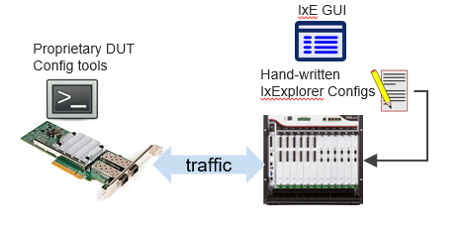
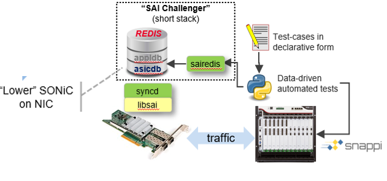
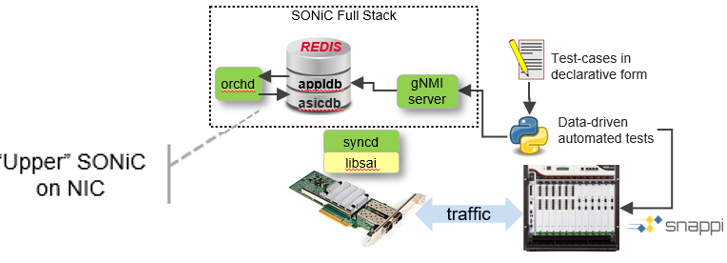

[[ << Test docs Table of Contents ]](./README.md)

[[ << DASH/test main README ]](../README.md)

[[ << DASH main README ]](../../README.md)

# DASH test maturity stages

This document describes the DASH test maturity stages. 

## Proof of Concept (OC)

 

TBD

## Standard test cases

 

TBD

## DUT configuration via SAI

 

TBD

## DUT configuration via Redis

 

TBD

## DUT configuration gNMI

 

TBD

## Options 

 

TBD
