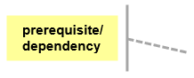
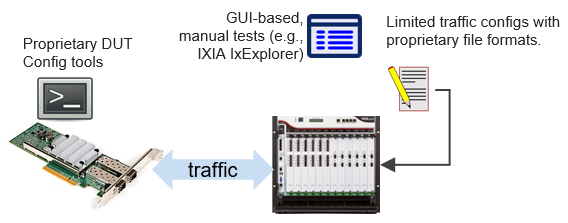
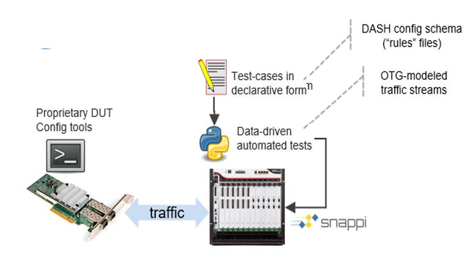
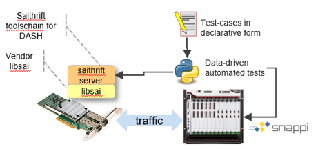
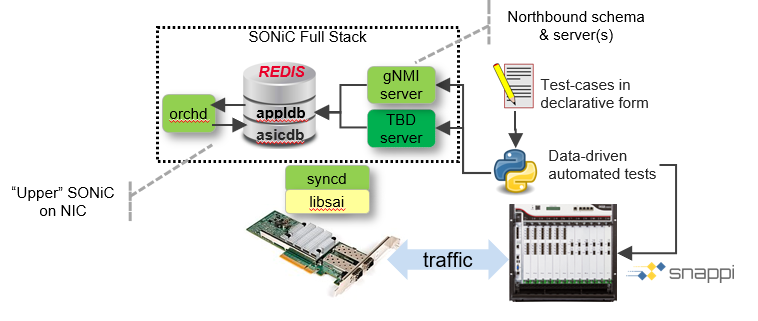
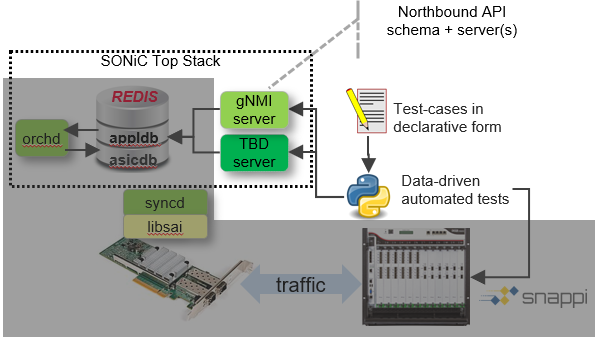
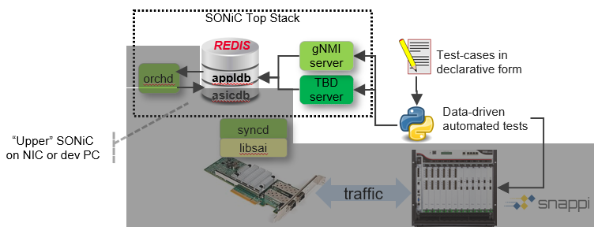
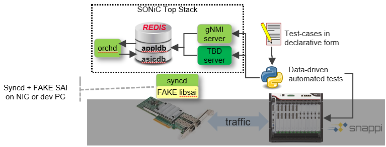
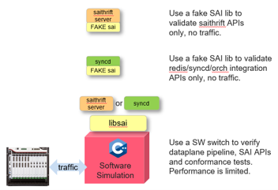

[[ << Test docs Table of Contents ]](./README.md)

[[ << DASH/test main README ]](../README.md)

[[ << DASH main README ]](../../README.md)

# DASH test maturity stages

This document describes the DASH test maturity stages. The intent is to articulate the various scenarios and show a set of reference diagrams in order to establish a common vocabulary and workflows.

## Legend
In the diagrams below, the dashed "callout" notes indicate the prerequisites/dependencies needed to achieve this stage of testing, for example:

 

# Single Device Testing
This section describes incremental approaches to test a single DASH device, including bottoms-up (data plane first) and top-down (SDN northbound first) approaches.
The bottoms-up and top-down approaches allow respective development teams to proceed apace and converge towards eventual full-system integration.

## Bottoms-Up, Data plane Testing stages
The data plane can be progressively tested by configuring the DUT through successive "API" layers, starting with the DASH-SAI API, which does not require use of the SONiC stack; then adding more and more SONiC layers; culminating with the use of an application-oriented northbound management API such as gNMI or other interface.

> **NOTE: Stage 3 - DUT Configuration via SAI-Thrift is deemed the minimum "gate" for DASH performance and conformance testing of a DUT's data plane. Community data plane tests will focus on this stage.**

### Data plane Testing Stage 1: Manual/Ad-hoc Testing

 

This testing stage represents internal, vendor-specific testing approaches and as a practical matter, probably precedes the use of any DASH community-specified tests. This stage is distinguished by:

* Proprietary DUT configuration mechanisms: e.g. gRPC/REST APIs, config files, utility programs etc. which are not slated for DASH production use.
* Limited, manually-controlled, test traffic generation and analysis, using arbitrary, vendor-specific  traffic generation equipment, for example IXIA IxExplorer.

### Data plane Testing Stage 2: Standardized, Automated Test Cases

 

This testing stage utilizes standardized, automated test cases which are used by the community. This stage is distinguished by:

* Proprietary DUT configuration mechanisms: e.g. gRPC/REST APIs, config files, utility programs etc. which are not slated for DASH production use
* Standardized, automated test suites (e.g. PyTest), primarily data-driven, which can be scaled out and parameterized to yield many different tests
* Standardized, model-based Traffic Generator config formats, e.g. [OpenTrafficGenerator](https://github.com/open-traffic-generator) using the [snappi](https://github.com/open-traffic-generator/snappi) client library
### Data plane Testing Stage 3: DUT configuration via SAI-Thrift

 

This stage represents a crucial milestone for DASH-SONiC development because it verifies the ability to integrate with the SONiC stack. Later on, it allows comparing the performance and behavior of a DUT with and without SONiC, to identify potential issues. This stage is distinguished by:

* Vendor `libsai` implementation running on DUT with [saithrift](https://github.com/opencomputeproject/SAI/tree/master/test/saithrift) server endpoint. Note, saithrift is not a production component, it is used only for this test stage.
* Test scripts configure the DUT via saithrift

### Data plane Testing Stage 4: DUT configuration via SAI-Redis

 

This stage tests integration with the "lower SONiC stack" which consists of the redis datastore `ASIC_DB` and the `syncd` daemon.
>**TODO** - identify other SONiC stack components required for/verified by this stage.

This stage is distinguished by:
* `syncd`, `redis` and sairedis thrift endpoint running on DUT. Note, the thrift-sairedis server is not a production component, it is used only for this test stage.
* Test scripts configure the DUT via saithrift
### Data plane Testing Stage 5: DUT configuration via SONiC Northbound API

 

This stage is the culmination of DUT data plane integrated with the SONiC stack and is distinguished by:

* Full SONiC stack integration of the [Switch State Services/SWSS](https://github.com/Azure/sonic-swss) (Redis, orchd, syncd, etc.)
* Northbound API endpoint such as gNMI or other TBD-API with defined schema and backend
* Test scripts control the DUT via the northbound API

## SONiC-DASH Top-Down Testing Stages
This section describes a progressive series of top-down testing stages, starting from the SONiC-DASH northbound management interface and working its way down to the final DASH-SAI API which controls the data plane. These stages may or may not be exercised in the community tests. Nevertheless, they provide a vocabulary and reference diagrams to discuss the scenarios.

In the figures below, the greyed-out areas represent functionality which is ignored in the specified stage's test coverage. The intent is to incrementally drill down into deeper layers of the SONiC stack as testing proceeds and expose more of the stack as the greyed-out zones diminish.

### SONiC-DASH Stack Testing Stage 1 - Dummy Northbound API

This stage focuses on the northbound management API in isolation. This API might be gNMI, or something similar, for SDN control of DASH. The API server can be a "dummy" server which accepts "write requests" according to its schema but does not have to act upon them (other than validation of the messages). "Read requests" can similarly be validated, but result in empty responses. This stage is distinguished by:

* Defined schema for the API
* API server endpoint which the test scripts can access to configure

### SONiC-DASH Stack Testing Stage 2 - Northbound to APPL_DB

This stage verifies that the SONiC-DASH northbound API can correctly populate and query the Redis "Application DB" (APPL_DB). This stage is distinguished by:

* A northbound API "backend" which correctly maps northbound API objects to their corresponding Redis `APPL_DB` objects.
* CRUD access to the APPL_DB objects via the northbound API

### SONiC-DASH Stack Testing Stage 3 - Northbound through orchd to ASIC_DB

This stage verifies that the SONiC-DASH northbound API can correctly populate and query the Redis "ASIC DB" (ASIC_DB) via the `orchd` functions. This stage is distinguished by:

* Functional orchestration daemon or `orchd` which handles DASH application objects
* ASIC_DB table and schema enhanced for DASH objects

### SONiC-DASH Stack Testing Stage 4 - Northbound through syncd to Fake SAI

This stage verifies that the SONiC-DASH northbound API can correctly access a Fake SAI layer starting at the northbound SONiC API. This stage is distinguished by:

* Functional ASIC sync daemon or `syncd` which translates ASIC_DB (conceptional SAI objects) into SAI library calls
* Fake `libsai` library linked at runtime to the `syncd` daemon.

### SONiC-DASH Stack Testing Stage 5 - Full stack northbound through to DUT
This is identical to [Data plane Testing Stage 5: DUT configuration via SONiC Northbound API](#dataplane-testing-stage-5-dut-configuration-via-sonic-northbound-api) and represents the convergence of the data plane and northbound API/SONiC stack. The content below is repeated from above.

 

This stage is the culmination of DUT data plane integrated with the SONiC stack and is distinguished by:

* Full SONiC stack integration of the [Switch State Services/SWSS](https://github.com/Azure/sonic-swss) (Redis, orchd, syncd, etc.)
* Northbound API endpoint such as gNMI or other TBD-API with defined schema and backend
* Test scripts control the DUT via the northbound API
## Common Options - Fake libsai, P4 simulator
The figures below highlight various options which may be incorporated into various test stages to use a "Fake" libsai backend implementation, or a P4-simulated backend. This is a placeholder for future discussion.

 
