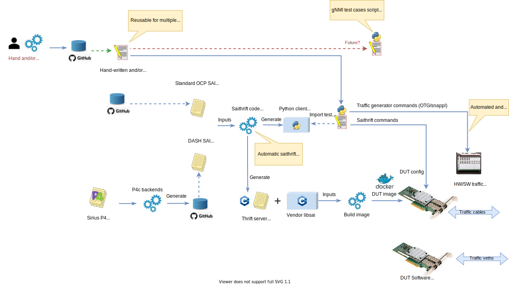

[[ << Test docs Table of Contents ]](./README.md)

[[ << DASH/test main README ]](../README.md)

[[ << DASH main README ]](../../README.md)

# DASH Test Workflow with saithrift

This document describes the DASH test workflow with SAI-thrift. In particular, it describes: 
- The inputs required to create a test  
- How these are distributed across various repos
- The transformation of these input source files into various test artifacts
- How these artifacts are utilized to create a client-server test framework to be used by test scripts to configure a DUT and test it with packet traffic.

### Summary

- DASH data plane behavior is specified by a "DASH" P4 behavior model.
- The P4 program can generate SAI overlay headers. Combined with a subset of standard SAI underlay headers, we have a complete "DASH API".
- Vendors implement a `libsai` for their device.
- The **saithrift** tool transforms the  SAI headers into a **Thrift client** library and a **Thrift server** skeleton.
  - The client `python` library is used by the test script to "talk" to the DUT to configure it.
  - The server skeleton must be linked to the vendor `libsai` to yield a complete server. When executed on the DUT, a client (the test script) can configure the DASH data plane via SAI API calls transported over the **Thrift API**.
- Test runs may be triggered manually, i.e. by a SW developer or test engineer; or triggered automatically by a GitHub Action (e.g. upon a Commit or Pull Request). Cloud-hosted community CI/CD tests are limited to pure software tests.
- Data-driven test cases stored in an abstract format are stored in a catalog of test suites, and read by the executable test scripts.
- Test scripts consume the test case data and execute code to program the DUT and configure the Traffic Generator to send and receive traffic.
- Test scripts read the results from the Tgen (and possibly DUT state queries), analyze against expected results and report test outcomes.

## Workflow overview 

In the diagram below, fixed resources such as abstract test-cases, P4 code, SAI headers, etc. reside in GitHub repositories as indicated. These artifacts are transformed roughly from left to right into into various artifacts required to run tests. This is a high-level conceptual diagram which omits many details, such as shell scripts, Makefiles, GitHub automation scripts, etc. In addition, some of the workflow steps take place in different environments or repos, at different points in time.

Most importantly, the execution of test scripts inside the red circle represent the *main event* and thus all the other steps are dependencies which must be satisfied, including installation of software/firmware onto the **Device Under Test** (DUT).

**Diagram - DASH saithrift Test Workflow**

The previous figure highlights the following important test work-flow concepts:

- How test cases are represented and executed
- How the abstract SAI interface to the Device Under Test (DUT) is derived
- How the SAI-thrift interface is generated and utilized for testing
- How a traffic generator (and receiver) is used to test the DUT

The GitHub repositories can be found at these locations:

- [dash/test](https://github.com/Azure/DASH/tree/main/test)
- [opencompute/SAI](https://github.com/opencomputeproject/SAI)

The descriptions below are listed in rough order of dependency, culminating in the test script itself.

## P4 to SAI Interface Transformation

> **TODO** This could be covered in the [README](../../dash-pipeline/README.md) file of the directory `../../dash-pipeline`.

A P4 program, [dash_pipeline.p4](../../dash-pipeline/dash_pipeline.p4), describes the behavior of the DASH data plane according to the well-known [P4 programming language](https://github.com/p4lang/p4-spec) and associated architectural models. The details are not covered here. Suffice to say the P4 program comprises a *single source of truth* for the data plane behavior.

Besides describing the data plane behavior, the P4 source code can be parsed by the community [p4c](https://github.com/p4lang/p4c) compiler and, via a suitable backend (**TODO** - provide link when it becomes part of this repo) it emits [SAI](https://www.opencompute.org/projects/sai) header files describing the abstract data plane API to the [underlay](../../SAI/underlay) portion of the data plane. The [overlay](../../SAI/overlay) portion of the DASH data plane is a subset of the standard SAI header files, e.g. as typically used by [SONiC](https://azure.github.io/SONiC/).

Treating the P4 program as the starting point ensures an unambiguous contract for data plane behavior. By generating SAI header files directly from the P4 code, we can be assured the programming interface is tightly bound, and agrees to the behavioral model.

### DASH SAI API

The combination of the underlay and the overlay SAI header files comprise the canonical "DASH API": an abstract data plane API which exposes [CRUD](https://en.wikipedia.org/wiki/Create,_read,_update_and_delete) operations upon canonical tables, which represent the configuration (and in some cases, the state) of the data plane.

DASH tests use this API to configure and/or read the state of the DUT; therefore, test cases and test scripts will utilize this API.

### SAI Thrift RPC Interface

SAI is defined as a c-language binding (`.h` header files), it is just a "contract"; hence it is not directly accessible by a test script running in its own process. A remote procedure call interface is required to allow a test program (e.g., a [PyTest](https://docs.pytest.org/en/6.2.x/) script) to "talk" to the DUT. The DUT must expose a server endpoint which can be accessed by the test program over a socket i.e., via an IP `address:port` pair.

 The DASH project specifies the [saithrift](https://github.com/opencomputeproject/SAI/tree/master/test/saithrift) RPC approach, already used in SONiC testing. The previous figure illustrates the following flow:
 * SAI header files are fed into a saithrift generator toolchain. This is a collection of Perl scripts which generates both client and server [Thrift](https://thrift.apache.org/) code. Thrift is a Remote Procedure Call (RPC) framework which uses an Interface Description language (IDL) schema to specify a client-server communications mechanism.
* The saithrift toolchain yields Python client libraries which are imported and used by a test program to make remote SAI calls, and a server skeleton with RPC callback methods. These callbacks implement all the SAI RPC function signatures (CRUD operations upon all the conceptual SAI tables). These callbacks in turn make function calls into the vendor-supplied SAI library entrypoints, which must be implemented for each target (DUT).
* Each DASH device vendor must implement a `libsai` shared library, i.e., a compiled `.so` module which can be linked to the server skeleton to produce a running SAI server image. The library has function calls supporting CRUD operations upon each DASH SAI header definition and attribute. The vendor `libsai` function entrypoints translate the abstract SAI CRUD operations into the underlying platform operations, e.g., typically via the vendor's Software Development Kit (SDK) libraries or equivalent. 
* The vendor-supplied `libsai` is compiled with the saithrift server skeleton to produce an executable binary file which is a server daemon. When run, this daemon exposes a socket-based API endpoint. This endpoint is the SAI-thrift API server.
Test programs can perform SAI RPC calls against the saithrift endpoint. In the previous figure, the PyTest test scripts make SAI calls to configure and query the DUT data plane.

> **TODO** Consider publishing versioned/tagged saithrift clients as [PyPi modules](https://pypi.org) and saithrift servers as Docker Images on [Dockerhub](https://hub.docker.com/) to eliminate the need for constant rebuilding. Once SAI header files have stablilized this should be feasible.

### Physical or Simulated DUT

A DUT may be a real hardware device (SmartNIC/DPU/IPU), or a software "simulation", for example a [P4-DPDK](https://github.com/p4lang/p4-dpdk-target) soft switch, or a [bmv2](https://github.com/p4lang/behavioral-model) model. Simulations will be used as reference targets to cross-check conformance tests and verify DASH SAI APIs. Performance of software targets are not expected to meet DASH requirements, but nonetheless they serve as useful tools.

### OTG/snappi Traffic Generator

The DUT is tested by configuring it as explained before; then sending packets to it into a "front-panel" interface(s); then capturing and analyzing what the device sends back out the front panel interface(s). A Traffic Generator/Analyzer is used to emulate the behavior of many (even thousands) of hosts/servers in the normal datacenter environment. It can generate traffic streams simulating live traffic, capture what comes back, and analyze the results. **This is the main idea of DASH traffic tests**.

There are many software and hardware-based traffic generator/analyzers (nicknamed "Tgens") available in the market or in the open community, of varying capabilities. To provide a uniform, model-based programming interface and avoid vendor lock-in, DASH has adopted the [Open Traffic Generator (OTG)](https://github.com/open-traffic-generator/models) data model for Tgens, and the accompanying [snappi](https://github.com/open-traffic-generator/snappi) client SDKs to make test script development more consistent and convenient. This allows for both software and hardware based Tgens to be used with minimal script changes.

> **NOTE**: some test cases may require dedicated, vendor-specific traffic-generators controlled via proprietary APIs, because these types of test are not supported in an OTG model. As an example, stateful connection performance testing may require specific gear.

### Abstract Test Cases

[Abstract test cases](./dash-test-HLD.md#data-driven-test-cases) comprise data and/or test script/programs which apply configuration to the DUT; configure a Traffic Generator to send packets to the DUT and capture packets back from the DUT; analyze the results; and compare expected versus actual to produce absolute pass/fail outcomes and/or perhaps performance figures against some standard. These test cases ideally are expressed independently of the precise programming interface of the DUT, and the programming interface of the Traffic Generator. For example, the same test case could in principle be used to program the DUT via the saithrift API (as is the central assumption of this workflow), or a northbound management interface such as the SONiC gNMI API. This is discussed further in the [DASH Test High-Level Description ](./dash-test-HLD.md#data-driven-test-cases) document.

The test cases are stored in the GitHub repository and comprise standard DASH test suites. A set of Pytest Test scripts use the test-case data to define a test. As an example, the test data may describe a set of ACL rules to configure the device, in an abstract form (e.g. a JSON file). The ACL rules may specify accept/deny behavior, which the test script can verify.

### Manual or Automatic Test Execution

As the figure shows, test scripts are executable programs, e.g. Pytest suites. Execution may be triggered upon demand, by a SW developer or test engineer in their development environment; or via a [GitHub CI/CD "Action"](https://resources.github.com/devops/tools/automation/actions) such as a commit to a staging branch, or submission to a Pull Request. CI/CD tests are executed in a cloud-hosted server and are thus limited to purely SW-based tests, possibly including a P4-based simulation.

Note, vendors may extend the community tests (locally, in their own environments) to add proprietary tests and  even include automatically-triggered (CI/CD), hardware-based tests. For example, automated test-cases could be added triggered upon local commits and execute against physical DUTs and traffic generators.

A test script consumes the test data, configures both the DUT and the traffic generator, and measures the results. The DUT is configured, via saithrift protocol, over a socket to its endpoint; and the Tgen is configured, via OTG/snappi protocol, over a socket to its endpoint. Packets are sent from the Tgen to the DUT, received by the Tgen, and analyzed by the test script.

## References

- [CRUD](https://en.wikipedia.org/wiki/Create,_read,_update_and_delete) 
- [PyTest](https://docs.pytest.org/en/6.2.x/)
- [PyPi](https://pypi.org)
- [GitHub CI/CD "Action"](https://resources.github.com/devops/tools/automation/actions)
- [saithrift](https://github.com/opencomputeproject/SAI/tree/master/test/saithrift)
- [Thrift](https://thrift.apache.org/)
- [P4-DPDK](https://github.com/p4lang/p4-dpdk-target) 
- [bmv2](https://github.com/p4lang/behavioral-model)
- [Open Traffic Generator (OTG)](https://github.com/open-traffic-generator/models) 
- [snappi](https://github.com/open-traffic-generator/snappi)
- [Abstract test cases](./dash-test-HLD.md#data-driven-test-cases)
- [DASH Test High-Level Description](./dash-test-HLD.md#data-driven-test-cases)
