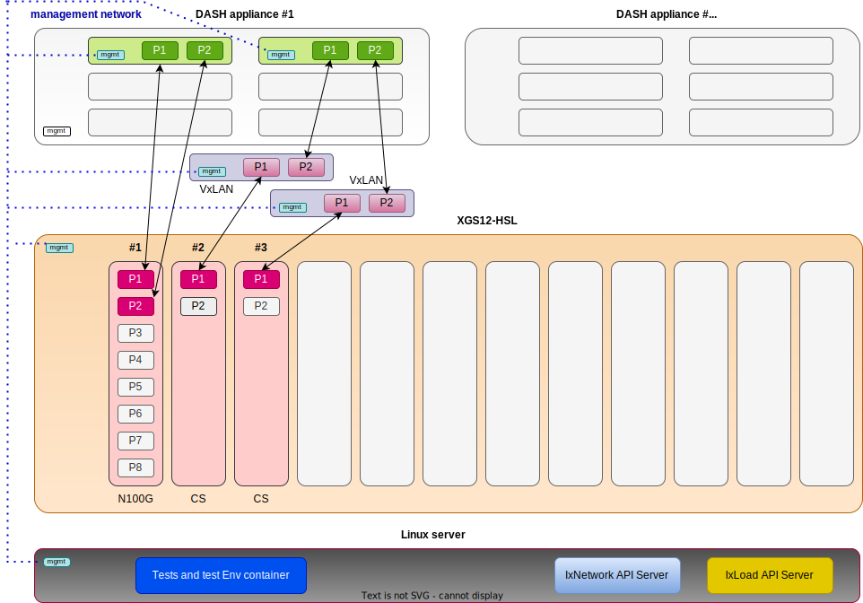

## Config files

`testbed.py`
```
TESTBED = {
    'stateless': [
        {
            'server': [
                {'addr': '10.36.77.101', 'rest': 443}
            ],
            'tgen':    [
                {
                    'type': 'keysight',
                            'interfaces': [['10.36.77.102', 1, 1],    ['10.36.77.102', 1, 2]]
                }
            ],
            'dpu':     [
                {'type': 'sku',
                 'interfaces': [['10.36.77.103', 1],    ['10.36.77.103', 1]]}
            ],
        }
    ],
    'stateful': [
        {
            'server': [{'addr': '10.36.77.107', 'rest': 10010}],
            'tgen':    [
                {
                    'type': 'keysight',
                            'interfaces': [['10.36.77.102', 2, 1],    ['10.36.77.102', 3, 2]]
                }
            ],
            'vxlan': [{
                'tgen': [['10.36.77.105', 'Ethernet1'],    ['10.36.77.106', 'Ethernet1']],
                'dpu':[['10.36.77.105', 'Ethernet2'],    ['10.36.77.106', 'Ethernet2']],
            }],
            'dpu':     [
                {'type': 'sku',
                 'interfaces': [['10.36.77.104', 1],    ['10.36.77.104', 2]]}
            ],
        }
    ],
}

```

`credentials.py` (rename `credentials.py.template` to `credentials.py`[^1])
```
# do not sumbit this file back 

CREDENTIALS = {
    '10.36.77.101': {'user': 'admin', 'password': 'admin', 'key': '0000000000000000'},
    '10.36.77.102': {'user': 'admin', 'password': 'admin', 'key': '0000000000000000'},
    '10.36.77.103': {'user': 'admin', 'password': 'admin', 'key': '0000000000000000'},
    '10.36.77.104': {'user': 'admin', 'password': 'admin', 'key': '0000000000000000'},
    '10.36.77.105': {'user': 'admin', 'password': 'admin', 'key': '0000000000000000'},
    '10.36.77.106': {'user': 'admin', 'password': 'admin', 'key': '0000000000000000'},
}
```

[^1]: to prevent the risk of committing your login info `credentials.py` was added to `.gitignore` file
