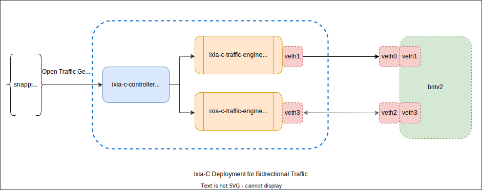

# **VNET to VNET**

## Overview

This test plan corresponds to the phase where standardized, automated test cases 
will be scripted to verify Data plane Testing Stage 3 as outlined in [dash test maturity stages](../dash-test-maturity-stages.md#data-plane-testing-stage-3-dut-configuration-via-sai-thrift). 

In these tests we want to leverage the snappi API to test some of the functional aspects of DUT. 
By verifying and validating the scaling aspects of the switches (hardware/BMv2) 
we are able to empirically baseline the scaling values. Additionally, we also 
want to check some of the relevant counters to features like IPv4, IPv6, TCP, 
UDP, common traffic stats etc.

### Scope

These test cases are targeted for testing the feature functionality of DASH implementation. The purpose of these test cases are to verify inbound/outbound/bidirectional traffic streams originating and terminating at the traffic generator. We plan to use the [OTG](https://github.com/open-traffic-generator) (Open traffic generator model) by leveraging the snappi APIs. 

### Testbed

The generic testbed setup may consist of two OTG connected to two ports of a switch (hardware-based or BMv2 software switch). 
In this specific testbed setup we will use [Ixia-c](https://github.com/open-traffic-generator/ixia-c) which is a modern, powerful, and API-driven open traffic generator model-based traffic tool that will generate traffic to observe the behavior of the device under test (DUT).

### Testbed Topology 

The testbed is setup to emulate a VNET to VNET scenario and to test the mechanisms of VM to VM communication in VNET as outlined [here](https://github.com/sonic-net/DASH/blob/main/documentation/vnet2vnet-service/vnet-to-vnet-service.md).

To emulate each VM in a VNET an Ixia-c port will be utilized. The BMv2 will be the DUT (This can later be replaced by a hardware-based appliance that connects to physical ports of a traffic generator)

In the above diagram:
- Ixia-C can be replaced by a hardware-based OTG
- BMv2 switch can be replaced with another software-based or a hardware-based switch

### Test Methodology

Following test methodologies will be utilized to verify and validate the behavior of the switch

- Traffic generator will be used to configure traffic streams that originate and/or terminate on traffic generator ports
- Data traffic will be sent from VNET to VNET to verify performance properties like: CPS, flow, PPS, and rule scale.  These performance properties will be verified while  features like: VM to VM communication in VNET, route support, LPM support, ACL support are enabled.
- Depending on the test cases, a combination of UDP traffic for IPv4, IPv6 addresses will be generated

### Test Cases
Note: No counters exist to date. Once counters are defined, the test-cases will be refined to incorporate them.

| Test Description                                             | Expected Result               |
| :----------------------------------------------------------- | :------------------------ |
| UDP IPv4 inbound  | Verify traffic originating from one VNET simulated terminates on another simulated VNET.    Verify counters in DUT in the inbound direction are accurately incremented.    Verify latency measurements   Verify packet loss is 0 (Tx frames - Rx frames = 0)    Verify configured throughput rate is achieved in traffic statistics  |
| UDP IPv4 outbound | Verify traffic originating from one VNET simulated terminates on another simulated VNET.    Verify counters in DUT in the inbound direction are accurately incremented.    Verify latency measurements   Verify packet loss is 0 (Tx frames - Rx frames = 0)    Verify configured throughput rate is achieved in traffic statistics |
| UDP IPv4 bidirectional  | Verify traffic originating from one VNET simulated terminates on another simulated VNET.    Verify counters in DUT in the inbound direction are accurately incremented.    Verify latency measurements   Verify packet loss is 0 (Tx frames - Rx frames = 0)    Verify configured throughput rate is achieved in traffic statistics    |
| UDP IPv6 inbound | Verify traffic originating from one VNET simulated terminates on another simulated VNET.    Verify counters in DUT in the inbound direction are accurately incremented.    Verify latency measurements   Verify packet loss is 0 (Tx frames - Rx frames = 0)    Verify configured throughput rate is achieved in traffic statistics    |
| UDP IPv6 outbound direction | Verify traffic originating from one VNET simulated terminates on another simulated VNET.    Verify counters in DUT in the inbound direction are accurately incremented.    Verify latency measurements   Verify packet loss is 0 (Tx frames - Rx frames = 0)    Verify configured throughput rate is achieved in traffic statistics  |
| UDP IPv6 bidirectional  | Verify traffic originating from one VNET simulated terminates on another simulated VNET.    Verify counters in DUT in the inbound direction are accurately incremented.    Verify latency measurements   Verify packet loss is 0 (Tx frames - Rx frames = 0)    Verify configured throughput rate is achieved in traffic statistics  |                                                 
|  ACL inbound | Verify data traffic is allowed and unwanted traffic based on ACL is dropped.   Verify ACL inbound counters on DUT are incremented
| ACL outbound  | Verify data traffic is allowed and unwanted traffic based on ACL is dropped.   Verify ACL outbound counters on DUT are incremented
| BGP underlay | Verify BGP adjacency is established.   Verify BGP counters on DUT are incremented

