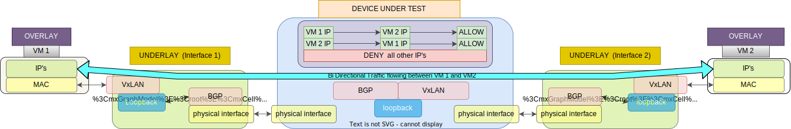

The purpose of this test case is to obtain the best performance numbers the hardware can achieve
Combined with the worst case scenario cases (TBD) we will be able to determine the range of performance within the hardware can operate.



1. Configure VXLAN with 1 VPC and 1 VNI.
2. Configure BGP to achieve connectivity between the loopback interfaces.
3. Configure VMs behind VTEPs.
4. Verify that the control plane is up.
5. Find the Max PPS supported using stateless UDP bidirectional traffic
	start rate of 10 Million pps
	increase the rate as long as there are 0 dropped packets
	provide result in millions of pps


- sample output for pps test:
```
Final Possible Boundry is  3000000
+--------+-------------+-------------+----------------+----------+
| PPS    |   Tx Frames |   Rx Frames |   Frames Delta |   Loss % |
|--------+-------------+-------------+----------------+----------|
| 1.00M  |       10000 |       10000 |              0 |    0     |
| 4.00M  |       40000 |       39387 |            613 |   15.34  |
| 2.00M  |       20000 |       20000 |              0 |    0     |
| 3.00M  |       30000 |       30000 |              0 |    0     |
+--------+-------------+-------------+----------------+----------+
```


- sample output for cps test:
```
+------+-----------------+----------------+------------------------+---------------+-----------------+-----------------+-------------+
|   It |   Objective CPS |   Obtained CPS |   HTTP Requests Failed |   TCP Retries |   TCP Resets TX |   TCP Resets RX | Pass/Fail   |
|------+-----------------+----------------+------------------------+---------------+-----------------+-----------------+-------------|
|    1 |      	   50000 |          50006 |                      0 |             0 |               0 |               0 | Pass        |
|    2 |      	   70000 |          51353 |                      0 |             0 |               0 |               0 | Fail        |
|    3 |           60000 |          51167 |                      0 |             0 |               0 |               0 | Fail        |
|    4 |           55000 |          51106 |                      0 |             0 |               0 |               0 | Fail        |
|    5 |           52500 |          51181 |                      0 |             0 |               0 |               0 | Fail        |
|    6 |           51250 |          50988 |                      0 |             0 |               0 |               0 | Fail        |
|    7 |           50625 |          50611 |                      0 |             0 |               0 |               0 | Fail        |
+------+-----------------+----------------+------------------------+---------------+-----------------+-----------------+-------------+
```
