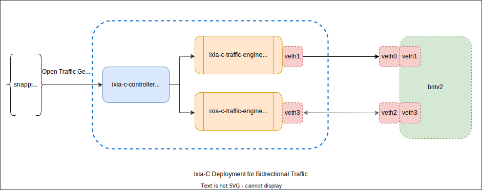

# Deploying Ixia-C

Deployment is done using `docker-compose` and configuration file [ixia-c-deployment.yml](ixia-c-deployment.yml) and by setting up veth pairs (assumed already in-place by the test environment before docker-compose is called).

Future considerations
 - [Containerlab](https://containerlab.dev/), a CLI for orchestrating and managing container-based networking labs.
